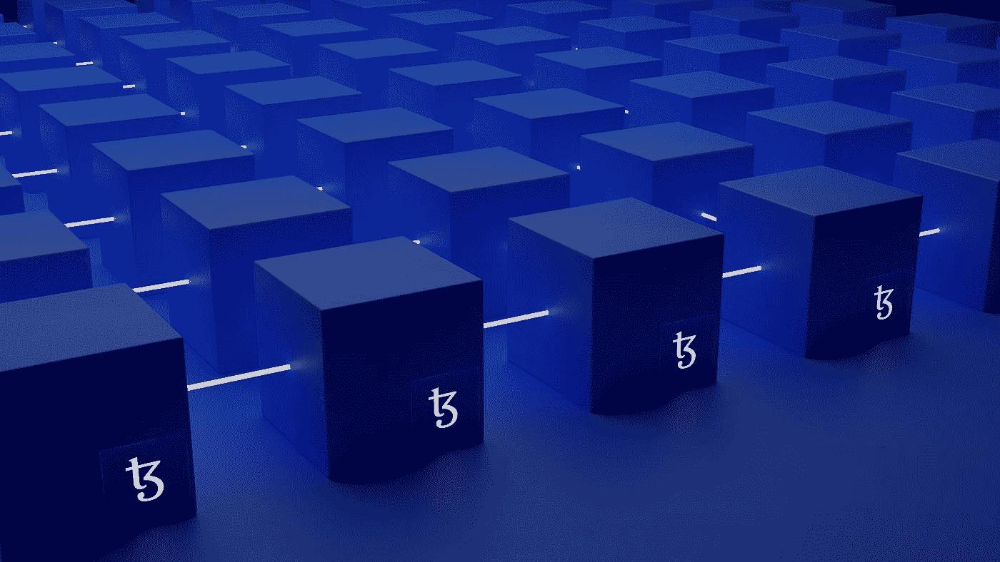
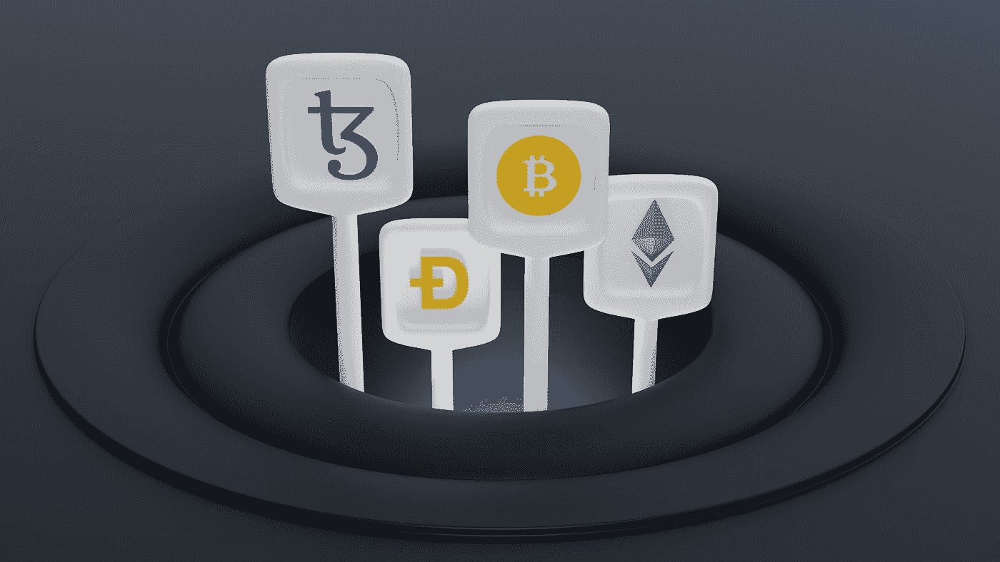

# 如何用复合克隆平台在以太坊上启动你的 DeFi 创业？

> 原文：<https://javascript.plainenglish.io/how-to-launch-your-defi-venture-on-ethereum-with-a-compound-clone-platform-f672ed918313?source=collection_archive---------17----------------------->

由于传统金融资产无法为投资者提供丰厚回报，分散融资(DeFi)被证明是一种可行的替代方案。用户可以获得几个优势，如全天候资金访问、没有中介、即时处理交易、充足的流动性和友好的用户界面。以太坊上有一个平台提供多种服务，如托管服务、跨分散交易所的资产交易(DEXes)、资金管理、点对点贷款(P2P)等。这不是别的，正是化合物。你是想利用 Web 3.0 力量的企业家吗？现在发射一个复合克隆。

Photo by [Shubham Dhage](https://unsplash.com/@theshubhamdhage?utm_source=medium&utm_medium=referral) on [Unsplash](https://unsplash.com?utm_source=medium&utm_medium=referral)

# **什么是复合克隆？**

它是一个预建的借贷平台，功能类似于复利。一家去中心化金融(DeFi)平台开发公司将使用先进的技术堆栈创建一个 [**复合克隆**](https://www.appdupe.com/compound-clone-script) 。一般来说，它的功能是一个自主利率协议。

用户和机构可以通过硬件和软件钱包利用各种服务，如资金管理、存储本地代币和稳定硬币的托管、赌注以及投资组合的实时管理。

分散金融(DeFi)开发公司将定制您的复合克隆。因此，你可以添加品牌元素，如标志，口号，标语，颜色等。这将有助于吸引全球的机构和散户投资者。

Photo by [Shubham Dhage](https://unsplash.com/@theshubhamdhage?utm_source=medium&utm_medium=referral) on [Unsplash](https://unsplash.com?utm_source=medium&utm_medium=referral)

# **复合克隆平台的主要特点是**

**Markets Section —** 它就像一个仪表板，提供有关虚拟资产借贷的实时信息。显示的统计数据包括年度百分比收益率(APY)、cryptos、stablecoins、DeFi tokens、wrapped tokens 的总供应量和借入量(24 小时)、存款人和借款人的数量。

**治理面板—** 毫无疑问，用户在复合克隆平台上获得了很多权力。他们获得投票权。投资者可以点击治理选项，对影响分散金融(DeFi)平台未来增长和发展的提案进行投票。

例如，提案可以涉及与分散式交易所(DEXes)的集成、资产的跨链转移、不同协议的资金存取以及安全措施的升级。投资者可以看到正在进行的、通过的和失败的提案列表。令牌持有者和代理人可以看到剩余的本地令牌数量、投票地址列表和代理投票。

**开放价格提要—** 一个复合克隆平台与一个开放价格提要相集成。一般来说，报告将签署关于价格的数据链外。过一会儿，以太坊区块链上的任何账户都会自动将数据移出链外。因此，显示了关于加密令牌、DeFi 资产和稳定硬币的价格以及一段时间内的波动的数据。

某个时间限制将决定交易对的加权平均价格(加密对稳定币、加密对加密和 DeFi 令牌对加密)。一个提要提交关于分散令牌的锚价格的数据。用户可以在以太网区块链浏览器上找到合同名称和地址。

**支持钱包—** 投资者可以在类似于 Compound 的去中心化金融平台上轻松管理自己的资金。他们可以选择比特币基地钱包、MetaMask 等软件钱包，也可以使用 WalletConnect 开源协议支持的其他钱包。此外，交易者可以通过使用类似 Ledger 的硬件钱包安全地存储他们的资金。散户和机构交易者可以用私钥和秘密恢复短语来保护他们的资金。

**排行榜—** 投票权重地址、投票数、投票提案数、投票人的公共钱包地址等详细信息显示在排行榜上。用户可以点击它们，查看关于剩余复合令牌数、投票数、委托类型(对自己和他人)、年龄(日期和时间戳)、结果和投票历史(支持和反对不同提案)的数据。

**技术支持中心—** 为机构投资者提供关于复合克隆的全天候技术支持。他们可以联系帮助台并解决诸如支付处理、cryptos 与 stablecoins 的相互转换、从金库提取资金、接收有关基础价格的数据以及与不同硬件和软件钱包的集成等问题。

Photo by [Austin Distel](https://unsplash.com/@austindistel?utm_source=medium&utm_medium=referral) on [Unsplash](https://unsplash.com?utm_source=medium&utm_medium=referral)

# **分析财资应用编程接口(API)如何在复合式平台上运行？**

**无故障集成—** 多年来，金融世界经历了许多变化。早些时候，支付方式通常是信用卡、借记卡和电汇。然而，像 Compound 这样的 [**DeFi 平台将通过友好的用户界面改变这种情况。**](https://www.appdupe.com/compound-clone-script)

金融机构、投资银行家和投资组合经理可以点击财政部 API 按钮。他们可以将其集成到日常业务运营中。这确保了用户可以在不同的账户和钱包地址之间无缝地转移资金。

**立即生成报告—** 真实性和透明度是复合式平台的标志。因此，大小投资者可以根据他们的业务需求随时下载这些报告。他们还可以单击自定义选项来定期接收报告。

**权限设置—** 毫无疑问，现在数字经济蓬勃发展。同样，机构可以按下与 Compound 相同的 DeFi 平台上的访问控制部分。他们可以决定共享数据的权限以及谁可以访问数据(会计、员工和投资组合经理)。

最终，投资者可以密切关注每日收益率、期间收益、存款和提款、以美元(USD)计算的总利息以及所有进出交易的日期和时间。

# **收尾**

在分散金融(DeFi)时代，复利稳步增长。根据数据跟踪门户网站 DeFi Pulse 的数据，用户已经在算法货币市场协议上锁定了 82.9 亿美元。自 2018 年 9 月推出以来，该平台已见证了 270 万以太坊(ETH)和 192，300 比特币(BTC)的存款。

有趣的是，最锁定的资产是复合包装以太坊($WETH)。此外，投资者可以通过交叉桥接访问众多分散金融(DeFi)平台，如 Aave、SushiSwap、Uniswap 和 Maker。他们通过存款赚取固定利率。总体而言，Compound 提供了进入 17 个不同市场的渠道，锁定的总资产已超过 134.4 亿美元。

你想启动一个货币市场协议，让借款人可以方便地与贷款人联系吗？现在就与白标解决方案提供商联系，开发类似化合物的平台。

*更多内容看* [***说白了就是 io***](http://plainenglish.io/) *。报名参加我们的* [***免费周报***](http://newsletter.plainenglish.io/) *。在我们的* [***社区获得独家访问写作机会和建议***](https://discord.gg/GtDtUAvyhW) *。*