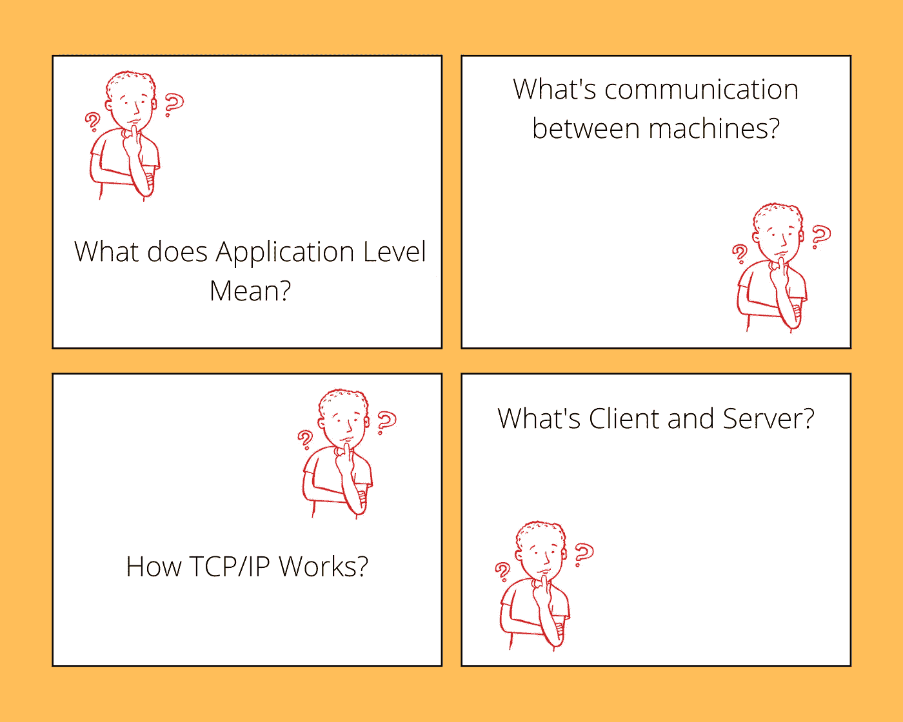
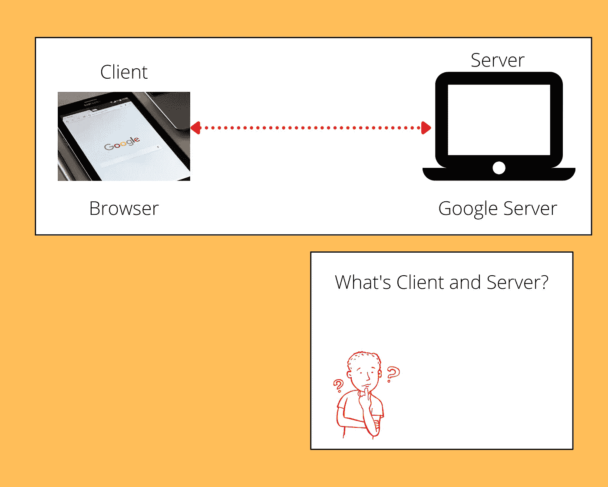
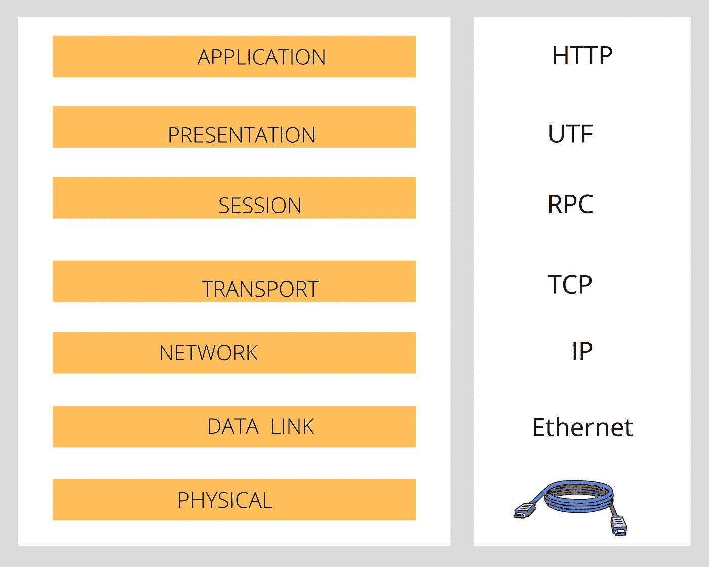
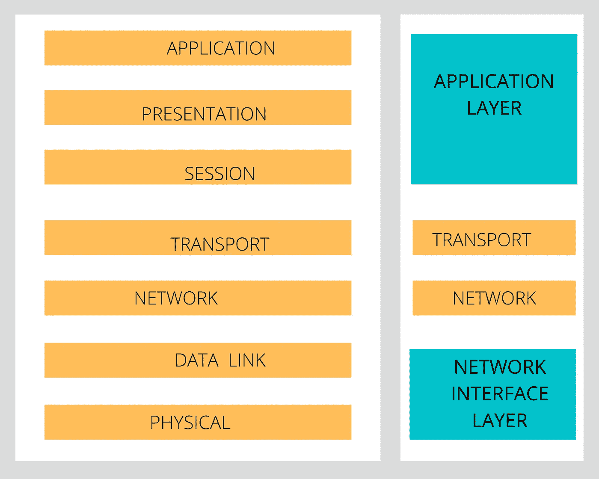

# 如何通过简单的思维转变来学习复杂的技术

> 原文：<https://javascript.plainenglish.io/how-to-learn-complex-technologies-using-a-simple-mind-shift-12b9bc22fd1b?source=collection_archive---------6----------------------->

## 让我们以 HTTP 调用为例来看看它是如何工作的

Photo by [Raghav Modi](https://unsplash.com/@raghavmodi?utm_source=unsplash&utm_medium=referral&utm_content=creditCopyText) on [Unsplash](https://unsplash.com/s/photos/teacher?utm_source=unsplash&utm_medium=referral&utm_content=creditCopyText)

我们大多数人都会记得，一位来自学校或大学的老师或教授能够用简单的语言解释任何复杂的问题，让每个人都容易理解。我们经常认为这只是教学技能，但我们一次又一次地看一些 youtube 视频或参加一个会议，演讲者用简单的英语精彩地解释了最复杂和无聊的话题，不仅有趣，而且容易记住。

如果仅仅是教学或表达技能需要在一个职业中表现出色，那么任何受过一点训练的人都可以做同样的事情。但事实并非如此，这些人会做一些其他人忽略的事情。

我们稍后将讨论这种做法是什么，但在此之前，让我们举一个例子来更好地理解这一原理。

让我们试着理解 HTTP 调用，自己看看是否同样的原理可以适用于所有的情况。

当今的每个程序员都工作过或听说过 HTTP 调用，大多数后端 API 调用都是使用 HTTP 进行的。如果我们今天必须学习 HTTP 调用，我们将如何学习这个概念？

## **简单来说 HTTP 是什么？**

它是建立在 TCP/IP 之上的应用程序级协议，支持客户端和服务器之间的通信。

显然，这不是一个非常明确的定义。所以让我们把定义分解成以下 4 个问题。

**1。什么是客户端和服务器？**

任何请求信息的计算机或移动应用程序都是客户端，而提供信息的计算机是服务器。

浏览器是一种客户端，每当在谷歌上搜索某个东西时，它都会要求提供信息。谷歌(公司)有服务器(把它想象成谷歌拥有的电脑),它会把一堆链接返回到你的浏览器，而且它们是以有序的方式排列的。这是客户机-服务器模型。

**2。什么是交流？**

这是两个设备用他们能理解的语言相互交流。二进制。

相距数英里的计算机使用一组光缆在它们之间传递信息，这些光缆甚至跨越海洋将各大洲相互连接起来。

我们上面提到的二进制，实际上会以电信号、光或无线电波的形式传播。

互联网服务提供商公司将为我们提供互联网，也就是说，他们将我们与世界上的其他计算机连接起来。

Photo by [Nastya Dulhiier](https://unsplash.com/@dulhiier?utm_source=unsplash&utm_medium=referral&utm_content=creditCopyText) on [Unsplash](https://unsplash.com/s/photos/network-cables?utm_source=unsplash&utm_medium=referral&utm_content=creditCopyText) (Entire World is communicating with each other all the time)

**3。应用程序级别是什么？**

它是 OSI 模型中的最高级别。

为了用简单的英语理解这一点，我们需要理解什么是 OSI 模型，在该主题结束时，我们还将学习 TCP/IP 是如何工作的。

**4。什么是 OSI 模型，TCP/IP 是如何工作的？**

OSI 是描述网络中通信功能的框架。基本上，它是一个模型，描述了当客户端(例如:浏览器)向服务器(例如:Twitter，Medium)请求某些东西，服务器向客户端做出响应时，每个组件的工作规则。

到目前为止，我们知道 HTTP 是一个应用层协议，它建立在 TCP/IP 协议之上。这意味着 HTTP 协议定义了应用程序应该如何与网络通信，但是从一台计算机到另一台计算机的实际数据传输仍然依赖于较低层的协议。

TCP/IP 模型(下图右侧)看起来比 OSI 模型更抽象一些。

既然我们已经回答了所有与 HTTP 协议定义相关的问题，让我们尝试用一种新的方式来回答这个老问题。

## 重温:简单来说 HTTP 是什么？

一种协议，使得在 web 上交换数据(通信)成为可能。

不可思议的老师、演讲者、教授和我们今天学到的简单的思维转变是用基本原则理解任何主题。一旦我们理解了任何概念的最基本形式，向别人教授或解释它就成了一件轻而易举的事。

## 结论

学习复杂的技术概念是一个耗时的过程，但是将大的概念分解成小的部分有助于更好的理解。有了充分的理解，我们将学会欣赏和享受物理和技术在我们日常生活中创造的一切。

*更多内容请看*[***plain English . io***](http://plainenglish.io/)*。报名参加我们的* [***免费周报***](http://newsletter.plainenglish.io/) *。在我们的* [***社区***](https://discord.gg/GtDtUAvyhW) *获得独家获得写作机会和建议。*