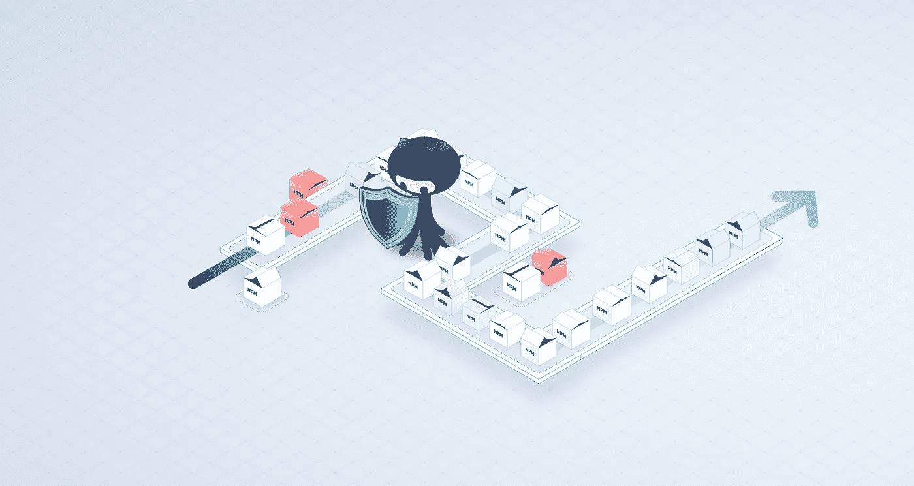
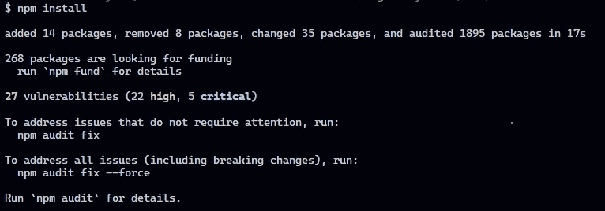
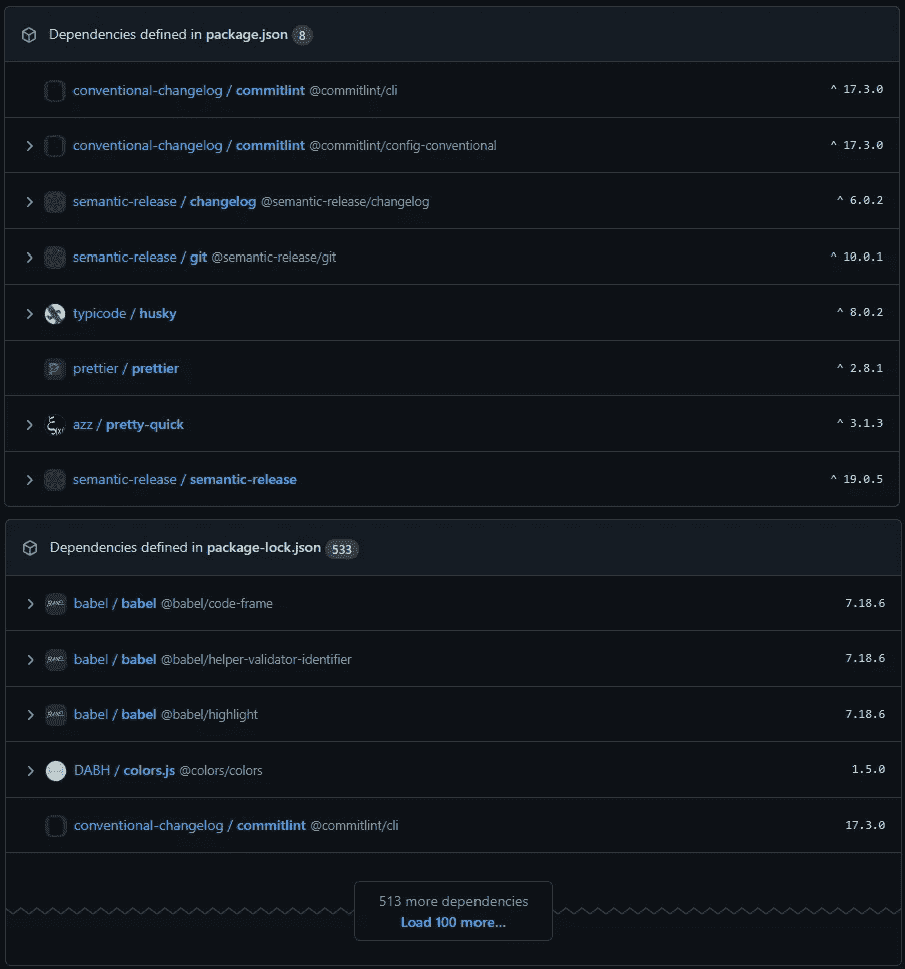
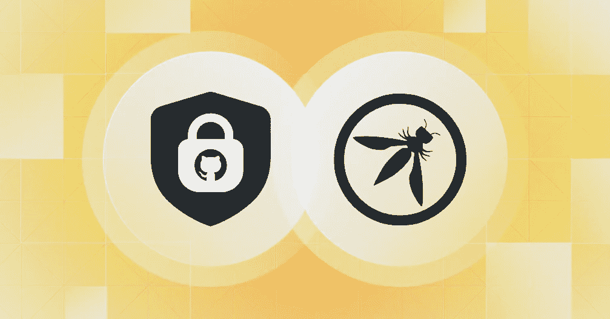
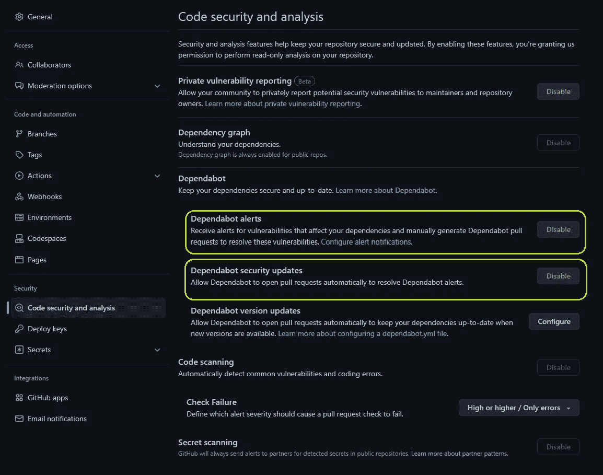
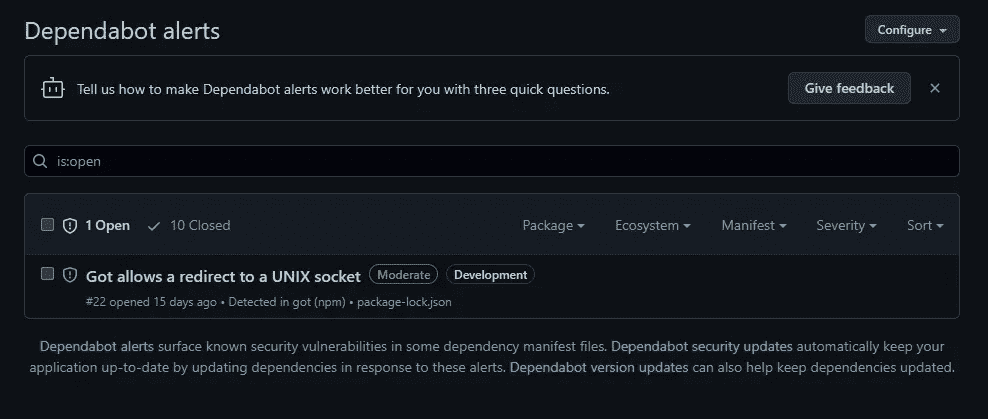
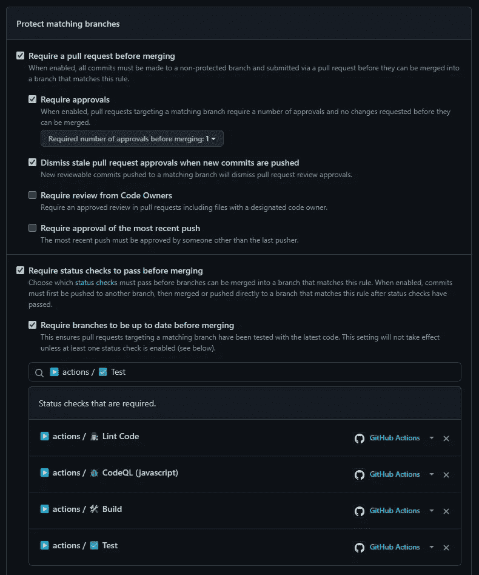

# 如何利用 GitHub 和语义发布来减少包中的漏洞

> 原文：<https://javascript.plainenglish.io/how-to-leverage-github-and-semantic-release-to-reduce-vulnerabilities-in-your-packages-c517403e339c?source=collection_archive---------8----------------------->



你很可能从个人经验中知道，如今许多项目需要一堆依赖项来开发、编译或运行。

您是否注意到，当您安装项目的依赖项时，npm 还会报告这些依赖项中的已知漏洞？



`npm install` reporting vulnerabilities

即使你的项目只使用了少量的直接依赖项，这些依赖项本身也有传递依赖项，等等…你明白我的意思了吧。

让我们看看[演示项目](https://github.com/Th3S4mur41/demo-auto-security-release/network/dependencies)的依赖关系树…



List of dependencies and their vulnerabilities in both package.json and package-lock.json

虽然项目本身“仅仅”有八(8)个直接依赖项在它的 [*package.json*](https://github.com/Th3S4mur41/demo-auto-security-release/blob/main/package.json) 中被引用，但是整个依赖项树总共包含 533 个包。

手动跟踪所有这些依赖项及其漏洞很快就变成了一项乏味的任务，如果不是不可能的话。

这就是 GitHub 可以帮忙的地方。

*以下所有代码片段都可以从 GitHub* *上的*[*demo 资源库中派生出来。*](https://github.com/Th3S4mur41/demo-auto-security-release)

# 开源代码库

Github 最近发布了一份减少 OWASP 漏洞的最佳实践列表。



Explore how GitHub Advanced Security can help address several of the OWASP Top 10 vulnerabilities

其中一个技巧是利用[dependent bot](https://github.blog/2022-05-25-how-we-use-dependabot-to-secure-github/)来提醒开发者依赖关系中的已知漏洞，并潜在地将这些依赖关系更新到一个补丁版本。

第一步是激活 Dependabot 警报和安全更新。这可以在*代码安全和分析*下的存储库设置中轻松完成，正如你在下面的截图中看到的。



Github’s “Code security and analysis” repository settings with Dependabot alerts & Dependabot security updates enabled

## 依赖机器人警报

第一个设置将在您使用的依赖关系中存在已知漏洞时提醒您，就像运行`npm audit`一样，但它也将帮助您跟踪和管理这些漏洞。



The dependabot alerts page showing a single moderate vulnerability

## 依赖机器人安全更新

第二个设置将使 dependabot 能够尝试并自动修复漏洞。如果依赖项的一个固定版本可用并且与您的存储库兼容，Dependabot 将打开一个 pull 请求来更新受影响的包。

## Dependabot 版本更新

但是为什么就此打住呢？第三个选项是*dependent bot 版本更新*，它将帮助您创建一个 dependent bot 配置来自动更新您的所有依赖项。

下面的代码是最基本的 dependent bot 配置，用于每周更新您的 npm 依赖项，并添加一个用户或团队作为 dependent bot 将创建的所有拉请求的审查者。

```
# .github/dependabot.yml
version: 2
updates:
  - package-ecosystem: "npm"
    directory: "/" # Location of package manifests
    schedule:
      interval: "weekly"
    reviewers:
      - "<user or team name>"
```

在[官方依赖机器人文档](https://docs.github.com/en/code-security/dependabot/dependabot-version-updates/configuration-options-for-the-dependabot.yml-file)之后，版本更新可以以多种方式进一步定制。

## [奖金]让您的 CI 保持最新

虽然这与您的依赖项没有直接关系，但也可能有助于保持您的 CI 安全。通过在 dependent bot . yml 中添加几行代码，您还可以对其进行配置，使您的 Github 操作保持最新。您只需添加第二个软件包生态系统，代码如下:

```
- package-ecosystem: "github-actions"
    directory: "/"
    schedule:
      interval: "daily"
```

[演示库的 dependabot 配置](https://github.com/Th3S4mur41/demo-auto-security-release/blob/main/.github/dependabot.yml)被设置为每天更新 npm 包和 Github 动作。

## 自动合并从属机器人 PR

在有很多依赖项的项目中，由 Dependabot 生成的 pull 请求的数量会很快成为审查和合并的负担。如果您有一个测试自动化来验证您的拉请求，这是您不再想要手动做的事情。

⚠️ **在实施这一步骤之前，请确保设置分支保护和您可以信任的 CI(构建、测试、部署),因为您将不再手动验证这些更改。**



Make sure that PR need to be approved and your relevant CI workflows are successful before allowing pull requests to be merged

通过利用 Github API 创建一个工作流，可以自动合并 Dependabot pull 请求…

```
# .github/workflows/dependabot-automation.yml
name: Depandabot automation
on: 
 pull_request_target:    
  types: [opened, synchronize, reopened]
permissions:
  pull-requests: write
  contents: write
jobs:
  dependabot-auto:
    name: '🤖 Dependabot Automation'
    runs-on: ubuntu-latest
    # Only run if PR was opened by dependabot
    if: ${{ github.actor == 'dependabot[bot]' }}
    steps:
      - name: Dependabot metadata
        id: metadata
        uses: dependabot/fetch-metadata@v1
          with:
            github-token: '${{ secrets.GITHUB_TOKEN }}'
      - name: Enable auto-merge for Dependabot PRs
        continue-on-error: true
        # Auto merge dependencies with patch or minor updates
        # Major versions still must be merged manually
        if: ${{(steps.metadata.outputs.update-type == 'version-update:semver-patch') || (steps.metadata.outputs.update-type == 'version-update:semver-minor')}}
        run: gh pr merge --auto --squash "$PR_URL"
        env:
          PR_URL: ${{github.event.pull_request.html_url}}
          # GH_TOKEN needed to trigger follow up worlflow: https://github.com/fastify/github-action-merge-dependabot/issues/134
          GITHUB_TOKEN: ${{ secrets.GH_TOKEN || secrets.GITHUB_TOKEN }} 
```

如果您的分支被配置为在合并前需要批准，您还需要将以下步骤添加到前面的工作流中来处理这一问题。

```
- name: Approve a PR
    continue-on-error: true
    run: gh pr review --approve "$PR_URL"
    env:
      PR_URL: ${{github.event.pull_request.html_url}}
      # GH_TOKEN needed to approve PR as code owner on protected branches
      GITHUB_TOKEN: ${{ secrets.GH_TOKEN || secrets.GITHUB_TOKEN }} 
```

或者，你也可以依赖 Github 的动作，比如[dependent bot Auto Merge](https://github.com/marketplace/actions/dependabot-auto-merge)来简化工作流程，类似于[在演示](https://github.com/Th3S4mur41/demo-auto-security-release/blob/main/.github/workflows/on_dependabot.yml)中实现的解决方案。

```
 # This is the workflow to automatically approve and merge dependabot PRs
#
name: Dependabot automation

on:
  pull_request_target:
    types: [opened, synchronize, reopened]

  # Allows you to run this workflow manually from the Actions tab
  workflow_dispatch:

jobs:
  dependabot:
    name: '🤖 Dependabot Automation'
    runs-on: ubuntu-latest
    if: ${{ github.actor == 'dependabot[bot]' }}

    steps:
      - uses: actions/checkout@v3
        with:
          ref: ${{ github.event.pull_request.head.sha }}

      - uses: ahmadnassri/action-dependabot-auto-merge@v2
        with:
          target: minor
          github-token: ${{ secrets.DEPENDABOT_TOKEN  }}
          command: squash and merge
```

## 避免引入具有新依赖性的漏洞

Github 团队最近发布了一个名为[dependency-review-action](https://github.com/actions/dependency-review-action)的新操作，它可以通过扫描 pull 请求并在易受攻击的依赖项出现在代码中之前阻止它们的添加，来进一步帮助减少易受攻击的依赖项。

```
name: Check Dependencies

on:
  pull_request:
    types: [opened, synchronize, reopened]

permissions:
  contents: read

jobs:
  dependency-review:
    name: '⛓️ Dependency Review'
    runs-on: ubuntu-latest

    steps:
      - name: '☁️ Checkout repository'
        uses: actions/checkout@v3

      - name: '🛡️ Dependency Review'
        uses: actions/dependency-review-action@v3
```

有了这些，您已经减少了代码中的漏洞。但是在你创建一个新的版本之前，你的包仍然会受到影响。

这通常是遗留包或者没有被主动或定期维护的包的问题。一旦你进入下一个项目，这不是你想发生在你的包上的事情！

# 语义释放

[semantic-release](https://semantic-release.gitbook.io/semantic-release/) 是一个帮助你自动化你的包的发布过程的工具，包括更新版本号，生成发布说明和变更日志，将包发布到注册表。

## 提交格式

为了让语义发布能够确定要碰撞语义版本的哪一部分，您的提交需要遵循提交约定。

在我们的例子中，我们使用带有默认设置的[扩展的](https://github.com/Th3S4mur41/demo-auto-security-release/blob/main/commitlint.config.js)[提交列表](https://commitlint.js.org/#/)，以确保语义发布能够使用它们。

## 自动发布安全修复程序

您还需要配置语义发布…

此外，要选择哪个分支应该触发发布，您可能还需要添加一些插件来生成发布说明和 changelog，发布您的包并生成 GitHub 标签。

以下设置还将确保生成的 changelog 以及带有新版本的包配置被提交到您的存储库中。

```
{
 "branches": ["main"],
 "plugins": [
  "@semantic-release/commit-analyzer",
  "@semantic-release/release-notes-generator",
  "@semantic-release/changelog",
  "@semantic-release/npm",
  [
   "@semantic-release/git",
   {
    "assets": ["CHANGELOG.md", "package.json", "package-lock.json"]
   }
  ],
  "@semantic-release/github"
 ]
}
```

就这样？

不完全是。来自 dependabot 的默认提交消息不会触发新的发布，所以我们仍然需要做一些事情。

Matt Rathbun 写了一个[直截了当的指南](https://rathbun.dev/posts/semantic-release-dependabot/#approach-2---configure-semantic-release-to-understand-dependabot-commits)来更新你的语义发布配置，以自动触发依赖关系更新的新补丁发布。

该配置包含两项更改:

*   更新提交分析器以发布用于“构建(deps)”提交的新补丁
*   更新发布说明生成器，在 GitHub 发布说明中包含这些提交的详细信息

```
"release": 
  // ...
  "plugins": [
    [
      "@semantic-release/commit-analyzer",
      {
        "preset": "conventionalcommits",
        "releaseRules": [
          {
            "type": "build",
            "scope": "deps",
            "release": "patch"
          }
        ]
      }
    ],
    [
      "@semantic-release/release-notes-generator",
      {
        "preset": "conventionalcommits",
        "presetConfig": {
          "types": [
            {
              "type": "feat",
              "section": "Features"
            },
            {
              "type": "fix",
              "section": "Bug Fixes"
            },
            {
              "type": "build",
              "section": "Dependencies and Other Build Updates",
              "hidden": false
            }
          ]
        }
      }
    ]
    // ...
  ]
}{
```

剩下要做的就是在主分支上的每一次推动都触发语义释放。

```
name: 'Semantic release'

on:
  push:
    branches: [main]

jobs:
  # jobs to check your code come here

  release:
    name: '🏷️ Release'
    runs-on: ubuntu-latest

    environment:
      name: production
      url: https://github.com/${{ github.repository }}/releases/tag/v${{ steps.release.outputs.version }}

    outputs:
      version: ${{ steps.release.outputs.version }}

    steps:
      - name: '☁️ Checkout repository'
        uses: actions/checkout@v3
        with:
          fetch-depth: 0
          persist-credentials: false

      - name: '⚙️ Use Node.js'
        uses: actions/setup-node@v3
        with:
          check-latest: true
          cache: 'npm'

      - name: '⛓️ Install dependencies'
        run: npm ci --omit=optional --audit=false --prefer-offline --progress=false

      - name: '📦 Release'
        id: release
        env:
          GITHUB_TOKEN: ${{ secrets.GITHUB_TOKEN }}
          GH_TOKEN: ${{ secrets.GH_TOKEN || secrets.GITHUB_TOKEN }} # Needed to push to GitHub
        run: |
          npx semantic-release
          echo "::set-output name=version::$(npm run env | grep npm_package_version | cut -d '=' -f 2)"n::$(npm run env | grep npm_package_version | cut -d '=' -f 2)"
```

现在，每次 Dependabot 修复您的依赖关系中的漏洞时，CI 都会发布一个包含修复的软件包的新版本。

# 结论

通过结合这两个工具，您可以减少您的包中的漏洞的风险，而不用花费您的一分钟时间…我要说，这绝对值得花费最初的努力来做一点配置。

你怎么想呢?

*更多内容请看*[***plain English . io***](https://plainenglish.io/)*。报名参加我们的* [***免费周报***](http://newsletter.plainenglish.io/) *。关注我们关于*[***Twitter***](https://twitter.com/inPlainEngHQ)[***LinkedIn***](https://www.linkedin.com/company/inplainenglish/)*[***YouTube***](https://www.youtube.com/channel/UCtipWUghju290NWcn8jhyAw)*[***不和***](https://discord.gg/GtDtUAvyhW) ***。*****

*****对缩放您的软件启动感兴趣*** *？检查* [***电路***](https://circuit.ooo?utm=publication-post-cta) *。***