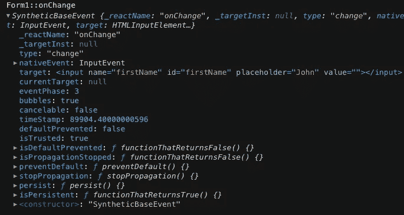

# 如何在 React 中收听 Formik onChange 事件？

> 原文：<https://javascript.plainenglish.io/how-to-listen-to-formik-onchange-event-in-react-df00c4d09be?source=collection_archive---------0----------------------->


Image license obtained from Envato Elements (license code: XNGDU3EF8T)

最近这个问题被问了好几次:

*   我在我的`React`项目中使用了`Formik`
*   我想观察(或倾听)表单值的变化
*   但是`<Formik>`没有为`onChange`回调提供道具

我该怎么做？

我想分享两个选择:

*   #1 在`<form>`元素/组件上附加回调函数
*   #2 用`useFormikContext`创建一个监听器/观察器组件

# 解决方案 1:在

`Formik`没有提供`onChange` prop，但是`<form>`(或者`<Form>`如果使用包装器版本)提供了。

所以，你可以像这样定义一个`handleOnChange`回调函数:

```
const handleOnChange = (event: FormEvent) => {
    console.log("Form::onChange", event);
};
```

…并将其直接传递给`<Form>`:

```
<Form **onChange={handleOnChange}**>
    {/* ... */}
</Form>
```

回调将接收一个合成 DOM 事件，您可以通过`event.target`访问触发变化的输入元素



# 解决方案 2:创建一个观察者组件

让我们不要局限在 DOM 的世界里，也从[受控组件](https://reactjs.org/docs/forms.html#controlled-components)的角度来思考一下——表单`Formik`中的输入元素是由`React`中的状态控制的，它们的状态可以通过`FormikContext`来访问和操作。

也就是说，您可以使用`useEffect`钩子创建一个组件来观察(或监听)`FormikContext`中`values`的变化:

```
const FormObserver: React.FC = () => {
  const { values } = useFormikContext(); useEffect(() => {
    console.log("FormObserver::values", values);
  }, [values]); return null;
};
```

…然后简单地把它当成`<Form>`的孩子:

```
<Form>
  {/* ... */}
  **<FormObserver />**
  {/* ... */}
</Form>
```

然后，您可以看到表单值更改时的效果运行:


# 演示/游乐场

我在代码沙盒上创建了一个演示/游乐场，欢迎您来试试:

# 思想

虽然这两种解决方案都可行，但思维方式是不同的。

解决方案 1:您正在监听一个 DOM 事件，您需要访问 DOM 来获取信息，这倾向于[不受控制的组件模式](https://reactjs.org/docs/uncontrolled-components.html)。

解决方案 2:您在不接触 DOM 的情况下监听状态变化，这倾向于[受控组件模式](https://reactjs.org/docs/forms.html#controlled-components)。

我认为 Formik 是一个强调[受控组件模式](https://reactjs.org/docs/forms.html#controlled-components)的库，所以我推荐解决方案#2，在使用这个库时保持心态一致。

*更多内容看* [***说白了。报名参加我们的***](http://plainenglish.io/) **[***免费周报***](http://newsletter.plainenglish.io/) *。在我们的* [***社区获得独家访问写作机会和建议***](https://discord.gg/GtDtUAvyhW) *。***