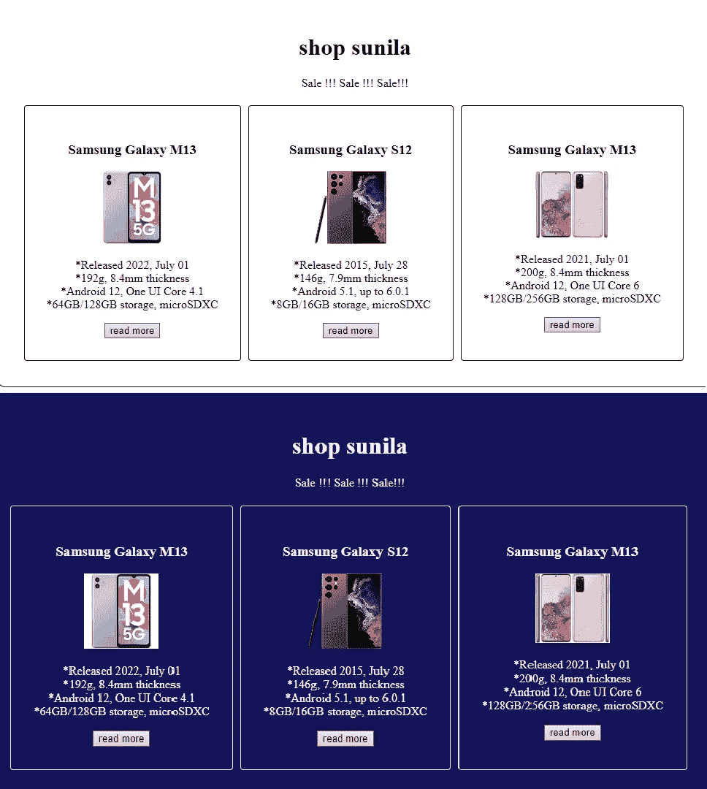

# 如何使用 HTML、CSS 和 JavaScript 制作一个明暗主题按钮

> 原文：<https://javascript.plainenglish.io/how-to-make-a-light-and-dark-theme-button-using-html-css-and-javascript-762695f7286a?source=collection_archive---------8----------------------->

# 步骤 01

首先，创建一个 index.html 文件，并将代码放在下面:

第一个 HTML 文件👇

# 步骤 02

请制作一个 CSS 文件，并将代码放在下面:

# 步骤 03

请创建一个 JS 文件，并将代码放在下面:

# 结论

希望你能够建设这个项目。请随意在评论中发表你的 [光影主题按钮](https://github.com/SameeraWijesooriya/Light-and-dark-theme-Button) *项目。*

如果你在实现这个过程中有任何困难或者需要任何帮助，请联系我。😍

试试我的项目-[https://sameerawijesooriya . github . io/Light-and-dark-theme-Button/](https://sameerawijesooriya.github.io/Light-and-dark-theme-Button/)

*更多内容看* [***说白了。报名参加我们的***](https://plainenglish.io/) **[***免费周报***](http://newsletter.plainenglish.io/) *。关注我们关于* [***推特***](https://twitter.com/inPlainEngHQ) ，[***LinkedIn***](https://www.linkedin.com/company/inplainenglish/)*，*[***YouTube***](https://www.youtube.com/channel/UCtipWUghju290NWcn8jhyAw)*，以及* [***不和***](https://discord.gg/GtDtUAvyhW) ***。*****

***有兴趣缩放你的软件启动*** *？检查出* [***电路***](https://circuit.ooo?utm=publication-post-cta) *。*