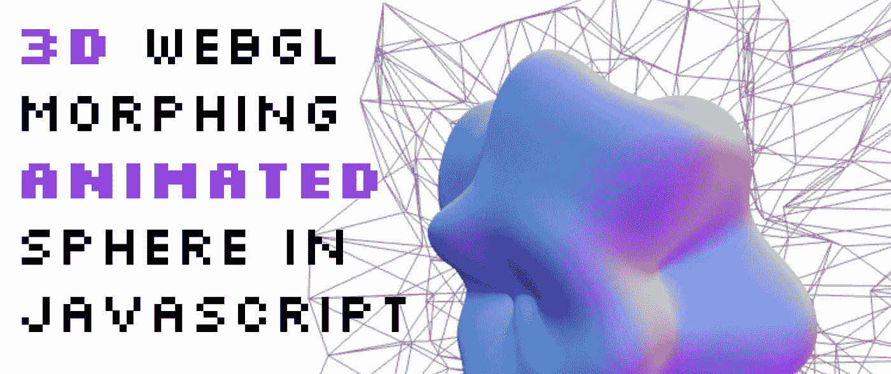

# 如何用 Three.js 在 JavaScript 中制作变形 3D 球体

> 原文：<https://javascript.plainenglish.io/how-to-make-a-morphing-3d-sphere-in-javascript-with-three-js-faad09e84876?source=collection_archive---------18----------------------->



我喜欢互联网上的 3d 效果，而且它们越来越普及。他们可以给网站增加一个额外的维度，帮助吸引用户的注意力。[我之前已经介绍过我制作的 WebGL 卡的 3d 效果](https://fjolt.com/article/apple-cards-webl-gl-javascript)，但是在本指南中，我想创建一个具有酷酷的线框背景的变形球体。

通过这篇教程，我也将帮助你理解 3d 效果如何在网络上工作的基础知识。让我们开始吧。

**下面是演示:**

# 创建 3D 变形球体

我用来在浏览器中访问 WebGL 功能的工具叫做 three.js。这是一个简化在浏览器中进行 3d 工作的过程的包——为此，它使用了`canvas`。稍后我们将通过代码追加这一点。

重要的是要理解 three.js 只是给了我们一个使用 WebGL 的接口，web GL 是一个用于在 web 上渲染 2d 和 3d 对象的 API。这也是我们接下来要导入 three.js 的原因。你可以通过`npm`做到这一点。我们要在这里安装的两个东西如下:

```
npm i three
npm i open-simplex-noise
npm install three-orbitcontrols
```

安装完成后，将它们导入到您的代码中。因为我是在 codepen 上做的演示，所以我用 skypack 导入了它们。这三个函数将让我们做三件事(不是双关语):

*   在 web 上使用三维形状(三个)
*   控制摄像机(三轨道控制)
*   创建噪声和随机性(开放单工噪声)

```
import * as THREE from "https://cdn.skypack.dev/three@0.133.1";
import { OrbitControls } from "https://cdn.skypack.dev/three@0.133.1/examples/jsm/controls/OrbitControls.js";
import openSimplexNoise from 'https://cdn.skypack.dev/open-simplex-noise';
```

# 在 three.js 中为 3d 对象设置场景

导入包后，我们想做几件事:

*   创建一个新的场景，让我们的 3d 物体坐在上面
*   **创建一个摄像机**，这样我们就可以看到我们的场景
*   创建一个渲染器，设置它的大小，这样我们就不会得到奇怪的模糊形状
*   **添加我们的轨道控制**，这样我们就可以点击并拖动我们的物体，并移动它

```
// Scene
let scene = new THREE.Scene();
// Camera
let camera = new THREE.PerspectiveCamera( 75, innerWidth / innerHeight, 0.1, 1000 );
camera.position.set(1.5, -0.5, 6);
// Renderer
let renderer = new THREE.WebGLRenderer({antialias: true, alpha: true});
renderer.setSize( innerWidth, innerHeight );
// Append our renderer to the webpage. Basically, this appends the `canvas` to our webpage.
document.body.appendChild( renderer.domElement );new OrbitControls(camera, renderer.domElement);
```

现在，乐趣可以开始了，我们可以开始添加我们的 3d 形状。

# 用 three.js 为我们的场景添加 3d 形状

首先，是我们的领域。three.js 中的每个对象都由两部分组成——**几何体**,即组成球体的顶点和三角形，以及**网格**,即这些顶点的颜色、图案和特征。

因为我们最终想要操作我们所有的顶点，所以我也将它们分别存储在一个`positionData`数组中。我们将使用 bult in `Vector3`函数在 three.js 中存储 3d 坐标集。

```
// Create our geometry
let sphereGeometry = new THREE.SphereGeometry(1.5, 100, 100);// This section is about accessing our geometry vertices and their locations
sphereGeometry.positionData = [];
let v3 = new THREE.Vector3();
for (let i = 0; i < sphereGeometry.attributes.position.count; i++){
    v3.fromBufferAttribute(sphereGeometry.attributes.position, i);
    sphereGeometry.positionData.push(v3.clone());
}// A `normal` material uses the coordinates of an object to calculate its color
let sphereMesh = new THREE.MeshNormalMaterial();// Combine both, and add it to the scene.
let sphere = new THREE.Mesh(sphereGeometry, sphereMesh);
scene.add(sphere);
```

# 改为使用自定义着色器

现在，**这里有一个**警告，我决定让我的球体更加可定制，为此，我使用了**着色器**。所以，当我们调用`MeshNormalMaterial`时，它实际上做了一些对网络来说有点不寻常的事情。它使用称为着色器的东西来计算每个顶点的颜色。

有两种类型的着色器，`fragment`，它本质上是对象的颜色，以及`vertex`，它是该形状上顶点的位置。这些着色器是用 **GLSL** 或 **OpenGL 着色语言**编写的——所以不是 JavaScript。我不打算详细介绍这种语言是如何工作的，但它更像 C 而不是 JavaScript。

基本原则是:

*   不使用`MeshNormalMaterial`，我们可以使用`ShaderMaterial`，并建立我们自己的着色器。
*   我们将使用**普通材质**着色器——因此会出现相同的效果，但是在我们的代码中使用它们意味着我们可以在以后更新它——例如，改变颜色。
*   我们可以使用`uniforms`将 JavaScript 变量实时传递给着色器，T5 是 GLSL 中的一种特殊类型的变量。

这意味着我们在 HTML 中定义我们的 GLSL，并用一个 JavaScript 选择器把它拉进来。**注意**:与`MeshNormalMaterial`相比，我没有对这些着色器做任何真正的改变——唯一的不同是我将一种颜色作为**制服**传入。这意味着，如果我们愿意，我们可以从 JavaScript 中更改这个值。这里我只展示片段着色器，但是两者都可以在 codepen 的 [HTML 部分找到。注意我定义了`uniform vec3 colorA`——这是我们将在 JavaScript 中使用的变量！](https://codepen.io/smpnjn/pen/MWVLqZa)

最终，着色器会根据我们的指示对 3D 对象的每个像素进行操作。它们计算量很大，但是可以创造一些非常酷的效果。

```
<script id="fragment" type="text/glsl">
uniform vec3 colorA;
#define NORMAL
#if defined( FLAT_SHADED ) || defined( USE_BUMPMAP ) || defined( TANGENTSPACE_NORMALMAP )
    varying vec3 vViewPosition;
#endif#include <packing>
#include <uv_pars_fragment>
#include <normal_pars_fragment>
#include <bumpmap_pars_fragment>
#include <normalmap_pars_fragment>
#include <logdepthbuf_pars_fragment>
#include <clipping_planes_pars_fragment>void main() {
    #include <clipping_planes_fragment>
    #include <logdepthbuf_fragment>
    #include <normal_fragment_begin>
    #include <normal_fragment_maps> gl_FragColor = vec4( normalize( normal ) * colorA + 0.5, 1.0 ); #ifdef OPAQUE
        gl_FragColor.a = 1.0;
    #endif 
}
</script>
```

# 普通着色器的工作原理

普通着色器通过计算`normalize( normal ) * 0.5 + 0.5`来计算像素的颜色。因此，我们可以将第一个`0.5`替换为自定义颜色，这就是我们的**制服** `colorA`。然后，我们可以将这两个顶点和片段着色器添加到 JavaScript 中，如下所示:

```
let sphereMesh = new THREE.ShaderMaterial({
    uniforms: {      
        colorA: {type: 'vec3', value: new THREE.Vector3(0.5, 0.5, 0.5)}, },
    vertexShader: document.getElementById('vertex').textContent,
    fragmentShader: document.getElementById('fragment').textContent,
});
```

学习 WebGL 时，了解它是如何工作的非常重要。着色器对于在 3d 中做事情非常重要，所以知道如何定义和操纵它们是很好的。

# 操纵我们球体的几何形状

然后我们可以创建一个 three.js 时钟来跟踪时间。我们利用这段时间来创建噪声，使用我们导入的噪声函数。噪波只是随机性，有助于创建随机变形球体的效果。之后，three.js 还为我们提供了添加动画关键帧的功能，我们可以使用前面提到的 three.js 时钟来制作那个球体的动画。

```
let noise = openSimplexNoise.makeNoise4D(Date.now());
let clock = new THREE.Clock();renderer.setAnimationLoop( () => {
    // Get the time
    let t = clock.getElapsedTime();
    sphereGeometry.positionData.forEach((p, idx) => {
        // Create noise for each point in our sphere
        let setNoise = noise(p.x, p.y, p.z, t * 1.05);
        // Using our Vector3 function, copy the point data, and multiply it by the noise
        // this looks confusing - but it's just multiplying noise by the position at each vertice
        v3.copy(p).addScaledVector(p, setNoise);
        // Update the positions
        sphereGeometry.attributes.position.setXYZ(idx, v3.x, v3.y, v3.z);
    })
    // Some housekeeping so that the sphere looks "right"
    sphereGeometry.computeVertexNormals();
    sphereGeometry.attributes.position.needsUpdate = true;
    // Render the sphere onto the page again.
    renderer.render(scene, camera);
})
```

现在我们的球体将开始变形！我对球体后面的平面也重复了这个步骤。我在这里用了一个`BoxGeometry`，只有一个基本的网格，这使它看起来像一个线框。这个位的代码，以及其他所有东西，[都可以在 CodePen](https://codepen.io/smpnjn/pen/MWVLqZa) 上找到。

# 结论

在网络上制作 3d 图形是一项非常好的前端技能。虽然很多事情可以用 CSS 和 HTML 来完成，但有些效果只能通过 3d 来实现，而 three.js 提供了一个完美的平台来实现这一点。我希望你喜欢这个用 three.js 和 JavaScript 创建 3d 变形球体的快速指南。如果你想要更多的 [JavaScript 内容](https://fjolt.com/category/javascript)，[你可以在这里阅读我所有的其他东西](https://fjolt.com/category/javascript)。

*更多内容看* [***说白了。报名参加我们的***](https://plainenglish.io/) **[***免费周报***](http://newsletter.plainenglish.io/) *。关注我们关于* [***推特***](https://twitter.com/inPlainEngHQ) ，[***LinkedIn***](https://www.linkedin.com/company/inplainenglish/)*，*[***YouTube***](https://www.youtube.com/channel/UCtipWUghju290NWcn8jhyAw)*，* [***不和***](https://discord.gg/GtDtUAvyhW) *。***