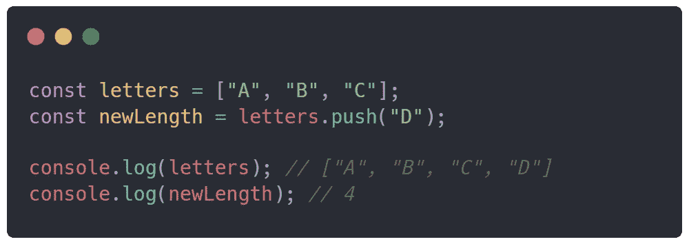
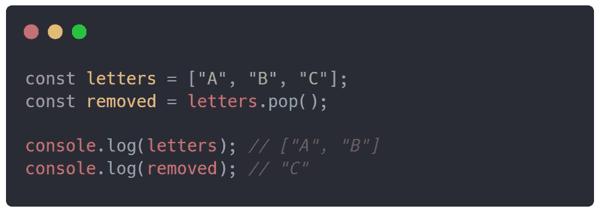
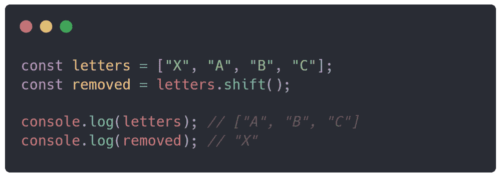
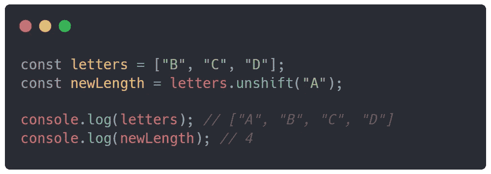

# 如何在 JavaScript 中创建队列

> 原文：<https://javascript.plainenglish.io/how-to-make-a-queue-in-javascript-a9bfe5ff6c2a?source=collection_archive---------10----------------------->

## Java Script 语言

## 使用 JavaScript 数组方法创建队列系统

Photo by [Michał Parzuchowski](https://unsplash.com/@mparzuchowski?utm_source=medium&utm_medium=referral) on [Unsplash](https://unsplash.com?utm_source=medium&utm_medium=referral)

队列非常适合将必须遵循特定顺序的事物放入队列。例如，队列的一个很好的用例是记录每个人位置的网站上的等待列表。幸运的是，JavaScript 已经实现了 4 个可用于堆栈或队列系统的数组方法。

## 如何创建队列？

创建队列的方式与创建普通内容数组的方式相同。我们可以用任何变量类型的关键字(`let`、`var`或`const`)初始化一个新的队列数组。允许使用`const`关键字，因为我们没有给它分配一个新数组，而只是用新内容修改它。

# 推送()

方法`push()`允许你添加一个元素到数组的顶端/末端。当我们调用这个方法时，`push()`返回插入了新元素的数组的长度。需要一个参数—我们要添加的元素`push(element)`。

## 例子

在一系列字母后添加字母`D`，然后将修改后的数组`letters`和数组的`newLength`注销到控制台的示例。

# 流行()

方法`pop()`允许你移除数组顶部/末端的一个元素。当我们调用这个方法时，`pop()`返回数组中被移除的最后一个元素。

## 例子

移除数组的最后一个元素，然后将修改后的数组`letters`数组和`removed`元素注销到控制台的示例。

# shift()

方法`shift()`允许您移除数组底部/开头的元素。当我们调用这个方法时，`shift()`返回数组中被移除的第一个元素。

## 例子

移除数组的第一个元素，然后将修改后的数组`letters`数组和`removed`元素注销到控制台的示例。

# 未移位()

方法`unshift()`允许你在数组的底部/开头添加一个元素。当我们调用这个方法时，`unshift()`返回插入了新元素的数组的长度。需要一个参数—我们要添加的元素`unshift(element)`。

## 例子

一个在字母序列前添加字母`A`，然后将修改后的数组`letters`和数组的`newLength`注销到控制台的例子。

## 结论

在 JavaScript 中创建一个队列对于在你的网站上建立一个等待列表，将新的人放入一个队列中，以及跟踪每个人的位置是非常重要的。我希望，这是一篇对你有益的文章，并且你现在会正确而明智地使用它。

*更多内容尽在* [***说白了. io***](https://plainenglish.io/) *。报名参加我们的* [***免费周报***](http://newsletter.plainenglish.io/) *。关注我们关于* [***推特***](https://twitter.com/inPlainEngHQ) *和*[***LinkedIn***](https://www.linkedin.com/company/inplainenglish/)*。查看我们的* [***社区不和谐***](https://discord.gg/GtDtUAvyhW) *加入我们的* [***人才集体***](https://inplainenglish.pallet.com/talent/welcome) *。*