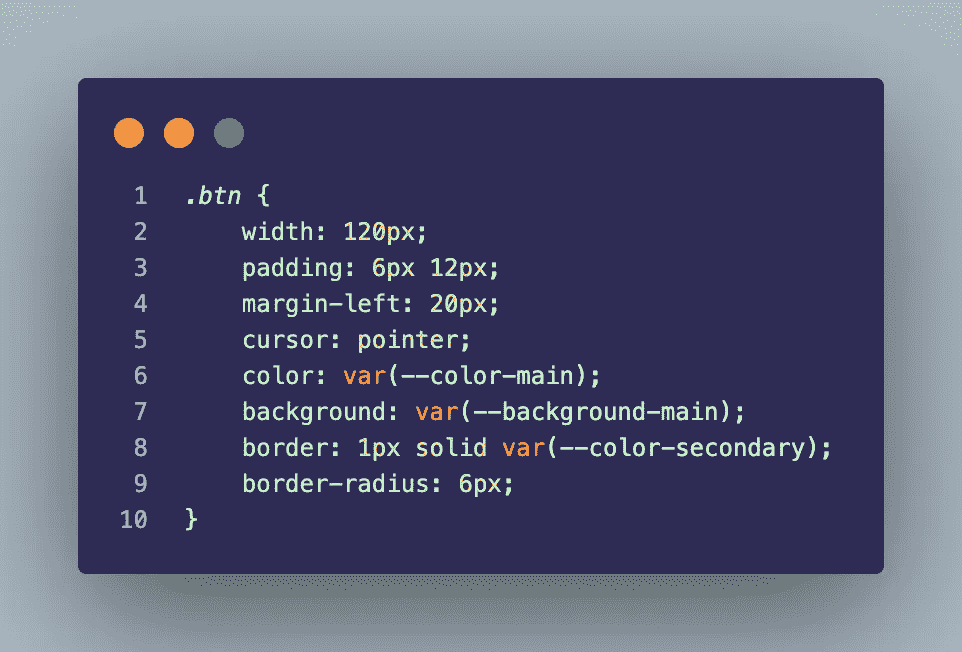

# 如何制作一个系统/亮/暗主题选择器

> 原文：<https://javascript.plainenglish.io/how-to-make-a-system-light-dark-theme-selector-4e70322205d7?source=collection_archive---------11----------------------->

## 如何只用 HTML、CSS 和 JavaScript 为你的网站或应用程序创建主题选择器的教程

这篇文章是关于如何在现代应用程序中创建一个非常常见的功能，这是一个主题选择器，允许用户只使用 HTML、CSS 和 JavaScript 为你的网站或应用程序选择亮、暗或系统管理的主题。

Photo by [Mohammad Rahmani](https://unsplash.com/@afgprogrammer?utm_source=medium&utm_medium=referral) on [Unsplash](https://unsplash.com?utm_source=medium&utm_medium=referral)

如今，几乎每个应用都允许用户选择他们最喜欢的主题，这对于用户体验来说是一个很好的改善(UX)，但作为开发者，我们需要非常小心，这样我们才不会弄乱预期的设计。

例如，在运行 Android 12 的手机中，如果应用程序没有呈现正确的深色主题，系统会尽最大努力在手机运行深色模式时应用一个，但这通常只是改变黑色和白色，会破坏应用程序的可读性和许多组件的对比度，严重损害用户体验和界面(UX/UI)。

另一个常见的问题是，当设置 CSS 配置来支持系统主题时，用户就失去了选择不同于系统主题的主题的可能性。

所以我将向您展示一种简单的方法来避免这些问题，只使用 HTML、CSS 和普通的 JavaScript，由于不需要插件或包，这种技术可以在任何 JS 框架上使用！

在本例中，我们将创建一个简单的 HTML 页面，如下所示:

HTML template for this example.

到目前为止，没有什么奇怪的，唯一需要注意的是 meta 标签`<meta name=”color-scheme” content="light dark" />`,它告诉系统我们的应用程序支持明暗主题，所以它使用我们的 CSS 样式，而不是黑色和白色的自动转换。我们将使用三个按钮来选择每个主题。

然后在我们的 CSS 上:

CSS root style.

在根元素上，我们将使用默认主题设置变量，在本例中是 Light 主题。然后我们将使用这些变量来设置每个元素的颜色，不允许硬编码的颜色！

例如，在按钮上，我们会这样做！

CSS style using predetermined variables.

然后我们将为我们的黑暗主题添加一个类:

CSS dark theme.

如你所见，这里我们将变量的值改为深色背景和浅色文本，所以如果我们将这个类添加到页面主体元素中，这些值将应用到我们的元素中。

在此之前，一切都很标准，现在让我们进入系统管理主题:

CSS system dark theme style.

这里我们使用一个`@media (prefers-color-scheme: dark)`来使用我们设备的系统在黑暗主题上运行时的一组规则。正是在这一部分，通常你会遇到用户丢失他们选择的系统正在使用的主题的问题，因为在几乎所有的教程中，建议使用`:root`元素来设置系统的黑暗主题，但这只会引发每次我们的系统主题改变为黑暗，我们的`:root`元素将改变我们的变量的值，这样，我们就完全失去了对主题的控制。这个想法是使用一个类来设置样式，所以不管系统是否处于黑暗模式，只有当用户选择使用系统的主题时，主题才会被应用，因此这个类被附加到我们的 body 元素上。

现在，我们将使用 JavaScript 来更改附加到 body 元素的类，然后控制我们应用什么主题:

JavaScript Theme Selector functionality.

为了便于开发，我们首先捕获 body 元素和三个按钮，然后为每个按钮添加一个 click 事件侦听器，将每个按钮的主题传递给 setTheme 函数。我们可以用我们所有的主题做一个数组来进行某种验证。然后，我们将我们选择的主题保存到我们的本地存储中，这样当用户再次打开我们的应用程序时，它将使用 loadTheme 功能自动获得其首选主题。然后，为了保持整洁，我们从 body 元素中删除了所有与主题相关的类，并向其中添加了我们想要的类。

这就是我们需要在我们的应用程序上有一个功能主题选择，这将与我们的系统主题，但不会损害我们的用户偏好。

之后，您可以添加尽可能多的主题，甚至创建一个自定义的颜色主题创建功能。在我的下一篇文章中会有相关的教程。

这是一个可用的 Codepen 示例。如果需要，您可以使用相同的代码:

Theme selector example.

我希望我把一切都解释清楚了，这对你有帮助。

*更多内容请看*[***plain English . io***](https://plainenglish.io/)*。报名参加我们的* [***免费周报***](http://newsletter.plainenglish.io/) *。关注我们关于*[***Twitter***](https://twitter.com/inPlainEngHQ)[***LinkedIn***](https://www.linkedin.com/company/inplainenglish/)*[***YouTube***](https://www.youtube.com/channel/UCtipWUghju290NWcn8jhyAw)*[***不和***](https://discord.gg/GtDtUAvyhW) *。对增长黑客感兴趣？检查* [***电路***](https://circuit.ooo/) *。***