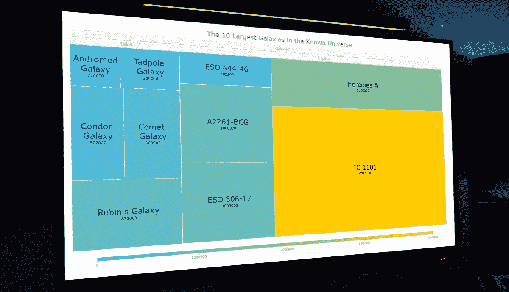

# 如何用 JavaScript 制作树形图

> 原文：<https://javascript.plainenglish.io/how-to-make-a-treemap-with-javascript-1ea7349395c7?source=collection_archive---------16----------------------->



树形图可视化广泛用于分层数据分析。如果您需要构建一个，但以前从未做过，您可能会认为这个过程有些复杂。嗯，不一定。我决定制作一个循序渐进的教程，解释如何使用 JavaScript 轻松创建令人敬畏的交互式树形图。你会喜欢这些插图的！

我们在宇宙中是孤独的吗？一个我们每个人都曾问过自己的问题。当我们考虑地球是否是宇宙中唯一可居住的星球时，我们可能会考虑的一件事是宇宙有多大。让我们在树形图的帮助下来看看吧！在本教程中，我们将使用树形图技术可视化已知宇宙中 10 个最大星系的规模。

那么，你想知道如何快速构建一个基于 JS 的树形图吗？跟随我学习这个循序渐进的教程，以一种简单有趣的方式学习吧！

# 什么是树形图？

在我们开始学习教程之前，让我们先来看看树形图的概念。[树形图](https://www.anychart.com/chartopedia/chart-type/treemap/)是一种用于可视化分层组织的树形结构数据的流行技术。旨在快速显示层次结构以及各个数据点的值，它使用嵌套的矩形，其大小与相应的数量成比例。

树的每个分支是一个矩形，对于子分支，有更小的矩形嵌套在其中。通过颜色和接近度显示数据，树形图可以很容易地表示大量数据，同时有效地利用空间，非常适合比较层次结构中的比例。

树状图是由 [Ben Shneiderman](https://en.wikipedia.org/wiki/Ben_Shneiderman) 教授发明的，他在信息设计和人机交互领域做出了重大贡献。树状图用于许多数据可视化领域，可以在股票市场数据分析、人口普查系统和选举统计以及数据新闻、硬盘探索工具等方面找到应用。

# 一瞥我们的 JS 树形图

所以现在，我们将使用 JavaScript 构建一个树形图来比较已知宇宙中前 10 个星系的大小。看看我们到底要创造什么。这是我们的 JS 树形图在教程结束时的样子。


让我们开始星际之旅吧！

# 创建一个基本的 JS 树形图

创建基于 JavaScript 的树形图通常需要以下四个基本步骤:

1.  创建 HTML 页面
2.  参考 JavaScript 文件
3.  设置数据
4.  写一些 JS 树映射代码

如果你是 HTML、CSS 和 JavaScript 的新手，也不用担心。我们将详细介绍每一个步骤，在本教程结束时，您将已经准备好自己的 JS 树形图。

那么，倒计时已经开始，让我们准备好我们的图表。

## 1.创建 HTML 页面

我们在这里做的第一件事是创建一个基本的 HTML 页面。在这里，我们添加了一个 HTML 块元素(`<div>`)——这是我们的树形图将要放置的地方——并为它分配了一个 ID 属性(例如，让它成为“container”)，以便在代码的后面引用它。

我们还应该为`<div>`设置一些样式。让我们将`width`和`height`属性定义为 100%，边距和填充为 0。你可以根据自己的喜好改变它。

```
<!DOCTYPE html>
<html lang="en">
  <head>
    <meta charset="utf-8">
    <title>JavaScript Treemap Chart</title>
    <style type="text/css">   
      html, body, #container {
        width: 100%;
        height: 100%;
        margin: 0;
        padding: 0;
      }
    </style>
  </head>
  <body>
    <div id="container"></div>
  </body>
</html>
```

## 2.参考 JavaScript 文件

接下来，我们需要引用创建树形图所需的所有脚本。

有[多个](https://en.wikipedia.org/wiki/Comparison_of_JavaScript_charting_libraries) JavaScript 图表库可供选择。创建交互式数据可视化的基本步骤或多或少都是相同的。在这里，为了便于说明，我将使用[any chart](https://www.anychart.com)——它支持树形图并有一个免费版本，源代码在 [GitHub](https://github.com/AnyChart/AnyChart) 上开放。

因此，要构建一个树形图，我们需要“核心”和“树形图”模块。让我们在第一步中创建的 HTML 页面的 head 部分引用这两者。我们将从 CDN 获得它们(或者，可以下载脚本)。

```
<!DOCTYPE html>
<html lang="en">
  <head>
    <meta charset="utf-8">
    <title>JavaScript Treemap Chart</title>
    <script src="https://cdn.anychart.com/releases/8.11.0/js/anychart-core.min.js"></script>
    <script src="https://cdn.anychart.com/releases/8.11.0/js/anychart-treemap.min.js"></script>
    <style type="text/css">   
      html, body, #container {
        width: 100%;
        height: 100%;
        margin: 0;
        padding: 0;
      }
 </style>
  </head>
  <body>
    <div id="container"></div>
  </body>
</html>
```

## 3.设置数据

数据来了。我们将想象出已知宇宙中最大的 10 个星系的规模。这些星系是如此的巨大，以至于可以用它们有多少光年来衡量。一光年是一束光在一个地球年中传播的距离，大约相当于 6 万亿英里。

我已经从[Largest.org](https://largest.org/geography/galaxies/)那里得到了星系尺度的数据。

对于我们的图表，树形结构数据如下所示。根级元素是“星系”，根据星系类型分为“椭圆”和“螺旋”作为其子元素，而这些子元素又有一系列单独的星系对象作为自己的子元素。

每个星系物体都有以光年为单位的名称和规模的键值属性。例如，`{name: "IC 1101", value: 4000000}`表示 IC 1101 星系，其尺度为 400 万光年。老实说，很难理解它有多大。

```
var dataSet = [
  {name: "Galaxies", children: [
    {name: "Elliptical", children: [
      {name: "IC 1101", value: 4000000},
      {name: "Hercules A", value: 1500000},
      {name: "A2261-BCG", value: 1000000},
      {name: "ESO 306-17", value: 1000000},
      {name: "ESO 444-46", value: 402200},
    ]},
    {name: "Spiral", children: [ 
      {name: "Rubin's Galaxy", value: 832000},
      {name: "Comet Galaxy", value: 600000},
      {name: "Condor Galaxy", value: 522000},
      {name: "Tadpole Galaxy", value: 280000},
      {name: "Andromeda Galaxy", value: 220000} 
    ]}
  ]}
];
```

## 4.写一些 JS 树映射代码

现在，只需几行 JavaScript 代码来为我们的树形图加油。

首先，我们包含了`anychart.onDocumentReady()`函数，它将封装树形图的所有 JavaScript 代码，确保它在网页完全加载并准备就绪时执行。

```
<script>
  anychart.onDocumentReady(function () {
 ***// The JS treemapping code will be written here.***  });
</script>
```

第二步，我们在树形图中添加我们想要可视化的数据，从第三步开始。

```
<script>

  anychart.onDocumentReady(function () {

    var dataSet = [
      {name: "Galaxies", children: [
        {name: "Elliptical", children: [
          {name: "IC 1101", value: 4000000},
          {name: "Hercules A", value: 1500000},
          {name: "A2261-BCG", value: 1000000},
          {name: "ESO 306-17", value: 1000000},
          {name: "ESO 444-46", value: 402200},
        ]},
        {name: "Spiral", children: [ 
          {name: "Rubin's Galaxy", value: 832000},
          {name: "Comet Galaxy", value: 600000},
          {name: "Condor Galaxy", value: 522000},
          {name: "Tadpole Galaxy", value: 280000},
          {name: "Andromeda Galaxy", value: 220000} 
        ]}
      ]}
    ];

  });

</script>
```

第三，我们添加下面一行来从树数据创建一个树形图。

```
var chart = anychart.treeMap(dataSet, "as-tree");
```

最后，我们添加一个标题，将图表放入之前定义的`<div>`容器中，并使用`draw`命令显示它。

```
chart.title("The 10 Largest Galaxies in the Known Universe");
chart.container("container");
chart.draw();
```

现在我们的 JS 树形图已经基本准备好了，如果我们就此打住，它看起来会像这样:


加载树形图时，只能立即看到两个图块，“椭圆形”和“螺旋形”我们可以点击它们，它们会展开显示各自的子星系——这就是所谓的[下钻](https://docs.anychart.com/Drilldown)动作。


为什么会这样，就两块瓷砖？因为默认情况下，最大深度值设置为 1。这意味着我们一次只能看到其父级的一个级别。较低的级别是隐藏的。在第一个层面上，我们将“星系”分为“椭圆”和“螺旋”，所以我们只能默认看到这种情况。

现在，我们如何一次显示所有的银河方块呢？很简单。我们只需要使用`maxDepth()`功能改变最大深度值。

```
chart.maxDepth(2);
```

倒计时结束了，我们的树形图已经是现在了！


在这张图表中，我们可以看到星系是如何根据层次进行分组的，我们还可以单击顶部的“椭圆形”或“螺旋形”标题来放大它们的子星系。

在 [JSFiddle](https://jsfiddle.net/awanshrestha/zL6gbem5/) 【或者 [AnyChart Playground](https://playground.anychart.com/zUBT93xw/) 上看看这个基本 JavaScript 树形图的交互版本。你可以随意摆弄它。您也可以查看下面的完整代码。

```
<!DOCTYPE html>
<html lang="en">
  <head>
    <meta charset="utf-8">
    <title>JavaScript Treemap Chart</title>
    <script data-fr-src="https://cdn.anychart.com/releases/8.11.0/js/anychart-core.min.js"></script>
    <script data-fr-src="https://cdn.anychart.com/releases/8.11.0/js/anychart-treemap.min.js"></script>
    <style type="text/css">   
      html, body, #container {
        width: 100%;
        height: 100%;
        margin: 0;
        padding: 0;
      }
    </style>
  </head>
  <body>
    <div id="container"></div>

    <script>

      anychart.onDocumentReady(function () {

 ***// create the data***        var dataSet = [
          {name: "Galaxies", children: [
            {name: "Elliptical", children: [
              {name: "IC 1101", value: 4000000},
              {name: "Hercules A", value: 1500000},
              {name: "A2261-BCG", value: 1000000},
              {name: "ESO 306-17", value: 1000000},
              {name: "ESO 444-46", value: 402200},
            ]},
            {name: "Spiral", children: [ 
              {name: "Rubin's Galaxy", value: 832000},
              {name: "Comet Galaxy", value: 600000},
              {name: "Condor Galaxy", value: 522000},
              {name: "Tadpole Galaxy", value: 280000},
              {name: "Andromeda Galaxy", value: 220000} 
            ]}
          ]}
        ];

 ***//  create the treemap chart and set the data***        var chart = anychart.treeMap(dataSet, "as-tree");

 ***// set the chart title***        chart.title("The 10 Largest Galaxies in the Known Universe");

 ***// set the container id for the chart***        chart.container("container");

 ***// initiate drawing the chart***        chart.draw();

      });

    </script>
  </body>
</html>
```

创建一个漂亮的 JavaScript 树形图很容易，不是吗？现在，你可以一目了然地看到 10 个最大星系的规模，并对它们进行比较。

最终的图表对我来说已经很不错了。但是，让我向您展示如何在需要时定制 JavaScript 树形图。

# 自定义 JS 树形图

现在，让我们添加一些美学和功能上的变化，使我们的交互式树形图更好，更有洞察力。

## A.改变颜色

改变任何图表的外观和感觉的一个简单方法是改变颜色以匹配我们所表示的数据。这里我们展示了宇宙中的星系。当我想到宇宙时，我想象黑暗空间中深蓝色和紫色的恒星云。

所以，让我们改变瓷砖的颜色。让我们把它们涂成紫色。此外，让我们使他们深蓝色时，选择。

```
chart.normal().fill('#B46FC2');
chart.hovered().fill('#44008B', 0.8);
chart.selected().fill('#0A0068', 0.8);
chart.selected().hatchFill("forward-diagonal", '#282147', 2, 20);
```

这里，我们添加了`fill()`和`hatchFill()`方法来改变树形图的颜色。


## B.应用线性色标

在树形图中，不仅是尺寸，还有图块的颜色都有助于突出比例。让我们来看一个很酷的方法，在线性色标的帮助下，根据相应的数据维度自动给图块着色。

我们创建一个线性色标，为其提供两个值，一个是最低范围值，另一个是最高范围值，最后，启用颜色范围。

```
var customColorScale = anychart.scales.linearColor();
customColorScale.colors(['#37B8F7', '#ffcc00']);
chart.colorScale(customColorScale);
chart.colorRange().enabled(true);
chart.colorRange().length('90%');
```

为了实现这些功能，我们需要去掉前一节中编写的代码。


这里我们有浅蓝色代表最低，黄色代表最高。和颜色一起玩。

## C.格式化标签和工具提示

我们可以使用 HTML 来格式化我们的标签。为此，我们需要为标签启用 HTML。那么您可以无限制地使用 HTML 来设计它们的样式。

为了简单起见，我们将把标签格式化为`<span>` HTML 元素，并设置它们的样式以增加字体大小和改变颜色。

```
chart.labels().useHtml(true);
chart.labels().format(
  "<span style='font-size: 24px; color: #00076f'>{%name}</span><br>{%value}"
);
```

正如你在上面的代码片段中看到的，我们还使用了`{%name}`和`{%value}`标记来改变树形图标签和工具提示的文本。这样，在创建可视化时，将输出每个星系的名称和比例值。

此外，让我们使用`format()`方法定制工具提示的文本。信息丰富的工具提示有助于更好地理解数据。

```
chart.tooltip().format(
  "Scale: {%value} light-years"
);
```


我们基于 JS 的树形图在标签和工具提示格式上看起来有了很大的改进。

## D.按升序排列图块

默认情况下，树图平铺按降序排列。我们可以看到星系从最高到最低排序，规模最大的 IC 1101 星系是左起第一个。

但情况不一定总是如此。有时，我们可能需要以升序显示数据。准备好惊讶地发现这有多简单吧！我们只用一行代码就做到了。

```
chart.sort("asc");
```


查看下面这个最终的交互式 JavaScript 树形图的全部代码[也可以在 [AnyChart 游乐场](https://playground.anychart.com/5ZzVNs9c)上查看]。请随意尝试一些实验。

```
<!DOCTYPE html>
<html lang="en">
  <head>
    <meta charset="utf-8">
    <title>JavaScript Treemap Chart</title>
    <script data-fr-src="https://cdn.anychart.com/releases/8.11.0/js/anychart-core.min.js"></script>
    <script data-fr-src="https://cdn.anychart.com/releases/8.11.0/js/anychart-treemap.min.js"></script>
    <style type="text/css">   
      html, body, #container {
        width: 100%;
        height: 100%;
        margin: 0;
        padding: 0;
      }
    </style>
  </head>
  <body>
    <div id="container"></div>

    <script>

      anychart.onDocumentReady(function () {

 ***// create the data***        var dataSet = [
          {name: "Galaxies", children: [
            {name: "Elliptical", children: [
              {name: "IC 1101", value: 4000000},
              {name: "Hercules A", value: 1500000},
              {name: "A2261-BCG", value: 1000000},
              {name: "ESO 306-17", value: 1000000},
              {name: "ESO 444-46", value: 402200},
            ]},
            {name: "Spiral", children: [ 
              {name: "Rubin's Galaxy", value: 832000},
              {name: "Comet Galaxy", value: 600000},
              {name: "Condor Galaxy", value: 522000},
              {name: "Tadpole Galaxy", value: 280000},
              {name: "Andromeda Galaxy", value: 220000} 
            ]}
          ]}
        ]; ***// create the treemap chart and set the data***        var chart = anychart.treeMap(dataSet, "as-tree");

 ***// set the chart title***        chart.title("The 10 Largest Galaxies in the Known Universe"); ***// set a custom color scale***        var customColorScale = anychart.scales.linearColor();
        customColorScale.colors(['#37B8F7', '#ffcc00']);
        chart.colorScale(customColorScale);
        chart.colorRange().enabled(true);
        chart.colorRange().length('90%'); ***// format the labels***        chart.labels().useHtml(true);
        chart.labels().format(
          "<span style='font-size: 24px; color: #00076f'>{%name}</span><br>{%value}"
        );

 ***// format the tooltips***        chart.tooltip().format(
          "Scale: {%value} light years"
        ); ***// sort in ascending order***        chart.sort("asc");

 ***// set the container id for the chart***        chart.container("container");

 ***// initiate drawing the chart***        chart.draw();

      });

    </script>
  </body>
</html>
```

# 结论

你可能还没有找到“我们在宇宙中是孤独的吗？”问题。但是您已经学会了毫不费力地创建令人敬畏的交互式 JavaScript 树形图！

现在轮到您构建自己的基于 JS 的树形图可视化了。查看[树形图文档](https://docs.anychart.com/Basic_Charts/Treemap_Chart)以了解除了我们在本教程中讨论的内容之外还可以做什么，或者对不同的图表库应用相同的逻辑，如果您需要任何进一步的帮助，请不要犹豫联系我(我会尽力而为)。

宇宙在不断扩张，让我们的学习、知识和创造力也是如此。

***经阿万·施雷斯塔许可出版。原载于 2022 年 6 月 1 日***[***DZone***](https://dzone.com/articles/treemap-chart-javascript)***标题为《如何使用 JavaScript 构建树形图》。***

***你可能也想看基本的 JavaScript***[***Treemap 图表教程***](https://www.anychart.com/blog/2019/08/01/treemap-chart-create-javascript/) ***最初发表在我们的博客上。***

***查看其他***[***JavaScript 制图教程***](https://www.anychart.com/blog/category/javascript-chart-tutorials/) ***。***

*最初发表于 2022 年 6 月 8 日*[*https://www.anychart.com*](https://www.anychart.com/blog/2022/06/08/treemap-js/)*。*

*更多内容请看*[***plain English . io***](https://plainenglish.io/)*。报名参加我们的* [***免费周报***](http://newsletter.plainenglish.io/) *。关注我们关于*[***Twitter***](https://twitter.com/inPlainEngHQ)*和*[***LinkedIn***](https://www.linkedin.com/company/inplainenglish/)*。查看我们的* [***社区不和谐***](https://discord.gg/GtDtUAvyhW) *加入我们的* [***人才集体***](https://inplainenglish.pallet.com/talent/welcome) *。*