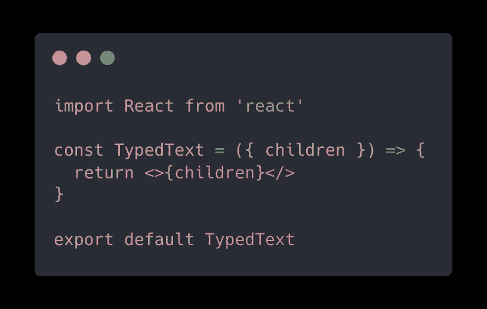
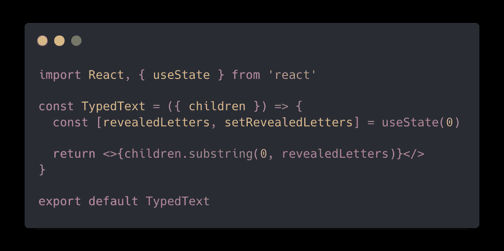
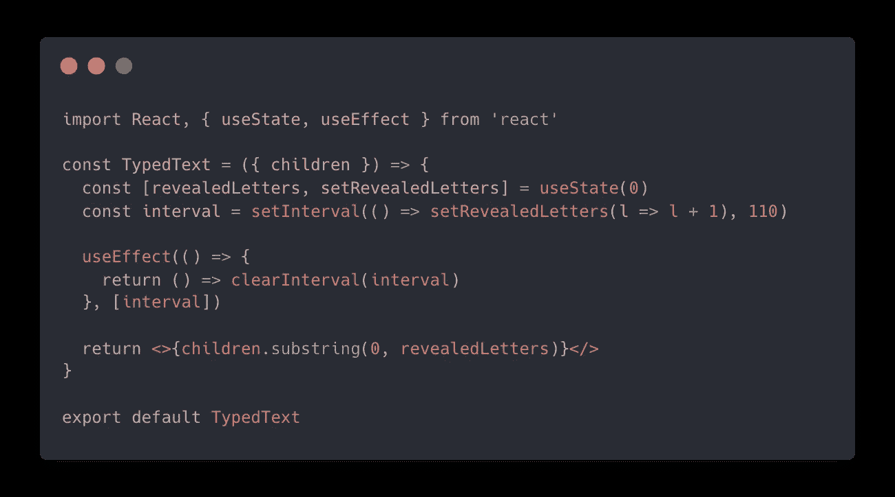
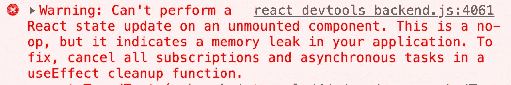
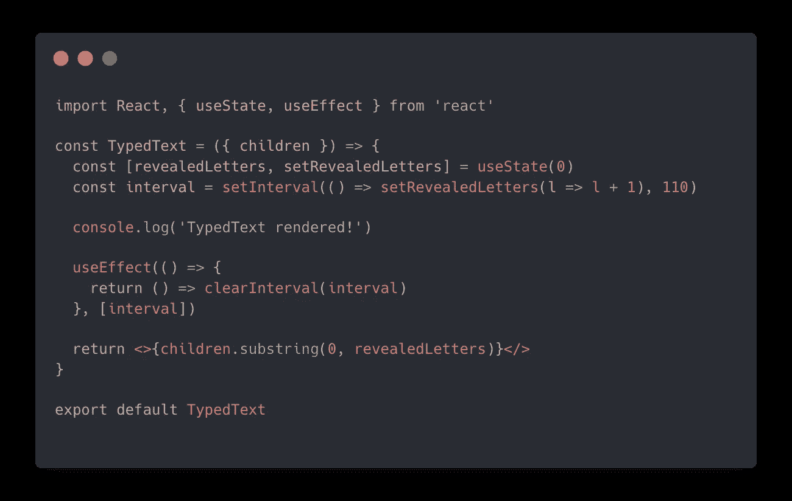
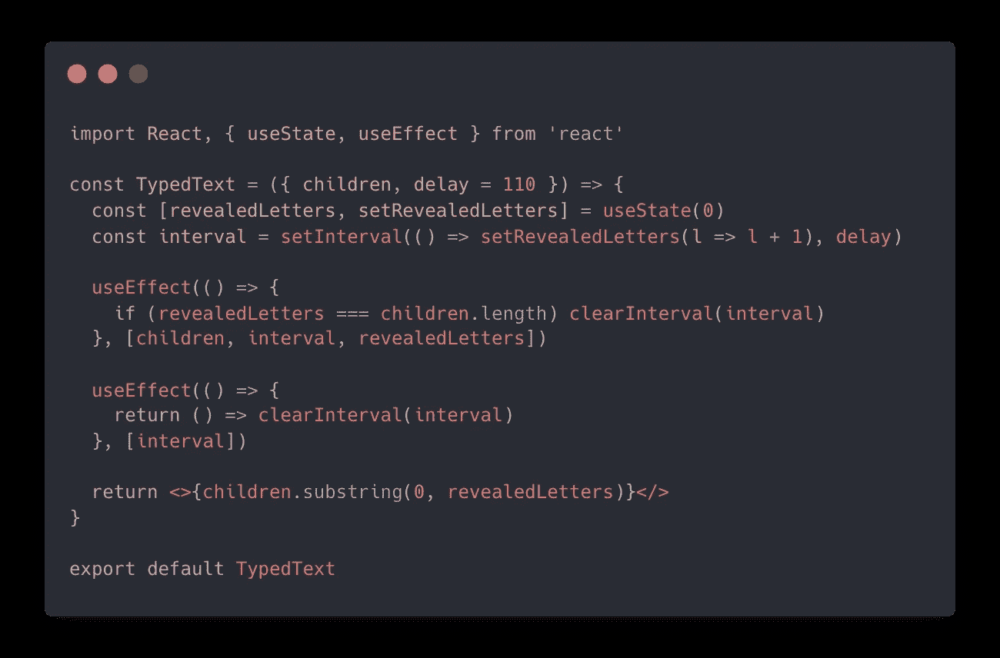
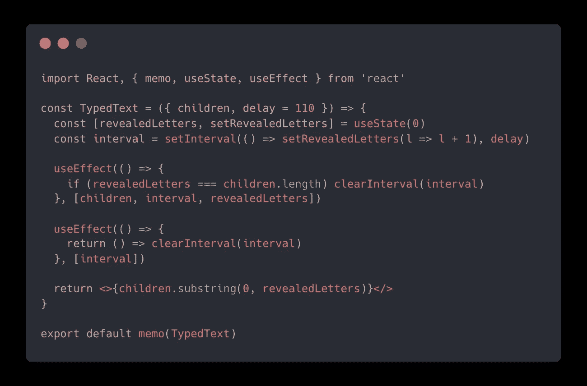

# 如何制作类型化文本反应组件

> 原文：<https://javascript.plainenglish.io/how-to-make-a-typed-text-react-component-f92a035d194?source=collection_archive---------10----------------------->

Photo by [Bernard Hermant](https://unsplash.com/@bernardhermant?utm_source=medium&utm_medium=referral) on [Unsplash](https://unsplash.com?utm_source=medium&utm_medium=referral)

我最近构建了一个“输入文本”React 组件，用于我的[网站](http://wilstaley.com)。该组件将获取任何文本，并使其看起来像正在被键入一样。

今天，我想介绍一下我是如何构建这个组件的，因为我认为这是一个很好的练习，可以帮助您构建反应技能。

## 这个计划

有很多方法可以解决这个问题！让我概述一下我想如何用一个定制的 React 组件来完成这个任务…

这个“TypedText”组件将通过 children prop 接收一些文本。它将负责简单的文本动画，没有花哨的样式或类似的东西。然后，任何我们希望“键入”的文本，我们都可以放在`<TypedText>`组件中。我们将通过最初呈现一个空字符串来执行动画，然后按照设定的时间间隔追加每个字符，一次一个。我们将一直这样做，直到完整的字符串被呈现出来，并且看起来已经被输入到屏幕上！下面是最终的结果:

我们还会添加一个“延迟”道具，这样你就可以自定义显示角色之间的延迟时间。

## 让我们建造它！

让我们从创建一个基本组件开始:

所有这些都是返回通过儿童道具提供的文本……目前看来毫无意义。现在让我们添加一些状态来跟踪有多少字母被泄露:

这里我们将`revealedLetters`状态初始化为 0，因为我们希望从没有字母显示开始。我们将这个状态与 [substring](https://developer.mozilla.org/en-US/docs/Web/JavaScript/Reference/Global_Objects/String/substring) 方法一起使用，只返回通过子属性传递给这个组件的字母的子集。

substring 方法的作用与您想象的完全一样，它返回调用它的原始字符串的子字符串。例如:

`'cowboy'.substring(0, 3) === 'cow'`

好的，我们有办法返回所提供的字母的特定子集。现在，我们需要一种方法来增加某个时间间隔内显示字母的数量。让我们添加一些东西来做到这一点:

首先，我们调用 [setInterval](https://developer.mozilla.org/en-US/docs/Web/API/setInterval) 来增加在设定的时间间隔内显示的字母的数量。`setInterval`方法将函数和延迟作为参数。它将连续调用提供的函数，每次调用之间有固定的时间延迟。查看这段特定的代码，`setInterval(() => setRevealedLetters(l => l + 1), 110)`，我们提供了一个函数，它将每 110 毫秒递增一次 revealedLetters 状态。

现在我们知道了 setInterval 是如何工作的，我们需要一些方法来停止它！我们不希望它永远持续运行我们的功能！事实上，如果我们只是调用`setInterval()`而不告诉它停止增加我们的状态，这将是一个等待发生的错误。为什么？因为当我们的 TypedText 组件卸载时，setInterval 会继续尝试更新不再在 dom 中的组件的状态。如果您曾经尝试更新未安装组件的状态，您可能会在控制台中看到类似这样的弹出错误:

请注意错误消息末尾的内容:*“要解决这个问题，请取消 useEffect 清理函数中的所有订阅和异步任务”*。

^这就是为什么我们在 setInterval 之外增加了 useEffect。如果从 useEffect 钩子中返回一个函数，React 将在组件卸载时执行这个函数。这就是所谓的“清理”功能，可用于取消组件卸载后您不希望发生的任务。清理功能可以用于很多事情，比如取消网络请求，但是在我们的例子中，我们将使用它来清理我们的时间间隔。

你可能注意到，当我们调用`setInterval()`时，我们将其返回值赋给一个叫做“interval”的常数。调用`setInterval()`的返回值是一个 id，用来标识刚刚创建的区间。我们需要存储一个对该 id 的引用，这样我们就可以通过将该 id 传递给`clearInterval()`来取消间隔。

# 全部完成！对吗？

不完全是！

虽然我们的 TypedText 组件完全可以工作并且看起来不错，但是它并没有经过优化。要看到这一点，尝试在组件的顶层添加一个`console.log`,如下所示:

如果打开控制台，您会看到“TypedText rendered！”不断地被打印——组件不必要地重新呈现自己！它为什么这样做？因为，setInterval 会不断更新 revealedLetters 的状态，即使在所有字母都已显示之后。在 React 中，更新组件的状态会导致组件重新呈现。

一旦所有的角色都被展示出来，我们真的应该停止我们的幕间休息。我们将这样做:

这里，我们添加了另一个 useEffect 钩子。这个 useEffect 在其依赖数组中包含了`revealedLetters`，所以每次`revealedLetters`递增时，它都会重新运行这个函数。我们在这里所做的就是检查是否所有的字母都被显示了，如果是，清除我们的间隔。这将防止我们的 TypedText 组件在所有字母显示后不必要地重新呈现。

你可能想知道为什么需要两个独立的使用效果。为什么不直接把返回的“清理”函数放在第一个 useEffect 中呢？嗯，我还没有告诉你这些清理函数是如何工作的……当组件被卸载时，从 useEffect 返回的清理函数不仅仅是*调用的*。每次效果运行之前都会调用它，以便从上次运行中清理。因此，如果我们试图从第一个 useEffect 返回我们的 cleanup 函数，它会在每次显示另一个字母时尝试清除我们的间隔。那可不好。好消息是，在一个 React 组件中有多个 useEffect 完全没问题😀

## 奖励积分

现在我们的组件性能更高了。让我们再添加一些小东西来使这个组件 ***更上一层楼*** ！

首先，让我们添加我在开始时提到可选延迟属性:

如你所见，我们添加了一个简单的“延迟”道具。我们给它一个默认值 110，这样如果用户没有指定这个属性，它将有一个合理的默认值。然后我们简单地用延迟变量替换`setInterval()`中硬编码的 110 毫秒。很简单。

接下来，让我们记住这个组件:

我们在这里所做的就是从 react 导入`memo`,并将默认导出包装在这个高阶组件中。我们为什么要这么做？我认为 React 的[文档](https://reactjs.org/docs/react-api.html#reactmemo)最好地解释了这一点:

> "如果您的组件在给定相同的属性的情况下呈现相同的结果，您可以将它包装在对 React.memo 的调用中，在某些情况下通过记忆结果来提高性能。这意味着 React 将跳过组件的渲染，并重用最后一次渲染的结果… React.memo 只检查属性更改。如果 React.memo 中包装的函数组件在其实现中有一个 useState、useReducer 或 useContext 挂钩，当状态或上下文发生变化时，它仍会重新呈现。

现在你知道了！一个优化的、灵活的、令人敬畏的 React 组件，可以用于任何文本！

我希望这有助于您通过构建这个基本组件学到一些东西。如果你喜欢这篇文章，并希望看到更多类似的文章，请考虑成为 https://www.patreon.com/wilstaley 的顾客！

## 进一步阅读

 [## 用 React 和 Bit 设计组件中的令牌

### 现场演示更好。在我们深入细节之前，让我们看一下使用 Bit 设计令牌如何帮助我们构建…

比特云](https://bit.cloud/blog/design-tokens-in-components-with-react-and-bit-l28qlxq6) 

*更多内容请看*[***plain English . io***](https://plainenglish.io/)*。报名参加我们的* [***免费周报***](http://newsletter.plainenglish.io/) *。关注我们关于*[***Twitter***](https://twitter.com/inPlainEngHQ)[***LinkedIn***](https://www.linkedin.com/company/inplainenglish/)*[***YouTube***](https://www.youtube.com/channel/UCtipWUghju290NWcn8jhyAw)***，以及****[***不和***](https://discord.gg/GtDtUAvyhW) *对成长黑客感兴趣？检查* [***电路***](https://circuit.ooo/) ***。*****