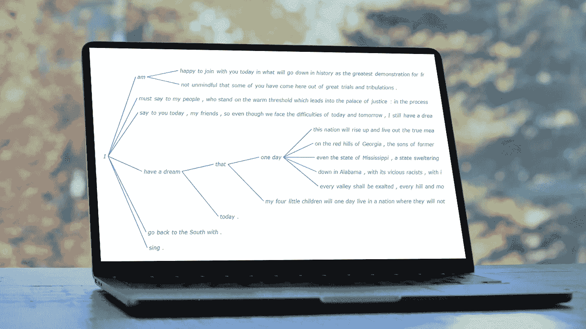
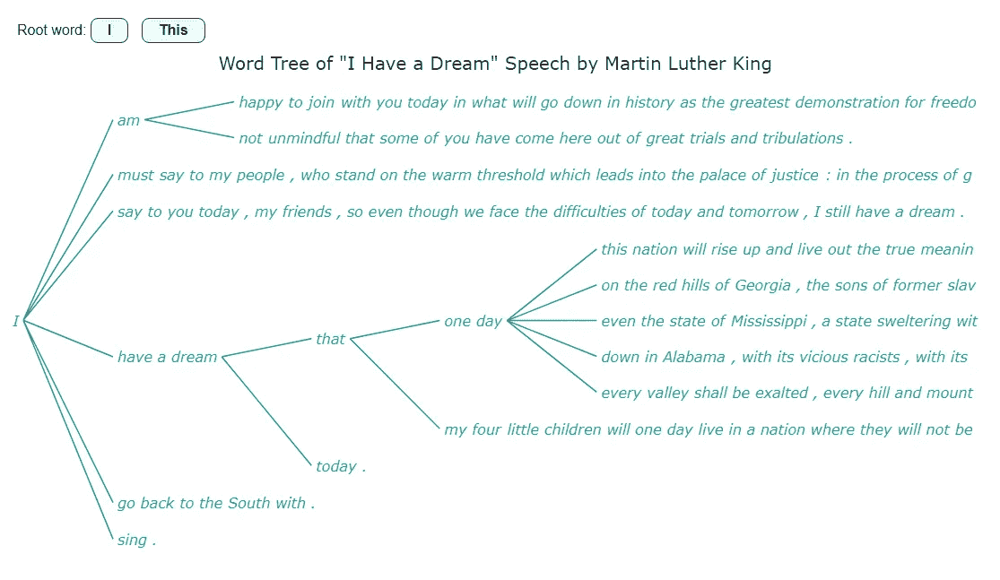

# 如何用 JavaScript 制作单词树

> 原文：<https://javascript.plainenglish.io/how-to-make-a-word-tree-using-javascript-ad34b5bc24d1?source=collection_archive---------12----------------------->

## 了解如何在可视化马丁·路德·金的“我有一个梦想”演讲的同时，在 JS 中快速制作酷炫的交互式单词树图表。



一个明显的事实是，数据的图形或图像表示，即所谓的[数据可视化](https://www.anychart.com/blog/2018/11/20/data-visualization-definition-history-examples/)，比数组、电子表格或密集报告中的原始数据更快地传递信息。图表使数据更容易理解，这进一步有助于快速形成有价值的见解。很有趣，对吧？现在，让我们看看一种叫做**单词树**的图表类型，看看如何轻松地构建它。

单词树是一种数据可视化形式，旨在显示文本中出现的多个平行单词(或短语)序列。使用单词树分析文本变得更容易，因为它们通过分支结构显示所选单词如何与其他单词相联系。

在本教程中，我将带你浏览用 JavaScript (HTML5)创建一个漂亮的单词树图表的过程。被可视化的文本将是牧师和民权活动家马丁·路德·金的著名演讲**“我有一个梦想”**。每个步骤都将被详细解释，你会发现一切都很简单。好好坐着，享受学习吧！

# 将要创建的单词树图表

这是最终单词树图的样子。请继续阅读，了解如何使用 JavaScript 快速创建这样的可视化。



# 用 JavaScript 构建基本单词树

你可能会发现单词树的概念有点复杂。但是我向你保证，制作这样一张图表并没有什么了不起。这里有四个基本步骤:

1.  创建一个 HTML 页面。
2.  包括 JavaScript 文件。
3.  加载数据。
4.  为图表添加一些 JS 代码。

现在，我们将逐一介绍这些步骤。

## 1.创建 HTML 页面

第一步是获取图表的网页。

创建一个基本的 HTML 页面。添加一个`<div>`元素——这是单词树将被放置的地方。给它一个 ID。

将`width`和`height`参数设置为 100%,以便在整个屏幕上显示图表。或者根据您的需求进行配置。

请随意在结构中添加您的特殊风格。

```
<!DOCTYPE html>
<html lang="en">
  <head>
    <meta charset="utf-8">
    <title>JavaScript Word Tree Chart</title>
    <style type="text/css">      
      html, body, #container { 
        width: 100%; 
        height: 100%; 
        margin: 0; 
        padding: 0; 
      } 
    </style>
  </head>
  <body>
    <div id="container"></div>
  </body>
</html>
```

## 2.包括 JavaScript 文件

当您使用一个现成的支持这种图表类型的好的 JavaScript 图表库时，创建单词树会非常容易。在本教程中，将根据[文档使用](https://docs.anychart.com/Basic_Charts/Word_Tree) [AnyChart](https://www.anychart.com/) 演示该过程。

让我们从 AnyChart [CDN](https://cdn.anychart.com) 中包含所需的 JS 文件(或者，您可以下载它们)。[核心模块](https://docs.anychart.com/Quick_Start/Modules#core)和[单词树模块](https://docs.anychart.com/Quick_Start/Modules#word_tree)是创建单词树图表所需的脚本。 [jQuery](https://code.jquery.com/jquery-latest.min.js) 将用于查询文本文件。

需要在`<head>`部分引用脚本。JS 代码将放在 JavaScript 标记脚本中，该脚本可以放在`<head>`或`<body>`部分的任何地方。所以我们的 HTML 现在看起来像这样:

```
<!DOCTYPE html>
<html lang="en">
  <head>
    <meta charset="utf-8">
    <title>JavaScript Word Tree Chart</title>
    <script src="https://cdn.anychart.com/releases/8.11.0/js/anychart-core.min.js"></script>
    <script src="https://cdn.anychart.com/releases/8.11.0/js/anychart-wordtree.min.js"></script>
    <script src="https://code.jquery.com/jquery-latest.min.js"></script>
    <style type="text/css">      
      html, body, #container { 
        width: 100%; 
        height: 100%; 
        margin: 0; 
        padding: 0; 
      } 
    </style>
  </head>
  <body>
    <div id="container"></div>
    <script>
 ***// The JS Word Tree chart’s code will be written here.***    </script>
  </body>
</html>
```

## 3.加载数据

现在，是时候设置数据了。我从[马歇尔大学](https://www.marshall.edu/onemarshallu/i-have-a-dream/)的网站下载了马丁·路德·金博士的演讲《我有一个梦想》并创建了一个[数据文件](https://gist.githubusercontent.com/awanshrestha/0033cf6344bcda10c242b64fe1d8c2f7/raw/115a11507a1d672fbf651f1bd413963318501010/i-have-a-dream-speech.txt)。

为了将数据加载到 JS 图表中，我们将使用 jQuery `ajax()`函数，如下一步所示。

## 4.为图表添加一些 JS 代码

现在，需要几行 JavaScript 代码来制作一个功能性的单词树图表。

首先，添加包装整个图表代码的`anychart.onDocumentReady()`函数，确保只有在页面完全加载后图表才会被执行。

```
<script>
  anychart.onDocumentReady(function () {
 ***// The main part of the word tree code will go here.***  }
</script>
```

然后，按照第三步中的初步说明加载数据。

```
anychart.onDocumentReady(function () {
$.ajax("https://gist.githubusercontent.com/awanshrestha/0033cf6344bcda10c242b64fe1d8c2f7/raw/115a11507a1d672fbf651f1bd413963318501010/i-have-a-dream-speech.txt").done(function (text) {
 ***// The rest of the word tree code will go here.*** });
});
```

之后，使用 JS 库的`wordtree()`函数创建一个单词树图表实例，并将文本数据传递给它。

```
var chart = anychart.wordtree(text);
```

定义词根是词树图的一个重要部分，因为正是这个词根分支到文本中的各个句子。对于这个例子，我们把“I”设为词根。

```
chart.word("I");
```

最后，我们给图表一个标题，定义容器，并显示结果。

```
chart.title("Word Tree of \"I Have a Dream\" Speech by Martin Luther King");
chart.container("container");
chart.draw();
```

万岁，搞定了！这就是使用 JavaScript 创建交互式单词树图表所需的全部内容。这种可视化可以嵌入到任何网页或应用程序中，并在任何浏览器中工作。

这个 JavaScript 单词树图可以在 AnyChart 游乐场上找到，并附有完整的代码。你可以在这里随意试验。为了您的方便，完整的单词树代码也放在下面。

```
<html lang="en">
  <head>
    <meta charset="utf-8">
    <title>JavaScript Word Tree Chart</title>
    <script src="https://cdn.anychart.com/releases/8.11.0/js/anychart-core.min.js"></script>
    <script src="https://cdn.anychart.com/releases/8.11.0/js/anychart-wordtree.min.js"></script>
    <script src="https://code.jquery.com/jquery-latest.min.js"></script>
    <style type="text/css">      
      html, body, #container { 
        width: 100%; 
        height: 100%; 
        margin: 0; 
        padding: 0; 
      } 
    </style>
  </head>
  <body>
    <div id="container"></div>
    <script> anychart.onDocumentReady(function () {   $.ajax("https://gist.githubusercontent.com/awanshrestha/0033cf6344bcda10c242b64fe1d8c2f7/raw/115a11507a1d672fbf651f1bd413963318501010/i-have-a-dream-speech.txt"
        ).done(function (text) {

 ***// create a word tree chart***          var chart = anychart.wordtree(text); ***// set the root word***          chart.word('I');

 ***// set the chart title***          chart.title("Word Tree of \"I Have a Dream\" Speech by Martin Luther King"); ***// set the container id***          chart.container("container"); ***// initiate the drawing of the word tree chart***          chart.draw();

        }); 
      }); </script>
  </body>    
</html>
```

这个基于 JS 的单词树看起来已经很漂亮了。但是总有改进的余地。使用 AnyChart，很容易根据个人喜好修改图表的任何方面。让我们开始定制吧！

# 定制 JavaScript 单词树图表

下面，我想告诉你如何对 JS 单词树图做一些快速的改变和改进:

1.  自定义字体。
2.  修改连接器。
3.  改变词根。

## A.自定义字体

在 HTML 的帮助下，增强文本的外观很容易，这可以使用`useHtml()`函数来实现。让我们像这样自定义单词树的标题:

```
chart
  .title()
  .enabled(true)
  .useHtml(true)
  .text('<span style = "color: #2b2b2b; font-size:20px;">Word Tree: I Have a Dream Speech</span>');
```

还可以使用几个方便的函数来修改单词树本身的字体设置:

```
chart.fontColor("#0daf8d");
chart.fontWeight(500);
chart.fontStyle('italic');
chart.minFontSize(8);
chart.maxFontSize(16);
```

这是字体重新配置后单词树的样子。

在 [AnyChart 游乐场](https://playground.anychart.com/2dAoVwAp/)上看到这个 JS 单词树版本。

## B.修改连接器

在单词树图表中，将一个单词连接到另一个单词的分支也可以根据您的喜好轻松修改。我觉得图表用直线连接符看起来更有条理。那么，为什么不试试呢？

让我们用`curveFactor()`功能改变连接器的形状，用`length()`功能改变它们的长度。同样，它的偏移量和笔画也可以自定义。

```
var connectors = chart.connectors();
connectors.curveFactor(0);
connectors.length(100);
connectors.offset(5);
connectors.stroke("1.5 #1976d2");
```

我已经把它改成了直线，但是，如果你只是稍微改变一下它的曲线就可以了，请随意。

你可以在 [AnyChart 游乐场](https://playground.anychart.com/TxpcwrWz/)找到这个 JS 单词树版本。

## C.改变词根

如果你想改变词根呢？是的，你可以在 JS 代码的这一部分设置一个新的:

```
chart.word("I");
```

如果想从图表本身动态改变呢？它需要复杂的代码吗？一点也不！我将向您展示如何通过几个简单的步骤动态地改变词根。

让我们添加两个按钮。点击它们将分别改变词根为“I”或“This”。这是 HTML 部分的内容。为按钮添加一个`<div>`，并在那里添加两个按钮。在按钮中，添加一个`onclick`属性，以便当用户点击按钮时，调用`switchRoot()`函数(将在 JS 部分定义)。然后，将所需的词根作为参数传递给该函数。

```
<div class="button-container">
  <span>Root word: </span>
  <button onclick="switchRoot('I')">I</button>
  <button onclick="switchRoot('This')">This</button>
</div>
```

您可以使用 CSS 微调按钮的外观。例如:

```
.button-container{
  padding: 20px 0 0 20px;
  font-family: 'Arial'
}button{
  border: 1px solid #222222;
  border-radius: 8px;
  color: #222222;
  font-size: 16px;
  font-weight: 600;
  padding: 4px 18px;
  margin-right: 10px;
  cursor: pointer;
}
```

现在，在 JavaScript 部分，我们创建一个变量并将单词树图表的实例复制到其中。

```
let theChart;anychart.onDocumentReady(function () {
$.ajax( "https://gist.githubusercontent.com/awanshrestha/0033cf6344bcda10c242b64fe1d8c2f7/raw/115a11507a1d672fbf651f1bd413963318501010/i-have-a-dream-speech.txt").done(function (text) {

  var chart = anychart.wordtree(text);
  theChart = chart;
```

最后，定义`switchRoot()`函数。将词根参数传递给它，并使用`word()`函数更改其中的词根。

```
function switchRoot(newWord){
  theChart.word(newWord);
};
```

现在你看到图表上方有两个按钮，点击它们，你可以在词根之间切换。

下面是 JavaScript 单词树图表最终版本的完整源代码，也可以在 [AnyChart 游乐场](https://playground.anychart.com/9F9snZ6H)上找到。

```
<html lang="en">
  <head>
    <meta charset="utf-8">
    <title>JavaScript Word Tree Chart</title>
    <script src="https://cdn.anychart.com/releases/8.11.0/js/anychart-core.min.js"></script>
    <script src="https://cdn.anychart.com/releases/8.11.0/js/anychart-wordtree.min.js"></script>
    <script src="https://code.jquery.com/jquery-latest.min.js"></script>
    <style type="text/css">      
      html, body, #container { 
        width: 100%; 
        height: 100%; 
        margin: 0; 
        padding: 0; 
      } 
      .button-container{
        padding: 20px 0 0 20px;
        font-family: 'Arial'
      }
      button{
        border: 1px solid #222222;
        border-radius: 8px;
        color: #222222;
        font-size: 16px;
        font-weight: 600;
        padding: 4px 18px;
        margin-right: 10px;
        cursor: pointer;
      }
    </style>
  </head>
  <body>
    <div class="button-container">
      <span>Change Root Word to: </span>
      <button onclick="switchRoot('I')">I</button>
      <button onclick="switchRoot('This')">This</button>
    </div>
    <div id="container"></div>
    <script> let theChart; anychart.onDocumentReady(function () {

        $.ajax( 'https://gist.githubusercontent.com/awanshrestha/0033cf6344bcda10c242b64fe1d8c2f7/raw/115a11507a1d672fbf651f1bd413963318501010/i-have-a-dream-speech.txt'
        ).done(function (text) {

 ***// create a word tree chart***          var chart = anychart.wordtree(text);
          theChart = chart; ***// set the root word***          chart.word('I');

 ***// configure the chart title***          chart
            .title()
            .enabled(true)
            .useHtml(true)
            .text('<span style = "color: #2b2b2b; font-size:20px;">Word Tree of \"I Have a Dream\" Speech by Martin Luther King</span>'); ***// configure the font size and color***          chart.fontColor("#0daf8d");
          chart.fontWeight(500);
          chart.fontStyle('italic');
          chart.minFontSize(8);
          chart.maxFontSize(16);

 ***// configure the connectors***          var connectors = chart.connectors();
          connectors.curveFactor(0);
          connectors.length(100);
          connectors.offset(5);
          connectors.stroke("1.5 #1976d2");

 ***// set the container id***          chart.container("container"); ***// initiate the drawing of the word tree chart***          chart.draw();

        }); }); ***// a function to set the root word***      function switchRoot(type) {
        theChart.word(type);
      } </script>
  </body>    
</html>
```

# 结论

太棒了。通过用 JavaScript 创建这个漂亮的交互式单词树图表，您已经完成了本教程的学习。我迫不及待地想看到你按照本教程创建另一个单词树，并在其中加入你的个人风格。

此外，看看 AnyChart 中可用的各种[图表类型](https://docs.anychart.com/Quick_Start/Supported_Charts_Types)，并尝试实现它们以实现数据可视化。我确信这将是令人着迷的。

此外，如果有任何疑问，请不要犹豫地联系我，提出你的任何问题，我将尽我所能回答他们。希望你有一个伟大的时间来创建自己的单词树图表！

***我们要感谢 Awan Shrestha 这个牛逼的单词树教程！***

***看看我们博客上其他牛逼的***[***JavaScript 制图教程***](https://www.anychart.com/blog/category/javascript-chart-tutorials/) ***。***

***如果你有一个客座博文的想法，就*** [***联系我们***](https://www.anychart.com/support/) ***。***

*原载于 2022 年 10 月 14 日 https://www.anychart.com*****。****

*更多内容请看*[***plain English . io***](https://plainenglish.io/)*。报名参加我们的* [***免费周报***](http://newsletter.plainenglish.io/) *。关注我们关于*[***Twitter***](https://twitter.com/inPlainEngHQ)[***LinkedIn***](https://www.linkedin.com/company/inplainenglish/)*[***YouTube***](https://www.youtube.com/channel/UCtipWUghju290NWcn8jhyAw)***，以及****[***不和***](https://discord.gg/GtDtUAvyhW) *对成长黑客感兴趣？检查* [***电路***](https://circuit.ooo/) ***。*****