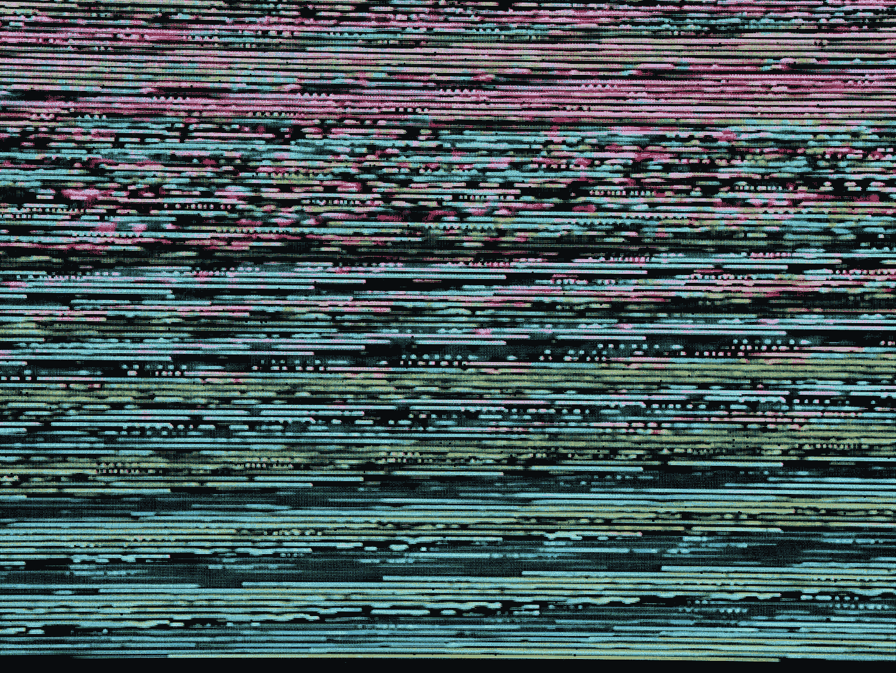

# 如何让一个锚链接比 JavaScript 链接的位置高出一些像素？

> 原文：<https://javascript.plainenglish.io/how-to-make-an-anchor-link-go-some-pixels-above-where-its-linked-to-with-javascript-9674c44a8dd4?source=collection_archive---------7----------------------->



Photo by [Michael Dziedzic](https://unsplash.com/@lazycreekimages?utm_source=medium&utm_medium=referral) on [Unsplash](https://unsplash.com?utm_source=medium&utm_medium=referral)

有时，我们想让一个锚链接比它链接的位置高出一些像素。

在这篇文章中，我们将看看如何让一个锚链接去一些像素以上的地方。

# 使用 window.scrollTo 方法

我们可以使用`window.scrollTo`方法，当我们点击一个散列值为`href`的链接时，滚动到页面上我们想要的坐标。

例如，我们可以编写以下 HTML:

```
<a href='#'>link 1</a>
<a href='#foo'>link 2</a>
<a href='#bar'>link 3</a><div id='bar' style='height: 500px'>
  Lorem ipsum dolor sit amet, consectetur adipiscing elit.
</div><div id='foo' style='height: 500px'>
  Lorem ipsum dolor sit amet, consectetur adipiscing elit.
</div>
```

然后我们写道:

```
const offsetAnchor = () => {
  if (location.hash.length !== 0) {
    window.scrollTo(window.scrollX, window.scrollY - 100);
  }
}const anchors = document.querySelectorAll('a[href^="#"]')for (const a of anchors) {
  a.addEventListener('click', (event) => {
    window.setTimeout(() => {
      offsetAnchor();
    }, 0);
  });
}document.addEventListener('click', (event) => {
  window.setTimeout(() => {
    offsetAnchor();
  }, 0);
});window.setTimeout(offsetAnchor, 0);
```

我们有`offsetAnchor`函数，它检查散列是否被附加到带有`location.hash.length`的 URL 上。

如果它存在，那么我们滚动到元素的位置，该元素的 ID 由散列给出，但是 y 坐标减去 100。

接下来，我们得到以英镑符号开始的`href`的`a`元素。

如果 for-of 循环，我们调用`addEventListener`为每个`a`元素添加一个点击处理程序。

在点击处理程序中，我们在`setTimeout`回调中调用`offsetAnchor`。

我们将它放在`setTimeout`回调函数中，以便在滚动完成后调用它。

接下来，我们对`document`做同样的操作，从我们点击页面的地方向上滚动 100 像素。

同样，我们最初调用`offsetAnchor`来滚动到页面的初始坐标。

# 结论

我们可以使用`window.scrollTo`方法在页面上滚动到我们想要的坐标，当我们点击一个带有 hash 作为`href`的链接时。

*更多内容请看*[***plain English . io***](https://plainenglish.io/)*。报名参加我们的* [***免费周报***](http://newsletter.plainenglish.io/) *。关注我们关于*[***Twitter***](https://twitter.com/inPlainEngHQ)[***LinkedIn***](https://www.linkedin.com/company/inplainenglish/)*[***YouTube***](https://www.youtube.com/channel/UCtipWUghju290NWcn8jhyAw)*[***不和***](https://discord.gg/GtDtUAvyhW) *。对增长黑客感兴趣？检查* [***电路***](https://circuit.ooo/) *。***