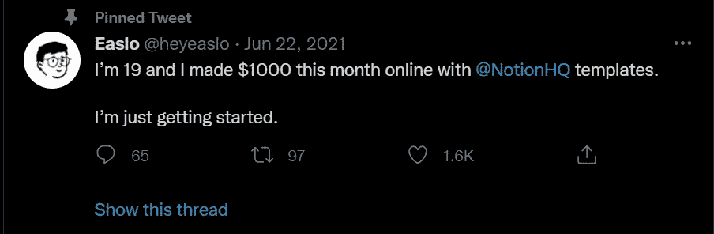

# 如何用这种简单的方法每月多赚 500 美元

> 原文：<https://javascript.plainenglish.io/how-to-make-an-extra-500-every-month-with-this-easy-side-hustle-bac6fd48cdfe?source=collection_archive---------0----------------------->

## 没有废话，请不要期待博客，YouTube，自由职业者，或媒体

Photo by [Aiony Haust](https://unsplash.com/@aiony?utm_source=medium&utm_medium=referral) on [Unsplash](https://unsplash.com?utm_source=medium&utm_medium=referral)

好吧，如果你在一年前说我这些，我会嘲笑你，甚至不理你。但是在做了之后，通过它赚钱，并且找到了非常酷的赚钱方法，这让我大吃一惊。

如果你在互联网上搜索，你可能会发现数百个声称可以轻松赚钱的人。嗯，大部分都不值钱。你会惊讶地发现，他们中的大多数人谈论自由职业、成为 Youtuber 用户、在媒体上写作或创建博客等等。

读完这些废话后，我们大多数人都失去了希望。我们都知道这些东西。

但是这篇文章不是关于这个的。我不会告诉你做所有这些，甚至我不会告诉你填写一些调查，花你的钱在一些新的加密业务，或任何废话。

在深入之前，我想澄清一下，只有当你能够投入一些时间和精力时，这些帖子才会有所帮助。

如果没有，请阅读其他内容。当然，我会提供一些现实生活中的例子。此外，这些副业需要一些编程知识。

激动吗？然后继续读下去。

最近写了一篇关于[在你睡觉的时候做开发者挣钱](/5-different-ways-you-can-make-money-as-a-developer-while-you-sleep-ad54715b6ad7)的文章。它像病毒一样传播开来，大多数读者为它鼓掌，其中一些人关注我，还通过我的推荐链接订阅了[。](http://bit.ly/3rkGT7A)

嗯，你知道有些人给我发电子邮件，告诉我他们的副业，他们是如何赚钱的，等等。

1.  **出售概念模板**

说实话，我一点都没听说过。是的，我熟悉在 Canva 上销售模板，在 Gumroad 和 Etsy 上销售数字产品，在 Codecanyon 上销售代码。

我首先想到的是个人是否通过观念获得金钱。而且反应比你想象的还要出乎意料。

这里有一个实际的例子。

因此，其中一位读者告诉我，在过去的三个月里，他通过 ideal 赚了大约 1500 美元。

不错吧？每天工作 2-3 小时后。

其次，我在 Twitter 上发现了一个名叫 [Easlo](https://twitter.com/heyeaslo) 的家伙，他声称这个月从 ideal 赚了 1000 美元。

所以如果你想入手或者了解更多，可以看看 YouTube 上的一些视频。

**2。销售 API**

大约 3 个月前，我听说有一些像 RapidAPI 这样的平台，开发者可以在那里出售 API 并赚钱。

在那之后，我[看了一个与此相关的 YouTube 视频](https://youtu.be/GK4Pl-GmPHk)。然后就再也没有尝试过开始这种侧推。

最近，我收到一封来自一家公司的电子邮件，要求我为他们设计 API 进行销售。我完全惊呆了。他们真的赚钱了吗，还是只是充斥着我的收件箱？所以，我试着用他们的链接安排一次会面，并和他们交谈。

在讨论了我的专业知识并了解了他们的业务后，我询问他们是否从中赚钱。

他们说，“我们不能透露我们的全部收入，但让我告诉你，我们一个月内接近 15-20 个客户。”为了完成任务，我们每天雇佣你 3-4 个小时。

所以，如果你了解 JavaScript 或者 Python，你就可以开始这个兼职了。

**3。成为在线顾问**

我总是试图从专家那里学到一些东西，不管他们从事什么行业。甚至，我不断更新我的读者关于它的信息。你可能读过我的一些帖子，比如:

*   [百万富翁实现财务独立的六个简单步骤](https://themakingofamillionaire.com/a-millionaires-six-simple-steps-to-financial-independence-e67ae9005bbe)在那里，我与一位来自印度古吉拉特的名人进行了交谈。
*   [8 条人生经验一位有 30 多年经验的程序员教给我](/8-life-lessons-a-programmer-with-30-years-of-experience-taught-me-2a9fb090a398)，他给了我一些改变人生的建议。

同样，如果你有任何特定的知识，你可以在公司或企业中做咨询来赚钱。

我举一个我自己的例子。六个月前，LinkedIn 的一家公司发邮件给我，说他们正在寻找一位懂一些网络开发知识的顾问。

我要求他们提供进一步的信息。所以他们告诉我，他们需要一个开发人员，当他们遇到重大问题时可以帮助他们的开发人员，并在客户会议上解决客户的一些问题。

就这样结束了。我不用编码，也不用朝九晚五地工作。我接受了它，因为我熟悉 Next.js 和 React.js，这对我很容易。

而我的其他朋友，比如萨姆，则按小时收取咨询费。此外，一些企业付钱给他，让他根据他们的需求更新最好的技术。

很酷，对吧？我知道作为一个初学者，你不能更深入地挖掘这个侧面的骗局。但在中级水平，你可以尝试这种侧推。

我明白，因为你是新手，这些副业可能需要一些时间来发展。然而，正如我在几个例子中所展示的，你可能意识到赚钱是可以实现的。

他们中的一些人一个月挣 10，000 美元或更多。是的，这对我们所有人来说都很难，但我们可以努力开始每月至少赚 500 美元。

不要忘了，当你努力赚钱的时候，你在身体上把自己和那些几天后不尝试或放弃的人区分开来。

[*如果你喜欢阅读这样的故事，并想帮助我成为一名作家，可以考虑成为一名中等会员*](https://nitinfab.medium.com/membership) *。每月花费 5 美元，你可以无限制地访问媒体内容。如果你通过我的链接注册，我会得到一点佣金。*

就这些——谢谢。

 [## 作为一名开发者，你可以在睡觉的时候用 5 种不同的方式赚钱

### 不要指望博客，媒体，YouTube

javascript.plainenglish.io](/5-different-ways-you-can-make-money-as-a-developer-while-you-sleep-ad54715b6ad7)  [## 3 Side 催促说，我永远不会试图作为一个开发者赚钱

### 网络社区在愚弄我们

javascript.plainenglish.io](/3-side-hustles-that-i-will-never-try-to-earn-money-as-a-developer-c0b421853b4b) 

*更多内容看* [***说白了就是***](http://plainenglish.io/) *。报名参加我们的* [***免费周报***](http://newsletter.plainenglish.io/) *。在我们的* [***社区不和谐***](https://discord.gg/GtDtUAvyhW) *获得独家获取写作机会和建议。*