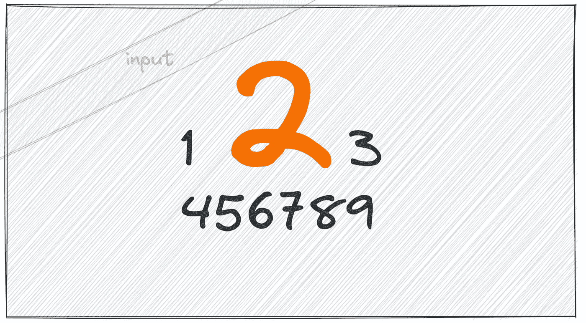
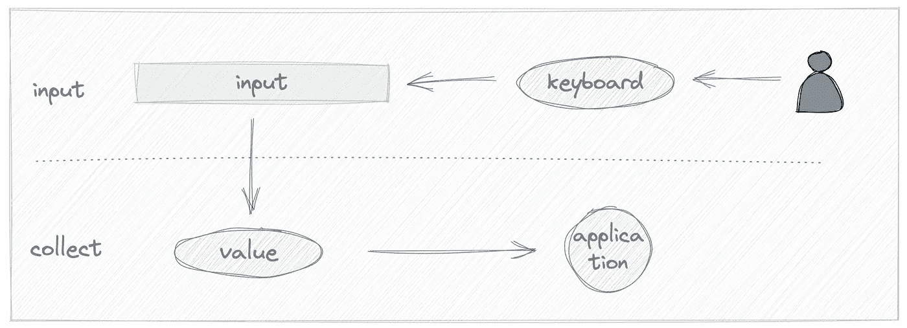

# 如何使输入只接受整数

> 原文：<https://javascript.plainenglish.io/how-to-make-an-input-only-accept-integers-9cc54f6217ad?source=collection_archive---------7----------------------->

## 两种实现方式。



## 前言

输入是一个非常常见的 HTML 标签，用于收集用户数据。我们可以将它用于文本、数字和文件，但是用户输入的数据是不可信的。有时我们期望一个数字，用户可能输入一个字符串或其他字符。因此，我们的 web 应用程序可能无法很好地处理错误的数据类型。上周，我的 React 应用程序遇到了这个问题，因为输入接受除整数之外的浮点类型。在本文中，我将介绍两种实现只接受整数的输入的方法。

首先，让我们分析从用户输入到存储数据的步骤:



主要有两个步骤:

1.  用户通过使用键盘输入数据；
2.  应用程序收集数据；

我们可以做一些事情，使输入在每一步都采用正确的数据。

## 验证数据并给出反馈

我们必须收集用户输入的数据。因此，简单的方法是检查数据，如果不满足关于数据类型的条件，则向用户提供反馈。

如果我们只想接受整数输入，我们可以使用下面的正则表达式来检查数据:

```
/^\d+$/
```

我们可以通过使用输入`blur`事件来检查它:

它工作得很好，但是**你可以只使用 HTML 来检查输入数据。**输入标签支持`pattern`属性，该属性可以是一个正则表达式，我们可以通过`:valid`、`:invalid`伪元素了解其有效性状态。

通过使用`pattern`属性，用户数据将在输入过程中被自动检查，我们可以通过使用 input 元素的`validity`属性来获得状态。如果您想使用该功能，可以参考[<Input>:Input(表单输入)元素— HTML:超文本标记语言| MDN(mozilla.org)](https://developer.mozilla.org/en-US/docs/Web/HTML/Element/input#client-side_validation)了解更多信息。

## 防止输入过程中出现意外字符

在一些只需要整数的众所周知的场景中，比如楼层号和星期几，我们可以通过防止输入意外字符来做到这一点。

在 Chrome 中，我们可以使用`keydown`事件来阻止动作，其他事件如`keypress` `input`可能对已经设置的输入值不起作用。并且我们可以使用`typeof number`来防止输入使用字符串字符。

这种解决方案可能会导致用户的一些误解，没有任何反馈，这可能被认为是一个 bug。您可以在输入元素下面放置一些提示，让用户知道原因。

## 结论

在本文中，我们了解了只接受整数作为输入的两种方法——简单的方法是给出错误反馈，另一种方法是防止输入意外的字符。在大多数情况下，我们可以使用错误反馈的方式，让用户知道原因。这是 Codepen.io 上的一个演示:

这是一项实用技能。如果你想在手机上输入只接受整数，你可以用`tel`设置 type 属性，它只会触发数字键盘。

*更多内容尽在* [***说白了. io***](https://plainenglish.io/) *。报名参加我们的* [***免费周报***](http://newsletter.plainenglish.io/) *。关注我们关于* [***推特***](https://twitter.com/inPlainEngHQ) ，[***LinkedIn***](https://www.linkedin.com/company/inplainenglish/)*，*[***YouTube***](https://www.youtube.com/channel/UCtipWUghju290NWcn8jhyAw)*，* [***不和***](https://discord.gg/GtDtUAvyhW) *。*