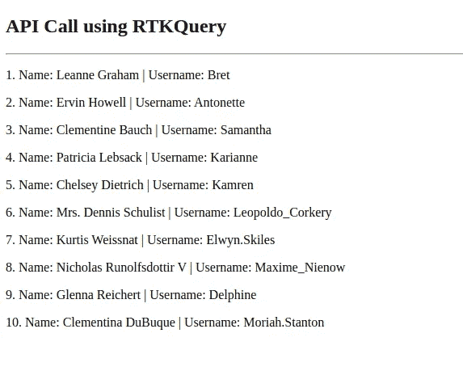

# 如何使用 RTK 查询在 React 中进行 API 调用

> 原文：<https://javascript.plainenglish.io/how-to-make-api-calls-using-rtk-query-in-react-apps-b0713d4c7411?source=collection_archive---------6----------------------->

## RTK Query 是一个强大的数据获取和缓存工具。它旨在简化在 web 应用程序中加载数据的常见情况，消除自己编写数据获取和缓存逻辑的需要。


React + Redux ([Source](https://miro.medium.com/max/1200/1*meCFnZ5MK_7Fu1ogYfBvNQ.png))

作为开发人员，您必须知道，除了进行 API 调用来构建应用程序之外，您还需要注意各种其他行为，同样:

*   跟踪加载状态以显示 UI 微调器。
*   避免对相同数据的重复请求。
*   乐观的更新让 UI 感觉更快。
*   在用户与 UI 交互时管理缓存生存期。

RTK Query 可用于处理所有这些行为以及进行 API 调用。它在 Redux Toolkit 的 API 上有内置的数据获取和缓存逻辑。

# 为什么要 RTK 查询？

虽然有其他工具可用于解决上述问题，但您应该使用 RTK Query，原因如下:

*   您已经有一个现有的 Redux 应用程序，并希望简化您的 API 处理逻辑。
*   您希望能够利用流行的 Redux Dev 工具扩展来跟踪状态随时间的变化，因为一旦处理了请求，RTK Query 就会分派标准的 Redux 操作。
*   它为您提供了在一个地方定义所有端点的能力，并为 API 调用提供了内置的钩子。

# 装置

RTK 查询与 Redux 工具包捆绑在一起。所以为了设置它，您需要首先配置 redux 工具包。请注意，在本文的过程中，我们将使用一个预定义的模板来设置使用 Vite 的 React 应用程序。说到这里，让我们开始设置 RTK 查询。

[](https://github.com/eshankvaish/react-ts-linting) [## GitHub-eshankvaish/react-ts-林挺:为 React 类型脚本项目设置的 ESLint 和更漂亮的

### 此时您不能执行该操作。您已使用另一个标签页或窗口登录。您已在另一个选项卡中注销，或者…

github.com](https://github.com/eshankvaish/react-ts-linting) 

## 1.设置 Redux 工具包

通过纱线将`@reduxjs/toolkit`与`react-redux`一起安装；

```
yarn add react-redux@8.0.4
yarn add @reduxjs/toolkit@1.9.0
```

## 2.为 RTK 查询添加基本服务

现在让我们为 RTK 查询添加一个基本服务，它将为 API 端点定义基本 URL，并为 API 调用定义默认超时。默认情况下，`baseApi`使用构建在 fetch 之上的 RTK Query 内置`fetchBaseQuery`包装器进行 API 调用。

RTK Query Base Service

## 3.配置 Redux 存储

既然我们已经完成了基本服务的定义，我们可以用`baseApi`提供的缩减器和中间件来配置 redux store。这是为了管理订阅生存期。

## 4.添加 React Redux 提供程序

让我们在项目的`main.tsx`或`index.tsx`文件中添加 React Redux 提供程序，以便 Redux 上下文在整个应用程序中都可用。

## 5.添加 API 切片

现在，让我们配置 API 片段来调用基本 URL 的`/users`端点，以获取用户列表。我们将动态注入端点，而不是在单个文件中定义所有端点，以便更好地管理我们的 API 服务。RTK Query 通过定义和失效标签来支持自动重新获取数据。如果一个 API 查询端点提供了一个 API 标签，而同一个标签由于另一个突变而无效，那么 RTK Query 会自动为提供该标签的查询触发一个新的请求。

这差不多是我们在 React 中进行 API 调用所需的设置。现在让我们来看看`useUsersQuery`的行动。

## 6.使用 API 钩子获取数据

要使用上面定义的钩子进行 API 调用，我们只需要将它添加到下面定义的`UserList`组件中，它就会返回一个带有一堆选项的对象，如`isFetching`、`data`和`error`等。我们可以使用`isFetching`变量显示加载状态，一旦`data`变量可用，我们就可以迭代它，在我们的页面上显示用户列表。

## 7.更新应用程序文件

要查看 API 调用的运行情况，您需要在`App.tsx`文件中添加`<UserList />`组件并启动服务器。

# 结论

我们最终对 JSON 占位符 API 进行了 API 调用，以获取用户列表并将其显示在 UserList 页面上。



API Call Using RTK Query in React

和往常一样，下面是 Github 上完整代码的链接:

[](https://github.com/eshankvaish/react-rtk-query) [## GitHub-eshankvaish/react-rtk-Query:使用 React 设置 RTK 查询

### 此时您不能执行该操作。您已使用另一个标签页或窗口登录。您已在另一个选项卡中注销，或者…

github.com](https://github.com/eshankvaish/react-rtk-query) 

> *感谢阅读。请分享您对在 React 应用程序中设置 RTK 查询进行 API 调用的想法。另外，如果你觉得这篇文章有用，请考虑在 Medium* *上关注我，并在你的圈子里分享这篇文章。*

```
Want to connect?
Reach out on [Twitter](https://twitter.com/eshankvaish), [LinkedIn](https://www.linkedin.com/in/eshankvaish/) or in the comments below!
```

# 参考

*   [RTK 查询](https://redux-toolkit.js.org/rtk-query/overview)
*   [Redux 工具包](https://redux-toolkit.js.org/)
*   [React 应用程序中林挺和格式设置的模板](https://github.com/eshankvaish/react-ts-linting)

*更多内容请看*[***plain English . io***](https://plainenglish.io/)*。*

*报名参加我们的* [***免费周报***](http://newsletter.plainenglish.io/) *。关注我们关于*[***Twitter***](https://twitter.com/inPlainEngHQ)，[***LinkedIn***](https://www.linkedin.com/company/inplainenglish/)*，*[***YouTube***](https://www.youtube.com/channel/UCtipWUghju290NWcn8jhyAw)*，以及* [***不和***](https://discord.gg/GtDtUAvyhW) ***。***

***有兴趣缩放你的软件启动*** *？检查* [***电路***](https://circuit.ooo?utm=publication-post-cta) *。*