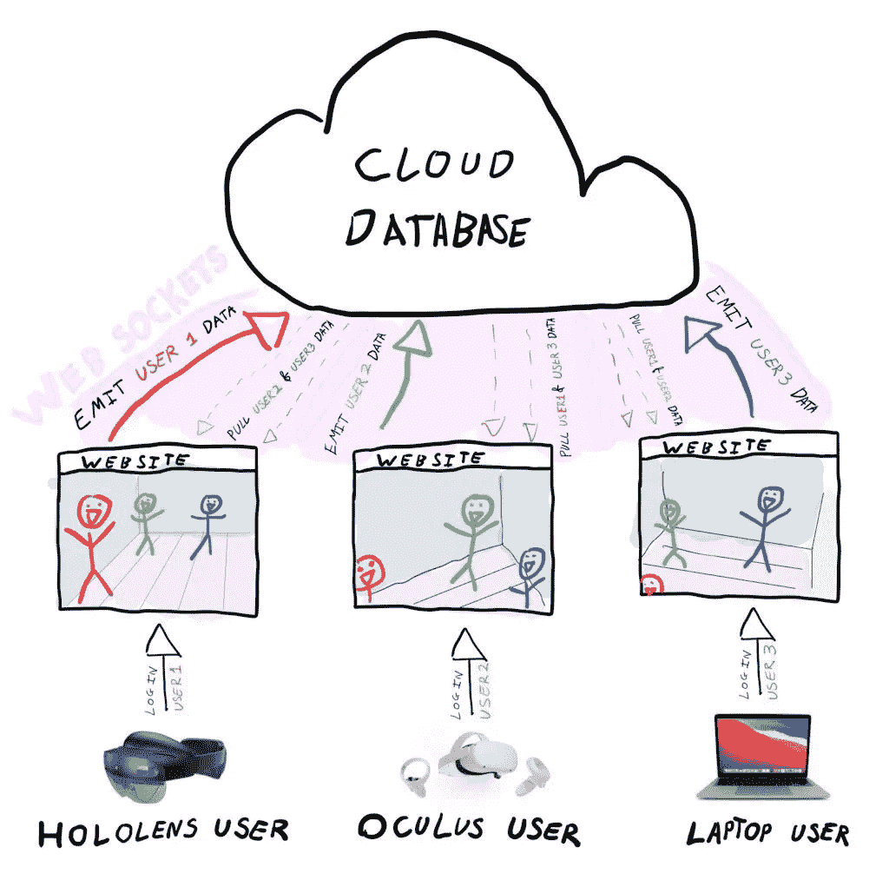
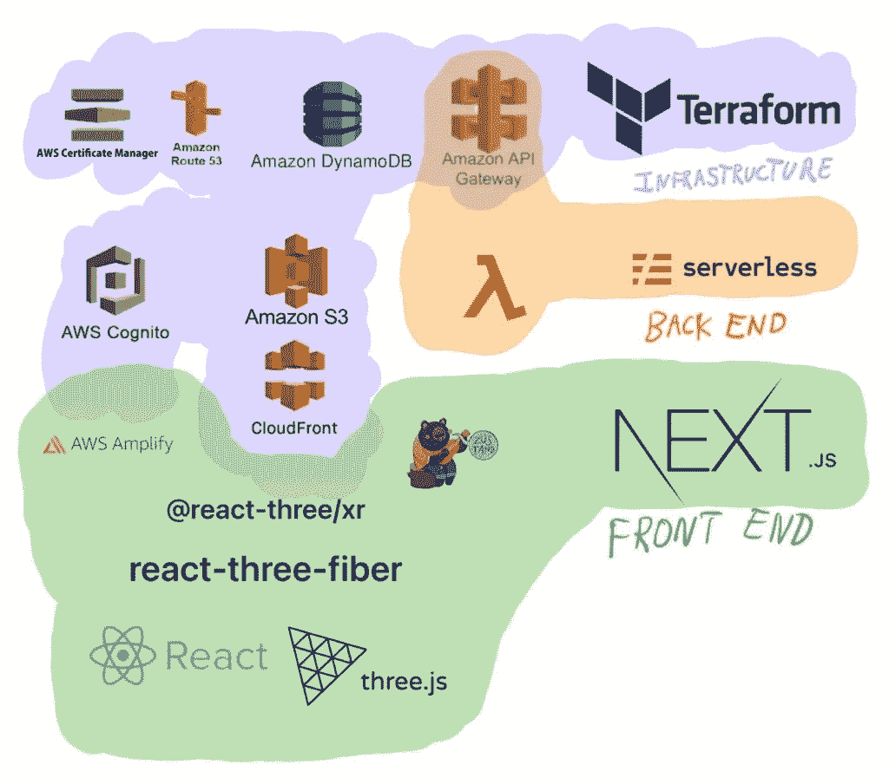
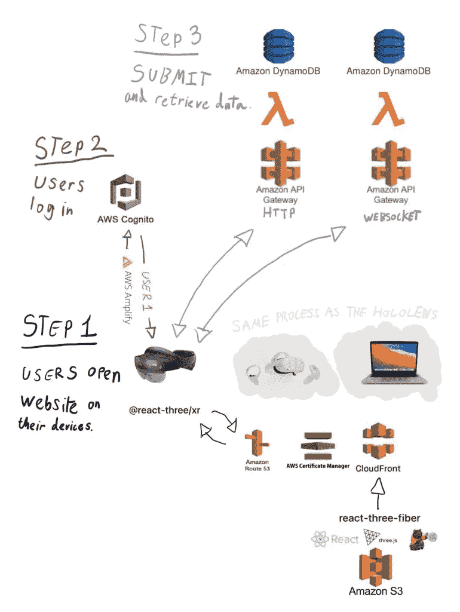

# 如何制作实时多人 WebXR 体验—第 1 部分

> 原文：<https://javascript.plainenglish.io/how-to-make-real-time-multiplayer-webxr-experiences-part-1-c5317765fd63?source=collection_archive---------5----------------------->

## 如何使用 Websockets、React Three Fiber 和 DynamoDB 来允许多个用户同时进行交互。

# 介绍

实时多人 WebXR 体验对互联网的未来来说是一个真正令人兴奋的前景，我们开始看到随着技术的发展如何使用它们(例如 T2 的术语‘元宇宙’)。

在最近发布了关于[如何创建跨设备工作的 WebXR 体验](https://jamesmiller.blog/create-cross-device-compatible-webxr-experiences/)之后，我想更进一步，解释将这些设备上的用户连接在一起的实际步骤。

我制作了我的合作伙伴(戴着一个 [Oculus Quest 2](https://amzn.to/3nwTwKl) )、一个示例用户( [Macbook Pro Desktop](https://amzn.to/3nzh3tQ) )和我自己(戴着一个 [HoloLens 2](https://ebay.us/IrdbDh) )在共享的 XR 空间与一个 3D 模型交互的 gif，见下图。

As a side note, I’m writing a library called [Wrapper.js](https://github.com/JamesMillerBlog/wrapper.js) that hopefully will help make creating collaborative WebXR experiences like the above easier.

# 概观

这个 web 应用程序是如何构建的，以及开发它所使用的技术有很多需要理解的地方，本节将解释这些信息。

为了充分利用这些信息，理解三个要点很重要:

## 这个概念

这个例子的工作原理是创建一个可以在不同设备上呈现的应用程序，为每个设备创建一个唯一的标识符(例如，通过用户登录)，在数据库中实时存储该设备的位置数据，然后在 WebGL 中呈现所有用户的数据。

下图显示了这一概念如何在混合现实耳机( [HoloLens 2](https://ebay.us/IrdbDh) )、虚拟现实耳机( [Oculus Quest 2](https://amzn.to/3nwTwKl) )和笔记本电脑( [Macbook Pro](https://amzn.to/3nzh3tQ) )中发挥作用。

对其工作原理的概括描述如下:

1.  用户在他们的设备上访问网站，并使用他们的凭证登录，网站将根据他们的设备进行渲染(多亏了 WebXR API)。
2.  当他们在环境中移动时，他们的移动坐标被实时发送到数据库，并根据他们的用户名进行存储。
3.  通过将其他用户的移动数据渲染到 3D 场景中，他们可以看到在环境中移动的其他用户。

## 技术堆栈

由于这原本是为 [Wrapper.js](https://github.com/JamesMillerBlog/wrapper.js) 编写的，所以它坚持使用了 [Terraform](https://www.terraform.io/) 、[无服务器框架](https://www.serverless.com/)和 [Next.js](https://nextjs.org/) 。

下图对此做了进一步的详细说明。

以下是对这三个类别的进一步解释:

## **地形**

作为代码库的基础架构管理除后端逻辑之外的所有云基础架构:

*   **Amazon API Gateway**(HTTP 和 Websocket 实现)，无服务器框架中的 lambda 函数部署到该网关。
*   **DynamoDB** 用于存储前端通过 HTTP 和 Websocket 请求向 API 网关提交和检索的数据。
*   **亚马逊 S3** ，用于部署 Next.js 导出的前端静态文件
*   **Cloudfront** ，内容交付网络(CDN)允许在边缘访问您的内容，也允许您使用自定义域名访问您的内容。
*   **Route53** ，将你的域名分配给你的云前端 CDN 和 API 网关的 DNS 记录。
*   亚马逊证书管理器，为你的域名生成 SSL 证书。
*   **AWS Cognito** 是一项管理用户登录信息的服务，用作联合身份以授权 web 应用的前端登录和数据的后端访问。

## **无服务器框架**

作为代码库的基础设施，用于管理后端逻辑 Lambdas 的本地开发和部署:

*   **Lambda 函数**部署到 API 网关(在 Terraform 中创建)并执行 Node.js 中编写的后端逻辑。

## **Next.js**

React 框架将所有前端 2D 和 3D 逻辑构建到一个易于导航的组件架构中。

*   **AWS Amplify** 是一个用于前端的库，提供开箱即用的组件和助手功能，使用户登录变得简单而安全。
*   Zustand 是一个库，帮助你在你的应用程序中实现简单的全局状态管理。
*   **React-Three-XR** 是一个允许 React-Three-Fiber 应用利用 WebXR API 的库。
*   **React-Three-Fiber** ，一个让 Three.js 集成到 React 组件简单、快速、高效的库。
*   **Three.js** 是一个允许你通过使用 WebGL 在浏览器中创建 3D 内容的库。
*   **React** 是一个允许你组件化你的 JavaScript 的库。

## 应用程序流程

如果您计划在本例中何时使用这些技术，它看起来会像下面的图表。

如果您从图的底部开始，您可以看到所有前端文件都被静态导出并托管在 **S3 存储桶**上。

这些文件随后通过 **Cloudfront CDN** 分发，由 **AWS 证书管理器**分配 SSL 证书，并提供带有 **Amazon Route 53** 的自定义域名。

此时，第 1 步开始:

*   用户通过访问域名在他们的设备上打开网站(例如[全息透镜 2](https://ebay.us/IrdbDh) )。
*   此时， **React-Three-XR** 根据设备的能力(在这种情况下是混合现实耳机)呈现网站。

接下来是第二步:

*   用户使用前端的 **AWS Amplify** 库登录到他们的 **AWS Cognito** 账户。
*   登录后，网站现在有了使用该设备的人的唯一标识符。

一旦用户成功登录并唯一地标识了自己，这就为第 3 步做好了准备:

*   用户可以与两种 API 进行交互——HTTP 和 WebSockets 。
*   调用一次 **HTTP** API 来获取用户的图像，然后可以在 WebGL:
    -一旦调用了 API，就会触发一个 **lambda** ，它使用用户的登录详细信息来查询数据库中的信息。
    -**Amazon dynamo db**数据库存储了与用户登录凭证相关的信息，比如个人资料图片 URL。
*   **WebSocket** API 在前端需要更新数据库以及数据库有更新时被调用:
    -当用户在 3D 世界中移动时，他们的位置坐标被实时提交给 **WebSocket** API。
    -一旦 API 被触发，一个**λ**函数获取提交的数据并将其保存到 **DynamoDB** 数据库中。
    -一旦数据被保存到数据库中，所有数据将被返回到前端，在那里 3D 渲染器将所有物体的位置数据可视化。

# 结论

我尽力简化了这篇文章中的概念，以帮助理解实时多人 WebXR 体验的过程。

在下一篇文章中，我将详细介绍用于实时呈现多个用户位置的实际代码。

同时，希望你喜欢这篇文章，玩得开心。:D

*更多内容请看*[***plain English . io***](https://plainenglish.io/)*。报名参加我们的* [***免费周报***](http://newsletter.plainenglish.io/) *。关注我们关于*[***Twitter***](https://twitter.com/inPlainEngHQ)*和*[***LinkedIn***](https://www.linkedin.com/company/inplainenglish/)*。查看我们的* [***社区不和谐***](https://discord.gg/GtDtUAvyhW) *加入我们的* [***人才集体***](https://inplainenglish.pallet.com/talent/welcome) *。*