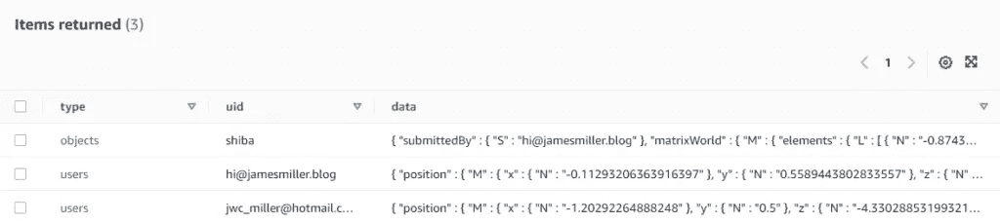
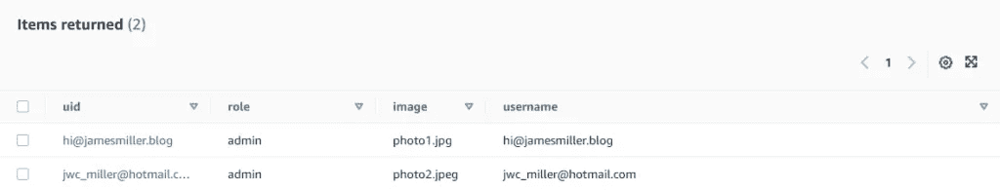

# 如何制作实时多人 WebXR 体验—第 2 部分

> 原文：<https://javascript.plainenglish.io/how-to-make-real-time-multiplayer-webxr-experiences-part-2-89015bf198fd?source=collection_archive---------6----------------------->

## 使用 WebSockets、React Three Fiber 和 DynamoDB 实时提交和检索用户位置。

# 介绍

在我的上一篇博文中，我谈到了实现实时多人 WebXR 体验的概念。

这篇文章将展示那篇博客文章的实际方面，这样你就可以开始将代码样本应用到你的应用程序中——或者如果你愿意的话——利用[包装器。我已经创建的 JS WebXR 模板](https://github.com/JamesMillerBlog/wrapper.js/tree/main/templates/webxr)(代码片段取自这里)。

如果你还不知道，那么[请阅读本系列教程的第 1 部分](https://jamesmiller.blog/how-to-make-real-time-multiplayer-webxr-experiences-part-1/#)——这样你就能理解下面代码片段背后的概念。

准备，预备，开始！:D

# 代码示例

在我最近的另一篇关于[如何让 WebXR 体验在任何设备上工作](https://jamesmiller.blog/create-cross-device-compatible-webxr-experiences/)的帖子中，我谈到了我创建的一个名为 **XRScene** 的高阶组件(HOC)。

在这些代码示例中，我们将详述:

1.  [如何实例化 WebSockets](https://jamesmiller.blog/?p=4054&preview=true#elementor-toc__heading-anchor-2)
2.  H [如何用 WebSockets 发出数据](https://jamesmiller.blog/?p=4054&preview=true#elementor-toc__heading-anchor-6)
3.  R [可视化&可视化 WebSocket 数据](https://jamesmiller.blog/?p=4054&preview=true#elementor-toc__heading-anchor-11)

让我们从:D 开始

## 如何实例化 WebSockets

为了使用 WebSockets 发送和检索数据，您需要首先在您的应用程序中设置它们。

让我们看看我是如何设置它们的，首先看看我的 index.js 文件是如何设置的。

**index . js 文件**

您可以看到，该文件声明了为索引路由“/”呈现的前端。

我突出显示了第 7 行和第 19–42 行，它们显示了编写 3D 应用程序(Three.js)逻辑的高阶组件(HOC) XRScene。

在这个组件内部，我们需要看到 WebSockets 是在哪里实现的。

**XRScene 组件**

该组件负责为用于打开网页的浏览器动态选择合适的 WebGL 呈现器(如我在上一篇文章中所述)。

我不会重复我在那篇文章中已经讨论过的内容，但是请注意，在第 18 行和第 34 行，有一个 Sockets HOC，它包含 WebGL 渲染逻辑作为其子组件。

我们需要看的就是这个套接字组件。

**插座组件**

在这个组件中，你可以看到我们正在使用一个名为 [react-use-websocket](http://react-use-websocket/) 的库来实现 WebSockets。

在第 11 行，您可以看到我们正在设置应用程序应该使用的 WebSocket，并使用 Cognito 收到的 JWT 来确保它的安全，以确保后端仅对经过身份验证的用户可见。

在第 19–23 行之间，我们用最新收到的消息和一个发送消息的函数来更新应用程序的全局状态。

## 如何用 WebSockets 发出数据

现在我们已经了解了 WebSockets 是如何设置的，让我们看看如何使用它们来实时发送用户位置数据。

让我们从查看 Sockets 组件中呈现的任何组件开始，例如，让我们使用 RenderAR 组件。

**RenderAR 组件**

该组件负责返回 ARCanvas 组件(这是一个 WebGL 渲染器，用于可以在浏览器上使用增强现实的设备)。

我将在本教程中讨论两个组件，即**相机**组件和**化身**组件。

**Avatars** 组件用于渲染在站点中移动的其他用户，因此用户可以看到他们——我将在教程中进一步解释这一点。

**Camera** 组件负责为登录用户配置移动和视线，这是我们开始查看如何使用 WebSockets 发送数据的地方。

**摄像头组件**

相机组件负责为登录到应用程序的用户配置移动和视线设置。

我将详细介绍这个应用程序的前端如何工作，以及它如何与后端(实际的 WebSockets 本身)交互。

下面这个例子中有很多代码，为用户可以用来移动/瞄准的摄像机设置细节。

为了简单起见，我假设您了解 Three.js 的基本工作原理，并将直接跳到实现实际套接字的部分。

我突出显示了第 51–53 行和第 61–81 行，它们显示:

*   **51–53**:每 250 毫秒触发一次
*   **61–81**:每次触发器被激活时被触发的 useEffect 生命周期方法。该函数负责使用名为 sendJsonMessage 的函数发出位置数据。

在这个 useEffect 函数中，发生了以下情况:

1.  **第 62 行**获取登录用户的用户名

2.**第 63–67 行**定义了将发送给 WebSocket 的数据

*   当我们为用户定义位置数据时，类型被设置为“用户”
*   唯一标识符(uid)被设置为我们刚刚在第 62 行定义的用户名
*   实际移动数据在“用户”本地状态变量中定义

3.**第 68–73 行**主要检查触发器是否设置为真，然后确保是否有移动数据可用于重置允许跟踪移动数据的状态，如果没有，则发送空数据包

4.第 74 -77 行包含向 WebSocket 发送数据的实际函数

5.**第 79 行**重置触发状态变量

**在后端提交位置数据**

一旦数据在 WebSocket 上提交，包含以下代码的 Lamda 函数将在后端运行。

它获取前端发送的数据，并将其保存到 DynamoDB 表中(见第 47 行)。

然后，DynamoDB 表的内容被返回到前端(参见第 21–25 行)。

## 检索和可视化 WebSocket 数据

现在，我们已经了解了如何发出用户位置数据，我们现在可以看看我们如何渲染其他用户位置，以便您可以看到他们实时移动！

为此，我们需要 RenderAR 组件，看看头像组件是如何工作的。

**头像组件— index.js**

该组件负责获取 HTTP 和 WebSocket 数据，然后遍历在 DynamoDB 中保存了条目的所有其他用户，然后将他们的道具传递给一个名为 Avatar 的组件。

在这一节中，我将讨论前端代码和 DynamoDB 表。

这是另一个有很多内容的大文件，有两个关键方面需要您查看和理解:

*   **第 29 行**:这里我们传递最后接收到的 WebSocket 数据，包含所有其他用户的位置、当前登录的用户以及所有其他登录用户的图像
*   **第 49–56 行**:我们正在为传入第 29 行的每个用户渲染一个虚拟角色组件，注意他们的位置/旋转/uid/图像包含在道具中

**web socket 位置数据的数据库**

我在下面附上了 WebSocket 数据在 DynamoDB 中的样子。

在该表中，您可以看到存储的数据被分类为对象(例如，像本文顶部 gif 中的狗这样的 3D 模型)或用户。

这篇文章只关注如何实现用户之间的实时交互，但我可能会发表另一篇后续文章来解释如何实时共享用户在其他 3D 模型上的交互。:D

Screenshot of the positional data in the DynamoDB Table

现在，如果我们看看 DynamoDB 表中的一个用户的例子，您可以看到位置和旋转数据是什么样子的。

正是这些数据被传递给 Three.js 渲染器来更新化身组件的位置。

**头像组件— Avatar.js**

最后，一旦所有数据都被传递到**化身**组件——这就是可视化接收数据的神奇之处。

这篇文章的这一部分将讨论前端逻辑，以及 HTTP 数据是什么样子的。

需要理解的代码的关键部分是:

*   **第 10–12 行**:传入组件的图像被设置为 Three.js 的纹理，如果不存在的话加载备份图像
*   **第 16–19 行**:这是 WebSocket 每次返回新数据时更新另一个登录用户的位置和旋转的地方
*   **第 24–31 行**:这是 3D 网格渲染为平面，图像加载为纹理(我们在第 10–12 行之间定义的那个)

**HTTP 用户数据的数据库**

至于在前端呈现的“非实时”数据，可以通过 HTTP api 访问并存储在 DynamoDB 中。

每个用户都作为一个单独的条目存储在 DynamoDB 表中，并保存了他们的角色、电子邮件地址和图像。

Screenshot of the http user data in the DynamoDB Table

查看 JSON 格式的数据，返回这个对象——这是返回到前端的内容。

# 结论

哇！如果你真的走到了这里，你就是冠军——祝贺你，:D

幸运的话，您了解如何在您的 WebXR 应用程序中实现实时用户位置的实际方面，从而能够根据您的需要对其进行调整。

在我的下一篇文章中，我将讨论如何用实时逻辑实现用户与 3D 对象的交互结果，以便多个用户可以一起与环境交互。

在那之前，希望你喜欢这篇文章，并在:D 玩得开心