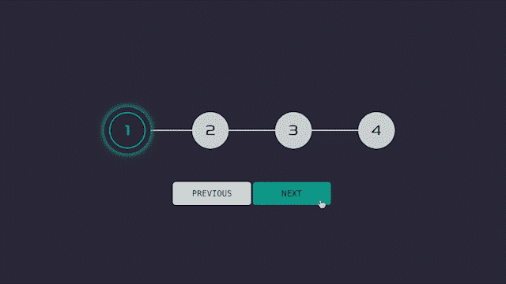

# 如何用普通 JavaScript 制作响应式步骤进度条

> 原文：<https://javascript.plainenglish.io/how-to-make-responsive-steps-progress-bar-with-vanilla-javascript-65dfa0515811?source=collection_archive---------3----------------------->

## 你曾经想要建立一个完全自定义的步骤进度条吗？嗯，这是你一直在寻找的文章。



自从我开始编码，我就一直热衷于构建自己的东西，尤其是当它涉及到一些很酷的东西时，比如这个 steps 进度条。这只是它最简单的版本。一旦您学会了如何构建框架，您就可以向它添加表单或潜在用户需要与之交互的其他步骤。

在我们开始编码之前，有几件事情需要考虑:

*   我在[移动优先的工作流](https://www.youtube.com/watch?v=0ohtVzCSHqs)中构建项目
*   我用的是 [SCSS](https://sass-lang.com) 而不是普通的 CSS，但是如果你不熟悉的话，你可以用这个很棒的 SCSS 到 CSS [转换器](https://jsonformatter.org/scss-to-css)
*   我对类名使用了 [BEM](https://9elements.com/bem-cheat-sheet/) 符号
*   不同阶段的项目和最终结果将在 [codesandbox.io](https://codesandbox.io) 上发布

好了，现在我们可以开始有趣的部分了。让我们写一些代码，好吗？👨🏻‍💻

# 1.添加初始设置

对于初始设置，我只是添加了一些基本的 HTML 和 CSS，这将添加大部分的内容，变量和一些重置。

在 CSS 重置中，我还在`html`中添加了这一行:

```
font-size: 62.5%; *// 100% / 16px = 62.5%*
```

因为我用`rem`来表示我的字体大小和其他东西，所以很难将`rem`转换成`px`。所以，这是一个帮助计算`rems`更容易的窍门。例如，在这个设置中，`16px`等于`1.6rem`，而`100px`等于`10rem.`，但是，出于可访问性的原因，我们仍然需要将默认字体大小恢复为`16px` ，所以我也在`body`中添加了这一行:

```
font-size: 1.6rem;
```

如果你不熟悉 SCSS，这是你在 SCSS `$name: value;`中初始化[变量的方法。](https://sass-lang.com/documentation/variables)

```
$color-primary: #2f2e41;
$color-secondary: #00bfa6;
$color-tertiary: #ced6d5;
$color-white: #fff;
```

你可以把任何你想要的名字，这只是一个惯例，我用来组织我的颜色，或任何其他变量。

# 2.添加 CSS

在这一阶段，我添加了一些没有任何媒体询问的 CSS，但是不要担心，我们一会儿就会回来。

让我们稍微复习一下课程。

*   `**.container**`顾名思义，是一个容纳进度条和按钮的容器。
*   `**.progress__container**`，掌握着圆圈和它后面的线，但是等待有两个杠肯！是的，有两个酒吧，一个是用`::before`伪元素建造的，里面有`background-color: $color-tertiary;`，就是现在可见的那个。
*   `**.progress__bar**`是一个当我们添加 JavaScript 时可见且动画的。
*   `**.progress__circle**`，又如其名，负责圈子的设计。它还有一个`.active`类，默认情况下它会被添加到进度条的第一个项目中，然后最终会被添加到其他项目中，当然是在我们添加 JavaScript 时。
*   `**.progress__span**` **，**使用好的 ol’`transform: translate()`技巧，确保圆圈中的数字保持在中心。
*   `**.btn**` **，**难道我真的需要告诉你这是干什么用的，或者你三试就能猜出来？(在评论区留下你的猜测🙃)

如果您想添加更多的步骤，请确保在移动视口时更改`**.progress__container::before**` 和`**.progress__bar**` **、**中的`***height***`。并分别改变`***width***`在平板电脑或桌面上时的视口宽度。

## 2.1 添加更多 CSS:媒体查询

没什么太疯狂的，我只是为两个条添加了`media queries`:`**.progress__container::before**`**和`**.progress__bar**` **，**它们从垂直变成水平，当视口宽度为`810px`及以上时。**

**如果您想更改`810px`的视窗宽度，请随意，这只是我通常用于平板电脑视窗宽度的一个数字。**

# **3.添加 JavaScript**

**现在我们来分解一下，JavaScript 部分。**

*   **首先，我们声明`currentActive`变量，并选择我们将与之交互的所有项目，例如，`prevBtn`，`nextBtn`，`progressBar`，`circles`。**
*   **第二，我们创建了负责`progressBar`交互的`changeBarDisplay()`函数。首先，它用`.active`类获取所有项目，然后在`if..else`语句中，我们检查窗口的大小。如果它大于或等于(`>=` ) `375px`，这也是我通常用于移动视窗宽度的一个数字，并且小于(`<` ) `810px`，那么将计算应用于进度条的高度，否则将计算应用于进度条的宽度。这个步骤有助于保持填充步骤的线的动画，无论它是在小的视窗宽度还是大的视窗宽度上。**如果您更改了屏幕尺寸，但看不到动画，请务必刷新页面。****
*   **第三，我们创建`updateCirlceState()`函数，它将负责更新圆圈的状态。所以，就在一开始，我们编写了一个`.forEach`循环，它将遍历每一个`circle`。它使用三元运算符来检查何时应该添加`.active`类。**
*   **之后，我们在`updateCirlceState().`中调用之前创建的`changeBarDisplay()`函数**
*   **此外，我们添加了一个`if..else if..else`语句来控制按钮的显示。如果,`currentActive`等于 1，这意味着我们仍处于第一步，因此必须禁用“上一步”按钮。Else 如果，`currentActive`等于`circles.length`表示我们在最后一步，那么下一步按钮必须被禁用。否则，他们两个都应该是活跃的。**
*   **稍后，我们创建两个函数，`incrementCurrent()`和`decrementCurrent()`。**
*   **在`incrementCurrent()`函数中，我们将`currentActive`变量的计数加 1，并检查它的值以确保它不超过最大步数。我们使用[短路](https://codeburst.io/javascript-what-is-short-circuit-evaluation-ff22b2f5608c) ( `&&`)来检查该值，因此如果`currentActive`的值大于圈数，则使其等于圈数。**
*   **在`decrementCurrent()`函数中，我们将`currentActive`变量的计数减 1，并检查其值是否低于最小步数。我们再次使用短路，但是在这种情况下，我们检查`currentActive`是否小于 1，那么`currentActive`也应该等于 1。**
*   **最后但同样重要的是，我们将`addEventListener`添加到`prevBtn`和`nextBtn`中，然后我们分别调用`incrementCurrent()`和`decrementCurrent()`，另外在两种情况下都调用`updateCirlceState()`。**

# **4.决赛成绩**

**您的最终结果应该是这样的。**

**此外，这里有一个 [**链接**](https://codesandbox.io/dashboard/all/tutorial-steps-progress-bar?workspace=6ca182b6-3c46-47a4-869a-fe608ccb0ae3) 与项目的所有不同阶段。**

**你可以自定义它来适应你的设计，也可以添加更多的功能，如添加表格，图像，更多的动画等。**

**如果你有，请在评论区与我和其他人分享。**

**这是我的第一篇教程文章，我希望它是有帮助的，并且你已经从它中学到了一些东西。如果您有任何问题，或者您发现了一个错误，请留下评论，这样我可以帮助您或修复错误，以进一步改善其他人的体验。提前感谢。**

**[](https://medium.com/@kens_visuals/membership) [## 通过我的推荐链接加入 Medium-Ken Nersisyan

### 用媒介释放你的潜能。立即加入，阅读我和其他顶尖作家的文章。读书，学习，变得更好…

medium.com](https://medium.com/@kens_visuals/membership) 

# 进一步阅读

[](/how-to-master-web-development-in-30-days-8f6d29237361) [## 如何在 30 天内掌握 Web 开发

### 什么是前端导师，它如何帮助我练习技能并走出教程地狱？

javascript.plainenglish.io](/how-to-master-web-development-in-30-days-8f6d29237361) [](/object-freeze-vs-object-seal-in-plain-english-813f27a71eb8) [## Object.freeze()与 Object.seal()的简单对比

### 这两种方法的主要区别，简单地说就是并列。

javascript.plainenglish.io](/object-freeze-vs-object-seal-in-plain-english-813f27a71eb8) [](/how-to-master-problem-solving-as-a-programmer-d16a0b8780ab) [## 作为程序员如何掌握解决问题的能力

### 14 种练习解决问题的资源以及我是如何掌握技能的。

javascript.plainenglish.io](/how-to-master-problem-solving-as-a-programmer-d16a0b8780ab) 

# 让我们连接

[](https://twitter.com/kens_visuals) [## 在推特上关注我﹫kens_visuals

### 👨🏻‍💻👾

twitter.com](https://twitter.com/kens_visuals) [](https://github.com/kens-visuals) [## kens-视觉效果-概述

### 前端开发者| JS 爱好者|科技写手。kens-visual 有 63 个可用的存储库。遵循他们的准则…

github.com](https://github.com/kens-visuals) 

*更多内容请看*[***plain English . io***](https://plainenglish.io/)*。报名参加我们的* [***免费周报***](http://newsletter.plainenglish.io/) *。关注我们关于*[***Twitter***](https://twitter.com/inPlainEngHQ)*和*[***LinkedIn***](https://www.linkedin.com/company/inplainenglish/)*。加入我们的* [***社区不和谐***](https://discord.gg/GtDtUAvyhW) *。***