# 如何让 Visual Studio 代码看起来很惊艳

> 原文：<https://javascript.plainenglish.io/how-to-make-visual-studio-code-look-amazing-253d0b33b40d?source=collection_archive---------0----------------------->

## VISUAL STUDIO 代码

## 创建一个视觉愉悦、一致的编辑器，防止眼睛疲劳并保持您的工作效率

Visual Studio 代码是一个了不起的编辑器，它有一个很大的扩展市场，可以根据您的用例来调整编辑器。市场目前提供 [8.000+主题](https://marketplace.visualstudio.com/search?target=VSCode&category=Themes&sortBy=Installs)来创建一个视觉上令人愉悦的编辑器，正好适合你。

这些主题帮助可以调整界面的颜色、用于显示文件类型的图标等等。

今天，我想强调一些市场上最受欢迎的主题。另外，我会在最后分享我的个人主题设置。

## 字体和连字

拥有合适的字体可以令人惊讶地有效提高你的工作效率和减少眼睛疲劳。有许多字体是专门为开发人员设计的。

这些通常是等宽字体。等宽字体是一种字符占据相同水平空间的字体。

另一个常见的添加是添加特定于代码的连字。连字是由两个或多个连接符号组成的字符。使用代码连字有两个原因。

1.  我们的大脑将多字符序列(如`===`)视为三个独立的字符。这使得我们的眼睛扫描所有三个字符，并消耗能量进行处理。
2.  某些字符组合允许空格纠正，这再次使连字更容易被眼睛扫描和处理。

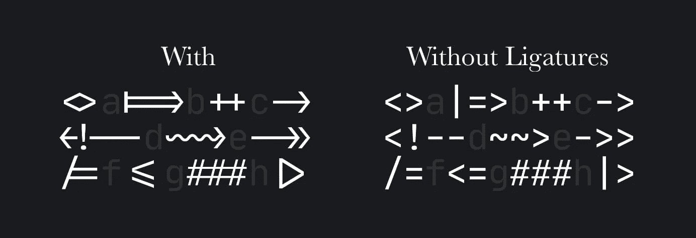

Ligatures example from Jetbrains Mono — [https://www.jetbrains.com/lp/mono/](https://www.jetbrains.com/lp/mono/)

我想在这里强调两种非常流行的开发人员字体

1.  [JetBrains Mono](https://www.jetbrains.com/lp/mono/)
2.  [Fira 代码](https://github.com/tonsky/FiraCode)

这两种字体本身就很棒，而且都可以免费使用。

*个人偏好:对 JetBrains Mono 有个人偏好。字母的高度增加了，形状更加清晰，通常也更容易阅读。我建议你下载并试用每种字体一段时间，看看它们是否适合你。*

## 在 VS 代码中使用你喜欢的字体

1.  从上面的链接下载字体到你的电脑，并安装在本地。我建议安装下载的 TTF 字体。zip 文件。
2.  通过命令面板打开你的 VS 代码的`settings.json`文件(⇧⌘P).输入设置，选择“首选项:打开用户设置(JSON)”。
3.  将下面两行代码添加到 settings.json 中，以选择您的首选字体并启用字体连字。这使得字体在几种等宽字体上后退。

## 图标主题

Visual Studio 代码在文件夹资源管理器中的每一项前都显示一个图标。此图标指示项目的类型。这样你就可以快速区分文件夹、javascript 文件和 HTML 文件之间的区别。

这些图标可以定制，根据你的喜好，市场上有很多很棒的软件包可以下载。让我们来看几个流行的选项。

**1。** [**素材图标主题—1450 万安装**](https://marketplace.visualstudio.com/items?itemName=PKief.material-icon-theme)

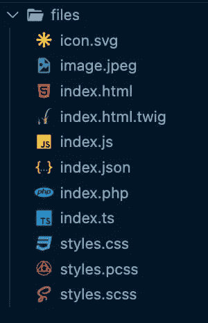

材料图标主题是 VSCode Marketplace 上下载量最大的扩展。它有一组漂亮清晰的图标，值得所有的赞美。

**2。**[**Monokai Pro—170 万安装**](https://marketplace.visualstudio.com/items?itemName=monokai.theme-monokai-pro-vscode)

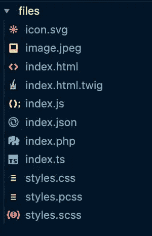

Monokai Pro 既是一个颜色主题，也是一个图标主题。但是，它们可以彼此独立切换。颜色主题和图标看起来都很漂亮，可以让你专注于你的代码。

**3。**[**vs code-icons—1210 万安装**](https://marketplace.visualstudio.com/items?itemName=vscode-icons-team.vscode-icons)

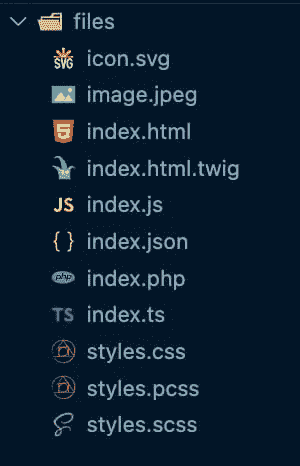

vscode-icons 是一组非常棒的图标，可以让你的边栏一目了然。我从 VSCode 的第一个版本开始使用这个图标集，直到大约一个月前。如果你不确定选择哪个图标集，请使用这个图标集。它能很好地与任何颜色主题融合，每个图标都简单明了。

**4。** [**城市灯光图标包— 96k 安装**](https://marketplace.visualstudio.com/items?itemName=Yummygum.city-lights-icon-vsc)

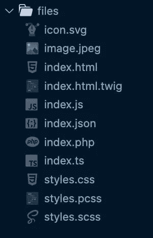

城市之光图标包有两种颜色和单色的图标主题。最近通过一个朋友发现了这个图标主题，用了大概一个月。在我看来，单色款式非常简洁，与夜猫子的主题融合得非常好。

## 颜色主题

到目前为止，颜色主题是你能对你的编辑器做出的最大的视觉改变，并且是高度个性化的。尽管如此，我还是想在这里列举几个在 VSCode 社区广受欢迎的好选择。

**1。**[**One Dark Pro—620 万装**](https://marketplace.visualstudio.com/items?itemName=zhuangtongfa.Material-theme)

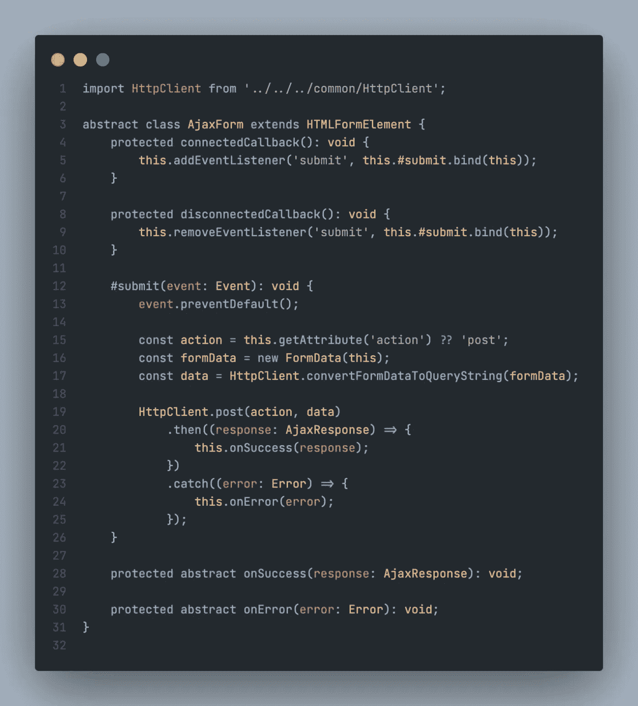

One Dark Pro 与 Atom 的 One Dark 主题完全匹配。这是 VSCode 市场上最受欢迎的主题。这个主题让很多过去使用 Atom 的开发者怀旧。

这个主题理应受到欢迎。颜色很漂亮，不会分散你对代码的注意力。

**2。** [**Github 主题—540 万安装**](https://marketplace.visualstudio.com/items?itemName=GitHub.github-vscode-theme)

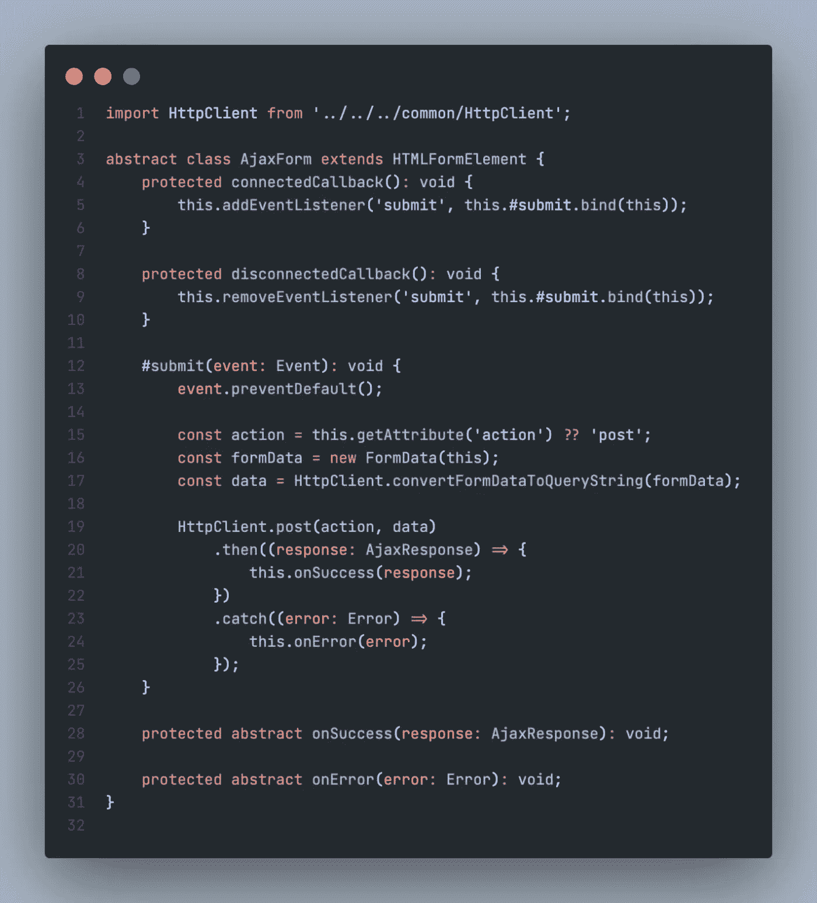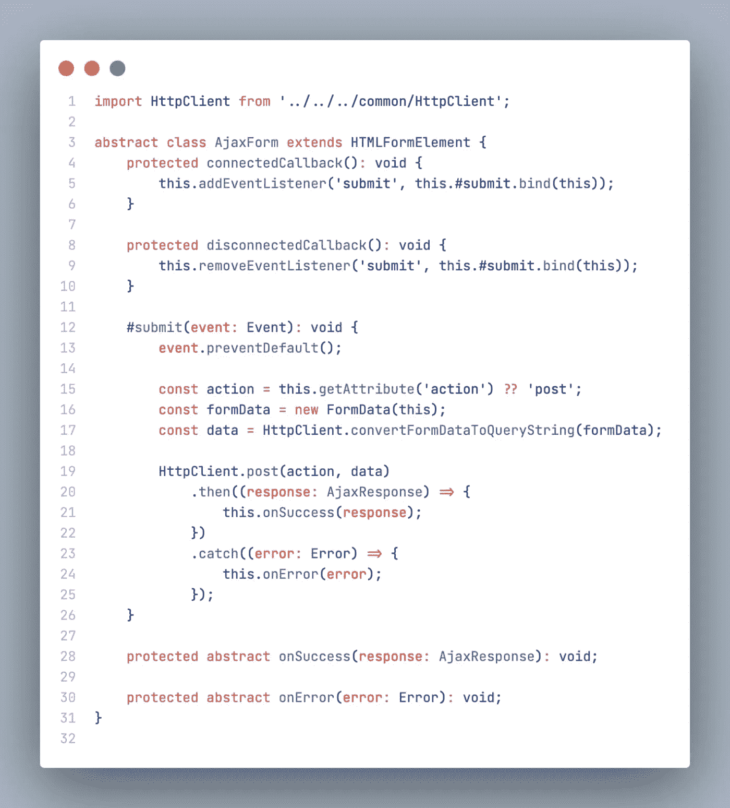

GitHub 发布了一组自己的主题。他们有一个黑暗和光明的主题，都有一个默认的，高对比度，色盲模式。

如果你是 GitHub 的长期用户，并且喜欢他们的颜色主题，那么你绝对应该尝试这个主题。

**3。** [**德古拉官方—440 万装**](https://marketplace.visualstudio.com/items?itemName=dracula-theme.theme-dracula)

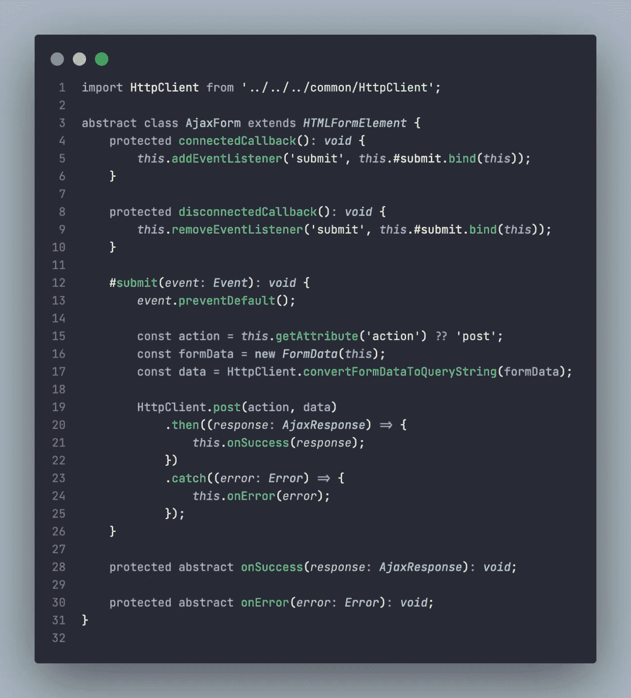

Dracula 官方是一个非常流行的主题，跨越了许多不同的编辑器、shells 和其他工具。这个想法是在你所有的工作流程中创建一个一致的颜色主题。这是一个美丽的深色主题，灵感来自夜晚(因此吸血鬼主题) :)

关于这个主题的更多信息，请查看他们的网站。

**4。** [**夜猫子——160 万安装**](https://marketplace.visualstudio.com/items?itemName=sdras.night-owl)

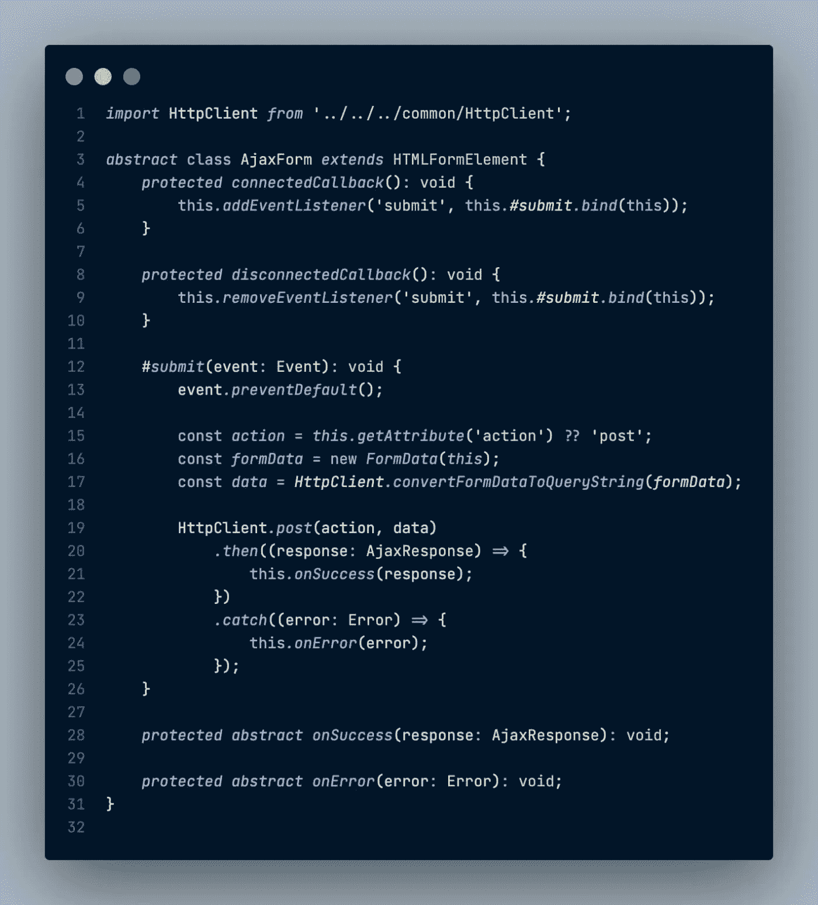

夜猫子是一个美丽的黑暗主题，是专门为深夜编码的人制作的。根据作者的说法:“颜色的选择已经考虑到了色盲者和在弱光环境下的易接近性。决定也是基于阅读理解和最佳眼花缭乱的有意义的对比。

*一个月前才发现这个主题，一直用到现在。*

***5。** [**一台 Monokai—150 万安装**](https://marketplace.visualstudio.com/items?itemName=azemoh.one-monokai)*

*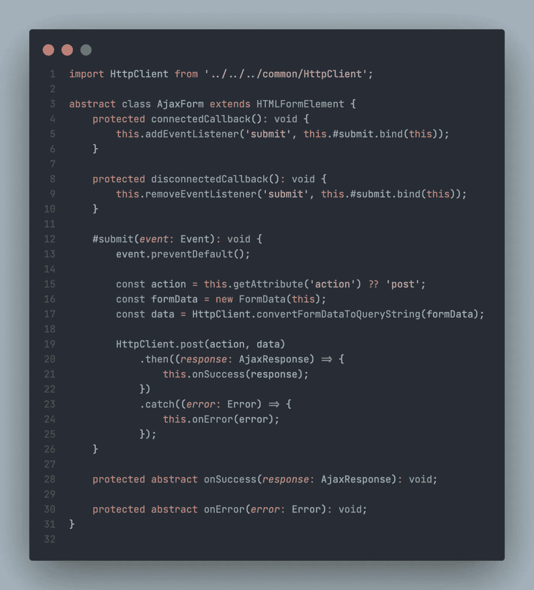*

*“一个莫诺凯”主题是“一个黑暗主题”和“莫诺凯”的结合。*

*6。 [**紫色阴影——130 万装**](https://marketplace.visualstudio.com/items?itemName=ahmadawais.shades-of-purple)*

*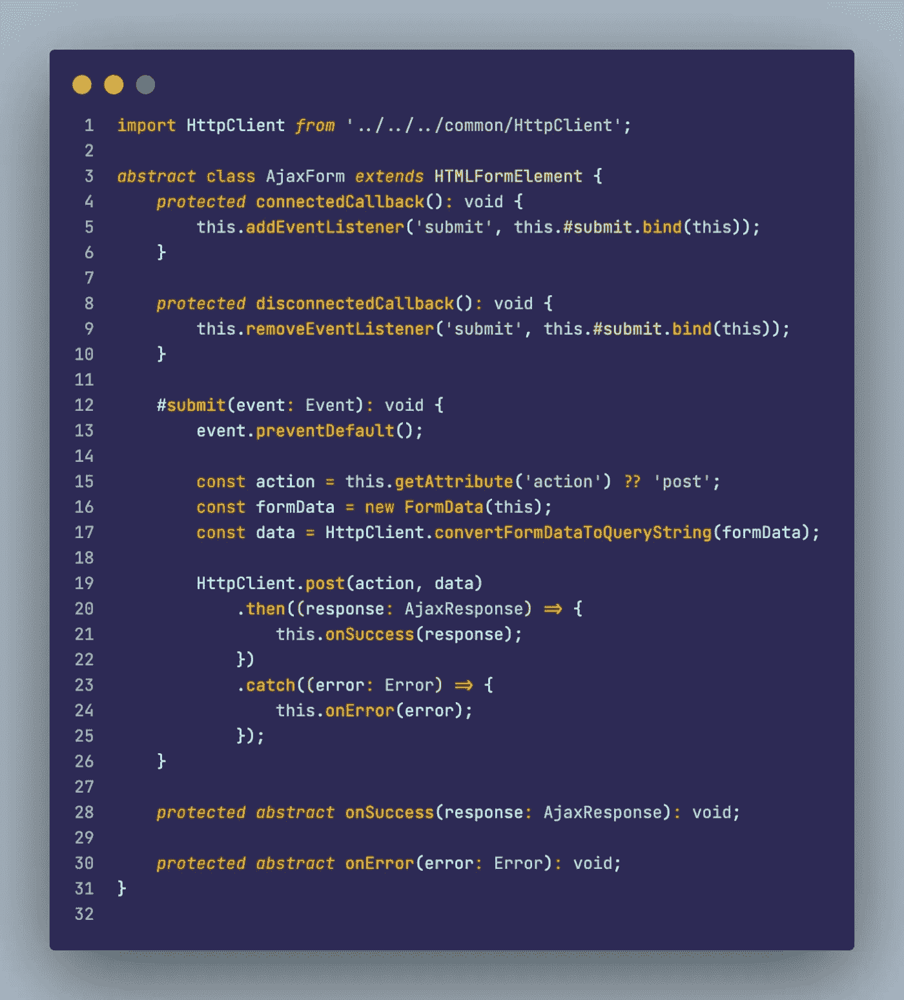*

*紫色阴影是一个美丽的主题，以大胆的紫色阴影为特色。代码基本上是用这个主题跳出你的屏幕的。我知道有几个人对这个主题信誓旦旦。我建议你试一试。*

*7 .**。**[**synth wave ' 84–100 万安装**](https://marketplace.visualstudio.com/items?itemName=RobbOwen.synthwave-vscode)*

*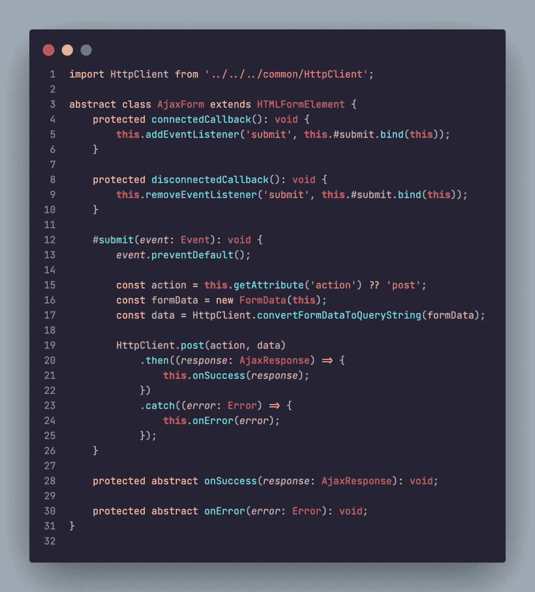*

*这个创意主题受到音乐和 Synthwave 乐队的封面艺术作品的影响，如 Timecop 1983 FM-84 和 The Midnight。*

*它非常耀眼，代码在你的屏幕上闪闪发光。如果你喜欢 80 年代的风格，这个主题可能正合你的胃口！*

***8。** [**东京之夜— 650k 装**](https://marketplace.visualstudio.com/items?itemName=enkia.tokyo-night)*

*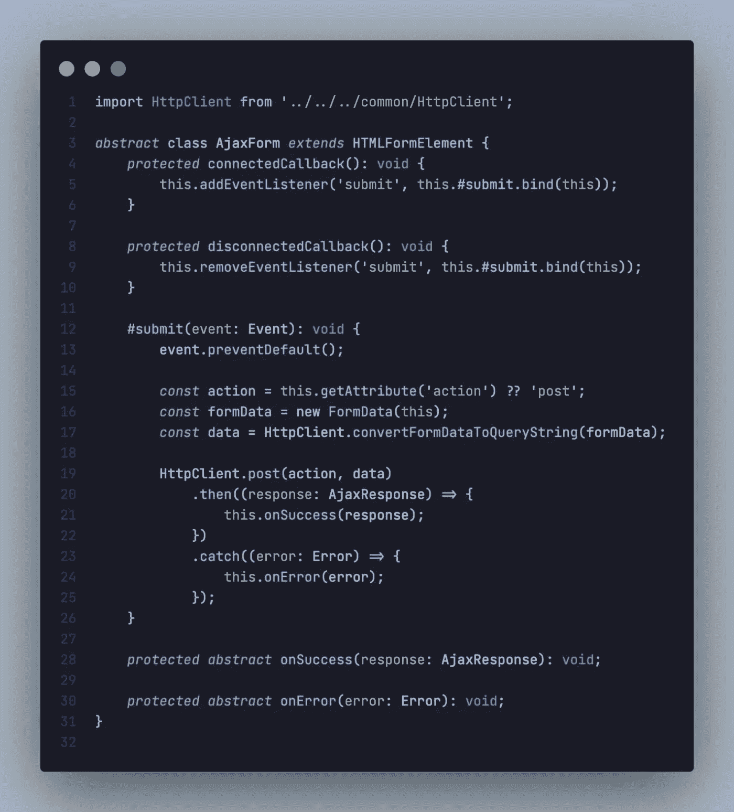*

*一个干净的 Visual Studio 代码主题，庆祝东京市中心夜晚的灯光。这个主题很干净，看起来很棒。*

***9。** [**神奈川— 100k 安装**](https://marketplace.visualstudio.com/items?itemName=qufiwefefwoyn.kanagawa)*

*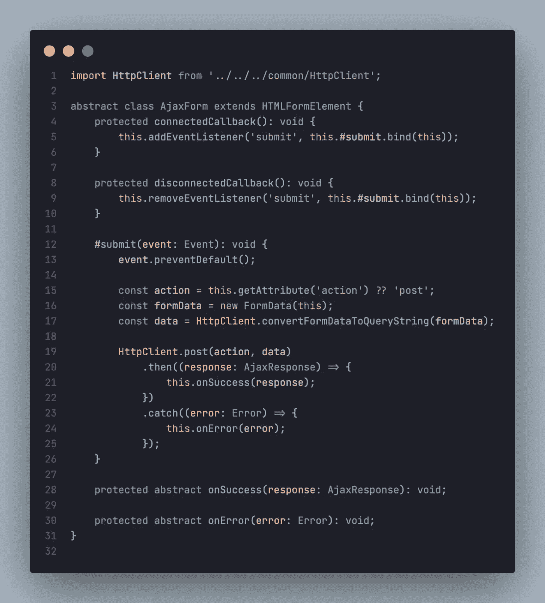*

*这是神奈川. nvim 配色方案的 VSCode 端口。这是一个黑暗的主题，灵感来自葛饰北斋名画的色彩。*

***10。** [**支架灯 Pro — 65K 安装**](https://marketplace.visualstudio.com/items?itemName=fehey.brackets-light-pro)*

*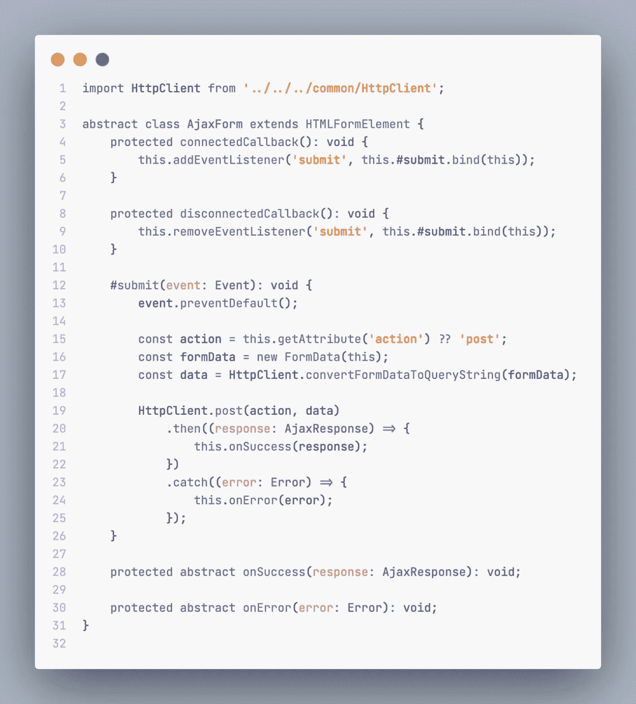**

韦斯利·史密茨* 

## *Visual Studio 代码*

*[View list](https://medium.com/@WesleySmits/list/visual-studio-code-b99af6ef41b8?source=post_page-----253d0b33b40d--------------------------------)**6 stories*******

## *结论*

*Visual Studio 代码有大量的自定义选项，可以让任何人都觉得它更美观。请在评论中让我知道你最喜欢的设置或者你已经在运行的设置！*

*如果你喜欢我的内容并想支持我的努力，考虑通过[我的会员链接](https://medium.com/@WesleySmits/membership)成为一个媒体订阅者。这不会花费你任何额外的费用，但 Medium 会把部分收益给我，让我推荐你。*

*如果你愿意，你可以在 LinkedIn 或者 Twitter 上和我联系！*

* [## 通过我的推荐链接加入 Medium-Wesley Smits

### 阅读韦斯利·斯密特(以及媒体上成千上万的其他作家)的每一个故事。您的会员费直接支持…

medium.com](https://medium.com/@WesleySmits/membership)* 

**更多内容请看*[***plain English . io***](https://plainenglish.io/)*。报名参加我们的* [***免费周报***](http://newsletter.plainenglish.io/) *。关注我们关于*[***Twitter***](https://twitter.com/inPlainEngHQ)[***LinkedIn***](https://www.linkedin.com/company/inplainenglish/)*[***YouTube***](https://www.youtube.com/channel/UCtipWUghju290NWcn8jhyAw)*[***不和***](https://discord.gg/GtDtUAvyhW) *。对增长黑客感兴趣？检查* [***电路***](https://circuit.ooo/) *。****