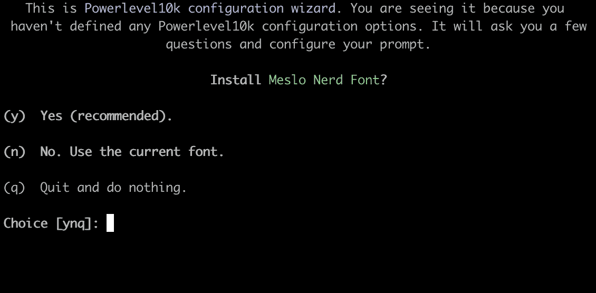
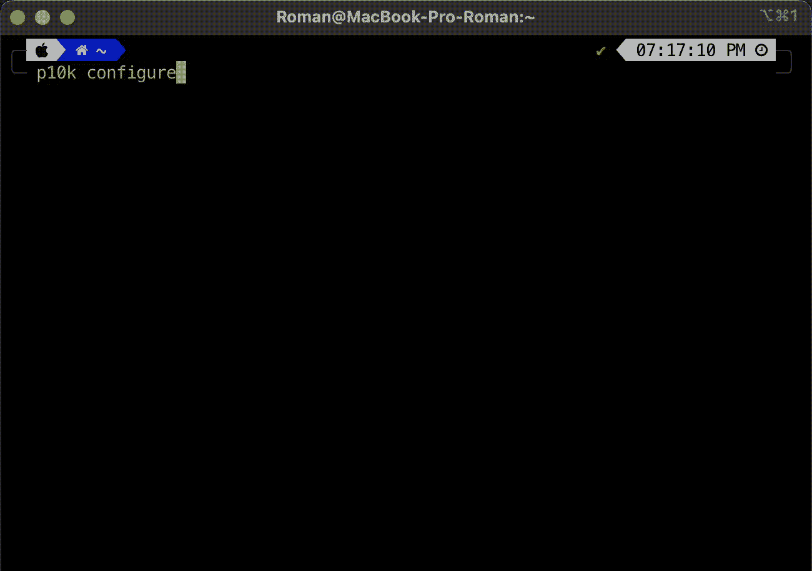
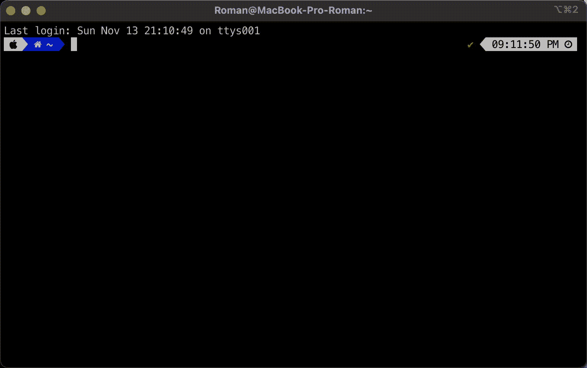

# 如何让自己的 Mac 终端变得更好，更丰富多彩

> 原文：<https://javascript.plainenglish.io/how-to-make-your-mac-terminal-better-and-make-it-more-colorful-a966e92a51b5?source=collection_archive---------5----------------------->


Photo by [Ana Cruz](https://unsplash.com/@anacruzbaeza?utm_source=unsplash&utm_medium=referral&utm_content=creditCopyText) on [Unsplash](https://unsplash.com/s/photos/colorful?utm_source=unsplash&utm_medium=referral&utm_content=creditCopyText)

如果你是一个拥有 Mac 的软件工程师，像我一样，你可能会在 Mac 终端上做很多工作。在默认终端中工作使用起来不是很方便，在这篇文章中我想谈谈有助于改进你的终端的工具。

## 第一步。公司自产自用

[家酿(brew)](https://brew.sh/) —软件包管理器，允许您根据用户的需要在 macOS 上安装应用程序和软件。就省时省力而言，它简单高效，值得推荐。
要安装，您需要运行一个命令:

```
/bin/bash -c "$(curl -fsSL https://raw.githubusercontent.com/Homebrew/install/HEAD/install.sh)"
```

安装后，将其添加到路径 replace 3 更多的命令将出现在终端中，您将需要执行。“[用户名]”中的必须是您的实际用户名:

```
 echo '# Set PATH, MANPATH, etc., for Homebrew.' >> /Users/[username]/.zprofile
 echo 'eval "$(/opt/homebrew/bin/brew shellenv)"' >> /Users/[username]/.zprofile
 eval "$(/opt/homebrew/bin/brew shellenv)"
```

## 第二步。iTerm2

MacOS 上的默认终端应用程序做得很好。但是还有更好的选择。我用的是 iTerm2。它有一堆很酷的功能，比如:****复制模式******分割窗格******搜索******粘贴历史*** 等等，你可以查看他们的网站 [iTerm2](https://iterm2.com/) 了解更多细节。*

*要安装，请运行:*

```
*brew install --cask iterm2*
```

*如果您还没有安装它，也安装 git:*

```
*brew install git*
```

*在本演练的剩余部分，切换到 iTerm2。*

## *第三步。哦，我的 Zsh*

*哦，我的天啊——帮助美化你的终端，让它更加丰富多彩。运行这个来安装[哦我的 Zsh](https://ohmyz.sh/) :*

```
*sh -c "$(curl -fsSL https://raw.githubusercontent.com/ohmyzsh/ohmyzsh/master/tools/install.sh)"*
```

> ***如何让 NVM 与之合作**。*
> 
> *安装完成后，退出终端窗口，打开一个全新的终端窗口。如果您尝试运行命令`nvm`，您可能会注意到它不起作用。那是因为没有设置为插件。要解决这个问题，您必须做几件事情。*
> 
> *首先，打开你的*。zshrc* 文件编辑它:*
> 
> *`vi ~/.zshrc`*
> 
> *使用向下箭头键在文件中向下滚动，直到你看到`plugins=(git)`。按下 **i** 键进入编辑模式。使用箭头键调整光标，然后在括号中添加 nvm，使其看起来像这样:`plugins=(git nvm)`。确保`git`和`nvm`之间有间距。*
> 
> *完成后，通过执行以下操作保存并退出该文件:按下 escape 键，然后键入`:wq`，然后按下 enter。*
> 
> *接下来，要刷新您的编辑，请运行以下命令:*
> 
> *`source ~/.zshrc`*

## *第四步。哦，我的 Zsh 主题*

*最流行的 [Oh My Zsh](https://ohmyz.sh/) 方案是 [PowerLevel10K](https://github.com/romkatv/powerlevel10k)*

**

*运行此命令以安装 PowerLevel10K:*

```
*git clone https://github.com/romkatv/powerlevel10k.git $ZSH_CUSTOM/themes/powerlevel10k*
```

*接下来打开你的*。zshrc* 文件编辑它:*

*`*vi ~/.zshrc*`*

*更改*ZSH _ 主题*的值，如下图所示:*

```
*ZSH_THEME="powerlevel10k/powerlevel10k"*
```

*接下来，要刷新您的编辑，请运行以下命令:*

*`*source ~/.zshrc*`*

*之后，您应该会收到以下消息:*

**

*按“ **y** 安装字体，然后退出 iTerm2。*

*接下来，您需要重新打开 ITerm2 并选择配置和建议的选项。如果您不喜欢选定的配置，可以通过调用命令来更改它*

*`*p10k configure*`*

**

***将 iTerm2 颜色更改为自定义主题***

1.  *打开 iTerm2 偏好设置*
2.  *转到配置文件>颜色*
3.  *导入下载的颜色配置文件或手动更改颜色*
4.  *选择颜色配置文件*

*你可以在这里找到其他主题: [Iterm2 配色方案](https://iterm2colorschemes.com/)*

## *第五步。ZSH 插件*

*自动建议插件——这个插件会查看你的历史记录，并为你之前输入的内容提供建议。所以它不同于默认的自动完成，因为它不是很聪明。它只是提示你之前输入的内容，包括错别字和错误。*

*安装 zsh-自动建议:*

```
*git clone https://github.com/zsh-users/zsh-autosuggestions 
${ZSH_CUSTOM:-~/.oh-my-zsh/custom}/plugins/zsh-autosuggestions*
```

***语法高亮—** 插件是语法高亮器。它会在您键入时突出显示您的命令:*

*安装 zsh-语法-突出显示:*

```
*git clone https://github.com/zsh-users/zsh-syntax-highlighting.git 
${ZSH_CUSTOM:-~/.oh-my-zsh/custom}/plugins/zsh-syntax-highlighting*
```

*接下来需要打开“~/”。zshrc "文件`*vi ~/.zshrc*` ，并修改插件行，如下图所示。*

```
*plugins=(git nvm zsh-autosuggestions zsh-syntax-highlighting)*
```

*通过运行以下命令加载这些新插件:*

*`*source ~/.zshrc*`*

*好了，就这些了，现在你有了一个更方便、更丰富多彩的终端。*

**

*希望对你有用！*

*感谢阅读！回头见。😊*

**更多内容请看*[***plain English . io***](https://plainenglish.io/)*。报名参加我们的* [***免费周报***](http://newsletter.plainenglish.io/) *。关注我们关于*[***Twitter***](https://twitter.com/inPlainEngHQ)[***LinkedIn***](https://www.linkedin.com/company/inplainenglish/)*[***YouTube***](https://www.youtube.com/channel/UCtipWUghju290NWcn8jhyAw)***，以及****[***不和***](https://discord.gg/GtDtUAvyhW) *对成长黑客感兴趣？检查* [***电路***](https://circuit.ooo/) ***。******