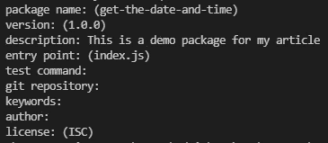
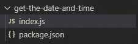
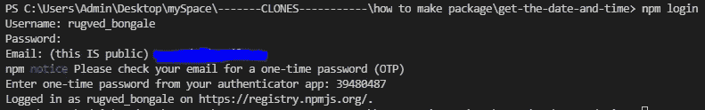
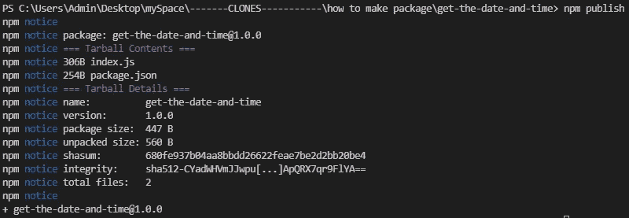
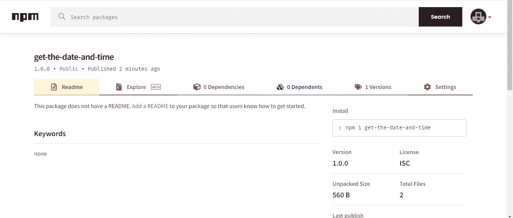
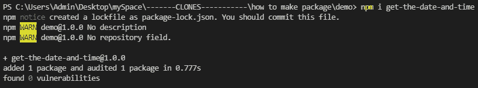
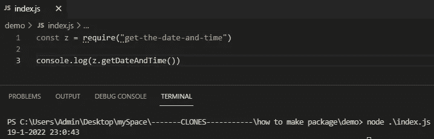

# 在 5 分钟内制作你自己的 npm 包

> 原文：<https://javascript.plainenglish.io/how-to-make-your-own-npm-package-in-5-mins-ae15cefaa605?source=collection_archive---------12----------------------->

## 构建一个返回当前日期和时间的简单 npm 包。


# 介绍

如果你使用 Node.js，你必须一直使用 npm 包。他们是如此的有帮助，令人惊讶的是，制作你自己的 npm 包并把它发布到互联网上是非常容易的。

# 我们要建造什么？

在本文中，我们将构建一个返回当前日期和时间的简单 npm 包。稍后，我们将发布它并将其安装在不同的项目中。

# 让我们编码

*   创建一个文件夹并运行 **npm init** 。

```
mkdir get-the-date-and-time
cd get-the-date-and-time
npm init 
```

*   在运行 **npm init** 之后，它会询问你一些基本的细节。当它要求你输入你的包名时，试着想一个唯一的名字。



*   在 package.json 所在的目录下创建 **index.js** 。这将是你编写所有函数的主文件。安装您的软件包的用户以后可以使用这些功能。



*   按照以下格式在 index.js 中添加函数

```
exports.functionName = () => {
    // function logic goes here
}
```

*   由于我们正在构建一个返回日期和时间的包，这里是用于演示的 index.js 文件。

```
exports.getDateAndTime = () => {
    var today = new Date();
    var date = today.getDate() + "-" + (today.getMonth()+1) + "-" +     today.getFullYear();
    var time = today.getHours() + ":" + today.getMinutes() + ":" + today.getSeconds(); var dateTime = date + ' ' + time;
    return dateTime
}
```

*   接下来，如果你还没有在 npm 官方网站[https://www.npmjs.com/](https://www.npmjs.com/signup)上创建账户。
*   在终端中，键入 **npm login** ，并键入您的用户名和密码。



*   我们差不多完成了。剩下要做的就是发布我们的包。为此，请在终端中输入以下内容。

```
npm publish
```

*   有时，您的软件包名称可能已经被占用，或者它可能与其他软件包非常相似。在这种情况下，转到 **package.json** ，将 **name** 属性更改为其他属性，并再次运行 **npm publish** 。



*   您的包现在对每个人都可用，您可以登录[https://www.npmjs.com/](https://www.npmjs.com/)查看您的个人资料



# 让我们测试一下它是否真的有效

*   创建一个新项目并重复前面的步骤。1)创建一个新目录
    2) npm init
    3)创建 index.js
*   现在通过运行以下命令来安装您的软件包。

```
npm install YOUR_PACKAGE_NAME
```



*   现在您的软件包已经成功安装，您可以访问您在其中编写的所有函数。要使用这些函数，我们需要“要求”index.js 中的包。



万岁！下次您构建任何有用的功能时，发布它以便其他人也可以安装它:)

*如果你喜欢这篇文章，请一定要喜欢，并与你的朋友分享。谢谢你。:))*

*更多内容请看*[***plain English . io***](http://plainenglish.io/)*。报名参加我们的* [***免费周报***](http://newsletter.plainenglish.io/) *。在我们的* [***社区***](https://discord.gg/GtDtUAvyhW) *获得独家获得写作机会和建议。*