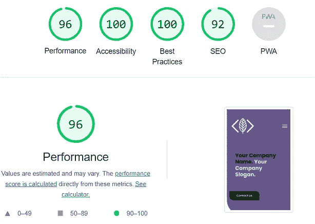
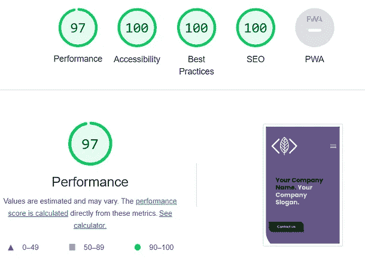
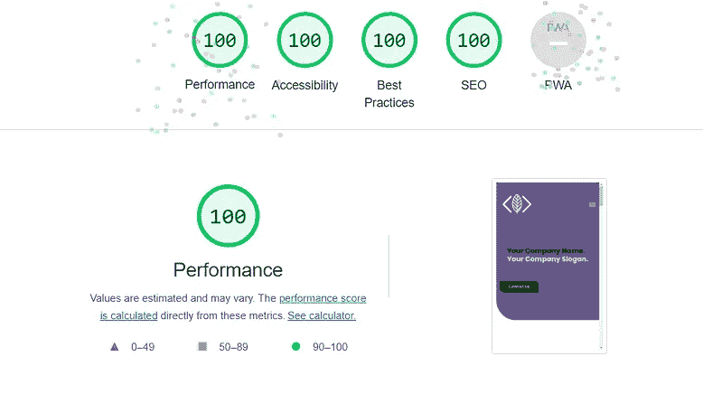
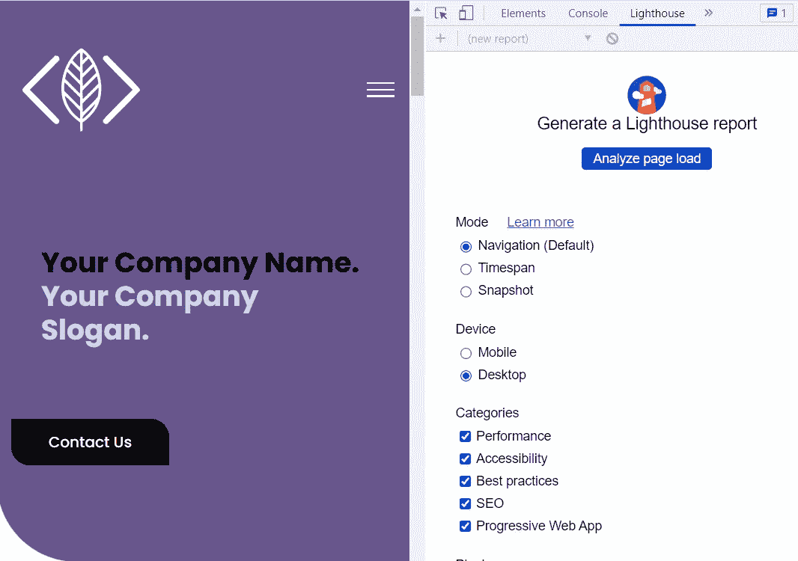

# 如何用谷歌灯塔开发工具让你的网站更强大

> 原文：<https://javascript.plainenglish.io/how-to-make-your-website-robust-with-lighthouse-tool-56f700c830ed?source=collection_archive---------15----------------------->

## 使用 Lighthouse Audit Report 的这些提示让你的网站表现得更好。

Photo by [Courtney Corlew](https://unsplash.com/@courtneycorlew?utm_source=medium&utm_medium=referral) on [Unsplash](https://unsplash.com?utm_source=medium&utm_medium=referral)

大家好，

最近，我一直致力于制作响应迅速、可定制、可扩展且性能强劲的网站模板，并在 Gumroad 平台上发布了其中一些模板。这篇文章来自于我在这个项目中所学到的东西。

了解每个企业都需要一个网站向其潜在客户展示其产品，我很乐意通过建立和开发一个响应网站来实现这一点，该网站可以根据企业的需求进行定制和扩展。然而，一个糟糕的网站会让他们的客户在浏览你的网站时失去兴趣，不管你的设计有多吸引人，有多少有用的信息。我相信优化你的网站是一个重要的关键，如果你提供付费服务。

为了解决这个问题，我开始做一些研究，以使我的模板在 Lighthouse performance 上取得最好的成绩。

下面是我的 [*网站模板*](https://landingpage-template-one.juninguyen.tech/) 的截图，是利用灯塔性能分析一次次改进的:

此时，你可能想知道**什么是灯塔**和**如何用灯塔**审计你的网站。以下是你的问题的答案和我的**建议，让你的网站整体表现更好**。

# **什么是灯塔？**

Lighthouse 是 Google 开发的一个开源工具，用于检查网页的性能和用户体验。

Lighthouse 运行自动审计扫描，检查网站在以下五个主要类别中的表现:

*   性能:它衡量页面有多快。
*   可访问性:它衡量你的页面的可访问性。审核必须通过 [*本*](https://web.dev/lighthouse-accessibility/) 文件中定义的详尽清单。
*   最佳实践:它衡量你的页面的最佳实践或可靠性受到多少尊重，这些最佳实践或可靠性是由 W3C、谷歌的标准所鼓励的。
*   SEO:它衡量**如何优化**和**如何标准化**你的页面对于搜索引擎来说。
*   渐进式网络应用程序(PWA):它衡量您的网站是否能够在所有设备上响应和安装。必须通过基于 [*基线 PWA 检查表*](https://web.dev/pwa-checklist/#baseline) *的审核。*

一旦 Lighthouse 完成其审计扫描，将生成一份报告，其中包含每个类别的总得分以及任何可操作的建议。但是，您会注意到**审计的结果可能会在您调整 lighthouse 工具的设置的功能方面稍有不同**，例如您已安装的互联网连接和扩展，以及您可以手动设置的预设。此外，可能有一些 UI 选项会降低分数，但对你的网站灵魂至关重要，比如动画、特效等等。因此，我们应该尽可能让**接近**一个完美的审核分数，但是它不应该影响你的网站的灵魂或者你的页面的外观和感觉。

# 2.**如何用 Lighthouse 审计你的网站？**

按照 [*这里*](https://developer.chrome.com/docs/lighthouse/overview/#devtools) 的指示，你可以使用一些方法来运行灯塔。我本人喜欢使用 *Chrome DevTools* 来测试我的网站在本地的表现，以下是你也可以在你的网站上运行灯塔审计报告的步骤:

1.  下载 [*谷歌桌面版 Chrome*](https://www.google.com/chrome/browser/desktop/)。(如果你有微软 Edge 作为浏览器，也可以用 DevTools 运行 Lighthouse)
2.  在 Google Chrome 中，转到您想要审计的 URL。
3.  [*右击页面，选择**检查**，打开 Chrome DevTools*](https://developer.chrome.com/docs/devtools/open/) 。
4.  点击**灯塔**标签。
5.  点击**分析页面负载**。DevTools 向您显示审计类别列表。让它们都保持启用状态。

几秒钟后，Lighthouse 在页面上给你一个报告。

# **3。让你的网站表现更好的技巧:**

现在是时候让你的网站**快速**、**可访问**、**可靠、**和**标准化**供搜索引擎使用了。基于我从 Lighthouse 审计报告中所学到的研究，我收集了这些技巧，以便节省您的开发时间，并且您将能够在下次运行 Lighthouse 报告之前修复您的站点:

***表演***

*   正确调整图像大小，尽可能接近它们在页面上的最终显示大小。例如，如果您的页面上有一个传记部分，您将显示的个人资料图片在页面上可能会有较小的尺寸。
*   使用 [*下一代*](https://web.dev/uses-webp-images/) 格式的图像，如*。webp*
*   [*延迟加载*](https://web.dev/fast/#lazy-load-images-and-video) 是一种允许延迟屏幕外图像的技术。这严重影响了包含大量图像的页面，因为在加载页面时，只会获取*占位符*图像(尺寸非常小的图像)。
*   尽可能限制 JS 包的大小，因为 JS 包越大，浏览器下载和解析它的时间就越长。
*   保持你的 DOM 小而简单，考虑推迟加载不必要的样式表，同时确保在生产站点上使用缩小的资产。

***无障碍***

*   你的文档应该有标题的`<heading>`元素。根据标题元素 的 [*MDN 文档，一个页面应该只有一个主标题`<h1>`，但是你可以为你的部分和锚使用任意多个`<h2>`，以及其他的`h3-h6`标题。*](https://developer.mozilla.org/en-US/docs/Web/HTML/Element/Heading_Elements)
*   在 DOM 中使用语义标签，例如，使用`<article>`而不是`
`来包装博客条目或文章。所有这些小的增加将帮助 [*屏幕阅读器*](https://axesslab.com/what-is-a-screen-reader/) 更好地理解你的文档。
*   使用`aria-x`属性，尤其是在不包含文本的元素上使用`aria-label`。另外，你的`<images>`应该都有一个`alt`属性来用文本描述它们。
*   文本和背景之间有足够的颜色对比度。你可以在 w3c 页面上的 [*对比*](https://www.w3.org/TR/WCAG21/#contrast-minimum) *中读到更多关于这条规则的内容。*
*   为你的输入使用标签。
*   为你的链接使用有意义的文本内容。你会在[*web . dev*](https://web.dev/link-name/)*网站上找到关于这些规则的更多细节。*

****最佳实践****

*   *不要使用`document.write`，因为它 [*会大大增加*](https://web.dev/no-document-write/?utm_source=lighthouse&utm_medium=devtools) 页面内容的显示。*
*   *使用外部链接的`rel="noopener"`或`rel="noreferrer"`属性来防止目标页面访问`window.opener`属性并劫持重定向。*
*   *确保您的包不会在控制台中抛出错误。*

****SEO (* 搜索引擎优化)***

*   *在文档的`<head>`中有一个`<title>`。*
*   *`<meta name="description">`是向搜索引擎描述你的页面的严格最小值。这个元素直接链接到搜索引擎为你的页面内容使用的 [*摘要*](https://web.dev/meta-description/) 。*
*   *`[*robots.txt*](https://web.dev/robots-txt/)` & HTTP 请求应该有效。*
*   *让你的网站移动友好，因为这将有助于搜索引擎更好地排名。*

****【PWA(渐进式网络应用)****

*   *页面加载应该很快。通过仅获取关键资源来限制页面负载:首先显示`text`，像加载`images`和`styles`一样推迟加载其余的资源。*
*   *使用`[*Service Workers*](https://developer.mozilla.org/en-US/docs/Web/Progressive_web_apps/Offline_Service_workers)`使您的网站离线可用。他们的目标是在访问者第一次访问时下载页面的资产，并存储在本地——以便下次访问可以离线进行。*
*   *给你的网站添加一个`manifest.json`文件。你会在这里找到完整的配置:[【web.dev/add-manifest】T4](https://web.dev/add-manifest/)。*
*   *显示内容，即使`JavaScript`在客户端被阻止。*
*   *实施 [*检查表*](https://web.dev/pwa-checklist/) 中的所有其他要求*

****注意*** *:一些框架&服务会为您处理上面列出的大量需求。如果你在用 React，我推荐 SPA 应用的*[*Gatsby . js*](https://www.gatsbyjs.org/)*——*[*Netlify*](https://www.netlify.com/)*duo。**

# ***结论***

*我知道，根据您的具体情况，实现其中一些可能需要花费大量的工作时间。但是如果你想为用户提供最好的体验，这是值得的。我希望这篇文章对你有所帮助。感谢您的阅读，下一篇文章再见！*

**更多内容请看*[***plain English . io***](https://plainenglish.io/)*。报名参加我们的* [***免费周报***](http://newsletter.plainenglish.io/) *。关注我们关于*[***Twitter***](https://twitter.com/inPlainEngHQ)[***LinkedIn***](https://www.linkedin.com/company/inplainenglish/)*[***YouTube***](https://www.youtube.com/channel/UCtipWUghju290NWcn8jhyAw)*[***不和***](https://discord.gg/GtDtUAvyhW) *。****