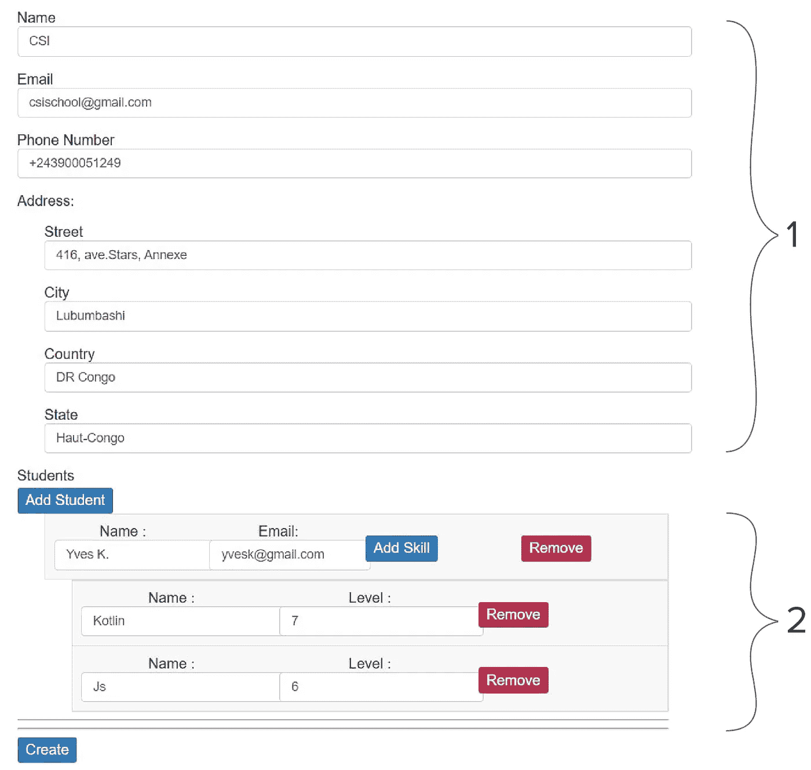

# 如何在 Angular 中管理复杂表单

> 原文：<https://javascript.plainenglish.io/how-to-manage-complex-forms-in-angular-7bd0007dea5e?source=collection_archive---------6----------------------->

## 在 Angular 中管理复杂表单的教程。

Photo by [Esther Jiao](https://unsplash.com/@estherrj?utm_source=medium&utm_medium=referral) on [Unsplash](https://unsplash.com?utm_source=medium&utm_medium=referral)

# **简介**

在处理包含几个 [**格式**](https://angular.io/api/forms/FormArray) 格式，甚至经常嵌套的表单时，您是否遇到过困难？

在本文中，我们将看到如何保存和修改包含几个**格式数组**的表单中的数据。

对于一个好的演示，我们将开发一个应用程序，记录学校学生的技能(专业)。

以下是最终结果的预览:

**Multiple formGroup in fromArray**

在我们图像的第(1)部分，它是关于一所学校的所有信息，而在第(2)部分，是关于每个学生的技能的信息。

# 应用程序模块

为了在我们的应用程序中使用表单的功能，我们将使用{[**ReactiveFormsModule**](https://angular.io/api/forms/ReactiveFormsModule)}。

## **型号**

正如您已经知道我们将要开发的应用程序的上下文，我们将创建 4 个接口来表示我们将在应用程序中操作的 4 种类型的数据:

***技能*** *界面*

这个界面显示了与学生的技能相关的信息。

***地址*** *界面*

该界面显示了与学校地址相关的信息。

***学生*** *界面*

这个接口表示与学校学生相关的信息，您会注意到在这个模型中有一个类型为 Skill 的技能数组，它表示一个学生拥有几项技能。

***学校*** *界面*

这个接口表示学校的信息，学校还有一个 Student 类型的学生数组，表示一个学校有几个学生。

我们将初始化类型为 [**FormGroup**](https://angular.io/api/forms/FormGroup) 的表单 ***schoolForm*** 和包含类型为 **School** 的测试值 ***school*** 的类的一个属性，用以下数据填充( **patchValue** 或 **setValue** )表单:

我们还导入了 **FormBuilder** 类。我们将它注入到应用程序组件的构造函数中，然后初始化表单，如下面的代码片段所示。

在我们的表单中填写**学生**或**技能**信息的最佳方式是逐步修改我们数组的每一行。

**学生阵列**

## 技能阵列

# PatchValue 示例

由于**学生**是一个包含**形式组**的**形式组**学生**又包含**技能**这是一个包含**形式组**的**形式组**类型**技能**；获取此信息的最佳方式是检索变量中的每个**数组**，然后根据它们在**学校**模型层次中的级别将其插入。**

# app.component.html

# 摘要

本指南展示了如何将值存储在**格式数组**中，并使用之前初始化的数据更新它们。

如果你想了解更多关于**棱角**的信息，请访问 [**官方文档**](https://angular.io/guide/what-is-angular) 。

通过以下链接[**https://robenkr.github.io/complexForm/**](https://robenkr.github.io/complexForm/)**来看看应用的 [**演示**](https://robenkr.github.io/complexForm/) 。**

你也可以在下面的 GitHub 链接找到代码:[**https://github.com/robenkr/complexForm.git**](https://github.com/robenkr/complexForm.git)**。**

如果有什么不清楚的地方或者如果你有任何问题，请不要犹豫发表评论或者在 [**Twitter**](http://twitter.com/RobenKal) 上联系我。

*更多内容请看*[***plain English . io***](https://plainenglish.io/)*。报名参加我们的* [***免费周报***](http://newsletter.plainenglish.io/) *。关注我们关于*[***Twitter***](https://twitter.com/inPlainEngHQ)*和**[***LinkedIn***](https://www.linkedin.com/company/inplainenglish/)*。查看我们的* [***社区不和谐***](https://discord.gg/GtDtUAvyhW) *加入我们的* [***人才集体***](https://inplainenglish.pallet.com/talent/welcome) *。**