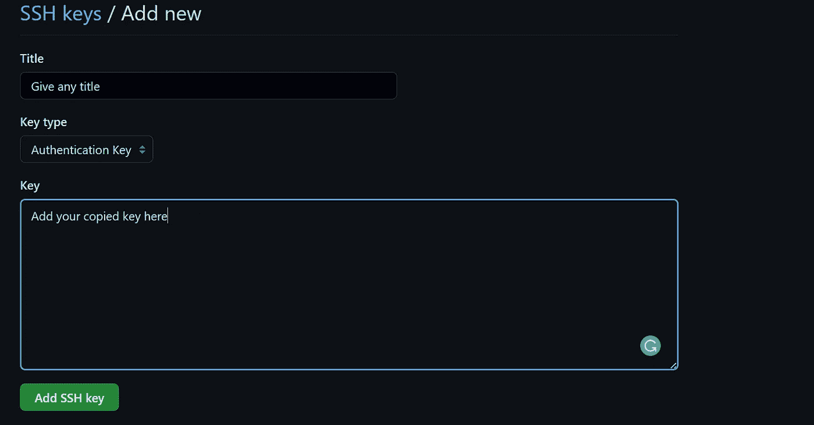

# 如何使用 SSH 密钥管理 VSCode 中的多个 GitHub 帐户？|一次性流程

> 原文：<https://javascript.plainenglish.io/how-to-manage-multiple-github-accounts-in-vscode-using-ssh-keys-7f1a3adef58a?source=collection_archive---------2----------------------->

## 我们来看看如何在 VSCode 中同时使用个人和专业 GitHub 账号。


目前，VSCode 一次只支持一个帐户登录。当你有多个 GitHub 帐户时，你必须注销一个帐户才能使用另一个帐户。然而，这是一个繁琐的过程。

这可以通过使用 SSH 密钥的一次性解决方案来解决。

您可能已经尝试了许多其他解决方案，这些解决方案告诉您在克隆存储库时为不同的帐户使用不同的自定义域名。但是这有两个问题:

*   每次克隆时，你都需要记住自定义域名。
*   并且您需要手动更新 git-config 文件。

然而，在本文中，我们会自动为您完成所有这些过程。

# 1.打开 git bash 和 goto。嘘

```
cd ~/.ssh
```

# 2.检查您是否已经有一个 SSH 密钥。

```
ls -al ~/.ssh
#it ends with .pub extention.
```

如果您有一个 SSH 密钥，那么使用它或者生成一个新的。

# 3.生成新的 SSH 密钥。

```
#execute one by one
ssh-keygen -t ed25519 -C "personal_email_address" -f "personal_github_username"
ssh-keygen -t ed25519 -C "company_email_address" -f "company_github_username"
```

*   -C:这是用于标识 SSH 密钥的注释。
*   -f:这是保存 SSH 密钥的文件名。

它要求输入一个`passphrase`,让它为空，然后按回车键。

# 4.启动 SSH 代理

```
eval `ssh-agent -s`
```

然后您会得到类似于`Agent pid 1576`的输出

# 5.将 SSH 密钥添加到 SSH-agent

```
#execute one by one
ssh-add -K ~/.ssh/personal_github_username  #personal SSH key
ssh-add -K ~/.ssh/company_github_username   #Company SSH key
```

# 6.向 GitHub 添加公共 SSH 密钥。

*   打开。在 VScode 或 Vim 上发布文件，然后复制密钥。

```
#execute one by one
code ~/.ssh/personal_github_username.pub
code ~/.ssh/company_github_username.pub
```

*   然后转到 https://github.com/settings/keys 的`Github → Settings → Keys`或[并点击**新 SSH 键。**](https://github.com/settings/keys)



# 7.创建`config`文件。

```
#execute one by one
touch config
code config           # to open this in VS code.
```

在`config`文件中添加以下内容。

```
#inside ~/.ssh
Host *
  IgnoreUnknown AddKeysToAgent,UseKeychain
  AddKeysToAgent yes
  UseKeychain yes
  IdentityFile ~/.ssh/<personal_github_username> # Default key (You can also use company key)
```

这将接受所有自定义域并检查。git 忽略任何路径匹配的文件。

# 8.转到根目录并创建以下三个文件。

```
cd ~
touch .gitignore
touch .gitignore.company
touch .gitignore.personal
```

如果你有其他账户，也为其创建一个. gitignore 文件。

在 VS 代码中打开三个文件，并添加下面的代码。

```
#inside ~/.gitignore.company
[user]
email = Your_company_email_address
name = Your name

[github]
user = "company_github_username" #should be inisde double quote.

[core]
sshCommand = "ssh -i ~/.ssh/company_github_username" #should be inisde double quote.
```

```
#inside ~/.gitignore.personal
[user]
email = Your_personal_email_address
name = Your name

[github]
user = "personal_Github_username" #should be inisde double quote.

[core]
sshCommand = "ssh -i ~/.ssh/personal_github_username" #should be inisde double quote.
```

```
#inside ~/.gitignore
[includeIf "gitdir:C:/Users/<user_name>/Personal/"] # include for all .git projects under Personal/ 
path = ~/.gitconfig.personal

[includeIf "gitdir:C:/Users/<user_name>/Comapny/"] # include for all .git projects under Company/
path = ~/.gitconfig.company  

[core]
excludesfile = ~/.gitignore      # Ignore .gitignore files valid everywhere
```

*   通过这样做，现在你不用担心自定义域和所有。
*   现在，当你在`personal`文件夹或`Company`文件夹中克隆一个项目时， `.gitignore` 中的`IncludeIf`匹配位置并执行各自的`sshCommand.`

# 完成后，您可以尝试克隆

下面给出了一个例子(通过创建私有存储库进行测试的最佳方法)。

```
git clone git@github.com:mohanas/test.git #my personal
git clone git@github.com:mohanas-company/test.git #my company

#these repositories are not exist, you can try your own repository.
```

如果你有任何疑问，或者如果这个方法对你不起作用，请在评论区告诉我。

如果你喜欢这篇文章，请鼓掌👏，注释💌和你的朋友一起分享吧🙏我为更多这样的内容。

> 我每周至少发表一篇文章，请考虑关注并订阅我的电子邮件✉️列表。

*更多内容请看*[***plain English . io***](https://plainenglish.io/)*。报名参加我们的* [***免费周报***](http://newsletter.plainenglish.io/) *。关注我们关于*[***Twitter***](https://twitter.com/inPlainEngHQ)[***LinkedIn***](https://www.linkedin.com/company/inplainenglish/)*[***YouTube***](https://www.youtube.com/channel/UCtipWUghju290NWcn8jhyAw)*[***不和***](https://discord.gg/GtDtUAvyhW) ***。*****

*****对缩放您的软件启动感兴趣*** *？检查* [***电路***](https://circuit.ooo?utm=publication-post-cta) *。***