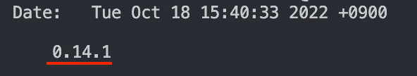

# 如何用 Shell 脚本管理 Web 项目版本

> 原文：<https://javascript.plainenglish.io/how-to-manage-web-project-version-with-shell-script-1afe679fee52?source=collection_archive---------9----------------------->

## 是时候使用 shell 脚本来管理您的应用程序版本了


Photo by [Tim Wildsmith](https://unsplash.com/@timwildsmith?utm_source=medium&utm_medium=referral) on [Unsplash](https://unsplash.com?utm_source=medium&utm_medium=referral)

最近，我喜欢用 Shell 脚本制作脚本。Shell 脚本功能强大，非常易于使用。有时，如果您必须运行 Git 命令或者必须导入`package.json`文件，这就方便多了。

在这篇文章中，我想分享我是如何使用 Shell 脚本和基本的 NPM 命令来制作版本管理脚本的。

# 对论点的理解

首先要做的是在`package.json`中添加一个新的脚本。

```
// package.json"scripts": {
  "version-check": "<your_directory>/version.sh"
}
```

现在你可以运行命令`npm run version-check`或`yarn version-check`，随你喜欢。在 Shell 脚本`version.sh`中，我们将从检查参数是否存在开始。

## $1 是神奇的关键字。

```
// version.shif [ -z "$1"]; then
  echo "You have to pass one of the following arguments"
  echo "major | patch | minor | <specific version>"
  exit 0
fi
```

Shell 脚本使用数字 1-9 的美元符号($)为您提供用户参数。例如，$1 指向第一个参数。如果运行命令`npm run version`，没有参数传递给`version.sh`，If 语句将通过。

在 if 语句中，`-z "$1"`表示，“如果第一个参数长度为零，则返回 true。”

# 检查分支名称

下一步是检查当前的分支名称，我们运行命令的地方，是我们想要的正确的地方。

假设我们只希望这个脚本在`main`分支上执行。在 Shell 脚本中，变量可以按如下方式赋值。

```
TARGET_BRANCH="main"
```

使用大写或小写并不重要。但重要的是等号(=)左右两边一定不能有空格。

现在我们要将当前工作的分支与`TARGET_BRANCH`进行比较。我们可以用 Shell 脚本非常容易地得到当前的分支名称。

```
git rev-parse --abbrev-ref HEAD
```

所以现在我们可以定义另一个变量来存储当前的分支名称。我们应该用美元符号和括号将 Git 或 NPM 命令括起来。

```
CURRENT_BRANCH=$(git rev-parse --abbrev-ref HEAD)
```

那么，多田。分店名称印得很好。

```
echo $CURRENT_BRANCH 
// main (if you are on the main)
```

现在我们可以检查当前分支是否是`main`，否则，我们将打印错误消息。

```
if [ "$TARGET_BRANCH" != "$CURRENT_BRANCH" ]; then
  echo "Cannot update the version. Make sure to checkout to $TARGET_BRANCH."
  exit 0
fi
```

# 检查文件更改

最后，我们希望只有在您的工作目录中没有文件更改时才运行这个脚本，因为更改版本通常意味着您的任务已经全部完成，而更新版本是最后要做的事情。

要从`package.json`中检索当前版本，我们可以这样写。

```
OLD_VERSION=$npm_package_version
```

我们可以使用 NPM 内置命令`npm version`来执行

```
NEW_VERSION=$(npm version $1 --no-git-tag-version)
```

## 我想我应该告诉你那个命令是什么意思

`npm version`需要版本类型，如`patch`、`minor`或`major`。但是当你运行这个脚本`npm version patch`时，它会将`package.json`的补丁号从`a.b.p`提升到`a.b.p+1`。例如，`npm run version`将版本从`0.0.1`更改为`0.0.2`。

当该命令改变`package.json`中的版本时，由于选项`git-tag-version`的原因，它还会创建一个标签并自动提交，默认值为`true`。



An automatically created commit

但是我们不喜欢它的样子；太丑了！😤

我们不想就这样离开。使用`--no`选项可以防止 Git 进行新的提交。

```
npm version patch --no-git-tag-version
```

这个命令只改变应用程序的版本，所以在 diff 中将有两个变化。

## Git 命令结果被赋给变量

右上方的命令结果被分配给`NEW_VERSION`。与取`package.json`版本的`OLD_VERSION`有一点不同，就是`OLD_VERSION`数字看起来像`0.1.1`或`1.0.3`，而`NEW_VERSION`看起来像`v0.1.2`或`v1.0.4`。它带有字母“v”。

# 最后一步:提交！😎

一切准备就绪！现在我们将提交日志！

我们跑吧

```
git commit -am "Update version from v$OLD_VERSION to $NEW_VERSION"
echo "Your commit has been created succesfully"
```

注意“v”只出现在`OLD_VERSION`之前。

提交后，信息“您的提交…成功”将打印在终端！

# 结论

```
npm run version-check 0.14.2
```

使用 Shell 脚本，您可以创建一个非常简单且有用的命令管道。有时，它可能是比 Node.js 脚本更好的选择。

这是包含我在这篇文章中展示的所有内容的要点。

# 参考

*   [外壳脚本 if 条件列表](https://tldp.org/LDP/Bash-Beginners-Guide/html/sect_07_01.html)
*   [如何获取 Git 分支名称？](https://stackoverflow.com/questions/6245570/how-do-i-get-the-current-branch-name-in-git)

*更多内容请看*[***plain English . io***](https://plainenglish.io/)*。报名参加我们的* [***免费周报***](http://newsletter.plainenglish.io/) *。关注我们关于*[***Twitter***](https://twitter.com/inPlainEngHQ)[***LinkedIn***](https://www.linkedin.com/company/inplainenglish/)*[***YouTube***](https://www.youtube.com/channel/UCtipWUghju290NWcn8jhyAw)*[***不和***](https://discord.gg/GtDtUAvyhW) *。对增长黑客感兴趣？检查* [***电路***](https://circuit.ooo/) *。***