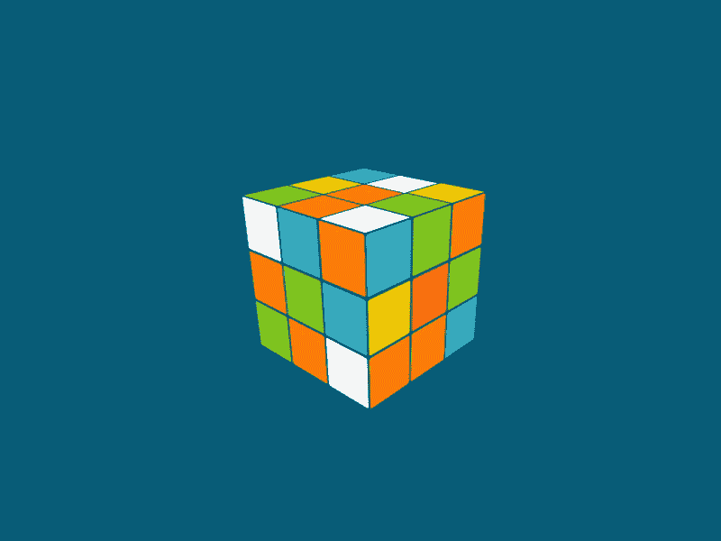
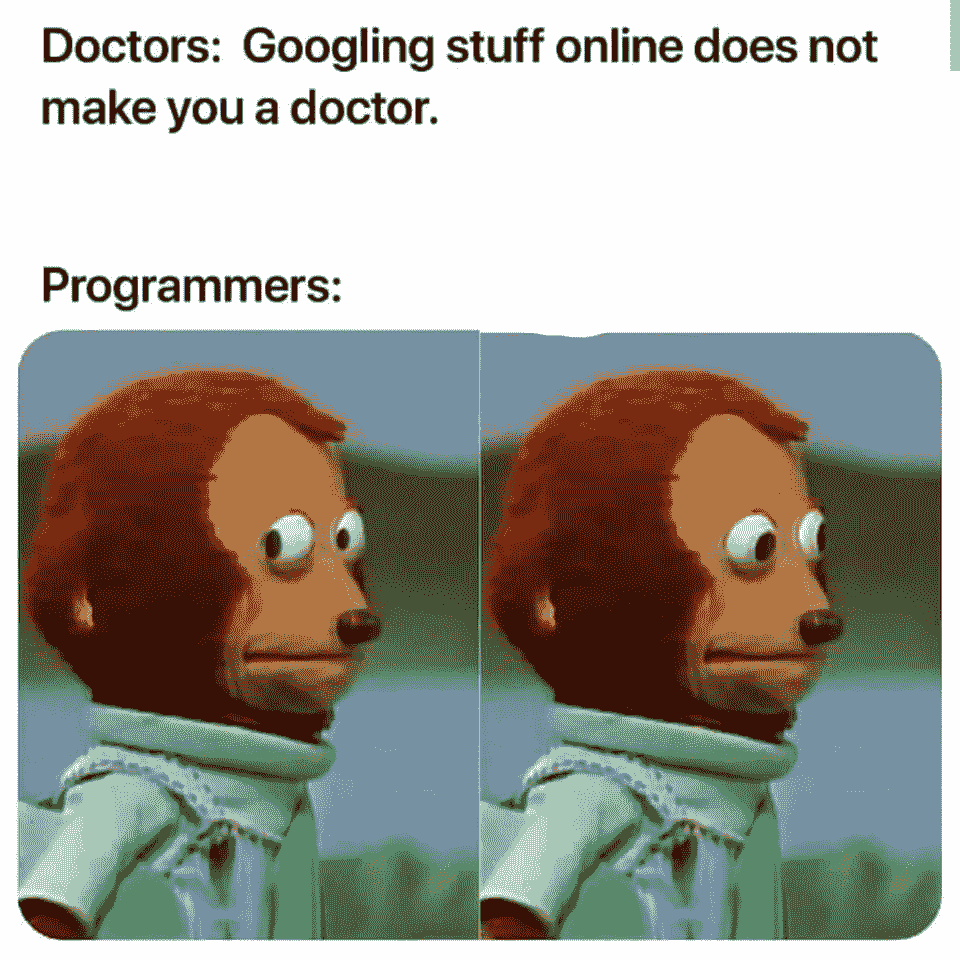

# 作为程序员如何掌握解决问题的能力

> 原文：<https://javascript.plainenglish.io/how-to-master-problem-solving-as-a-programmer-d16a0b8780ab?source=collection_archive---------3----------------------->

## 14 种练习解决问题的资源以及我是如何掌握技能的。

每个程序员都会在日常生活中解决一些问题。这不是人与生俱来的技能，解决问题可以像其他技能一样，随着时间的推移而掌握。

[John MacLeod’s](https://dribbble.com/wanderlayer) Rubik Cube GIF

通常一个好的程序员也意味着一个好的问题解决者。这种说法可能听起来很广泛，但它通常是正确的。

甚至马克·扎克伯格本人也同意我的观点。对吗马克？

GIF via [GIPHY](https://giphy.com)

> 编程就像其他运动一样。你可能知道规则，但你必须通过游戏来学习。—马克·扎克伯格

# 如何练习解题？

有许多方法可以练习解决问题，其中最流行的方法是解决编码挑战。这是我自己尝试过的，可以保证有积极的结果。

每天解决编码挑战真的可以增强解决问题的能力，让你在特定的编程语言中更加灵活。

很多人认为优秀的问题解决者是在编程语言方面有丰富经验的人。但这根本不是真的，有许多有经验的程序员承认他们从未尝试解决编程挑战。然而，他们使用了其他方法来锻炼和训练这块肌肉。

如果我必须用一句话来表达解决问题的方法，这就是它的样子。 ***不是知道怎么解决问题，而是你能想出多少办法来解决。***

## 我是如何掌握解决问题的技巧的？

在完成 Udemy 上的在线 JavaScript 课程后，我立即投入到解决挑战中。我对自己的技能非常有信心，认为自己能够解决每一个挑战。

但是哦，天哪，我错了，当我开始每天解决编码挑战时，一开始我是如此的失落。一个星期以来，我一遍又一遍地尝试，我不会很快放弃。

在开始的时候，解开答案真的很有诱惑力，我为这样做感到内疚。失败促使我打开它们，因为我迫切想知道如何解决它们。

每次打开溶液都会有同样的反应， ***“真的吗？有这么简单吗？为什么我解决不了？”*** 。

后来，当我在没有打开任何解决方案的情况下独自解决了几个挑战时，我意识到。我无法解决这些挑战，因为我只是坚持一种方法，而不是尝试多种方法。

另一个业余错误是，我拒绝用谷歌搜索东西。为什么？你会问，因为我认为我刚刚学了 JavaScript **我必须记住所有的东西。**

如果你有同样的想法，现在你知道这不是真的，我可以作为一个代码战争的战士向你保证，他在谷歌上搜索到了第三 kyu。

MEME via [r/ProgrammerHumor](https://www.reddit.com/r/ProgrammerHumor/)

# 用于培训的网站

## [代码大战](https://www.codewars.com)

代码战争是我开始解决问题之旅的地方。我喜欢它的原因是它的简单性和来自不同编程语言的程序员组成的庞大社区。

挑战被分为不同的级别，也称“kyu”-s，在你解决了一个挑战后，你可以看到其他人是如何解决它的。您也可以向上投票、向下投票，或在他们的解决方案下留言。

他们几乎支持任何编程语言。每一个挑战，也就是“卡塔”，都可以被翻译成 Codewars 支持的其他语言。

例如，假设您知道 JavaScript、TypeScript 和 Python。您会发现一个您非常喜欢的 JavaScript 挑战，但是它没有 TypeScript 或 Python 实现。你可以用 TypeScript 或 Python 来实现它，或者翻译它。

然后作者需要批准你的翻译，这不仅对作者有利，而且对整个“勇士”群体也有利，他们想解决武士刀，但不知道 JavaScript。

## [编码名称](https://www.codingame.com/start)

解决挑战的另一个有趣的方法是通过玩游戏来完成它们。是的，你会成为玩家，但是不像你通常的游戏，在这里你必须解决挑战才能玩。

换句话说，如果你不解决这个挑战，角色就什么都不会做。但是在这里，有一个双重的回报，你学习和实践新的令人敬畏的东西，同时玩和享受不同的故事情节。

## [LeetCode](https://leetcode.com)

LeetCode 是一个非常著名的网站，它提供了其他竞争者所做的一切，除了 CodinGame。我非常喜欢的一个很好的特点是他们在教授和测试你的技能的同时使用了特殊的积木。这些块包括数组 101、链表、二叉树等。

此外，它们还有高级功能，你可以在那里为苹果、谷歌、脸书、亚马逊等大型科技公司进行面试练习。

## [黑客银行](https://www.hackerrank.com)

对于任何级别的开发人员来说，这是另一个练习的好地方。您可以获得面试准备工具和挑战。此外，您可以对诸如 JavaScript、React、Python、SQL 等进行认证。

与代码战不同，你看不到其他用户的解决方案，但是你仍然可以和社区讨论挑战。

## [欧拉项目](https://projecteuler.net/about)

如果你是一个真正擅长数学的人，这是一个适合你的完美地方。与其他项目不同的是，在 Euler 项目中没有指定语言，所以由您自己决定，用您熟悉的任何语言来解决问题。

# 最后

像任何其他技能一样，解决问题需要时间和奉献来发展。

这里的要点之一是不要放弃，并建立一个解决问题的习惯，例如，每天解决 5-10 个挑战。

如果你真的想看到任何结果，你必须有一个常规。帮助我坚持日常生活的是以下事情:

*   **学习伙伴**
*   **记日记和做笔记**
*   **设定每天的具体目标**
*   不断地搜索和学习新东西

这些只是理解我如何坚持我的日常生活的一些一般想法，以及你可以从哪里开始。

解决问题不一定是一种负担，你需要享受这个过程，以便能够取得一些进展。这需要时间——就像生活中其他美好的事情一样，这不会在一夜之间发生。

如果你想建立一个关于你正在学习的编程语言的基础知识，你需要做以下四件事:

GIF via [GIPHY](https://giphy.com)

 [## 通过我的推荐链接加入 Medium-Ken Nersisyan

### 用媒介释放你的潜能。立即加入，阅读我和其他顶尖作家的文章。读书，学习，变得更好…

medium.com](https://medium.com/@kens_visuals/membership) 

# 更多资源

我上面提到的网站是我亲身体验过的，但还有很多需要探索，所以这里列出了其他网站，没有特别的顺序，来解决一些挑战。

 [## Coderbyte |代码筛选、挑战和面试准备

### 通过我们的 300 多个挑战库提高您的编码技能。

www.coderbyte.com](https://www.coderbyte.com/developers)  [## Topcoder 挑战列表| Topcoder 社区| Topcoder

### 浏览 Topcoder 上当前可用的挑战。

www.topcoder.com](https://www.topcoder.com/challenges?tracks[DS]=true&tracks[Des]=true&tracks[Dev]=true&tracks[QA]=true&types[]=CH&types[]=F2F&types[]=TSK)  [## CodeChef |竞争性编程|参与和学习| CodeChef

### 借助 CodeChef 的编码竞赛学习竞技编程。

www.codechef.com](https://www.codechef.com)  [## 练习

### 学习、练习并获得 50 多种语言的世界级指导。百分百免费。

exercism.org](https://exercism.org)  [## 环球在线法官

### SPOJ(球体在线裁判)是一个在线裁判系统，有超过 20000 个问题。

www.spoj.com](https://www.spoj.com)  [## Edabit //通过 10，000 多个交互式挑战学习编码

### 我们的小挑战是通过学习编码迷宫的捷径。

edabit.com](https://edabit.com)  [## Codier —前端编码挑战

### 探索和尝试 Codier 上的前端编码挑战

codier.io](https://codier.io)  [## Wolfram 挑战:Wolfram 语言的编程难题

### 用编程难题测试您的 Wolfram 语言编码技能。

challenges.wolfram.com](https://challenges.wolfram.com)  [## js 挑战者

### js 挑战者。免费 Javascript 挑战。通过解决编码练习在线学习 Javascript。

www.jschallenger.com](https://www.jschallenger.com/?ref=java5cript.com) 

## 我的其他文章

 [## 这是你开始写博客的标志

### 首先，让我告诉你，我不相信迹象，迷信，或任何这类事情。

medium.com](https://medium.com/@kens_visuals/this-is-your-sign-to-start-blogging-c9c39739ba65) 

## 让我们连接

 [## 在推特上关注我﹫kens_visuals

### 👨🏻‍💻👾

twitter.com](https://twitter.com/kens_visuals)  [## kens-视觉效果-概述

### 此时您不能执行该操作。您已使用另一个标签页或窗口登录。您已在另一个选项卡中注销，或者…

github.com](https://github.com/kens-visuals) 

*更多内容看* [*说白了. io*](http://plainenglish.io/) *。报名参加我们的* [*免费每周简讯*](http://newsletter.plainenglish.io/) *。在我们的* [*社区*](https://discord.gg/GtDtUAvyhW) *获得独家写作机会和建议。*