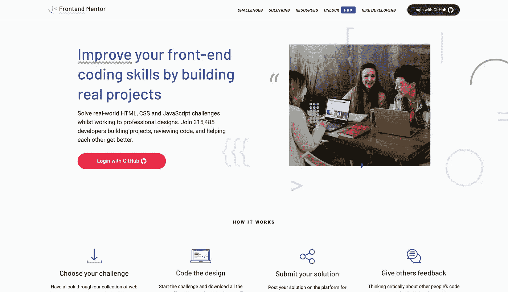

# 如何在 30 天内掌握 Web 开发

> 原文：<https://javascript.plainenglish.io/how-to-master-web-development-in-30-days-8f6d29237361?source=collection_archive---------5----------------------->

## 什么是前端导师，它如何帮助我练习技能并走出教程地狱？

Photo by [Jackson So](https://unsplash.com/@jacksonsophat?utm_source=medium&utm_medium=referral) on [Unsplash](https://unsplash.com?utm_source=medium&utm_medium=referral)

# 问题是

完成我的在线课程后，我陷入了教程地狱。我不断地在 YouTube 上寻找其他课程，免费的，付费的，到处都可以找到与 web 开发相关的课程。

我知道这不是一个好兆头，但与此同时，对失败和失望的恐惧正拖着我坐下来做我自己的项目。当你知道有人已经为你找到并“杀死”了所有的 bug 时，做一个项目的感觉很好。你所要做的就是坐在那里复制他们写的代码，安慰自己，“是的，我完全理解每一行代码”。

听起来耳熟吗？如果不是现在，你一定在某个时候到过那里。

好吧，让我们面对现实吧，除了一行一行地复制代码，你什么也没做。我不想成为那样的人，但那些项目不是你的。当你的朋友或潜在雇主问起时，你能声称这是你的工作吗？答案是*不*，(如果是*是*，那么你应该停止欺骗自己和他人🤨)

所以，在意识到这个课程/教程不会给我带来任何东西后，我开始寻找“现实世界的项目”来做。

我知道我不是一个设计师，当时我不想专注于学习 UI/UX 设计，只是为了让我的副业看起来很酷。然而，我坚信 UI/UX 很重要，因为无论你的代码有多好，或者它解决了什么样的复杂问题，如果用户不知道如何使用它，你的代码或问题解决者就没有什么价值。

除此之外，当你为你的投资组合构建这些项目时，你希望它们有些吸引力，而不仅仅是原始的 HTML 和 JS，上面还点缀着一些 CSS。

# 解决方案

因此，我想出了一个 [30 天网络开发挑战](https://github.com/kens-visuals/frontend-mentor)的主意，在那里我将尝试构建不同规模和难度的项目。然后，我开始在网上搜索，希望找到一些可能有一些设计的项目想法，这是我遇到 [**前端导师**](https://www.frontendmentor.io) **的时候。**

[**Frontend Mentor**](https://www.frontendmentor.io)’swebsite screenshot

对于问题*“这个平台是做什么的，它将如何帮助我？”*这是他们的回应:

> 我们提供前端挑战，包括专业的网页设计。这些可以让你在真实的工作流程中练习建立网站。接受这些挑战将帮助你提高技能，获得创建网站的经验，并建立一个令人难以置信的项目组合。我们也有一个很大的开发者社区，所以这是认识其他开发者的好方法！

WOAH Gif from [GIPHY](https://giphy.com/)

然而，我并不完全同意他们的答案，因为在我看来，无论你是前端、后端还是全栈开发人员，他们的挑战都将帮助你获得一些“真实世界”项目的实践。

我不同意的原因是他们没有给他们的项目设置任何限制。您可以用您喜欢的栈或技术构建任何项目。

例如，他们的最新挑战之一是一个[井字游戏](https://www.frontendmentor.io/challenges/tic-tac-toe-game-Re7ZF_E2v)项目，如果我有一些后端技能，我会增加一个在线多人游戏的能力。这只是我脑海中的一个例子。

从新手到大师，他们为每个人准备了 T2 挑战。每一个项目都有自己的挑战，例如:使设计具有响应性，或者为交互元素添加悬停状态。

我喜欢 Frontend Mentor 的另一点是，他们不提供解决方案。起初，这看起来很奇怪，但后来我意识到他们不是故意这样做的。想象一下，如果他们有“*官方解决方案*”部分，那会带来很多问题。

*   首先，每当你感到陷入困境时，你会忍不住跳入解决方案中，看看他们是如何做到的，这些项目的全部意义就会变得毫无意义。
*   第二，这将是一个不断争论和讨论的部分，不同意他们的“*官方解决方案*”的人会开始给他们发电子邮件，因为他们自己的信仰或经历而改变这个或那个部分。

因此，他们提供了解决这个问题的不同方法。截至 2021 年，Frontend Mentor 拥有超过 275，000 人的庞大社区。这些用户的解决方案不仅可以在他们的个人资料中找到，还可以在解决方案墙上找到，在那里你可以看到来自社区的每一个解决方案。

正如你可能已经从名字 Frontend **Mentor 中猜到的那样，**你可以用你的建议帮助其他人，或者你可以为你自己的项目提出具体的问题，人们会分享他们的经验或者帮助你解决你在项目中面临的任何困难。

帮助别人不仅在道德上是正确的，而且你还可以审查别人的代码。培养这种阅读不是你写的代码的技能会对你有很大帮助。

有一段时间，我更积极地为社区提供指导和建议。

Screenshot of my account in [**Frontend Mentor**](https://www.frontendmentor.io)

如你所见，也有一些徽章。如果您达到第一、第二或第三名，您可以获得这些徽章。有四个类别，或者我应该说是名人墙部分，在那里你可以在整个时间内达到某个位置，它们是，本周，本月，今年和空前。截至 2022 年 3 月，Frontend Mentor 每个月都有一些比赛，在那里你可以获得折扣或进入其他网站的溢价，以练习你的编程技能，如 [scrimba](https://scrimba.com) 。

值得一提的是，Frontend Mentor 中的大部分挑战都是完全免费的。然而，有一个专业版会给你一些额外的功能。(详见下面截图)

[**Frontend Mentor**](https://www.frontendmentor.io)’spro plan’s screenshot

此外，Frontend Mentor 正在建立一个新功能，招聘人员或公司将在其中寻找潜在的员工。他们正在建立一个名为 [*的新部门，雇佣开发者*](https://www.frontendmentor.io/hiring)*，在这里，来自世界各地的公司将能够在一个地方看到你所有的工作。当我说工作时，我不仅仅指那些完成的挑战，而是你为社区提供的帮助和你的徽章将是你努力工作和奉献的绝对证明。*

**

*Screenshot of [**Frontend Mentor**](https://www.frontendmentor.io)’s hiring page*

# *综上*

*这就是我如何走出教程地狱，并开始使用前端导师的挑战将项目添加到我的投资组合中。*

*我知道这听起来像付费广告，因为我说的只是一些好东西。因此，你不应该相信我的话，去报名吧——这是完全免费的，你可以自己试试。如果你有任何建设性的批评，你可以给他们发一封电子邮件，告诉他们你的问题或担忧。*

*在我忘记之前，这些不是唯一的挑战，它们在每个类别中都不断地被添加。这样你就不会缺少看起来很酷的项目，你可以自定义并制作自己的项目。他们也完全同意你以流媒体方式完成他们的挑战([阅读更多关于许可的](https://www.frontendmentor.io/faq))。*

*希望这是你旅程的开始，而不是马不停蹄的教程之旅。*

* [## 通过我的推荐链接加入 Medium-Ken Nersisyan

### 用媒介释放你的潜能。立即加入，阅读我和其他顶尖作家的文章。读书，学习，变得更好…

medium.com](https://medium.com/@kens_visuals/membership)* 

# *有用的资源*

* [## 前端导师的媒体博客

### 在 Frontend Mentor，我们通过构建真实的项目来学习。这里的文章将是关于一般前端善良，建设…

medium.com](https://medium.com/frontend-mentor)  [## GitHub-kens-视觉/前端-导师

### 前端顾问解决方案—我在一个回购中解决的所有项目👾。

github.com](https://github.com/kens-visuals/frontend-mentor)  [## 前端顾问|前端资源的精选列表

### 一个精选的免费资源列表，包括 HTML、CSS、JavaScript 等等。

www.frontendmentor.io](https://www.frontendmentor.io/resources) 

# 进一步阅读

 [## 作为程序员如何掌握解决问题的能力

### 14 种练习解决问题的资源以及我是如何掌握技能的。

javascript.plainenglish.io](/how-to-master-problem-solving-as-a-programmer-d16a0b8780ab)  [## Object.freeze()与 Object.seal()的简单对比

### 这两种方法的主要区别，简单地说就是并列。

javascript.plainenglish.io](/object-freeze-vs-object-seal-in-plain-english-813f27a71eb8)  [## 12 个前所未闻的背景模式资源

### 为你的下一个项目获得一些独特的背景图案。

bootcamp.uxdesign.cc](https://bootcamp.uxdesign.cc/12-unheard-background-pattern-resources-1f1041718ac6) 

# 让我们连接

 [## 在推特上关注我﹫kens_visuals

### 👨🏻‍💻👾

twitter.com](https://twitter.com/kens_visuals)  [## kens-视觉效果-概述

### 前端开发者| JS 爱好者|科技写手。kens-visual 有 61 个存储库。遵循他们的准则…

github.com](https://github.com/kens-visuals) 

*更多内容请看*[***plain English . io***](https://plainenglish.io/)*。报名参加我们的* [***免费周报***](http://newsletter.plainenglish.io/) *。关注我们关于*[***Twitter***](https://twitter.com/inPlainEngHQ)*和*[***LinkedIn***](https://www.linkedin.com/company/inplainenglish/)*。加入我们的* [***社区不和谐***](https://discord.gg/GtDtUAvyhW) *。**