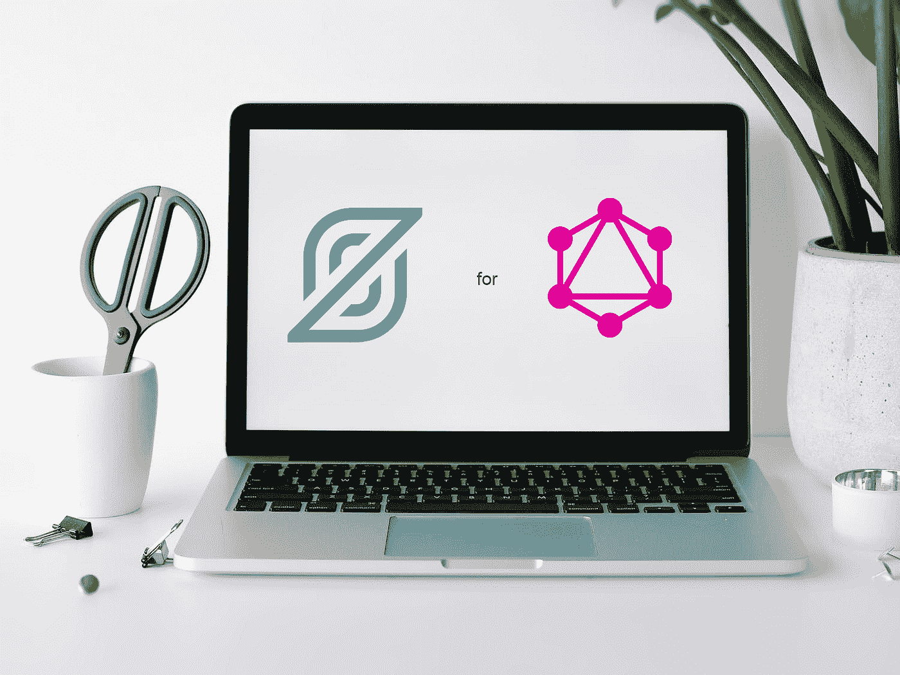
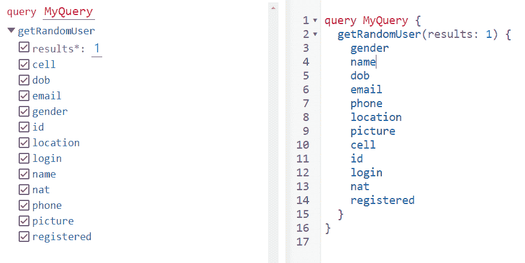
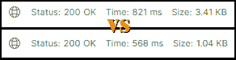
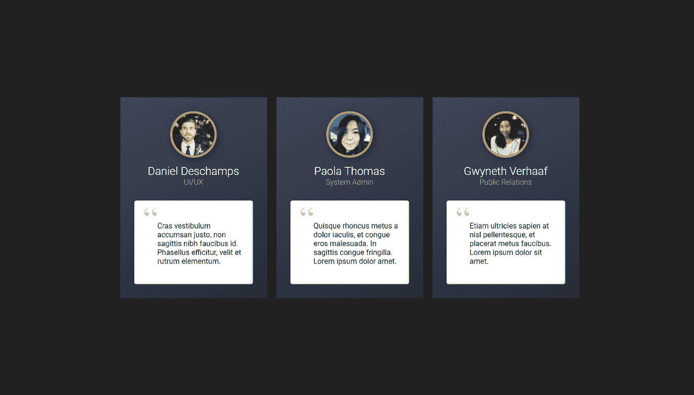

# 如何使用 StepZen 以智能的方式将 REST API 迁移到 GraphQL

> 原文：<https://javascript.plainenglish.io/how-to-migrate-a-rest-api-to-graphql-the-smart-way-with-stepzen-5e60b7908291?source=collection_archive---------11----------------------->

## 为什么 GraphQL 可能比 RESTful APIs 更适合您的下一个项目



Original Photo by [Ann poan](https://www.pexels.com/@ann-poan-3111643?utm_content=attributionCopyText&utm_medium=referral&utm_source=pexels) from [Pexels](https://www.pexels.com/photo/laptop-on-desk-near-lush-houseplant-5797997/?utm_content=attributionCopyText&utm_medium=referral&utm_source=pexels)

随着从单一应用程序的转变，REST APIs 已经成为标准化系统中不同移动部分如何协同工作和共享数据的首选方法。然而，REST 也是一个不灵活的、通常不明确的标准(它只是一组指导原则)，有几个架构和实现问题，并且已经被证明不能很好地适应现代客户的需求——数据密集型和快速变化的需求。

这正是 GraphQL 要解决的问题！带来灵活性和效率，并使处理大量数据变得轻而易举。

在本文中，我们将看看 GraphQL 如何比 RESTful APIs 更适合您的下一个项目，作为一个例子，通过使用免费工具 [StepZen](https://stepzen.com/) ，将现有的 REST API 转换为 GraphQL。

# GraphQL 如何改进 REST APIs

除了最简单的实现，REST APIs 的设计会导致客户端:

1.下载**比实际需要更多的**数据——因为 API 响应可能*也*包括对特定客户端无用的无关数据，

2.或者**不够**——导致客户端用更多的请求来敲打 API 服务器，以获取它需要的数据(第一个 get 获取 N 个结果+对这 N 个结果中的每一个**进行一次 GET，总共 1+N 个请求)**

无论哪种方式，我们都将面临服务器端和客户端的高带宽使用，这是一个坏消息，因为大多数网络应用消费都是在 4G/5G 上，即计量连接。

GraphQL 通过使用声明性查询语法解决了这些问题。由于使用 GraphQL API 的每个客户端都有能力指定他们需要的精确数据，该 API 只提供这些数据——不多也不少 **—** 极大地减少了有效负载的大小。此外，客户端实际上可以访问不同数据之间定义的关系，并且可以一次性获得所有关系，而不需要 1+N 请求，也不需要编程来批处理或并行化 API 调用。



Imagine REST APIs…that *also* let you transfer your SQL querying skills.

还有一些附带的好处:GraphQL 是严格类型化的，API 中公开的所有类型都在模式中定义。现在，您可以将前端与后端分离，因此前端团队可以通过模仿所需的数据结构来轻松测试他们的应用程序，后端团队可以设计出明确、单一的圣经，即模式。更好的是，*模式本身*可以作为 API 的文档，节省了大量的繁琐工作。

# 那么 StepZen 在哪里呢？

*太好了！那我们就什么都用 GraphQL 吧！*嗯，GraphQL *是*的牛逼，但它也是一项相对较新的技术，大多数公开的 API 都不支持它。将 REST API 迁移到 GraphQL 也不简单，而且会带来一些问题。

不要害怕，这是 StepZen 的救援！

简而言之，StepZen 是一个 GraphQL 抽象层，用于*您所有的*数据源，它在幕后做了大量的工作，使您可以非常容易地将关系数据库、REST APIs、其他 GraphQL APIs，无论您有什么，组合成一个单一的 GraphQL 端点，然后您可以在一个无服务器部署上托管它。

您将获得 GraphQL 的所有优势，并结合 StepZen 提供的“即服务”的所有优势—实时操作能力、监控、指标、缓存、服务器基础设施、可伸缩性、确保正常运行时间—为您节省大量时间来设置可伸缩、设计良好的高性能 GraphQL API。

# 案例研究:通过 StepZen 将 REST API 迁移到 GraphQL

因此，所有的方式，让我们看看我是如何利用 StepZen 在这里。我经常使用[randomuser . me](https://randomuser.me/)API——这是一种面向人们的 *lorem ipsum* 生成器——来模拟测试前端的数据。有一些方法可以解决它的 REST 特有的缺点，但是它们使我的 API 调用更加冗长和复杂，对于这样简单的东西来说，这是多余的。所以我通过 StepZen 将它迁移到 GraphQL，改善了响应时间并减少了近 70%的带宽使用！



Payload size difference between REST and GraphQL versions of the same API. This effect is amplified further in real-world projects where payload sizes can be in the MegaBytes range for each page of displayed results, and that’s not even counting infinite scrolling and static assets!

我的设置非常简单。我在 Express 上构建了一个 API 代理服务器，公开了一个端点，该端点代表我的前端调用 Randomuser.me API，在将结果发送回我的 React 应用程序之前对其进行整理和格式化。在真正的网站上，这只会从我的 MongoDB 存储中提取实际数据。



I get names, portrait image URLs, and use that data to mock up a testimonial page, for example.

## 步骤 0:先决条件

StepZen 提供了一个漂亮的命令行工具，可以让您快速构建和部署 GraphQL API。让我们用 npm 来获取它并进行全局安装，以确保我们可以使用它的 CLI 命令。

```
npm install -g stepzen
```

然后，使用以下信息登录:

```
stepzen login
```

…输入您的用户名，然后在出现提示时输入您的管理员密钥。

## 步骤 1:创建模式

💡StepZen CLI 提供了一种非常简单的方法，可以为您需要点击的每个 REST API 端点自动创建模式(`stepzen import`命令),但是首先，让我们以“普通”的方式来做，因为这将帮助您熟悉如何创建 GraphQL 模式。我们一会儿就回来讨论这个问题！

创建一个新的项目目录，给它起一个有意义的名字，在这个目录中，创建一个名为 **randomuser.graphql** 的新文件——这是您的模式文件。这是我们定义类型和查询的地方，为我们需要的每个 REST API 指定端点。

我们的具体用例非常简单，我们只需要点击 https://randomuser.me/api/的，可选地传入一个整数(表示我们希望生成的用户数量)作为查询参数。因此，我们的模式的内容将如下所示:

```
**./randomuser.graphql**
--------------------------------------------------------------------type User {
  gender: String!
  name: JSON!
  location: JSON!
  email: String!
  login: JSON!
  dob: JSON!
  registered: JSON!
  phone: String!
  cell: String!
  id: JSON!
  picture: JSON!
  nat: String!
}type Query {
  getRandomUser(results: Int!): [User!]!
  @rest(
    endpoint: “https://randomuser.me/api/?results=$results"
    resultroot: “results[]”
  )
}
```

> GraphQL 语法中的感叹号表示不可为空的字段。大括号表示我们期望用户类型的数组作为该查询的输出。

💡正如所承诺的，这里有一个简单的方法:通过简单的*导入*一个 REST API 端点，自动生成一个模式！

```
stepzen import curl [https://randomuser.me/api/?results=3](https://randomuser.me/api/?results=3) — query-name getRandomUser
```

这将为您创建一些文件和文件夹—最重要的是，自动生成的。curl 文件夹中的 graphql 模式文件，带有一个名为`getRandomUser`的查询，它接受一个数字作为输入——这正是我们想要的。

仅此而已，我们已经完成了！比自己编写模式简单得多，而且您可以进一步定制自动生成的模式，以更好地满足您的需求。

或者，您也可以使用 StepZen 的工具 [JSON2SDL](https://www.json2sdl.com/) 来为您处理模式创建。或者，简单地使用 StepZen 从 [GraphQL Studio](https://graphql.stepzen.com/) 中预先构建的模式之一。

最后，对于任何给定的项目，StepZen 还需要一个清单文件，这是一个名为 **index.graphql** 的文件，它将位于同一个目录中。它使用特殊的`@sdl`指令从所有指定的 GraphQL 文件中加载模式。如你所料，如果你有多个**。graphql** 文件，您可以将它们包含在这个数组中。

```
**./index.graphql**
--------------------------------------------------------------------schema @sdl(files: [“randomuser.graphql”]){
  query: Query
}
```

## 步骤 2:部署到云

我们完了！开始部署吧！

```
stepzen start
```

这将使用我们指定的数据源创建我们的 GraphQL API，并且——如果没有错误——将它部署到云中。您将被要求命名端点(CLI 提供了一个您可以更改的默认值)，一旦完成上传，它将为您提供您的端点 URL，以及您托管的 GraphQL API 的本地代理(您可以使用 GraphiQL GUI 进行浏览)。

## 步骤 API 代理服务器

我们现在处于最后冲刺阶段。剩下的工作就是在 **index.js** 构建我们的 Express 服务器，它代表我们的前端进行查询。

首先，依赖性。

```
npm i express axios dotenv
```

我们正在为我们的服务器获取 **ExpressJS** ，获取 **Axios** 来发出 HTTP 请求，获取 **dotenv** 来存储我们不想在源代码中公开的环境变量——比如我们的服务器端口号、StepZen ApiKey 和我们的 API 端点。(如果你使用的是像 GitHub 这样面向公众的源代码控件，不要忘记包含**。env** 文件在您的**中。gitignore** ！)

请注意，虽然我们可以访问用户类型的任何返回字段，但对于我们的用例，我们只需要名称和图片 URL，因此这就是我们将在 GraphQL 查询中指定的所有内容，为我们节省了大量带宽。因此，我们的 GraphQL 查询将如下所示:

```
query MyQuery {
  getRandomUser(results:3){
    name
    picture
  }
}--------------------------------------------------------------------
**./index.js**
--------------------------------------------------------------------const axios = require(“axios”).default;
const express = require(“express”);
require(“dotenv”).config();
const app = express();// RandomUser resource// for routes like /randomuser?results=3 (params optional)app.get(“/randomuser”, async (req, res) => {// GraphQL query (only names & pics)const body = JSON.stringify({
  query: `query MyQuery {
    getRandomUser(results:${req.query.results || 1}){
      name
      picture
    }
  }`,
});// calling our deployed GraphQL APIaxios({
  url: process.env.STEPZEN_GRAPHQL_API,
  method: “post”,
    headers: {
      “Content-Type”: “application/json”,
      “Content-length”: body.length,
      Authorization: “Apikey “ + process.env.STEPZEN_API_KEY,
      “User-Agent”: “Node”,
    },
  data: body,
}).then((response) => { res.send({
    result: “success”,
    users: response.data.data.getRandomUser,
  });
});});// no routes matchapp.use((req, res, next) => {
  const error = new Error();
  error.message = “Not found”;
  error.status = 404;
  next(error);
});// json error handlerapp.use(async (error, req, res, next) => {
  res.status(404).send({
    result: “failure”,
    error: error,
  });
});// create Express.js HTTP serverapp.listen(process.env.PORT || 3000);
```

> 请记住，标准的 GraphQL API 调用应该是 HTTP POST 请求，使用 application/json 内容类型，并包含 json 编码的主体(我们的查询)。

我们都完成了！启动我们的服务器，然后我们可以用 cURL、Postman 或诸如此类的工具测试它，看看我们是否得到了我们想要的数据。

```
**ExpressJS API response to a GET with query params ?results=3**
--------------------------------------------------------------------{
  “result”: “success”,
  “users”: [
  {
    “name”: {
    “first”: “Ivana”,
    “last”: “Morin”,
    “title”: “Madame”
    },“picture”: {
  “large”: “https://randomuser.me/api/portraits/women/29.jpg",
  “medium”: “https://randomuser.me/api/portraits/med/women/29.jpg",
  “thumbnail”:
    “https://randomuser.me/api/portraits/thumb/women/29.jpg"
  }
},{
  “name”: {
    “first”: “Mylan”,
    “last”: “Olivier”,
    “title”: “Mr”
  },“picture”: {
  “large”: “https://randomuser.me/api/portraits/men/25.jpg",
  “medium”: “https://randomuser.me/api/portraits/med/men/25.jpg",
  “thumbnail”: “https://randomuser.me/api/portraits/thumb/men/25.jpg"
}},{
 “name”: {
   “first”: “Josep”,
   “last”: “Gutierrez”,
   “title”: “Mr”
  },“picture”: {
  “large”: “https://randomuser.me/api/portraits/men/36.jpg",
  “medium”: “https://randomuser.me/api/portraits/med/men/36.jpg",
  “thumbnail”:   “https://randomuser.me/api/portraits/thumb/men/36.jpg"
}}]}
```

完美。对于为前端设计生成快速和肮脏的模型，这将工作得很好。

# 两全其美

GraphQL 非常强大和灵活，StepZen 凭借其强大的 CLI 工具、丰富的特性、针对大量数据源的预制模式和丰富的文档，使得实现 GraphQL 变得非常容易，并且可以满足您的所有开发需求。

StepZen 的 GraphQL-as-a-service 模型无疑是一个额外的抽象层，但由于 StepZen 从您(或您的组织的开发人员)的角度出发，负责开箱即用，所以您所做的只是定义数据的模式，描述您需要的 API 和 DB 调用，然后指导客户端应用程序开发人员简单地调用集中式 StepZen GraphQL 端点。

总而言之，StepZen 让开发者——无论是前端还是后端— *和*用户的生活变得简单多了，因为他们可以更快地获得更多数据。

*原贴于*[***plain English . io***](https://plainenglish.io/blog/how-to-migrate-rest-api-to-graphql-with-stepzen)*。*