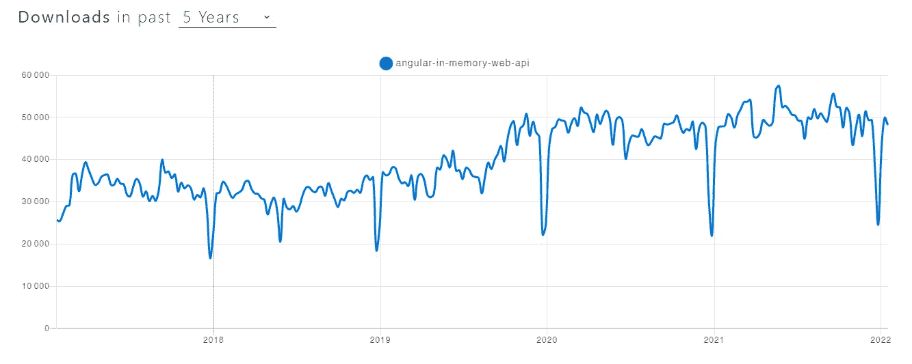

# 如何用 Angular 内存 Web API 模拟后端服务器

> 原文：<https://javascript.plainenglish.io/how-to-mock-a-backend-server-with-angular-in-memory-web-api-641d53d62e0d?source=collection_archive---------1----------------------->

## 包含源代码示例和 cats 的详细教程


我最近开始做一个 Angular 项目，后端的设置被推迟了。虽然 API 已经完全指定，但是开发工作进行得很晚。然而，我仍然需要开始工作的角度应用程序。我们需要一种好的方法来模拟与后端服务器的交互。

# 硬编码数据是不好的

不用想太多，我们可以诚实地开始处理硬编码数据。然后，一旦 API 准备就绪，我们就可以将我们的应用程序插入其中。这种方法不是最好的，原因如下:

1.  设置它需要一些工作。如果您正在处理一个简单的 GET 调用，那么读取您的数据将会很容易。但是如果你想更新数据，添加一些认证 HTTP 头，或者甚至想看看当 API 很慢的时候会发生什么呢？当然，你可以手动完成所有这些。但是这需要付出大量的努力，而不涉及应用程序的实际特性。
2.  **对后端 API 的依赖性仍然很强**。我们的目标是使这种依赖性尽可能小。然后，一旦实际的 API 准备好被集成，我们就可以不用期待太多的惊喜了。硬编码数据意味着您必须考虑所有可能的输出，这要么会导致大量的工作(见第 1 点)，要么会导致您忘记事情。这意味着在 API 准备好之后，您将需要更多的时间来适应。

在本文中，我想介绍 Angular 内存 web API 库，这是我们在项目中最终使用的解决方案。这个库通过拦截应用程序中的所有 HTTP 调用并返回一些您定义的数据来工作。它非常适合我们需要做的事情！如果你看过官方的角度文档，你可能已经知道了，因为在[那一章](https://angular.io/guide/http)中提到了它。它已经存在很长时间了，但是今天仍然有很多人下载。我将介绍一个演示应用程序，它将在我的 Github 上可用。



Angular in memory web api download data from [npmtrends](https://www.npmtrends.com/angular-in-memory-web-api)

# 什么时候使用 Angular 内存 Web API？

我个人的用例是何时使用它的完美例子。当前端团队可以开始一个项目的工作时，API 还没有完全准备好，但是已经指定了。在我们开始本教程之前，这里还有一些这个库可以有所帮助的情况。

当你想做一个快速的概念验证时，你可以使用这个库来专注于前端，然后处理后端。您可以包括更新和删除操作，它将像您有一个真正的服务器一样工作。

此外，因为它是一个模仿库，所以对于测试来说，它可以派上用场。当然，您可以在您的单元测试中使用它，但是也可以在您的 CI 中的端到端测试中使用它。因此，您可以在不影响真实数据库的情况下执行更新和删除操作。

# 在项目中设置 Angular 内存 Web API

为了演示如何使用这个库，我将构建一个显示关于猫的信息的应用程序。我将依赖于 [Cat API](https://thecatapi.com/) ，并认为一些端点还没有准备好被消费，以模拟现实生活中的例子。

关于终点，我们将有:

*   这将返回具有其特征的猫品种列表。
*   `[/images/search](https://docs.thecatapi.com/api-reference/images/images-search)`这将返回与您的请求相匹配的猫图像列表。

我用 Angular CLI 设置了我的应用程序。

```
ng new cat-demo
```

然后我就可以安装库了。

```
npm i angular-in-memory-web-api
```

需要注意的是，如果您的应用程序正在生产中，您应该添加`--save-dev`标志。你不应该依赖这个库来生产，因为它不是为它而生的。

现在我们已经安装了库，我们可以开始致力于我们的 Angular 服务来检索所有的猫品种。API 文档为我们提供了一个示例和实际数据将遵循的模式。使用提供的信息，我构建了一个`Breed`实体类和我的`CatService`。

但是等等，我们不是应该嘲笑服务吗？我们是。但这就是嘲讽的美妙之处。你按照你希望的方式编写代码。**你不应该在意数据还不可用的事实**。这是嘲讽图书馆的工作。

所以让我们开始定义我们的模拟数据。首先，我创建了扩展库提供的`InMemoryDbService`的`InMemoryCatService`。我们需要为名为`createDb`的方法提供实现。这种方法非常灵活，因为它可以返回:一个可观察的，一个承诺，甚至一个对象。我保留了第一个例子的基本实现:

这里有一点需要注意。要在内存数据和 HTTP 调用之间建立链接，需要将集合命名为与 API URL 的最后一部分相同的名称。在我的例子中，我将数组包装在一个**品种**属性中。这与我的 API URL**/breeds**相呼应。

最后，让我们将库导入到我们的应用程序中。

在 Angular 提供的`HttpClientModule`之后导入`HttpClientInMemoryWebApiModule` **很重要。我已经使用了变量`environmment.production`来决定我是否想要这个库。与前面的`--save-dev`一样，如果您的应用程序在生产中，您不应该包含这个库。这是一个很好的过滤方法。**

然后，我创建了一个非常基本的组件，将列出并显示所有的猫品种，这就是我得到的。


这是我们在模拟服务中包括的三个品种。如果您打开控制台中的 network 选项卡，您将会看到没有 HTTP 调用发出，它被拦截了。

# 一些有用的配置选项

## 向角度内存 Web API 添加延迟

让我们假设一旦我们使用真实数据，这个呼叫将会很长。如果在用户等待时显示一个微调器就太好了。在我们的模拟中模拟延迟将有助于前端团队设置微调器，但也有助于测试团队感受真实的条件。

要添加延迟，只需将 options 对象添加到模块导入中。然后你需要设置`delay`属性。该值以毫秒为单位。


现在，我们可以真正看到我们的旋转。

## 绕过对某些 URL 的模仿

另一个有用的配置属性是绕过模拟的能力。让我们通过在应用程序中实现大图片特性来说明这一点。在这个场景中，我们希望使用 mock 来检索所有的猫品种，但是我们希望使用真正的 API 来进行图像搜索。首先，我将 HTTP 调用添加到我的服务中，就像以前一样。

然后，我只需将该调用插入到我的组件中，它就会打开一个新的选项卡，显示所选品种的图片:

现在，如果我测试我的应用程序，我得到一个奇怪的错误。很奇怪，因为它显示 404 没有找到，但当我复制并粘贴在我的浏览器的网址，它的工作。


其实是完全正常的。默认情况下，库将试图通过 mock 解析所有内容，如果数据不在其中，将返回一个错误。为了允许它绕过未知的 URL，您可以将`passThruUnknownUrl`设置为 true，如下所示。

现在如果我再次测试我的应用程序:


# 高级用例:使用 Angular 内存 Web API 进行多个集合、查询字符串和自定义请求解析

在我们结束本教程之前，让我们试着模仿图像搜索 API。有一些与之相关的挑战，我们将一一介绍，为您提供一个很好的示例:

1.  我们已经有一个品种的模拟，我们打算保持原样。
2.  端点的 URL 是[https://api.thecatapi.com/v1/images/search](https://api.thecatapi.com/v1/images/search)，所以默认行为(将集合中的对象名映射到 URL 的最后部分)在这里不起作用。
3.  这个 API 接受一个查询字符串作为参数。我们需要在模拟中考虑到这一点。

首先，让我向您展示图像实体类。这是我以前调用真正的 API 时使用的。

由此，我可以向我的模拟服务添加一些数据，以包含一些猫的模拟图像。

我还将把`passThruUnknownUrl`设置回 false，因为这一次我想让所有东西都通过我的模拟。当我这样做时，我得到了一个 404 错误，这并不奇怪。该库无法在我的图像对象和我的 HTTP 调用之间建立链接。

为了帮助库完成这个链接，我们可以在服务中定义一个定制的 URL 解析器。这可以通过在模拟服务中覆盖方法`parseRequestUrl`来实现。

该方法有两个输入:

*   `url`截获的一串网址
*   `utils`实用方法的接口

这个方法必须返回一个`ParseRequestUrl`或`undefined`。我们的目标是将不符合默认模式的 URL 转换成符合默认模式的 URL。换句话说，按照我的例子，我们想把那个`/images/search`转换成`/images`，这样库就可以做链接了。在我的模拟服务中，我添加了以下方法:

这是非常基本的。我只是做了一个字符串替换，并把它解析成一个新的请求 URL。

如果我再测试一次，我去掉了 404，但是图像数组总是空的。我们应该注意查询字符串。

为了处理查询字符串，库将在我们的集合中查找与所提供的查询字符串相匹配的属性。例如，当我们点击第一只猫时，我们会称它为:[https://api.thecatapi.com/v1/images/search?breed_id=bsho](https://api.thecatapi.com/v1/images/search?breed_id=bsho)。该库将遍历所有图像，并寻找属性`breed_id`等于“bsho”的图像。我们可以将该属性添加到 Image 类中，然后用参数完成我们的模拟。这是可行的，但这将违背我们迄今为止所尊重的一个原则。**处理特性的代码不应该关心数据被篡改的事实。**在真实的 API 中，图像没有 breed_id 参数，所以如果我们添加它，我们正在修改我们的代码以适应 API 被嘲笑的事实。

通过尊重原则来解决这个问题的一个简单方法是使用继承。我们可以创建一个`ImageMocked`类来扩展我们的实体。这样,“业务”实体就不会移动并遵守 API 提供的规范。当然，这个例子只有一个参数，但是你可以把它应用到任何你想要的参数上。

我们最后的服务看起来像这样:

模拟服务将返回一个`ImageMocked`,允许库按照猫的品种过滤图像。

非常感谢你把这篇文章看完！我发现这个库功能强大、灵活且易于使用。我真的觉得一般来说，Angular 和前端开发人员应该更多地使用嘲讽。我希望这篇文章能对这个方向有所帮助。

我的 GitHub 上有完整的代码:

[](https://github.com/aurelien-leloup/cat-demo) [## GitHub-aurel ien-le loup/cat-demo

### 此项目是使用 Angular CLI 版本 13.1.3 生成的。npm 安装然后 npm 运行开始项目将…

github.com](https://github.com/aurelien-leloup/cat-demo) 

*更多内容看* [***说白了。报名参加我们的***](http://plainenglish.io/) **[***免费周报***](http://newsletter.plainenglish.io/) *。在我们的* [***社区获得独家访问写作机会和建议***](https://discord.gg/GtDtUAvyhW) *。***