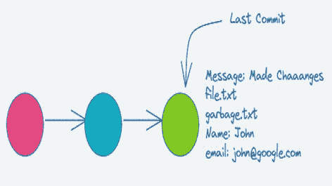
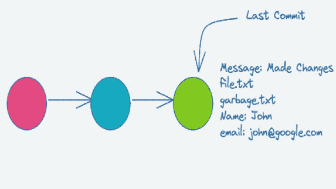
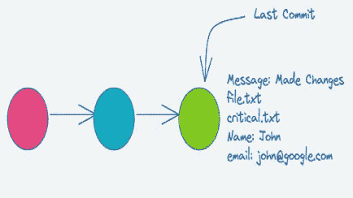
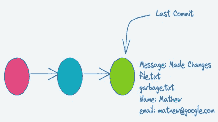

# 如何修改您的 Git 提交

> 原文：<https://javascript.plainenglish.io/how-to-modify-your-git-commits-3d01300e2ad7?source=collection_archive---------13----------------------->

## 搞砸自己的承诺是很常见的。了解如何修改 Git 提交。



我们都遇到过这种情况:您刚刚提交了一个文件，却发现自己在提交消息中打错了字，或者错过了将一个关键文件添加到提交中。

当然，你可以撤销提交或者重新提交来纠正错误，但是你可以做得更好。

让我们看看如何使用`--amend`修复不同的场景。

## 1.更新提交消息

假设您提交了一个请求，然后意识到提交消息中有一个打字错误或者不清楚。您可以使用以下命令更新提交消息。

```
git commit --amend -m “Made Changes” 
```



## 2.从提交中添加/删除文件

要在提交中更改文件，首先使用`git add`添加您想要包含的文件

```
git add critical.txt
```

如果你想从提交中删除一个文件，你可以使用`git rm`

```
git rm garbage.txt
```

一旦您完成了文件的添加/删除，您就可以使用下面的命令更新您的提交了。

```
git commit --amend --no-edit
```

`--no-edit`表示提交消息不变。



## 3.更新作者的姓名和电子邮件

通常，当您第一次设置 Git 时，您会设置作者的姓名和电子邮件，这样您就不必在每次提交时都担心这个问题。

假设您忘记了进行设置并执行了提交。您可以使用下面的命令用作者的详细信息更新提交

`git commit --amend --author "Mathew mathew@google.com"`



在我们结束之前，一个好的经验法则是，如果您的提交没有改变任何代码行为，`--amend`可能是一个好的选择。如果你仍然不确定，问问你的高级开发人员他们更喜欢什么。

我希望你已经发现这是有用的。感谢您的阅读。

*更多内容请看*[***plain English . io***](https://plainenglish.io/)*。报名参加我们的* [***免费周报***](http://newsletter.plainenglish.io/) *。关注我们关于*[***Twitter***](https://twitter.com/inPlainEngHQ)[***LinkedIn***](https://www.linkedin.com/company/inplainenglish/)*[***YouTube***](https://www.youtube.com/channel/UCtipWUghju290NWcn8jhyAw)*[***不和***](https://discord.gg/GtDtUAvyhW) *。对增长黑客感兴趣？检查* [***电路***](https://circuit.ooo/) *。***