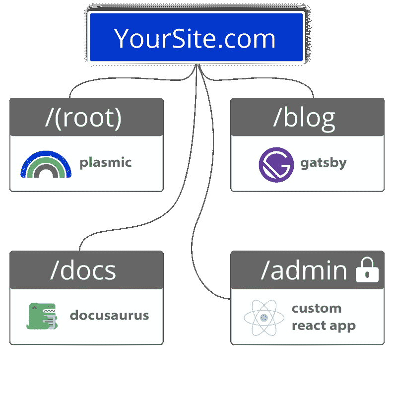

# 如何模块化您的 Monolith 前端，按照您的步伐过渡

> 原文：<https://javascript.plainenglish.io/how-to-modularize-your-monolith-frontend-transition-at-your-pace-18ee59ca27c4?source=collection_archive---------9----------------------->

## 如果你有一个单片前端，想把它分成更小、更容易使用的部分，我们将展示如何做。

成为前端不可知论者意味着没有狗参加比赛。这意味着能够支持任何一种架构。

单片或微型前端:两者都有一些优点。

对于 monolith 来说，这是多年来网站建设的标准方式。因此，对于一些实体来说，保持他们多年来使用的东西似乎是一条出路。

正如人们所说，认识的魔鬼比不认识的魔鬼好。

(鸣谢:n-ix.com)

## 独石的好处

好处中，大多数集中在这样一个事实上，即一个整体是完全由一个容器组成的。(这也有不好的一面，我们稍后会解释。)

如果所有东西都在一个集装箱里(问迈克？)，表示一切都在一个地方。这可以使做一些事情变得更简单。

monolith 开发起来很简单——也很直接——因为所有东西都在一个代码库中。每个开发网站的人都使用一个代码库，而不是像微前端那样使用多个代码库。

按照同样的思路，monolith 易于部署，因为它是一个集中式的代码库和存储库。

继续说，端到端测试很简单，因为它都是一个代码库。这意味着它也是在同一个 JavaScript 框架中构建的。

最后，正如我们之前所说的，monoliths 是行业标准，也是多年来网站建设的方式。这意味着他们被认为比微前端更值得信赖。

## 巨石柱的缺点

一个代码库是伟大的，除了当它不是的时候。

这正是代码库爆炸的时候——或者随着时间的推移逐渐增长——变成难以管理和难以处理的东西。这意味着有成千上万行代码，当出现问题时，要搜索这些代码来找到错误并修复它。

因此，这样一来，monoliths 在开始时可能更容易开发，但是随着代码的增长，令人头疼的问题也随之而来。

另一个缺点是可伸缩性问题。为了改变网站的一部分——比如说博客——开发者必须更新整个网站。在微前端中，自治团队可以更新站点的任何部分，而不会被另一个团队“阻止”。而且，[微前端](https://www.fathym.com/blog/articles/2022/april/2022-04-29-scale-as-you-grow)的扩展更容易，因为它们的模块化和运行它们的独立团队。

最后，缺乏灵活性是一个巨大的缺点。在一个 JavaScript 框架中构建所有内容在开始时更容易，但是随着时间的推移，会出现新的版本和升级吗？这意味着升级整个网站，这可能真的很乏味。类似地，如果你的网站是用棱角来建造的，几年后你可能会开始听到关于苗条的好消息，并希望你是在那个框架下建造的。在 monolith 中，你不能只是将新技术注入旧架构，但你可以用微前端。

## 一次分解一块巨石

这就是微前端或模块化的用武之地，它会慢慢分裂或溶解单片前端。

也许之前的例子听起来是真的，你想试试 Svelte——在 Stackoverflow 的 2021 年调查中，它被开发人员评为[最受欢迎的 JavaScript 框架——现在你可以了。](https://www.fathym.com/blog/articles/2022/april/2022-04-13-micro-frontend-popularity)

所以，如果你从一个整体开始，想要打开一个定价页面，开发者需要使用一个子域。相反，在我们这里，你可以简单地使用"yoursite.com/pricing"。

这些不是你爷爷的微前端。我们在您的域中独立托管每一条路由。

对于最终用户，所有的途径(定价、文档等。)似乎一切都是在同一个框架中编写的。但是，最终用户不知道它是否有反应、角度等。这为开发人员提供了使用新技术的可能性，并根据每个页面/网站的需要进行更好的调整。

从整体到微前端的一个好方法是从小处着手，按照自己的速度过渡。如果你还在使用 monolith，并且你的主机是 Fathym，你可以从一次打开一个页面开始。这使您可以从小处着手，并按照自己的速度沿着模块化的道路继续前进。

## 在这里观看如何模块化你的独石

[你可以在这里看到如何做到这一切。](https://medium.com/@rich.kurtzman/watch-learn-how-to-modularize-your-monolith-4f928549d514)

【https://www.fathym.com】最初发表于**。**

**更多内容请看*[***plain English . io***](https://plainenglish.io/)*。报名参加我们的**[***免费周报***](http://newsletter.plainenglish.io/) *。关注我们关于*[***Twitter***](https://twitter.com/inPlainEngHQ)*和*[***LinkedIn***](https://www.linkedin.com/company/inplainenglish/)*。查看我们的* [***社区不和谐***](https://discord.gg/GtDtUAvyhW) *加入我们的* [***人才集体***](https://inplainenglish.pallet.com/talent/welcome) *。***