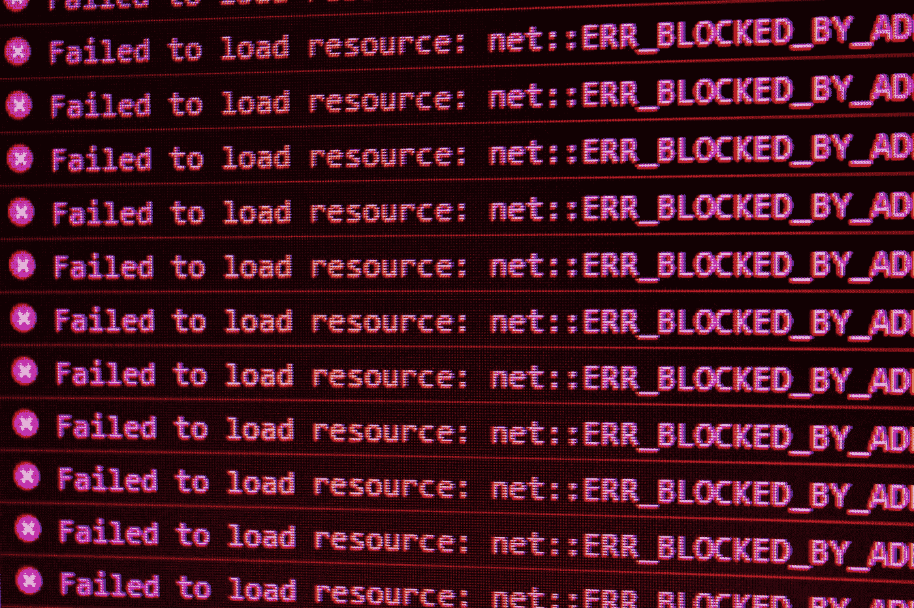

# 如何监控 Web 应用程序中的错误？

> 原文：<https://javascript.plainenglish.io/how-to-monitor-errors-in-a-web-app-f14ff18f5ac3?source=collection_archive---------9----------------------->

## 错误监控是一剂良药



Photo by [David Pupaza](https://unsplash.com/@dav420?utm_source=medium&utm_medium=referral) on [Unsplash](https://unsplash.com?utm_source=medium&utm_medium=referral)

当我们编写的 web 应用程序出现错误时，我们需要一些措施来报告这些错误。但是浏览器并没有统一的 API 来监控所有的错误，所以本文将为大家介绍几种常见的错误监控方法。

# 试着…接住

`try...catch`语句标记了一个`try`块和一个`catch`块。如果`try`块中的代码抛出异常，那么`catch`块中的代码将被执行。

但是它只能捕捉同步运行时错误。**语法错误和非等待异步错误不会被捕获。**

# window.onerror

`window.onerror`只能捕捉那些 JavaScript 运行时错误，除了那些发生在 Promises 中的错误。这是一个非常老的 API，可以在 IE 环境中使用。

下面是它的语法:

```
window.onerror = function(message, source, lineno, colno, error) {}
```

*   `message`:错误信息(字符串)。可作为`event`(原文如此！)在 HTML `onerror=""`处理程序中。
*   `source`:引发错误的脚本的 URL(字符串)
*   `lineno`:出现错误的行号(数字)
*   `colno`:发生错误的行的列号(数字)
*   `error` : [错误对象](https://developer.mozilla.org/en-US/docs/Web/JavaScript/Reference/Global_Objects/Error)(对象)。如果没有相应的错误对象，可能是`null`。

当该函数返回 true 时，默认事件处理程序将被阻止触发，并且不会向控制台输出任何错误。

# window.addEventListener('error ')

`window.addEventListener`不仅可以捕获`window.onerror`的错误，还可以捕获网络请求错误或资源(如`[](https://developer.mozilla.org/en-US/docs/Web/HTML/Element/img)`或`[<script>](https://developer.mozilla.org/en-US/docs/Web/HTML/Element/script)`)加载错误。

但是由于来自网络请求和资源加载的错误不会冒泡，因此需要在捕获阶段对它们进行监控。即`[addEventListener](https://developer.mozilla.org/en-US/docs/Web/API/EventTarget/addEventListener#parameters)`的第三个参数需要设置为 true。

比如下面这个简单的例子:

```

<script>
  window.addEventListener(
    'error',
    (error) => {
      // Event {isTrusted: true, type: 'error', target: img, …}
      console.log('error: ', error);
    },
    **true**
  );document.querySelector('img').src = '/test.png';
</script>
```

# element.onerror

对于特定的元素，我们也可以绑定一个`onerror`处理程序。

下面是一个简单的例子:

你可以看到这两个错误的`currentTarget`是不同的。

# window . addevent listener(' unhandled rejection ')

尽管您可以为每个承诺配置`.catch`或错误处理回调，但总有您错过的时候。那么我们需要一个统一的方法来捕捉承诺错误。

上面的方法都不能捕获 Promise 错误。浏览器为我们提供了`unhandledrejection`事件来捕捉承诺中出现的错误。

下面是它的语法:

```
window.addEventListener('unhandledrejection', (event) => {
  const { promise, reason } = event;
});
```

注意回调中的`[event](https://developer.mozilla.org/en-US/docs/Web/API/PromiseRejectionEvent)`，它有以下两个属性:

*   [承诺](https://developer.mozilla.org/en-US/docs/Web/API/PromiseRejectionEvent/promise):被拒绝的 JavaScript `[Promise](https://developer.mozilla.org/en-US/docs/Web/JavaScript/Reference/Global_Objects/Promise)`。
*   [原因](https://developer.mozilla.org/en-US/docs/Web/API/PromiseRejectionEvent/reason):表示承诺被拒绝原因的值或`[Object](https://developer.mozilla.org/en-US/docs/Web/JavaScript/Reference/Global_Objects/Object)`，传递给`[Promise.reject()](https://developer.mozilla.org/en-US/docs/Web/JavaScript/Reference/Global_Objects/Promise/reject)`。

当你不希望这种错误输出到控制台时，那么你可以在回调里面调用`event.preventDefault();`。

下面是一个简单的例子:

# 结论

为了达到预期的效果，可能需要结合使用上述几种错误捕获方法。但是`window.addEventListener('error')`包含了`window.onerror`可以捕捉的错误，建议先用前者。

今天就到这里。我是 Zachary，我将继续输出与 web 开发相关的故事。如果你喜欢这样的故事，想支持我，请考虑成为 [*中等会员*](https://medium.com/@islizeqiang/membership) *。每月 5 美元，你可以无限制地访问媒体内容。如果你通过* [*我的链接*](https://medium.com/@islizeqiang/membership) *报名，我会得到一点佣金。*

你的支持对我来说非常重要——谢谢。

*更多内容请看* [***说白了就是***](https://plainenglish.io/) *。报名参加我们的* [***免费每周简讯***](http://newsletter.plainenglish.io/) *。关注我们* [***推特***](https://twitter.com/inPlainEngHQ) *和*[***LinkedIn***](https://www.linkedin.com/company/inplainenglish/)*。查看我们的* [***社区不和谐***](https://discord.gg/GtDtUAvyhW) *加入我们的* [***人才集体***](https://inplainenglish.pallet.com/talent/welcome) *。*