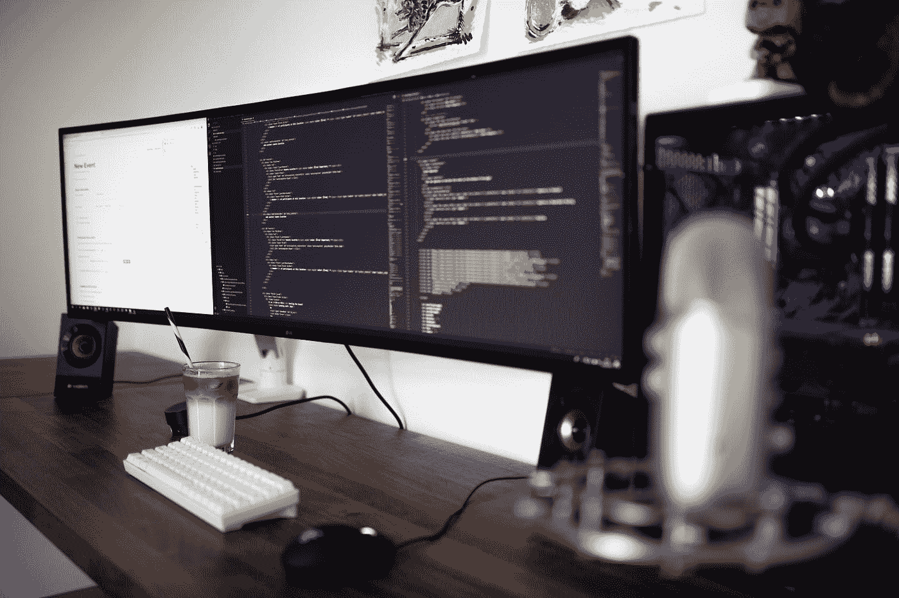

# 当你是一个新手程序员时，如何不成为一个新手程序员

> 原文：<https://javascript.plainenglish.io/how-to-not-be-a-newbie-programmer-when-youre-a-newbie-programmer-86e6250678d8?source=collection_archive---------13----------------------->

## 当你开始的时候，避免这些错误。

Photo by [Caspar Camille Rubin](https://unsplash.com/@casparrubin?utm_source=medium&utm_medium=referral) on [Unsplash](https://unsplash.com?utm_source=medium&utm_medium=referral)

每个人都从某个地方开始他们的编程冒险，如果您已经开始了，那么恭喜您！你已经向成为一名优秀的程序员迈出了第一步。

编程是将你的想法变成产品的一种超能力。

这很难，但同时也很有趣。每当你解决一个问题或开发一项新功能时，你都会注射多巴胺。

但是，在开始学习编程时，有一百万种方法会出错。这会让你沮丧，你甚至会考虑辞职。

编程意味着乐趣，擅长编程的人就是这样做的。如果你能记住一些提示，你可以让这个过程更顺利。

# 1:始终坚持一次做一件事

当我试图学习新技能或从事一个需要我学习各种技能的项目时，我会专注于一项任务并解决它。

编程中的每一个领域都是巨大的。你可以学的东西太多了。但是，好的一面是你不需要知道所有的事情。

**把你的要求和兴趣分解成更小的部分，一次专注于一件事。**

它将使你免于被编程所提供的无止境的一系列主题所淹没。

# #2:不要在计划之前就开始写代码

就像在好莱坞电影里一样，开始敲打你的键盘是很诱人的。

然而，如果你这样做，你就是在给自己设置不好的练习。

在输入一行代码之前，先分析问题以及如何解决它。

无论是一个简单的编码挑战还是一个复杂的项目，**在你开始编码之前在纸上计划将帮助你分析不同的场景。**

它会帮助你清晰地思考，看到高层次的画面。

当你直接进入你想到的第一个解决方案时，你可能会忽略或避免可能发生的逻辑错误。

最重要的是**对你的程序将如何工作有一个高层次的理解。**

现在你可以回去看你的电影，像专业人士一样开始编码了。

# #3.不要试图记住代码

你是在死记硬背代码，还是在谷歌上浏览记忆代码的技巧？

在那里停下来。

当你开始死记硬背时，你就违背了编程的核心。

编程是关于逻辑的，把逻辑放进代码中，并从中创造出优雅的东西。

许多人没有意识到**记忆代码类似于填鸭式的教学，这会中止学习过程。**

**程序员有一个特定的思维过程**，必须通过代码实践来开发。

富有创造性，掌握语言的基本结构和模式，并构建您的代码；开始几次你可能会失败。

但是即使是尝试和失败的过程也会帮助你成长。它教会你如何像程序员一样思考，建立一个思考过程。

# #4.知道你是否评论过度

许多初学者挣扎于过度评论，即使他们不是。其他人未能评估他们的评论是否只是弄乱了代码。

首先也是最重要的，如果你的注释看起来是你已经可以理解的代码的重新措辞的英文版本，你可能注释过度了。

对你的代码进行评论是必要的，但是你需要以正确的方式去做

*   确保你的**评论简洁而中肯。**
*   尝试给函数、参数和变量起一个不言自明的名字**。**
*   不要包含明显的评论。
*   不要害怕评论，只要它们是有帮助的，不要阻塞代码。

# #4:学习如何谷歌

许多新人低估了搜索任何东西是程序员工作的一部分的程度。

大多数程序员都会同意，知道谷歌什么比记住事情本身更重要。

**学习如何有效地使用谷歌。**

# #5.不要复制代码

…除非你自己知道怎么做。

抄袭他人的代码会阻碍你的思维过程，减缓你的成长。

假设你被一个问题卡住了，而你的解决方案不起作用。

不要从网上复制解决方案，**试着剖析为什么你的解决方案行不通，以及你如何修复它。**

花时间在你的代码上并分析它，即使你不能纠正它，也能使你成为一个比复制解决方案好得多的开发人员。

**懂得时间的权衡。**假设你已经花了相当多的时间在你的代码上，却什么也弄不明白。既然如此，不如去搜索研究别人的代码。

**研究。不是复制。**

# #6.不要放弃

作为编程新手，你经常不知道什么是难的，什么是容易的。

有些情况下，我发现对你来说很容易的困难的事情，而对你来说很复杂的事情可能会直接发生在我身上。

当你有困难的时候，不要灰心丧气。

最终这一切都是值得的。

事情开始时很难，但随着时间的推移，事情会变得容易起来。

如果你是新来的，喜欢这篇文章，在 Medium 上还有很多这样的文章。你可以注册阅读它们，每月只需 5 美元。

[**这里是无限制访问媒体上每一个内容的链接。如果你用这个链接注册，我会赚一小笔钱，不需要你额外付费。**](https://arpitfalcon.medium.com/membership)

*更多内容请看*[***plain English . io***](http://plainenglish.io/)*。报名参加我们的* [***免费周报***](http://newsletter.plainenglish.io/) *。在我们的* [***社区***](https://discord.gg/GtDtUAvyhW) *获得独家获得写作机会和建议。*