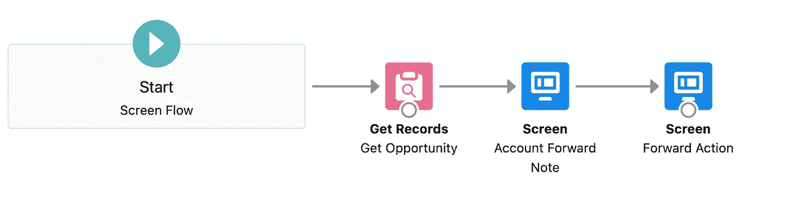
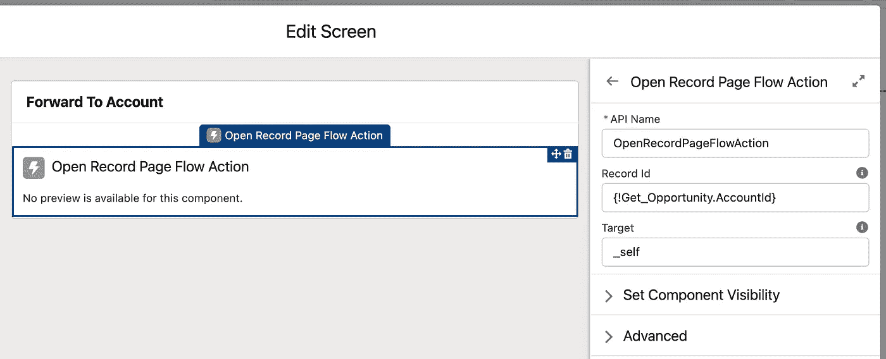
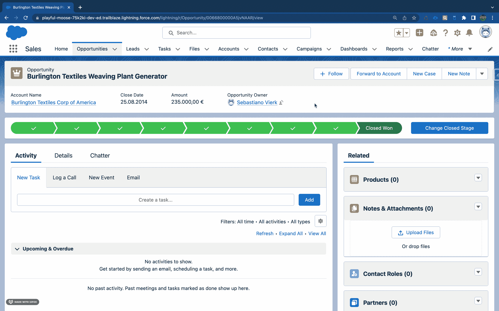

# 如何使用 LWC 从 Salesforce Flow 打开记录页面

> 原文：<https://javascript.plainenglish.io/how-to-open-a-record-page-from-salesforce-flow-using-lwc-a8a94bc0c9ba?source=collection_archive---------2----------------------->

## 使用 Lightning Web 组件构建简单、通用的流转发操作

Photo by [Maksym Tymchyk 🇺🇦](https://unsplash.com/@maksym_tymchyk?utm_source=medium&utm_medium=referral) on [Unsplash](https://unsplash.com?utm_source=medium&utm_medium=referral)

假设您面临着将您的用户从一个流中转发到一个记录页面的需求，例如，在创建一个记录之后将用户重定向到相应的记录页面。

直到最近，解决这个问题的方法通常是建立一个相应的光环流动作。不过既然 Lightning Web Components 是 Salesforce 的新标准 UI 框架，那么在我看来应该尽量用它来代替 Aura。因此，在这篇文章中，我们将看看如何用一个简单的 LWC 来解决整个问题。

# 构建打开记录页面流操作

为了通过我们的 LWC 实现转发，我们利用了 Web API 标准，在这种情况下，[窗口](https://developer.mozilla.org/en-US/docs/Web/API/Window)和[位置](https://developer.mozilla.org/en-US/docs/Web/API/Location)接口的功能:

*   我们将使用 [location.origin](https://developer.mozilla.org/en-US/docs/Web/API/Location/origin) 来获取所表示的 URL 的来源
*   我们将使用 [Window.open(](https://developer.mozilla.org/en-US/docs/Web/API/Window/open) )来加载特定的目标 URL

在我们的 LWC 中，我们组装这些函数如下，并用目标页面的记录 id 来丰富 URL:

不幸的是，与 Aura 组件不同，由于我们此时不能使用 LWC 作为流程中的无头动作，因此屏幕仍然是必要的，我们在组件的模板中添加了一个微调器作为加载指示器，以便为用户实现视觉上吸引人的显示。

# 使流操作 LWC 可配置

如果您构建定制组件，您应该确保它们尽可能地可重用和通用。我们还希望通过我们的 LWC 来实现这一点，因此将其配置为在流中普遍可用。在该流中，可以传递目标页面的记录 id，并且可以决定该页面是在相同还是不同的浏览器选项卡中打开。

# 打开记录页面流动作的示例性使用

为了通过一个示例演示前面构建的组件的用法，我们将构建一个简单的屏幕流，将用户从 Opportunity 重定向到关联的 Account record 页面。

该流程稍后会通过 Opportunity record 页面中的快速操作来触发，由以下三个简单的流程元素组成:

1.  **获取记录操作:**获取重定向所需的帐户 Id
2.  **账户转发说明屏幕:**可选屏幕，带有关于重定向的简短说明
3.  **转发动作画面:**由我行 LWC 转发至相关账户

Simple Flow to forward Users from Opportunity to related Account

为了通过我们的 LWC 成功重定向，只需将其添加到适当的流动屏幕。我们将 Account Id 作为记录 Id，将“self_”作为目标来打开当前选项卡中的页面。

Add Open Record Page Flow Action LWC to Flow Screen

下面您可以看到使用我们的组件进行的重定向:

Use Open Record Page Flow Action LWC to forward the User from Opportunity to related Account

# 结论

我们已经看到了如何用几行代码构建一个简单通用的 LWC，将用户重定向到任何记录页面。也许将来会有一个相应的标准心流动作，或者有可能使用 LWC 作为没有屏幕的心流动作，但在此之前，本文中显示的变体是避免使用光环的一种替代方法。

GitHub 上提供了完整的源代码，包括 JEST 单元测试和 JSDoc 注释:

 [## awesome-LWC-collection/force-app/main/default/LWC/openRecordPageFlowAction at main…

### 此时您不能执行该操作。您已使用另一个标签页或窗口登录。您已在另一个选项卡中注销，或者…

github.com](https://github.com/svierk/awesome-lwc-collection/tree/main/force-app/main/default/lwc/openRecordPageFlowAction) 

*更多内容请看*[***plain English . io***](https://plainenglish.io/)*。报名参加我们的* [***免费周报***](http://newsletter.plainenglish.io/) *。关注我们关于*[***Twitter***](https://twitter.com/inPlainEngHQ)[***LinkedIn***](https://www.linkedin.com/company/inplainenglish/)*[***YouTube***](https://www.youtube.com/channel/UCtipWUghju290NWcn8jhyAw)*[***不和***](https://discord.gg/GtDtUAvyhW) ***。*****

*****对缩放您的软件启动感兴趣*** *？检查* [***电路***](https://circuit.ooo/?utm=publication-post-cta) *。***