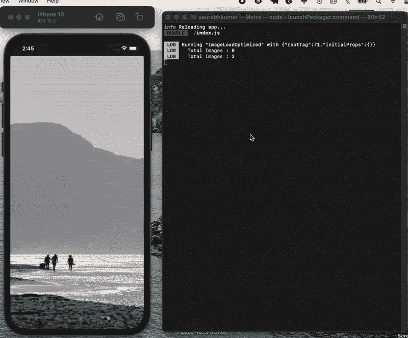

# 如何优化 React Native 中的数据抓取？

> 原文：<https://javascript.plainenglish.io/how-to-optimize-data-fetching-in-react-native-b3cab2ee45ab?source=collection_archive---------4----------------------->

> 了解有关延迟加载和预取图像以优化性能的更多信息。

欢迎来到另一个博客！对于任何 react 本地应用程序，通过 API 调用获取数据变得非常重要，因为我们需要更新本地状态，从而相应地在视图中呈现数据。在这篇博客中，我们将看看如何以优化的方式获取图像、视频等形式的数据。

> **数据预取的概念:**
> 
> **数据预取**是指在后台下载数据的概念。这样做是基于数据可能会被请求的假设，因此如果用户请求数据，就可以立即加载数据。

一个重要的标准是， **API** 应该以这样一种方式设计，即它可以接受一个参数，如限制/大小或开始/结束限制，并只带来那些请求的数据作为响应。

对于演示，我们将尝试克隆一个非常基本的 youtube 短片/ Instagram 卷轴版本，但不是视频，而是图像。我们将了解如何预取数据以避免加载时间，以及如何在组件安装后不大量加载状态的情况下延迟加载数据。

让我们开始吧。

# 主要成分

在主组件内部，我们需要呈现一个包含数据的平面列表。我们还需要传递 **onEndReachedThreshold** ，这样如果它从底部滚动到提供的像素值，它将触发 **onEndReached** 。

**onEndReached** 可以接受一个回调，该回调将使用更新后的大小通过 API 调用获取数据，这里我们更新 setLimit，它将触发 fetchImages()作为副作用操作。这个函数也将更新 setImages，因此我们将在 flatlist 中有一组更新的图像，它将呈现每个项目。

***源代码:***

# **屏幕**

我们可以为将在移动屏幕上呈现的每个项目启用全屏视图。

***源代码:***

演示-

想在 React Native 上看到更多这样令人惊叹的博客，请看看这些—

1.  [所有关于 React Native 的初学者:优点、缺点和未来](/a-beginners-friendly-article-on-react-native-simply-explained-f3098b1873ec?source=your_stories_page-------------------------------------)
2.  [最佳编码实践— React 本地版 2022](/best-coding-practices-react-native-edition-2022-da833c8161de?source=your_stories_page-------------------------------------)

感谢阅读。

*更多内容请看*[***plain English . io***](https://plainenglish.io/)*。报名参加我们的* [***免费周报***](http://newsletter.plainenglish.io/) *。关注我们关于*[***Twitter***](https://twitter.com/inPlainEngHQ)[***LinkedIn***](https://www.linkedin.com/company/inplainenglish/)*[***YouTube***](https://www.youtube.com/channel/UCtipWUghju290NWcn8jhyAw)***，以及****[***不和***](https://discord.gg/GtDtUAvyhW) *对成长黑客感兴趣？检查* [***电路***](https://circuit.ooo/) ***。*****