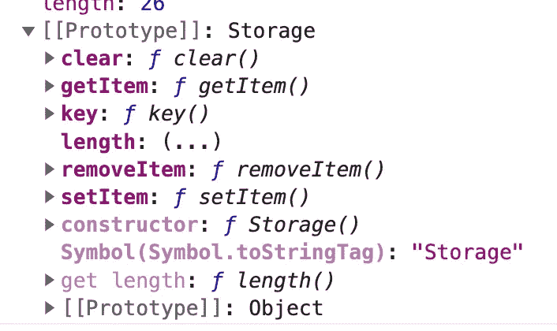
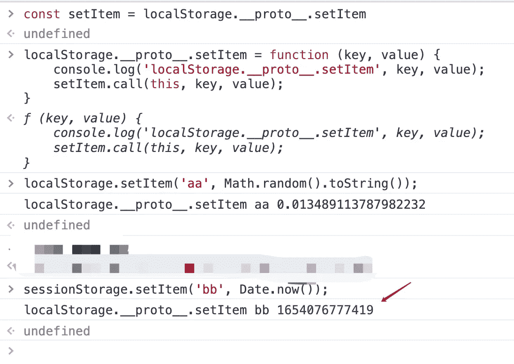
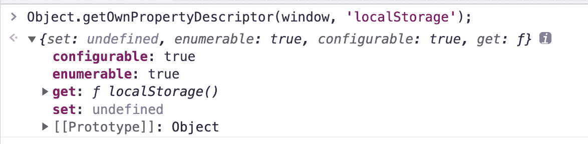

# 如何覆盖 localStorage 中的方法？

> 原文：<https://javascript.plainenglish.io/how-to-override-methods-in-localstorage-36c7e5edc47?source=collection_archive---------6----------------------->

## 将 localStorage 与 JavaScript 一起使用。


Photo by [Lia Trevarthen](https://unsplash.com/@melodi2?utm_source=unsplash&utm_medium=referral&utm_content=creditCopyText) on [Unsplash](https://unsplash.com/s/photos/storage?utm_source=unsplash&utm_medium=referral&utm_content=creditCopyText)

经常想重写`localStorage`实现某个功能。有哪些方法可以重写`localStorage`中的方法？有很多开发者想重新编写`localStorage`中的方法来实现密钥的到期时间，或者监控密钥的读写。那么有哪些方法可以覆盖`localStorage`中的方法。这是我的第 43 篇媒体文章。

# 1.直接在本地存储上重写

许多开发人员喜欢重写的想法，首先保留原来的方法，然后像下面这样直接在 localStorage 上重写方法。

但是，这种写法并不是重写方法`setItem()`，而是给`localStorage`添加一个`setItem`属性。当方法的 value 属性被声明时，本地的`setItem()`方法被覆盖。

我没有对它进行过多的测试，但是在一些浏览器中，这个属性会被忽略，导致我们的重写失败。

# 2.重写 localStorage 上的方法。__proto__

如果我们仔细观察，setItem 和 getItem 继承自 Storage `__proto__`伪属性。



然后我们直接重写上面的`localStorage.__proto__`方法。

这实现了对`setItem()`方法的真正覆盖。

但是这里还有一个问题。`localStorage`和`sessionStorage`都继承自[存储器](https://developer.mozilla.org/en-US/docs/Web/API/Storage)。在重写了`localStorage.__proto__`上的属性或方法后，`sessionStorage`中的方法也被重写。



# 3.外包装层

我们不直接修改`localStorage`本身的方法，而是在外面包裹一层，然后用`localStorage`实现底层的存储功能。

这样自由度相对更高，不存在第 1 节的兼容性问题。只有使用的名称发生了变化，而`localStorage`中的属性和方法被完全屏蔽。

如果你想使用一个没有包的自定义对象，那么你需要实现所有的属性和方法。像上面这样单独模仿一个方法是不可能的。

# 4.覆盖本地存储

使用`Object.defineProperty`或`Proxy`等同于完全覆盖`localStorage`变量。比第 3 部分更好，因为名称没有改变。

## 4.1 直接覆盖，无效果

如果用下面的方法直接覆盖，就没有效果了。

```
window.localStorage = Object.create(null);  console.log(window.localStorage); //still native
```

我们通过`[Object.getOwnPropertyDescriptor](https://developer.mozilla.org/en-US/docs/Web/JavaScript/Reference/Global_Objects/Object/getOwnPropertyDescriptor)`得到`localStorage`的属性描述符。可以发现没有 writable: true 属性，也就是说`localStorage`不是直接可写的。



## 4.2 用 Object.defineProperty 重写

既然没有`writable`属性，我们就给它加一个。我们可以用`Object.defineProperty`覆盖`localStorage`。

但是你不能用上面那种外面一层的写法。如果直接把上面的`myLocalStorage`给`localStorage`那么就会产生无限递归(为避免误导，错误的写法这里就不写了)。

我这里做了一个`localStorage`的备份。如果你需要一个本地方法，你也可以操作它。

# 5.摘要

在本文中，我们不具体实现诸如设置到期时间这样的功能。而是从另一个角度来谈谈如何重写`localStorage`或者其中的方法。

*更多内容请看*[***plain English . io***](https://plainenglish.io/)*。报名参加我们的* [***免费周报***](http://newsletter.plainenglish.io/) *。关注我们关于*[***Twitter***](https://twitter.com/inPlainEngHQ)[***LinkedIn***](https://www.linkedin.com/company/inplainenglish/)*[***YouTube***](https://www.youtube.com/channel/UCtipWUghju290NWcn8jhyAw)*[***不和***](https://discord.gg/GtDtUAvyhW) *。***