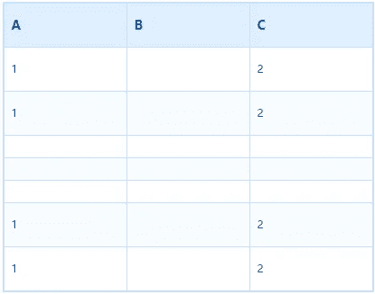

# 如何用 JavaScript 解析 Excel 文件

> 原文：<https://javascript.plainenglish.io/how-to-parse-excel-files-with-javascript-114752b6aa1d?source=collection_archive---------2----------------------->


今天，我们来谈谈如何使用 JS 来解析 excel 文件。当然，直接使用诸如 [exceljs](https://www.npmjs.com/package/exceljs) 和 [SheetJS](https://sheetjs.com/) 之类的库并不有趣。相反，我们来谈谈 JS 如何解析 Excel 表。

请注意，本文主要讨论 xlsx 格式的 Excel 表格，并未探讨其他格式。

## 什么是 excel 电子表格文件

首先，要解析 excel 文件，您必须首先了解它是如何存储数据的。经过各种可能的搜索，我终于在 GG 中找到了答案:excel 文件实际上是一个 zip 包！所以我很快创建了一个新的 xlsx 文件，并在其中创建了两张新的工作表。两页资料如下:
这是第 1 页:



这是第 2 页:


然后使用 zip 解压缩:

```
unzip test.xlsx -d test
```

然后通过树我们得到这样一个目录结构:

```
test
├── [Content_Types].xml
├── _rels
├── docProps
│   ├── app.xml
│   ├── core.xml
│   └── custom.xml
└── xl
    ├── _rels
    │   └── workbook.xml.rels
    ├── sharedStrings.xml
    ├── styles.xml
    ├── theme
    │   └── theme1.xml
    ├── workbook.xml
    └── worksheets
        ├── sheet1.xml
        └── sheet2.xml
```

啊哈，干得好，都是 xml 文件。

当我们打开 xml 进行查找时，我们可以看到有几个非常显眼的文件，即工作表下的 sheet1.xml 和 sheet2.xml，以及 workbook.xml。其他样式和主题乍一看与样式相关，_rels 感觉就像是内部引用。让我们先看看这两张纸的 xml 文件，看看猜测是否正确。粘贴工作表 1.xml:

```
<?xml version="1.0" encoding="UTF-8" standalone="yes"?>
<worksheet 
    xmlns:r="http://schemas.openxmlformats.org/officeDocument/2006/relationships"
    xmlns:xdr="http://schemas.openxmlformats.org/drawingml/2006/spreadsheetDrawing"
    xmlns:x14="http://schemas.microsoft.com/office/spreadsheetml/2009/9/main"
    xmlns:mc="http://schemas.openxmlformats.org/markup-compatibility/2006"
    xmlns:etc="http://www.wps.cn/officeDocument/2017/etCustomData">
    <sheetPr/>
    <dimension ref="A1:C7"/>
    <sheetViews>
        <sheetView workbookViewId="0">
            <selection activeCell="D5" sqref="A3:D5"/>
        </sheetView>
    </sheetViews>
    <sheetFormatPr defaultColWidth="9.23076923076923" defaultRowHeight="16.8" outlineLevelRow="6" outlineLevelCol="2"/>
    <sheetData>
        <row r="1" spans="1:3">
            <c r="A1">
                <v>1</v>
            </c>
            <c r="C1">
                <v>2</v>
            </c>
        </row>
        <row r="2" spans="1:3">
            <c r="A2">
                <v>1</v>
            </c>
            <c r="C2">
                <v>2</v>
            </c>
        </row>
        <row r="6" spans="1:3">
            <c r="A6">
                <v>1</v>
            </c>
            <c r="C6">
                <v>2</v>
            </c>
        </row>
        <row r="7" spans="1:3">
            <c r="A7">
                <v>1</v>
            </c>
            <c r="C7">
                <v>2</v>
            </c>
        </row>
    </sheetData>
    <pageMargins left="0.75" right="0.75" top="1" bottom="1" header="0.5" footer="0.5"/>
    <headerFooter/>
</worksheet>
```

我相信每个人都看过了，sheetData 是 excel 表中的数据，<row>代表行，其中 r 是行号的索引，行中的<c>应该是单元格，而<v>对应于单元格中的值，r 是单元格的位置，比如 A7 代表 a 列中的第 7 行。
另外还有几个很明显的属性，比如 dimension，可以看作是表的大小范围，从 A1 单元格到 C7 单元格形成一个方框。<工作表视图>应存储页面上的信息，而<选择>应代表所选表格的内容。
工作簿存储工作表信息:</v></c></row>

```
<?xml version="1.0" encoding="UTF-8" standalone="yes"?>
<workbook 
    xmlns:r="http://schemas.openxmlformats.org/officeDocument/2006/relationships">
    <fileVersion appName="xl" lastEdited="3" lowestEdited="5" rupBuild="9302"/>
    <workbookPr/>
    <bookViews>
        <workbookView windowHeight="16360" activeTab="1"/>
    </bookViews>
    <sheets>
        <sheet name="Sheet1" sheetId="1" r:id="rId1"/>
        <sheet name="Sheet2" sheetId="2" r:id="rId2"/>
    </sheets>
    <calcPr calcId="144525"/>
</workbook>
```

在查看了剩余的几个 XML 之后，存储的信息非常清晰，例如:

```
· The information of the file program and the file name are stored in the app
· The author's information and creation and modification time are saved in core
· The rels file is also in xml format, storing some other xml references
· theme stores the colors and fonts defined in the table
· [Content_Types] contains references to all files, which are estimated to be parsed entry files
```

# JS 实现步骤

既然我们已经知道了 excel 文件是如何存储数据的，那么我们就很清楚如何使用 js 来解析它。主要有三个步骤:

1.  使用 js 解压缩 excel 文件
2.  获取工作表文件的内容，然后解析 xml 数据
3.  将数据转换成我们想要的形状

让我们练习一下:

## ZIP 解压缩

直接使用 jszip 获取:

```
document.querySelector('#file').addEventListener('change', async e => {
    const file = e.target.files[0];
    if (!file) return;
    const zip = await JSZip.loadAsync(file);
    const sheetXML = await zip.files['xl/worksheets/sheet1.xml'].async('string');
});
```

快速修复，现在 sheetXML 就是我们刚刚看到的 sheet1.xml 中的数据。

## XML 解析

然后，我们可以解析 XML 内容并取出数据。xml 解析的原理非常简单，就像 html 解析一样。为了理解这个原理，让我们直接构建一个开源库来帮助:

```
import convert from 'xml-js';

const result = convert.xml2json(sheetXML, { compact: true, spaces: 4 });
```

然后我们得到一串类似这样的 JSON(一些内容被删除):

```
{
    "_declaration": {
        "_attributes": {}
    },
    "worksheet": {
        "_attributes": {},
        "sheetPr": {},
        "dimension": {
            "_attributes": {
                "ref": "A1:C7"
            }
        },
        "sheetData": {
            "row": [
                {
                    "_attributes": {
                        "r": "1",
                        "spans": "1:3"
                    },
                    "c": [
                        {
                            "_attributes": {
                                "r": "A1"
                            },
                            "v": {
                                "_text": "1"
                            }
                        },
                        {
                            "_attributes": {
                                "r": "C1"
                            },
                            "v": {
                                "_text": "2"
                            }
                        }
                    ]
                },
                {
                    "_attributes": {
                        "r": "7",
                        "spans": "1:3"
                    },
                    "c": [
                        {
                            "_attributes": {
                                "r": "A7"
                            },
                            "v": {
                                "_text": "1"
                            }
                        },
                        {
                            "_attributes": {
                                "r": "C7"
                            },
                            "v": {
                                "_text": "2"
                            }
                        }
                    ]
                }
            ]
        }
    }
}
```

接下来，我们只需要取出 sheetData 中的数据，然后根据内部属性生成我们想要的数据格式。

# 总结

excel 文件的本质是一个 zip 包。我们只需要经过 zip 解压缩、XML 解析和数据处理这三个步骤，就可以使用 JS 读取其中的数据。当然还有很多细节，但如果只是简单的 excel 模板，不妨自己试试。

*报名参加我们的* [***免费周报***](http://newsletter.plainenglish.io/) *。关注我们关于*[***Twitter***](https://twitter.com/inPlainEngHQ)，[***LinkedIn***](https://www.linkedin.com/company/inplainenglish/)*，*[***YouTube***](https://www.youtube.com/channel/UCtipWUghju290NWcn8jhyAw)*，以及* [***不和***](https://discord.gg/GtDtUAvyhW) ***。***

***有兴趣缩放你的软件启动*** *？检查* [***电路***](https://circuit.ooo?utm=publication-post-cta) *。*