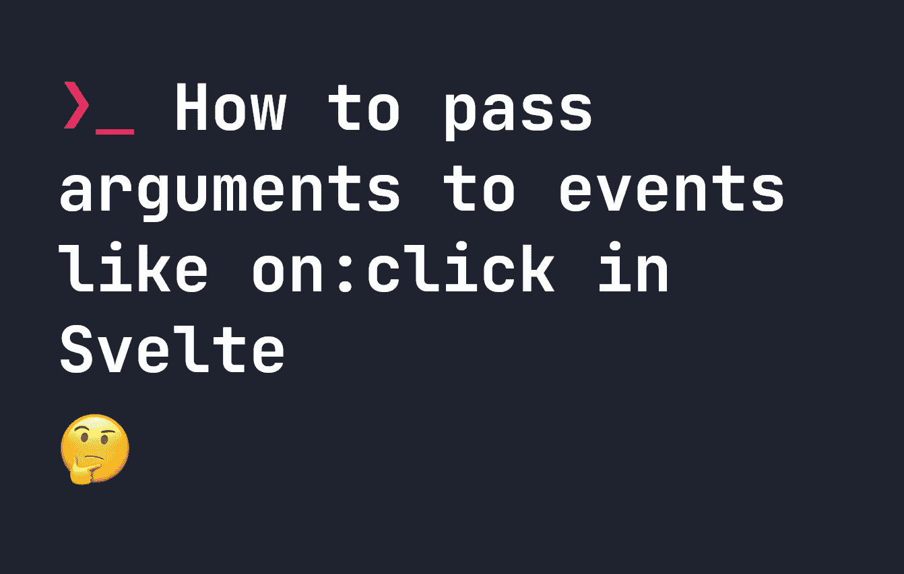

# 如何将参数传递给事件，如 on:click in Svelte

> 原文：<https://javascript.plainenglish.io/how-to-pass-arguments-to-events-like-on-click-in-svelte-68d734626f43?source=collection_archive---------9----------------------->



[苗条事件](https://fjolt.com/article/svelte-how-events-work)是我们为苗条组件添加交互性的方式。苗条事件的一个常见问题是给事件内部调用的函数添加参数。例如，假设我们有一个基本计数器，每当用户点击它时，它就会增加:

```
<script>
    // we write export let to say that this is a property
    // that means we can change it later!
    let x = 0;
    const addToCounter = function() {
        ++x;
    }
</script><button id="counter" on:click={addToCounter}>{x}</button>
```

这很好，但是假设我们想改变它，这样每当它被点击时，我们就增加一个特定的数量。我们可以试着将代码改成这样:

```
<script>
    // we write export let to say that this is a property
    // that means we can change it later!
    let x = 0;
    const addToCounter = function(amount) {
        x += amount;
    }
</script><button id="counter" on:click={addToCounter(5)}>{x}</button>
```

**但是这不行**——相反我们需要改变我们的事件来包含一个函数。为了给我们的`addToCounter`函数添加参数，我们必须这样做:

```
<button id="counter" on:click={() => addToCounter(5)}>{x}</button>
```

在这里，我们调用一个函数，它返回由`addToCounter`产生的值。这也适用于事件，所以如果你想把事件或`e`对象传递给你的函数，你可以这样做:

```
<button id="counter" on:click={(e) => addToCounter(e)}>{x}</button>
```

*更多内容看* [***说白了。报名参加我们的***](https://plainenglish.io/) **[***免费周报***](http://newsletter.plainenglish.io/) *。关注我们* [***推特***](https://twitter.com/inPlainEngHQ) *和*[***LinkedIn***](https://www.linkedin.com/company/inplainenglish/)*。加入我们的* [***社区***](https://discord.gg/GtDtUAvyhW) *。***