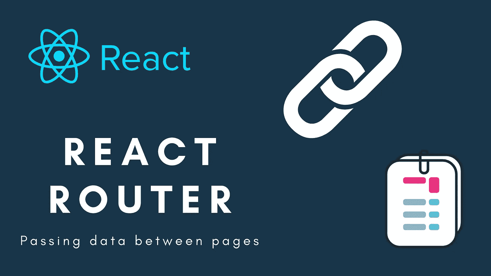
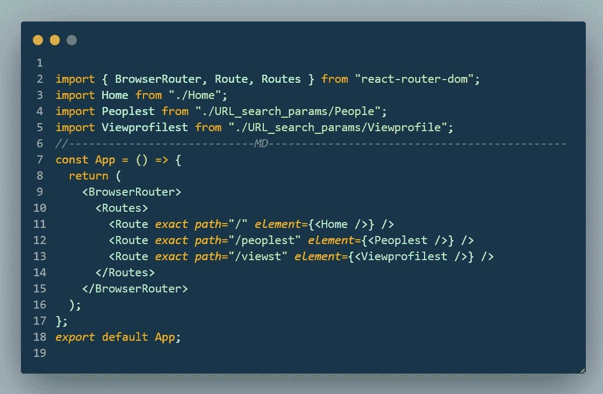
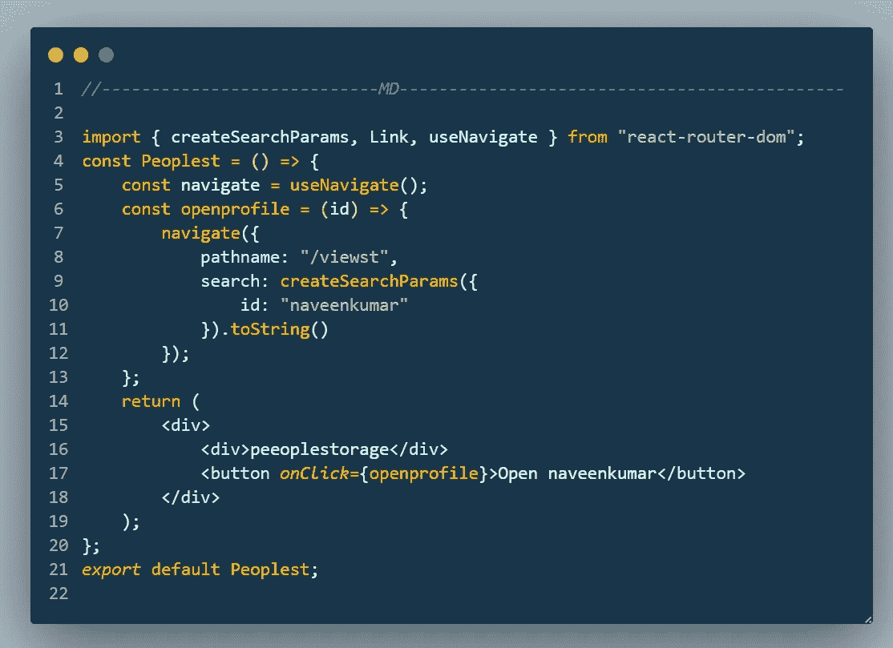
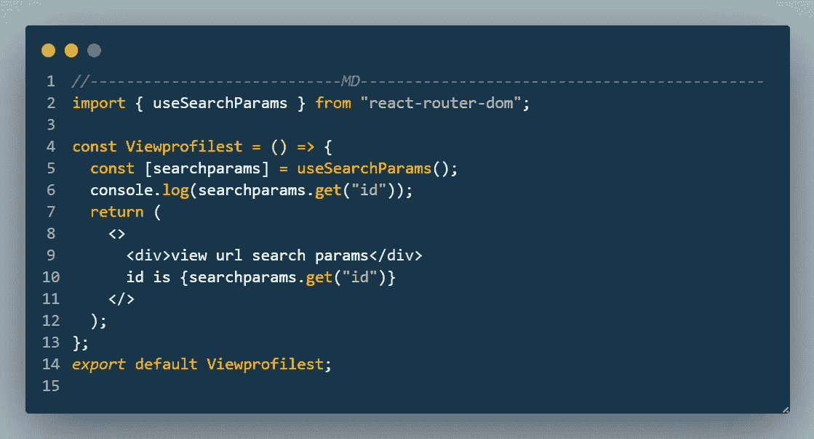
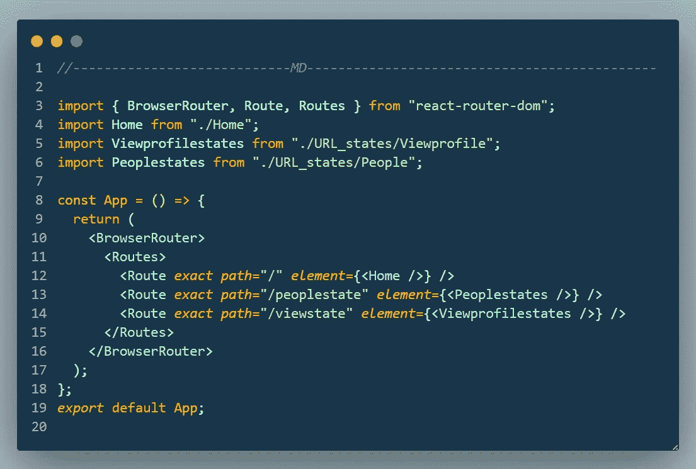
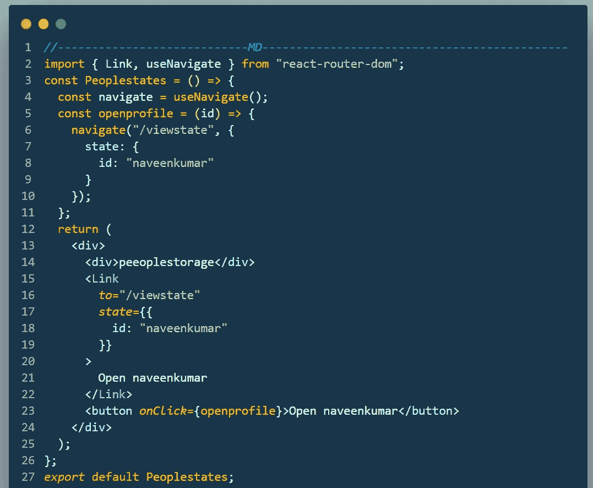
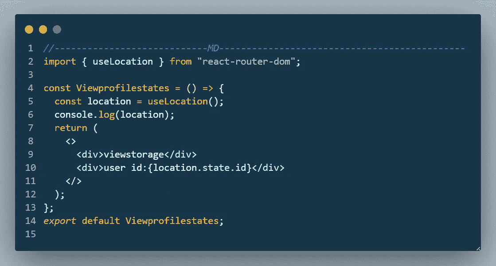
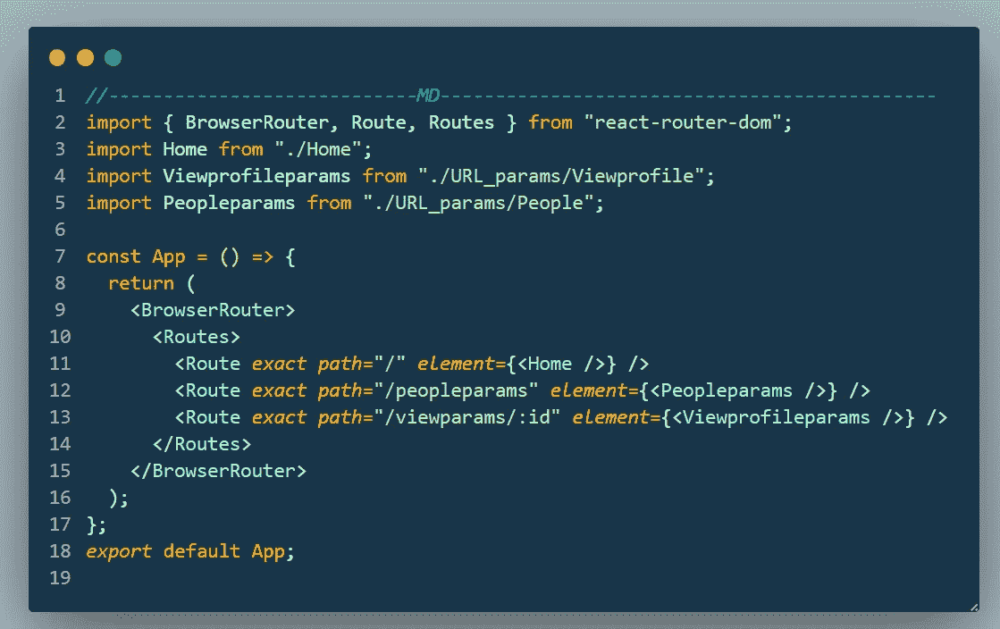
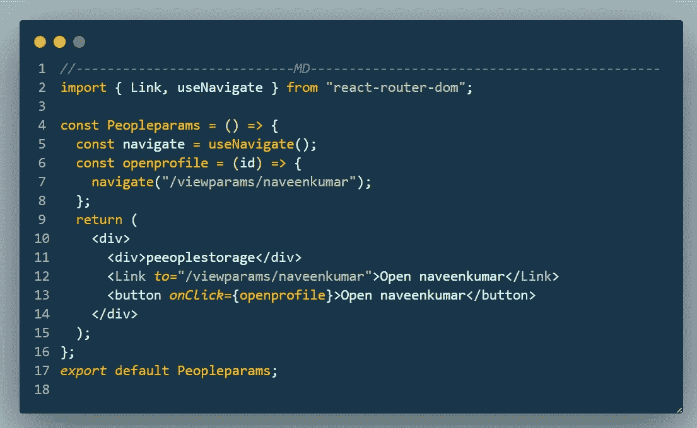
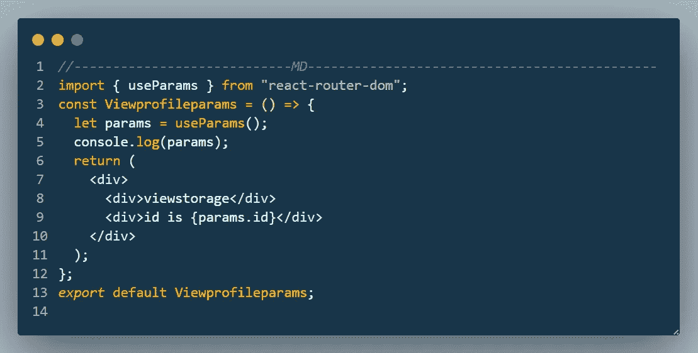

# react-router-dom V6 中如何在页面之间传递数据？

> 原文：<https://javascript.plainenglish.io/how-to-pass-data-between-pages-in-react-router-dom-v6-e2f95afb7cdf?source=collection_archive---------0----------------------->

## react-router-dom V6 中在页面之间传递数据的 3 种方式。

react-router v6 已经发布了很长时间，但是大多数开发人员仍然发现很难适应它。一开始我也觉得更难。我想这可能是因为晦涩难懂的文档，或者我们这些人太依赖 react-router v5 了。但是，随着模块的更新，我们也必须更新。

在本指南中，我不会向您解释如何在您的项目中使用 react-router-dom v6。但是我将讨论最重要的事情，即在页面之间传递数据。我将介绍实现它的 3 种方法，但这些并不是唯一的方法，我也不是说这些是最好的方法。

“我很高兴听到我错了。因为，如果不是这样，我仍然是错的。”

# 方法

1.  通过 URL 查询参数
2.  通过 URL 状态
3.  通过 URL 参数

## 1.通过 URL 查询参数

查询字符串是统一资源定位器的一部分，它为指定的参数赋值。查询字符串通常包括由 web 浏览器或其他客户端应用添加到基本 URL 的字段，例如作为 HTML 的一部分，选择页面的外观，或跳转到多媒体内容中的位置。(来源:维基百科)

## 定义路线

定义路由时，不需要做任何更改或配置。只需您的正常路线就足以使用查询参数。

## 定义链接和导航

在 React Router v6 中，我们使用 createSearchParams()方法从给定的对象中追加查询参数。

## 获取数据

使用 useSearchParams 挂钩获取查询参数。它类似于 useHistory 挂钩。首先，我们将把它赋给一个变量，然后我们将访问这些方法。这里也一样。

## 2.通过 URL 状态

状态是通过链接发送的变量。路由器链接包含状态变量的专用字段。状态变量可以是任何类型。

## 定义路线

定义路由时，不需要做任何更改或配置。只需您的正常路线就足以使用查询参数。

## 定义链接和导航

定义链接时，只需添加另一个名为 state 的键，并将变量添加到 state 中。

## 获取数据

通过发送的数据可以通过 useLocation 挂钩访问。

## 3.通过 URL 参数

参数就像动态路线。在这里，它将填充值，而不是路径名。

## 定义路线

在定义路线本身时，您必须提到要通过使用的变量:symbol。这个方法只有在初始阶段本身就知道变量的情况下才有效。

## 定义链接和导航

定义链接时，只需用值替换参数。

## 获取数据

可以用 useparams 钩子访问数据。

## 结论

选择正确的方法完全取决于你的愿望和项目的类型。

您可以从代码沙箱中获得完整的代码。请随意接近我。

 [## 纳文库马尔 M

### 我是一个多才多艺的网络开发人员，主要专注于 MERN 堆栈应用程序开发为您的小规模业务开发应用程序…

mdnaveenkumar.web.app](https://mdnaveenkumar.web.app) 

*更多内容请看*[***plain English . io***](https://plainenglish.io/)*。报名参加我们的* [***免费周报***](http://newsletter.plainenglish.io/) *。关注我们关于*[***Twitter***](https://twitter.com/inPlainEngHQ)*和*[***LinkedIn***](https://www.linkedin.com/company/inplainenglish/)*。加入我们的* [***社区不和谐***](https://discord.gg/GtDtUAvyhW) *。*