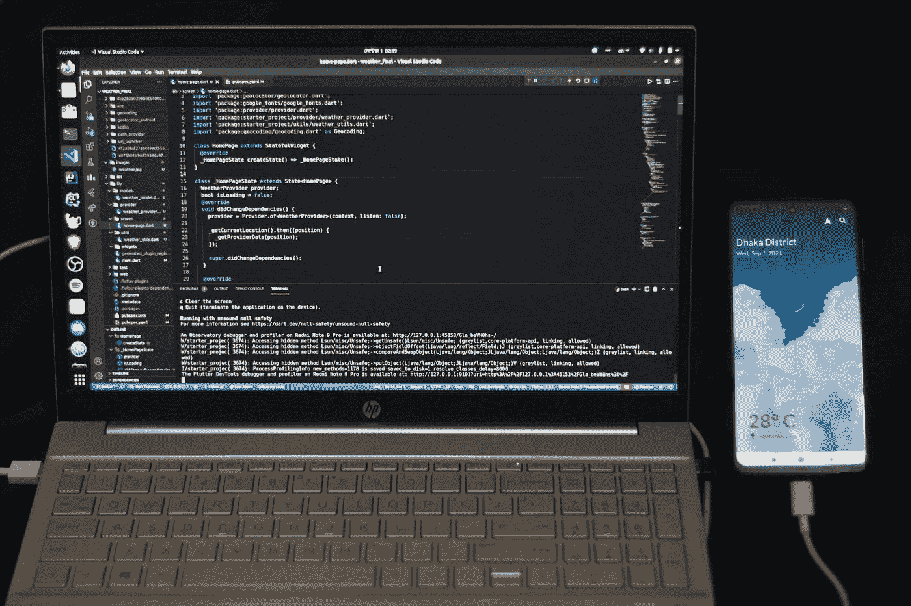

# 如何为移动应用程序开发挑选最佳的技术堆栈？

> 原文：<https://javascript.plainenglish.io/how-to-pick-the-best-tech-stack-for-mobile-app-development-43c578766639?source=collection_archive---------2----------------------->

Photo by [Fahim Muntashir](https://unsplash.com/@f12r?utm_source=medium&utm_medium=referral) on [Unsplash](https://unsplash.com?utm_source=medium&utm_medium=referral)

首先也是最重要的，移动应用是一种新的时尚，这要归功于新冠肺炎·疫情。到 2023 年，[移动应用预计将产生超过 9350 亿美元的收入](https://buildfire.com/app-statistics/)。即使在 2022 年，企业适应、应对需求并大力投资移动应用开发也是绝对正当的。

然而，选择一个可靠的技术组合有时会很困难。还有很多原因，比如需求、项目的规模和复杂性、第三方集成工具或插件或者总的[开发成本](https://www.resourcifi.com/blog/app-development-cost?utm_source=PlainEnglish&utm_medium=Offsite)。有时候，一些项目需要一个用户友好的 UI/UX，但是是小尺寸的。

所以这完全取决于你的目标和你打算使用的技术。如果你想知道如何为你的应用选择一个技术栈或者为移动应用开发选择最好的技术，那么不用担心。

在本文中，我将讨论为您的项目选择正确的技术堆栈所需了解的一切。

## **如何为你的应用开发项目选择合适的移动技术栈？**

技术栈是一套用于构建软件项目的编程语言。它是开发人员使用的框架、库、第三方应用程序和工具的组合。

让我们来看看哪些技术最适合您的项目需求。

**一般要求**

在开始你的移动应用程序开发框架之前，你能做的最好的事情是定义你的移动应用程序将服务的目标，并考虑[应用程序开发](https://www.resourcifi.com/blog/app-development?utm_source=PlainEnglish&utm_medium=Offsite)成本。当你这样做的时候，你会注意到在选择技术堆栈时的明显区别。

想想谁会使用你的应用程序，以及如何每次都为他们提供出色的用户体验和性能。

**项目范围**

如果你正在构建一个 MVP(最小可行产品),那么你的应用现在可能不需要先进的技术。但是，因受众而异。

对于小规模的组织，有足够数量的技术参与，而对于中型公司，它可以上升到更高的水平。

根据需求和目标，您可能需要使用许多应用程序开发框架的组合。例如，社交网络平台脸书是用多种编程语言和框架开发的。

**时间**

当你需要尽快在市场上推出你的产品时，MVP 是一个很好的选择，有一些类型的堆栈需要大量的时间，或者你可以称之为时间敏感技术。对于简单而省时的开发，您可以依赖 Ruby on Rails 框架，它可以提供快速开发。

此外，您可以通过第三方集成利用功能/特性，避免从头开始编写代码。它不仅节省了时间，而且极大地方便了酷的开发特性。

**数据安全**

有时候，一个 app 的类型或者流派，不是一个词就能定义的。假设有一个应用程序需要用安全的最佳实践来构建，并且应该有可能消除一般的安全缺陷。

为此，开发人员需要在客户端和服务器端运行一系列安全测试，最重要的是相应地开发应用程序。

**平台化发展**

好了，现在你已经考虑了前面提到的所有要点，然后继续你的[应用程序开发](https://www.resourcifi.com/resources/ebooks/9-stages-mobile-app-development?utm_source=PlainEnglish&utm_medium=Offsite)项目，那么平台呢？在你的移动应用开发项目中，平台的确扮演着重要的角色。你可以进行原生应用程序开发或跨平台应用程序开发。

选择原生应用开发平台意味着为特定的移动设备开发应用。本地应用通常不需要第三方 APIs 这使得它们跑得更快。

另一方面，跨平台应用程序开发意味着创建能够在许多移动设备上运行的应用程序。这种类型的开发更快，因为代码可以在各种平台上多次使用。大多数企业选择跨平台方法是因为它的适应性。

## 移动应用开发的最佳技术组合

**反应原生**

如果不是本地反应，那是什么？React Native 是由脸书公司开发的 JavaScript 框架。使用 React Native，您可以开发 iOS、Android 和 Web 的交互式应用程序。React Native 的另一个伟大之处是它的代码可以重用，相同的代码可以用于 iOS 和 Android。

JS 库和 React 的用户界面的结合使得应用程序反应灵敏且高效。由于其全球接受度和市场存在，React Native 被认为是开发跨平台移动应用程序的最有效框架。

**颤动**

Flutter 有 Google 做后盾，是 React Native 的直接竞争对手。许多人认为，与 React Native 相比，Flutter 是一个更可靠的平台，React Native 实际上是另一种方式。

使用 Flutter，你可以创建令人印象深刻的跨平台移动应用。其分层架构提供电源布局功能。而且，如果你想在不重新加载 app 的情况下查看新增加的功能甚至是 bug，可以用 Flutter 的热重新加载来实现。

**离子型**

接下来是爱奥尼亚。这是一个基于角度的框架，能够构建丰富的混合应用程序。Ionic 有很多先进的特性和优势，有利于组件的重用，DOM 元素可以处理移动性能差的问题。

**科尔多瓦**

框架 Apache Cordova 使用 HTML5，CSS 和 plain JS。它提供了 CLI(命令行界面),可用于构建不同平台的流程，使开发速度更快。然而，它也有一个很大的优势。使用 Apache Cordova 开发的应用程序会导致许多兼容性问题。

## 结论

现在，我已经介绍了如何为您的项目选择最适合的技术堆栈，以及为移动应用程序开发框架选择什么技术堆栈，您应该知道为了让您的产品在市场上取得成功，应该采用什么技术和什么方法。让我提醒你，技术栈的选择完全取决于你的目标和应用程序的类型。

*更多内容看* [***说白了就是***](https://plainenglish.io/) *。报名参加我们的* [***免费周报***](http://newsletter.plainenglish.io/) *。关注我们关于* [***推特***](https://twitter.com/inPlainEngHQ) ， [***领英***](https://www.linkedin.com/company/inplainenglish/) *，*[***YouTube***](https://www.youtube.com/channel/UCtipWUghju290NWcn8jhyAw)*，以及* [***不和***](https://discord.gg/GtDtUAvyhW) *。对增长黑客感兴趣？检查* [***电路***](https://circuit.ooo/) *。*