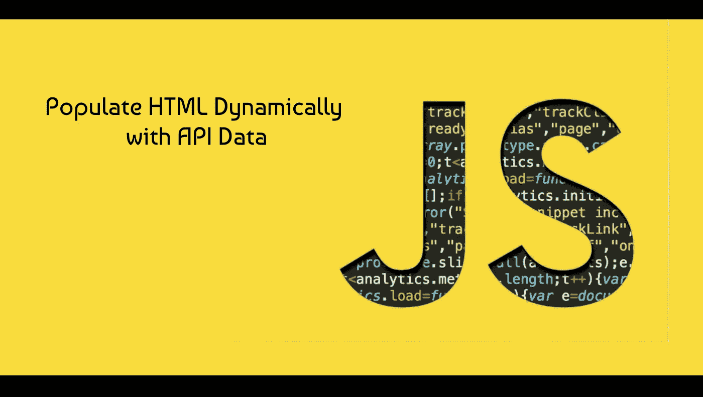

# 如何用来自 API 的数据动态填充 HTML

> 原文：<https://javascript.plainenglish.io/how-to-populate-html-dynamically-with-data-from-an-api-1a99be8a97c7?source=collection_archive---------6----------------------->

## 我如何使用一个简单的 API 为哈利波特人物创建卡片



作为一名 web 开发人员(通常也是一名软件开发人员)，学习如何使用应用程序编程接口(API)是非常重要的。简单解释一下，API 是一个数据集合，您可以通过使用 JavaScript 中的`fetch()`方法来访问它。不是所有的数据都存储在本地，而是存储在另一台服务器上的某个地方&你可以在需要时访问全部或部分数据。您需要在特定时间在网站或应用程序的特定部分显示这些数据&。

在我在这里写的例子中，我将向你展示我是如何从一个包含哈利波特角色信息的 API 中获取数据，以及如何在页面上显示这些数据的。我不知道的是，检索 API 数据并显示它实际上是项目中最容易的部分之一，但是如果我想写这个的话，那就另当别论了。废话少说，我们开始吧。

# 获取 API 数据

首先，让我们将 HTML 文档的一部分(`chars-container`)分配给一个变量，这个变量最终将由我们从 API 获取的字符信息填充:

```
const charsSection = document.getElementById('chars-container');
```

然后，让我们将 API 的 URL 赋给一个变量(当我们获取 API 数据时，使代码更加整洁)&创建一个异步函数，因为我们需要等待从 API 中检索数据):

```
// Assign API URL to variable:
const charsURL = 'https://hp-api.herokuapp.com/api/characters';

// Function to return array of filtered character data objects from API:
async function getChars() {
    // Fetch API data:
    const response = await fetch(charsURL);

    // Convert API data to JSON:
    const allCharsArr = await response.json();

    // Push into iterable array, newCharsArr, all characters that are human & contain an image URL:
    let newCharsArr = [];
    for (let i = 0; i < allCharsArr.length; i++) {
        if (allCharsArr[i].species === 'human' && allCharsArr[i].image.length > 0) {
            newCharsArr.push(allCharsArr[i]);
        }
    }
    return newCharsArr;
}
```

只要对象的`.image`属性长度大于 0(API 中所有非空的`.image`属性都包含一个有效的图像 URL) &，这个函数`getChars()` 获取 API 数据，将数据转换为 JavaScript 对象符号(JSON)，然后将每个数据对象推入一个新的可迭代数组`newCharsArr`。

您可能出于几个原因想要过滤 API 数据，其中一个原因可能是 API 不完整，就像这里的情况一样。如果您知道如何用循环、条件语句等操作 JS 对象中的数据，通常就可以解决这个问题。，只要它满足您的项目需求，或者直到 API 完成。在这种情况下，并不是 API 中的每个字符数据对象都包含图像，这对项目来说是必要的，所以我过滤掉了不包含图像的数据对象。

因此，上面的`getChars()`函数从 API 返回一个包含数据对象的 iterable 数组，该数据对象的`.species`属性是‘human’&，其`.image`属性长度大于 0。

# 用检索到的 API 数据填充页面

```
async function buildPage() {
    const newCharsArr = await getChars();
    // Populate character cards' HTML:
    for (let i = 0; i < newCharsArr.length; i++) {
        // Populate homepage (make cards visible by default)
        charsSection.innerHTML += 
            "<div class='char-card' data-name='" + newCharsArr[i].name.toLowerCase().replace(/\s/g, '-') + "' data-house='"
            + newCharsArr[i].house.toLowerCase().replace(/\s/g, '-') + "'>" 
                + "<div class='char-img-container'>"
                + "<button class='favs-btn' title='Add to Favorites'><i class='far fa-heart'></i></button>"
                + ""
                + "</div>"
                + "<header class='char-header'>" + newCharsArr[i].name + "</header>"
                + "<p><span>Ancestry: </span>" + newCharsArr[i].ancestry + "</p>"
                + "<p id='house-homepage'><span>House: </span>" + newCharsArr[i].house + "</p>"
                + "<p><span>Actor/Actress: </span>" + newCharsArr[i].actor + "</p>"
            + "</div>"
    }
}
```

还记得我们一开始声明的`charsSection`变量吗？上面的函数`buildPage()`，用我们用`getChars()`函数检索的过滤后的数据对象填充它。由于`getChars()`是异步的&必须等待从 API 中检索数据，`buildPage()`也必须是异步的&等待`getChars()`的调用，然后才能填充`charsSection`的 innerHTML。

在上面的`buildPage()`中，我将过滤后的数据对象的可迭代数组赋给了`newCharsArr`。对于`newCharsArr`中的每一个物品，我们都会动态地创建一张卡片，包含关于该物品所代表的角色的选择信息(角色的形象、名字、血统、霍格沃茨魔法学校、&男演员/女演员)。

这是在提取、过滤了角色的信息，并用它填充了页面后，该页面的摘录。我没有包括任何关于样式的信息，但是如果你想看我的整个项目的代码，可以在文章末尾看到它的 GitHub 库的链接。


这就是如何用从 API 获取的信息动态填充网页的简单例子。如果你有任何意见或问题，我很乐意回答。如果你觉得这篇文章有帮助，我会很感激一个好的评论或一两个掌声，这样我就可以知道我的读者喜欢什么内容。如果你认为其他人会发现这很有用，请与他们分享。

感谢阅读！

## 有用的链接

该项目的 GitHub 库:[https://github.com/EGROENE/api-project](https://github.com/EGROENE/api-project)

MDN Web Docs 简介':[https://developer . Mozilla . org/en-US/Docs/Learn/JavaScript/Client-side _ Web _ API/简介](https://developer.mozilla.org/en-US/docs/Learn/JavaScript/Client-side_web_APIs/Introduction)

*更多内容请看*[***plain English . io***](https://plainenglish.io/)*。报名参加我们的* [***免费周报***](http://newsletter.plainenglish.io/) *。关注我们关于*[***Twitter***](https://twitter.com/inPlainEngHQ)[***LinkedIn***](https://www.linkedin.com/company/inplainenglish/)*[***YouTube***](https://www.youtube.com/channel/UCtipWUghju290NWcn8jhyAw)*[***不和***](https://discord.gg/GtDtUAvyhW) *。对增长黑客感兴趣？检查* [***电路***](https://circuit.ooo/) *。***