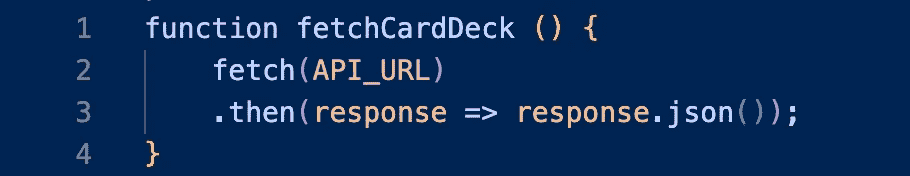

# 如何从 API 中提取

> 原文：<https://javascript.plainenglish.io/how-to-program-a-card-game-971bb69a7283?source=collection_archive---------15----------------------->

应用程序编程接口(API)是两个应用程序相互通信的一种方式。每个 API 都有文档解释它能做什么以及如何使用它。有很多免费的公共 API，其中一个就是这个[卡片组 API](https://www.deckofcardsapi.com/) 。

开始任何纸牌游戏，我们需要得到一副牌，洗牌，并分发第一轮。根据 API 的文档，我们可以通过调用一个特定的 URL 来获得一副新牌并洗牌。它看起来像这样:


`[fetch](https://developer.mozilla.org/en-US/docs/Web/API/fetch)`命令开始从给定的 URL 获取数据的异步过程。异步进程是从当前函数中分离出来并独立运行的进程。这意味着在下一行代码运行之前，结果可能还没有准备好。为了处理这个问题，`fetch`命令返回一个`Promise`对象，这只是一个占位符，以便代码可以继续运行。一旦`fetch`完成，它将用实际结果替换`Promise`对象。

从 URL 获取的数据将采用 [JavaScript 对象符号(JSON)](https://www.w3schools.com/js/js_json_intro.asp) 格式。这本质上是存储 JavaScript 对象的一种简化方式。为了在我们的代码中使用这些数据，我们需要使用`.json`将它从 JSON 转换成普通的 JavaScript:



*Note: JavaScript will ignore the white space between the fetch command and the then call, so it is common to see it written with line breaks to improve readability.*

因为`fetch`命令是异步的，我们需要告诉`fetchCardDeck`函数在试图转换数据之前等待`fetch`完成。我们通过使用回调函数调用`.then`来实现这一点。在这个例子中，我们使用一个匿名回调函数，它从`fetch`获取响应，并对其调用`.json`。结果将是一个来自 API 的卡片叠对象，我们可以在代码中使用它。

一旦我们得到了洗好的牌，下一步就是根据游戏规则开始发牌。同样，我们需要等到卡片组数据准备好之后再尝试使用它，因此我们使用另一个`.then`调用:


这第二个`.then`将等待第一个`.then`的结果。它将接受第一个`.then`的结果，也就是 JavaScript 格式的`cardDeck`对象，并执行一个匿名回调函数，将`cardDeck`发送给下一个函数`dealCards`。

最后，我们可以在我们的主函数中调用`fetchCardDeck`…


…我们已经准备好编写一个纸牌游戏了！

```
function fetchCardDeck () {
    fetch(API_URL)
    .then(response => response.json())
    .then(cardDeck => dealCards(cardDeck));
}
fetchCardDeck();
```

*更多内容看* [***说白了。报名参加我们的***](https://plainenglish.io/) **[***免费周报***](http://newsletter.plainenglish.io/) *。关注我们关于* [***推特***](https://twitter.com/inPlainEngHQ) ，[***LinkedIn***](https://www.linkedin.com/company/inplainenglish/)*，*[***YouTube***](https://www.youtube.com/channel/UCtipWUghju290NWcn8jhyAw)*，* [***不和***](https://discord.gg/GtDtUAvyhW) *。对增长黑客感兴趣？检查* [***电路***](https://circuit.ooo/) *。***