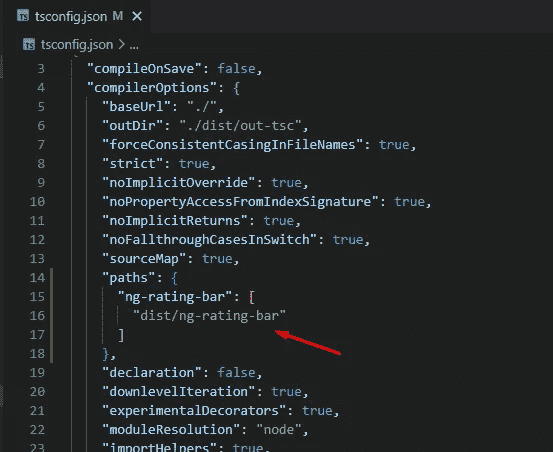

# 如何向 NPM 发布角库

> 原文：<https://javascript.plainenglish.io/how-to-publish-an-angular-library-to-npm-ec3a50244434?source=collection_archive---------6----------------------->

使用 Angular 6+，在 npm 中生成和发布包非常容易。在本例中，我们将创建并发布一个星级评定组件。

你可以在这里找到 git 库和源代码[，在这里](https://github.com/armenstepanyan/ng-rating-bar)找到发布的 npm 包


Publishing angular library onto npm

# 设置

首先，让我们创建一个新的 Angular 项目:

```
ng new rating
```

那么让我们添加一个新的角度库。Angular CLI 提供了一种使用以下命令在新工作空间中生成新库框架的方法。

```
ng g library ng-rating-bar
```


Create new library

正如我们在这里看到的，一个新的 **ng-rating-bar** 文件夹被创建在项目文件夹中，3 个文件被更新。让我们逐一看看:

*   **angular.json -** 新增 *ng-rating-bar* 项目(项目类型为库)


*   **packages.json -** 增加了**ng-packager**依赖项，用于从您编译的代码创建可以发布到 npm 的包。


ng-packagr will be added in packages.json

注意:对于普通的 angular 应用程序，使用**@ angular-devkit/build-angular:browser**来构建应用程序(您可以在 angular.json 文件中找到它),对于库 angular 使用**ng-packar**

*   **tsconfig.json -** 添加了一个新路径，稍后将使用该路径将库导入到我们的应用程序中



# 文件结构

新生成的库包含 public-api.ts 文件和 lib 文件夹。


Library file structure

默认情况下，lib 文件夹包含可以在我们的库中使用的模块、组件和服务文件。


Lib folder structure

对于我们的例子，我们不需要使用服务，所以我们可以从 lib 文件夹和 *src/public.api* 文件中删除它。

**projects/ng-rating-bar/src/public . API**

```
/*
 * Public API Surface of ng-bar
 */// export * from './lib/ng-bar.service'; // remove this
export * from './lib/ng-bar.component';
export * from './lib/ng-bar.module';
```

我们的库将按给定的配置显示评级。我不会在这里包含全部代码，你可以在 [Github 库](https://github.com/armenstepanyan/ng-rating-bar)上找到。

Part of ng-rating-bar component

现在我们需要导出组件:

```
import { NgModule } from '[@angular/core](http://twitter.com/angular/core)';
import { NgRatingBarComponent } from './ng-rating-bar.component';
import { CommonModule } from '[@angular/common](http://twitter.com/angular/common)';[@NgModule](http://twitter.com/NgModule)({
  declarations: [
    NgRatingBarComponent
  ],
  imports: [CommonModule],
  exports: [
    NgRatingBarComponent
  ]
})
export class NgRatingBarModule { }
```

我们组件的简单用法:

```
<ng-rating-bar
  [(value)]="value"
  [ratingCount]="ratingCount"
  colorActive="red"
  colorDefault="gray"
></ng-rating-bar>
```

# 将库导入应用程序

现在库已经准备好了，我们需要在我们的应用程序中导入并测试它。有两种方法:

**第一种方式:**我们可以直接从*项目/ng-rating-bar* 文件夹中导入模块:


Import library from projects folder

**第二种方式:**我们可以构建自己的库，从*ng-rating-bar***导入(因为 tsconfig.js 中增加了新的路径):**

```
ng build ng-rating-bar
```

**这将在 *dist/ng-rating-bar* 文件夹中创建库的构建版本:**

****

**Import module from ng-rating-bar**

> **当您从 Angular 应用程序的库中导入内容时，Angular 会在库名和磁盘位置之间寻找映射。当您安装一个库包时，映射在`node_modules`文件夹中。当您构建自己的库时，它必须在您的`tsconfig`路径中找到映射。**
> 
> **用 Angular CLI 生成库时，会自动将其路径添加到`tsconfig`文件中。Angular CLI 使用`tsconfig`路径来告诉构建系统在哪里可以找到这个库。**

# **出版图书馆**

**现在一切都准备好了，我们可以在 npm 中发布这个包了。但在此之前，我们先在 **Readme.md** 文件中添加一些信息，在 **package.json** 文件中添加作者、关键字和描述。**

****

**ng-rating-bar library**

**打开 packages.json 并添加元数据:**

```
{
  "name": "ng-rating-bar",
  "version": "1.2.2",
  "author": {
    "name": "Armen Stepanyan"
  },
  "keywords": [
    "angular",
    "rating",
    "javascript",
    "angular-rating",
    "ng-rating-bar"
  ],
  "repository": {
    "type": "git",
    "url": "[https://github.com/armenstepanyan/ng-rating-bar.git](https://github.com/armenstepanyan/ng-rating-bar.git)"
  },
  "description": "Star rating component for angular",
  "peerDependencies": {
    "[@angular/common](http://twitter.com/angular/common)": "^14.1.0",
    "[@angular/core](http://twitter.com/angular/core)": "^14.1.0"
  },
  "dependencies": {
    "tslib": "^2.3.0"
  }
}
```

**现在，我们可以构建并发布我们的库:**

```
ng build ng-rating-bar
```

**现在从 *dist/ng-rating-bar* 文件夹中，运行 *publish* 命令:**

```
npm publish
```

****

**Publish package in npm**

****注意**:如果没有登录 npm，需要运行`**npm login**` *。***

****发布包:****

**[](https://www.npmjs.com/package/ng-rating-bar) [## ng-评级-栏

### 角度的星级评定组件。最新版本:1.2.5，最后发布时间:3 天前。开始使用 ng-rating-bar 在您的…

www.npmjs.com](https://www.npmjs.com/package/ng-rating-bar) 

**Github 库:**

[](https://github.com/armenstepanyan/ng-rating-bar) [## GitHub-armenstepanyan/ng-rating-bar

### 在 GitHub 上创建一个帐户，为 armenstepanyan/ng-rating-bar 的发展做出贡献。

github.com](https://github.com/armenstepanyan/ng-rating-bar) 

*更多内容看* [***说白了就是***](https://plainenglish.io/) *。报名参加我们的* [***免费每周简讯***](http://newsletter.plainenglish.io/) *。关注我们* [***推特***](https://twitter.com/inPlainEngHQ) ，[***LinkedIn***](https://www.linkedin.com/company/inplainenglish/)*，*[***YouTube***](https://www.youtube.com/channel/UCtipWUghju290NWcn8jhyAw)*，* [***不和***](https://discord.gg/GtDtUAvyhW) *。***