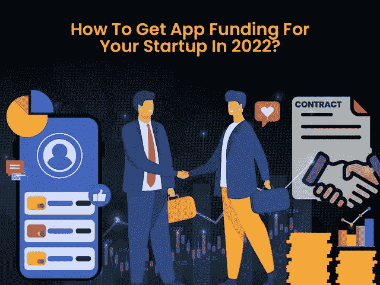

# 2022 年你的创业 App 如何融资？

> 原文：<https://javascript.plainenglish.io/how-to-raise-funds-for-your-startup-app-in-2022-4271bcb525b7?source=collection_archive---------10----------------------->

## 2022 年移动应用创业如何获得资金

就像创办任何其他企业一样，开发一个移动应用程序也需要数十亿美元的应用程序创意、投资和大量努力。作为一家初创公司或企业主，你可能有一个独特的想法来创建一个移动应用程序，帮助你在竞争激烈的市场中脱颖而出。但是，经费呢？你有资本投资它吗？

因此，在你放弃日常工作之前，你需要验证你的应用想法，寻找安全的融资选项，接近投资者，并收集工具，将你的应用想法转化为成功的产品。

即使你计划创建一个移动应用的初始版本，你也需要至少 10，000 美元或更多的投资。你对功能和技术的目标越高，它就越贵。作为一个初露头角的商业爱好者，在最初阶段你手头可能没有那么多现金。那么，你将如何开始呢？

***当然，为你的手机 app 创业筹集资金是必经之路！***

如果你考虑调查报告或市场研究，当然资金似乎是你只能阅读的东西。此外，对于许多企业主来说，只有他们与一些行业巨头有联系，才能获得资金。

然而，如果我们说从零开始接近投资者是一场可以赢的比赛呢？

毫无疑问，找到投资者并接近他们投资你的移动应用创业公司是一条艰难的道路。不过，如果你知道正确的策略，这不会是火箭科学。

如果你想知道如何为一个应用程序获得资金，这里有一个你的选择纲要。这篇博客将带你了解如何为移动应用创业筹集资金的详细过程？

**以下是这篇博客的主要亮点，可以帮助你了解为你的项目筹集资金的几种方式:**

*   *推出我的应用程序需要多少资金？*
*   *准备为移动应用初创公司吸引投资者
    -了解谁将投资你的移动应用初创公司？
    -他们为什么要投资你的移动应用创意？*
*   *您的应用有哪些安全的资金选项？*
*   *结论:正确获得资金，打造你的移动应用创意*

让我们进入每一点的细节。

## **推出我的应用程序需要多少资金？**

当你最终决定创建一个移动应用程序时，这是一个亟待解决的问题:移动应用程序的启动需要多少资金？对于任何始于应用融资过程的事情，你都需要保持警惕。误判可能是一把双刃剑，对投资者和企业主都有风险。

获得更少的资金会让你回来，而获得比计划更多的资金会让你亏损。你筹集的资金越多，你在创业初期给投资者的股权就越多。因此，获得适当估算的理想方法是雇佣一家 [**移动应用程序开发公司**](https://www.xicom.biz/services/mobile-app-development/) 。应用程序开发公司不会提供标准价格，而是会评估你的应用程序想法、特性和功能、UI/UX 设计、应用程序的复杂性以及更多因素。通过深入评估，他们将提供平均应用程序开发成本估算。

最重要的是，如果你计划为你的移动应用程序创业筹集初始资金，你需要计算出开发一个具有特定功能的移动应用程序的估计成本。**然而，为了简单起见，你可以问自己这三个问题:**

*   *为您的企业开发一款应用程序需要多少预算？*
*   *我需要多少钱来推广你的应用？*
*   *维护移动应用程序需要多少资金？*

得到这些问题的答案会让你更接近准确的估计。它会帮助你轻松地做出几个决定。作为一家科技初创公司，你必须明白，最大份额的资金用于制作应用程序。其余的资金将用于应用程序开发的其他方面。

一旦你估算出了应用开发的成本，就要想办法说服你的投资者为移动应用创业公司筹集资金。

# **准备为移动应用创业吸引投资者**

在你要求、接近或说服某人投资这个应用程序之前，你需要准备几件事。然而，在你接近应用程序投资者之前，只要有一个想法:为什么会有人投资你的业务？

*让我们先看一下统计数据，了解投资者为什么会考虑投资这家应用初创公司。*

*   根据调查报告，苹果和谷歌商店占据了超过 95%的市场份额。这些统计数据清楚地表明，应用经济是建立在这些平台上的。
*   调查报告显示，移动应用市场从 2015 年的 700 亿美元增长到 2020 年的 1890 亿美元。
*   此外，全球移动应用下载量已经从 1406.8 亿次达到 2021 年的[2300 亿次。](https://www.statista.com/statistics/271644/worldwide-free-and-paid-mobile-app-store-downloads/)

如今，应用发行商来自从零售到银行的各个行业。此外，假设你在现代世界中没有在线支付应用程序、电子商务应用程序、在线食品交付应用程序等，会让你感到有障碍。随着移动性和数字化对客户的影响越来越大，预计一切都将数字化。

*   **他们为什么要投资你的移动应用创意？**

随着应用程序市场的整体进步，很明显移动应用程序开发行业正在抓住炒作的机会，预计将大幅跃升。但当谈到为移动应用初创公司筹集资金时，一切都围绕着财务和财务稳定性。

在整个周期中，初创公司需要大量的资金来启动，同时他们也需要庞大的客户群来获得资金。因此，说服投资者投资一个应用程序的关键是给出一个理想的演示。

换句话说，展示应用初创公司的基线是行不通的，因为投资者需要知道该提议的潜力。你对市场的深入研究将确保他们如何在市场中竞争，以及如何取得成功。所以这就是你需要 [**雇佣一个移动应用开发者**](https://www.xicom.biz/offerings/hire-mobile-developers/) 来帮你把你的应用想法转化成一个完美的解决方案。

与专家讨论你的应用理念将有助于你对成本、功能、未来预期等做出正确的估计。所以我们一步一步来，让自己做好准备，把自己的想法带给投资人。

*   **了解你的应用的定位**

由于应用程序商店充斥着数十亿的移动应用程序，已经有一款应用程序可以满足你的一切需求。因此，投资者最没有兴趣为市场上已经存在的应用创意提供资金。

因此，在准备接触投资者的同时，你需要做研究，找出你的应用市场的竞争格局。如果你正在开发一个像 Instagram 这样的社交媒体应用，而不是创建一个相同的应用，看看你还能提供什么独特的东西。一定要找同行业的其他公司，保证你的创意不只是复制品。

你需要向投资者证明，你的应用创意是独一无二的，并将在我们的日常生活中占据重要地位。要获得他们的信任，你需要让他们明白:

*   *你的 app 是满足什么具体需求的会议？*
*   *了解启动该 app 类型的基本逻辑*
*   *是什么让你的应用理念与众不同、独一无二？*
*   *谁会是你的目标受众？*
*   *你将在应用中加入哪些特性和功能？*

这些问题的细节将使投资者对他们的投资充满信心。他们总是更喜欢投资那些能让他们的投资翻倍的想法。

*   **打造您的应用品牌**

既然你已经解释了你的应用的基线，那么是时候开始品牌化了。你的应用程序将使用什么类型的徽标或域名。这将为投资者提供一个广阔的视野。品牌有助于投资者形象化你的应用创意。因为品牌被认为是其余开发过程的基础。无论是一个领域，应用程序的模型，还是一个网站，品牌化你的应用程序可以帮助投资者形象化你的想法，以更好地理解你向他们推销的东西。

*   **创建您的电梯间推介**

投资者高度忙碌，在他们考虑安排约会之前，确保你准备好了你的电梯推销。

就像个人的电梯推销来获得一份工作一样，你的初创公司的电梯推销也是帮助你获得投资者关注的一个关键因素。为了帮助你开始，一个著名的 [**应用程序开发公司**](https://www.xicom.biz/services/mobile-app-development/) 可以帮你准备最好的电梯推介…如何准备？当你咨询专家来验证 app 想法时，他们会提供一份需求收集和启发表，简单明了地解释 app 想法。

考虑到这种详细的形式，你可以准备一个超级短的演讲，帮助你在不到一分钟的时间内总结整个想法。投资者没有一整天的时间来听你的计划。因此，请确保应用程序融资推介应包括您计划的要点、解决问题、关键功能和未来方面。

如果你不能在一个简短的演讲中准确地陈述应用程序项目的性质，那么你必须做进一步的研究。

*   **创建推介台**

如果你的电梯间推介被选中，并出现在他们的最终名单上，那么你就要准备好演示。它将更像一个幻灯片或 PowerPoint 演示文稿，解释你的应用程序想法的所有关键因素。此外，它包括市场研究统计数据，可以很容易地帮助投资者显示该市场如何增长及其未来目标。

*   **开发 MVP 解决方案**

创建一个完全成熟的应用程序，仅仅是为了展示你对应用程序融资的想法，可能会有很高的风险。因此，开始的关键方法是推出一个最小可行产品(MVP)或原型。它开发速度快，需要的投资少，还能帮助他们设想你的想法。通过 [**雇佣一个应用开发者**](https://www.xicom.biz/solutions/hire-developers/) 你可以轻松创造一个 MVP。它会让你评估用户的反馈，让你知道如何进一步拓展。最重要的是，为了获得应用程序或进一步合作的资金，MVP 总是有助于发挥你的移动应用程序创意的最佳效果。

简而言之，这几点有助于你了解如何在接近投资者进行融资时做好准备。然而，在此之后，你的下一个问题很可能是，谁会有兴趣为你的移动应用创业提供资金。

*   **了解谁会投资你的移动应用初创公司？**

因为你处于一个竞争激烈的世界，市场上已经有成千上万的应用程序。因此，为你的应用程序初创公司获取投资者名单是一项复杂的任务。然而，在你对任何人的数据或数字做出承诺之前，不要对你的想法有任何信心或过度自信。在你算错数字之前，你需要了解谁会有兴趣资助你的应用？

**寻找融资网站**

在数字化的世界里，有许多可供投资的网站，如 Funded.com、天使投资网(Angel Investment Network)，上面列出了 4 万多名投资者。然而，并不是每个人都适合你的业务目标。对潜在投资者进行排序的最佳方式是挑选前 40 名投资者，并推介你的应用创意。

**获取下线**

从你自己的网络中产生线索是一种很好的融资方式。引荐是见投资者的好方法。你可以在自己的社交网络中询问是否有人有兴趣资助你的应用创意。此外，与调解人联系也是一个很好的方式。他们会进一步把你和聪明的公司联系起来。

最后，像 LinkedIn 这样的专业平台是建立联系和寻求推荐的好方法。最重要的是，你可以把你的电子邮件发送给你的联系人。

了解了这几点之后，你一定很想知道哪种融资策略可以帮助你最少的麻烦开始。

# **您的应用有哪些安全的资金选项？**

现在，您已经整理了您的应用程序想法，并对融资流程有了更好的理解。因此，是时候向投资者推销你的产品了。不管他们是你的亲朋好友，还是风险投资人，都会被认为是投资人。他们将持有你的应用创意的股份，并相信他们的投资将会成倍增加，并可能看到成功。

因此，与其东张西望，不如让我们深入了解一下你的移动应用创业的不同融资方式。

*   **用自己的投资提升自己**

自举是最简单的融资方式之一，可以帮助你立即开始这个过程。你自己的储蓄、工作收入、现有投资或任何其他类型的个人资金都可以帮助你启动你的项目。如果可能的话，用自己的资金总是比较好的。bootstrapping 的明显优势是，它让您可以完全控制和拥有您的应用程序。事实上，这将降低向投资者赠送股票的风险。此外，这是一个在投资者面前站稳脚跟的好方法。

*   **找到一个完美的联合创始人来发布你的应用**

当你在找投资人的时候，给自己找一个可以分担责任的完美的联合创始人。确保他们能够投资你的项目，并在推出新应用时提供支持。虽然联合创始人不仅仅是你的朋友，所以要确保你根据各自的需求来选择他们。

例如，选择一位精通技术的联合创始人可以帮助你从头开始创建应用程序的原型，而无需花一分钱雇佣应用程序开发人员。Instagram 的应用程序在其初始阶段背后也有开发思想。

*   **众筹**

为这项事业筹集资金可能是一个惊人的选择。你所需要的是使用一个吸引人的好点子，让他们有信心投资你的应用创意。有各种各样的网站，比如 Kickstarter、IndieGoGo 或 GoFundMe，你可以在那里提出你的想法。热衷于投资你的 app 创意的人会自动联系你。如果你正在考虑众筹，那么你可以利用以下不同类型的选择:

*   基于捐赠的众筹
*   基于债务的众筹
*   基于股权的众筹

## **结论:正确获得资金，打造你的移动应用创意**

毫无疑问，科技初创公司需要一个出色的美元应用创意来启动，但由于缺乏资金，它很快就结束了。然而，有了这个博客指南，你知道如何为应用程序筹集资金。此外，你的公司有哪些潜在的融资选择？除此之外，这些建议将有助于你正确地向投资者推销。如果你有一个手机 app 开发的想法，那么就值得雇佣一个 [**手机 app 开发公司**](https://www.xicom.biz/services/mobile-app-development/) 来验证你的 app 想法。获取文件，并创造一个摊位，以吸引投资者。

然而，当你投入到吸引投资者的战斗中时，一定要做好推销的准备。总而言之，开发一个应用程序，找到投资者，并说服他们投资一个应用程序初创公司是一项复杂的任务。因此，你需要咨询专家，他们会从一开始就支持你，并帮助你将想法转化为可靠的解决方案。

感谢您的阅读。

## 进一步阅读

 [## 创业失败的 5 个原因(以及网络数据如何阻止这种情况)

### 像光明数据这样的网络数据平台使创业公司能够在强大数据的帮助下做出明智的决策…

简明英语. io](https://plainenglish.io/blog/5-reasons-why-your-startup-might-be-failing) 

*更多内容请看*[***plain English . io***](https://plainenglish.io/)*。报名参加我们的* [***免费周报***](http://newsletter.plainenglish.io/) *。关注我们关于*[***Twitter***](https://twitter.com/inPlainEngHQ)[***LinkedIn***](https://www.linkedin.com/company/inplainenglish/)*[***YouTube***](https://www.youtube.com/channel/UCtipWUghju290NWcn8jhyAw)*[***不和***](https://discord.gg/GtDtUAvyhW) *。对增长黑客感兴趣？检查* [***电路***](https://circuit.ooo/) *。***