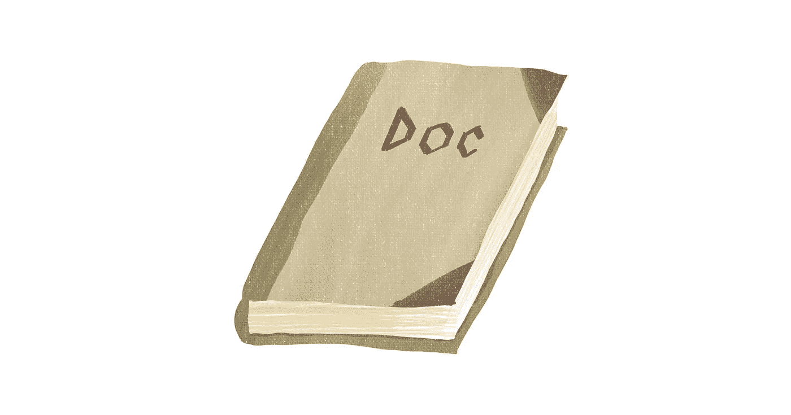
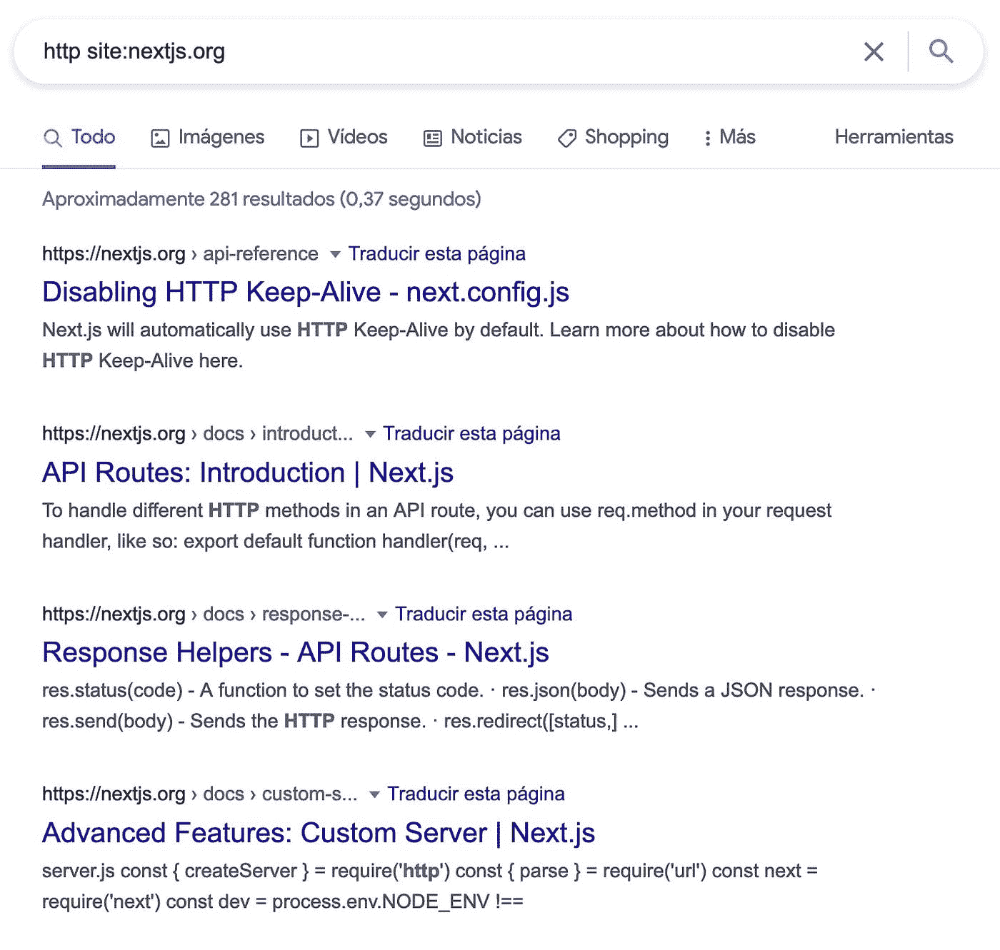
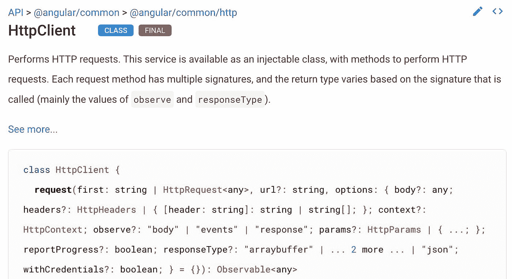
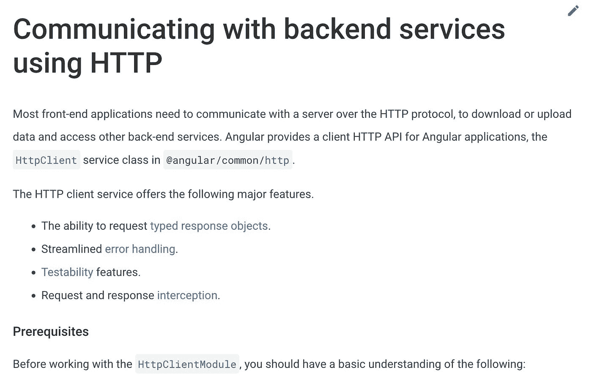
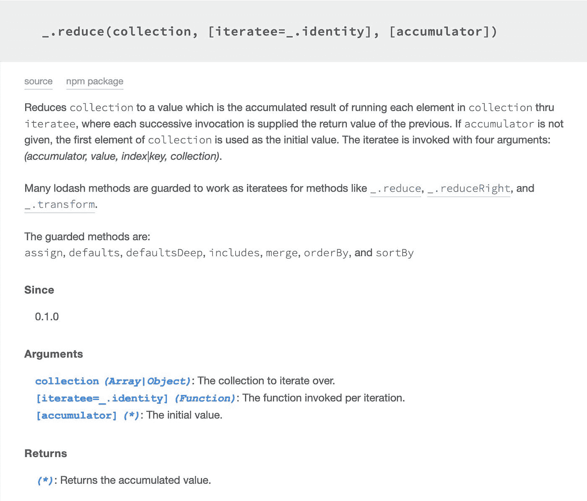

# 如何阅读文档

> 原文：<https://javascript.plainenglish.io/how-to-read-the-documentation-2bcbe2baacb1?source=collection_archive---------11----------------------->

## 如何发展阅读文档的技能？



如果你问的问题可以用文档快速回答，人们的反应将取决于你提问的地方、你工作的团队或在线论坛的气氛。友好的会给你链接到你能找到答案的地方。不太友好的会给你提供“RTFM”——阅读*咳嗽*友好手册——或者给你一个“让我帮你谷歌一下”的链接。

你应该尽量避免。

让我们看看你如何发展阅读文档的技能！

# 使用它

最重要的是，当你遇到困难的时候，试着从文档中找到答案。阅读文档的最大好处是，您通常可以在那里找到答案。你只需要一头扎进去，自己去找。随着你职业生涯的进展，你会发现越来越多的问题，没有现成的指南。

# 带来你的问题

大多数文档相对枯燥，旨在提供答案，不一定引人入胜。在寻找解决问题的方法时，专注于它要容易得多。

我讨厌通过阅读文档来了解项目。不管是我正在着手的新项目还是我正在了解的图书馆。这感觉像是浪费时间，因为我没有上下文，很难理解我正在阅读的东西之间的联系。

相反，我会尝试自己做一些事情，失败了，然后回到文档中寻找答案。那样的话，我至少知道我不知道的，我热衷于弥合差距。


# 使用搜索

当您有问题要解决时，可以使用搜索工具快速获得相关信息。

在第三方库的情况下，您可以利用搜索引擎通过添加`site:<domain>`来限制对项目网站的搜索:



使用 Google、Bing 和 DuckDuckGo 都是一样的。

对于代码内文档，您可以使用与搜索代码库相同的工具:

以`git grep`为例:

```
$ git grep 'http\.post' src/auto/injector.js: * $http.post(trackingUrl, trackedEvents); src/ng/http.js: * $http.post('/someUrl', data, config).then(successCallback, errorCallback); src/ng/http.js: * - {@link ng.$http
```

搜索文档有几个好处:

*   您可以熟悉文档结构
*   你将会找到与你的主题相关的文档的所有部分



API 参考——方法的简单描述



教程或指南-它提供了更多的背景。

# 如果你不明白，不要担心

文档质量差异很大。通常它不是一个非常容易理解的文档。可能有一个假设，读者有一些系统知识，这并没有在文本中明确说明。这让新来者有点不知所措。

最有问题的可能是闭源的商业项目。如果你有一个小团队既维护代码库又维护文档，那么在新的一批人浏览文档并试图理解它之间可能会有几个月的时间。

开源项目通常会稍微好一点。没有好的文档的人不太可能成功。

# 不要跳过指南

如果该项目提供了教程或指南，不妨去看看。如果你经常纠结于一个类似的问题，只需找到指南中涉及到它的部分并浏览一遍。一本好的指南将为你提供理解你正在使用的整个机制所需要的背景。


# 深入研究 API 的相关部分

API 描述是技术性最强的文档。通常，它非常枯燥，缺乏对可以使用给定方法的环境的全面了解。它向您展示了您可以任意使用的所有类、方法、参数和输出。



如果可能的话，浏览相同或相似事物的不同描述。通常一种方法是参考其他方法——因此，如果在阅读了第一种方法之后，您仍然感到困惑，那么您可以检查其他人的文档是否使它变得更清楚。

# 结果

有了方法，你要么改变一个对象的内部状态，要么得到一些输出。API 指南应该很好地描述了这两者。

# 输入变化

通常，方法接受多种参数组合的输入。医生会告诉你所有的选项，让你得到所有你需要的东西。

# 最后的想法

阅读文档是一项重要的技能，只有通过实践才能学会。第一次尝试时不要气馁；随着时间的推移会变得更好。

# 想多读点？

通过[采取小步骤](https://how-to.dev/how-to-make-small-steps-go-a-long-way)来了解进展。

*最初发布于*[*https://how-to . dev*](https://how-to.dev/how-to-read-the-documentation)*。*

*更多内容看* [***说白了。报名参加我们的***](https://plainenglish.io/) **[***免费周报***](http://newsletter.plainenglish.io/) *。关注我们关于*[***Twitter***](https://twitter.com/inPlainEngHQ)*和*[***LinkedIn***](https://www.linkedin.com/company/inplainenglish/)*。加入我们的* [***社区不和谐***](https://discord.gg/GtDtUAvyhW) *。***