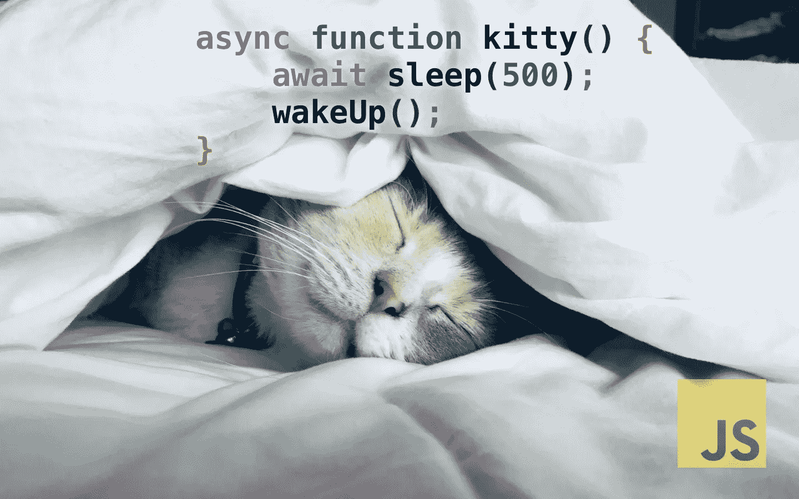
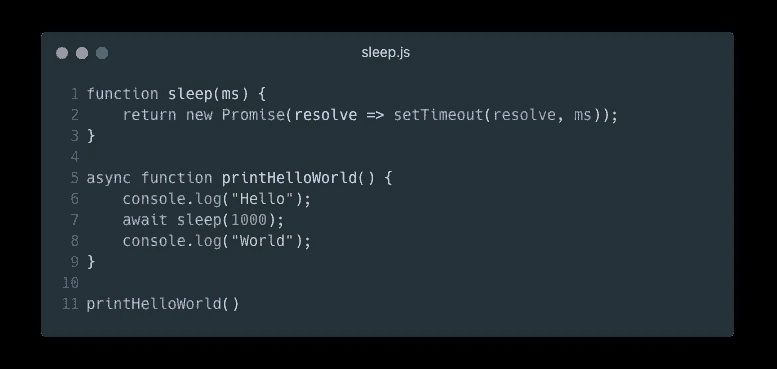
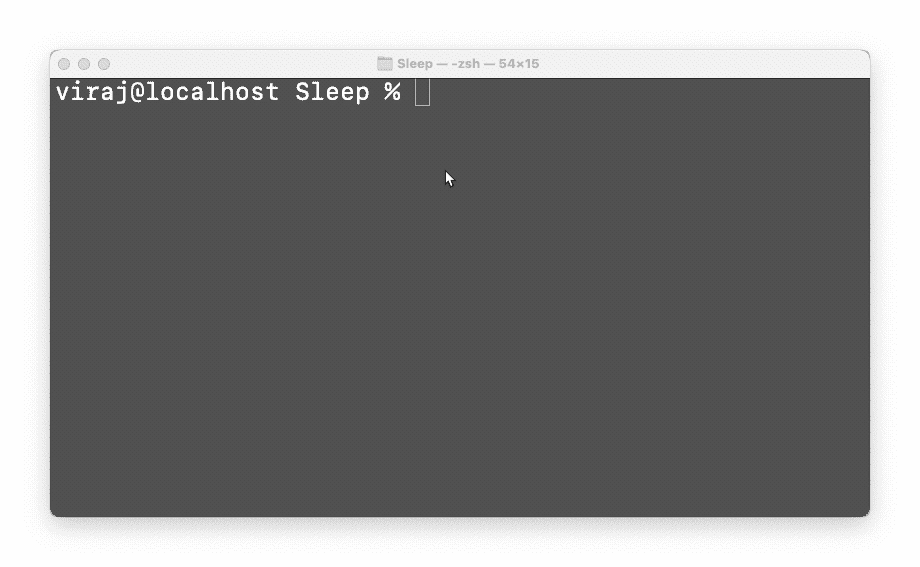
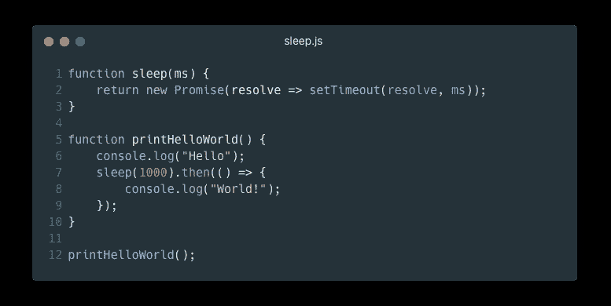
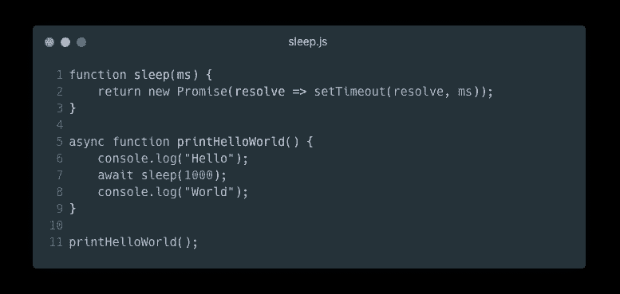
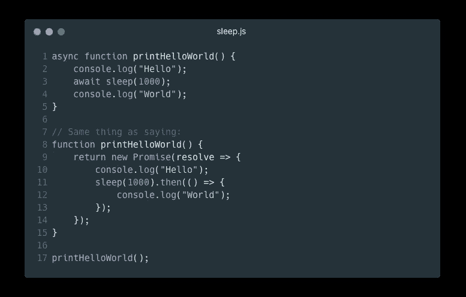
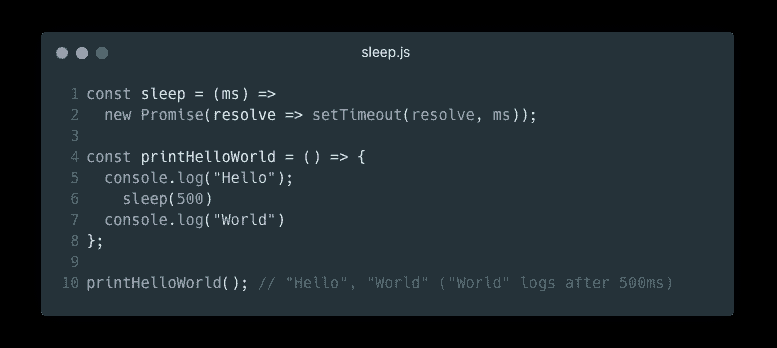

# 如何在 JavaScript 中真正实现 sleep()函数

> 原文：<https://javascript.plainenglish.io/how-to-really-implement-the-sleep-function-in-javascript-621b4ed1e618?source=collection_archive---------10----------------------->

## 如何用 JavaScript 实现`sleep()`函数的指南(正确的方法)。

我刚刚在[的 JavaScript in Plain English 刊物](https://javascript.plainenglish.io)上读到一篇文章。 [SnowBit](https://medium.com/@codewithsnowbit) 写过一篇文章，名为[如何在 JavaScript 中实现 sleep()函数？这篇文章有很多问题，我将在后面讨论。](https://medium.com/javascript-in-plain-english/how-can-you-implement-the-sleep-function-in-javascript-db5d4d89b13b)

首先，我会教你如何用 JavaScript 实现`sleep()`函数。然后我来解释一下 [SnowBit](https://medium.com/@codewithsnowbit) 犯的致命错误。(还有，如果你是 Medium 上的作家，不要把你文章唯一重要的部分完全搞砸了，尤其是文章这么短的时候。他把整篇文章都搞砸了！)

# 异步/等待睡眠功能

睡眠功能的代码很简单:

JavaScript code for an asynchronous sleep function

Demo of the sleep function in NodeJS (also works in the browser)

这是一句俏皮话！但是如果你不熟悉`async`函数，你可能需要一个解释器。

## 承诺、异步和等待(适用于新手)

[JavaScript Promises](https://developer.mozilla.org/en-US/docs/Web/JavaScript/Reference/Global_Objects/Promise) 是定义要执行的函数的唯一对象。有时，您可能希望接受用户输入，等待事件被触发，或者进行 API 调用。同时，您仍然需要执行代码的其他部分。

例如，假设您正在进行一个 API 调用，该调用需要大约 5 秒钟才能返回响应。您有一些其他的 JavaScript 代码，应该不断地改变网页的背景颜色。在单线程应用程序中，您必须等待 5 秒钟，让 API 做出响应，然后继续更改站点的背景颜色。在这 5 秒钟内，站点将**而不是**改变背景颜色。这叫堵。

JavaScript 承诺允许你避免阻塞代码。一个承诺说:“我保证我会很快给你一个答复，但不要等待；我准备好了就告诉你。”回应可以是决心，也可以是拒绝。解析类似于`return`语句，但可以随时调用；同时，JavaScript 继续执行剩余的代码。如果函数遇到错误，就会发生拒绝。

**那么，什么是**`**async**`**`**await**`**？****

**在以前的 JavaScript 版本中，您必须像这样编写代码:**

****

**Using Promise.then() to handle promise resolution**

**`sleep()`返回的`Promise`对象包含两个方法:`then`和`catch`。如果承诺解决，将调用`then`回调。如果错误导致承诺被拒绝，将调用`catch`回调。**

**ES6 引入了两个新的关键词:`async`和`await`。**

**`async`关键字是一个函数修饰符。它告诉 JavaScript 这个函数包含异步代码(通过 promises ),但没有显式返回一个`Promise`对象。相反，JavaScript 会自动将函数的 return 语句转换为 Promise resolution。**

**关键字`await`说，“等我解决了再继续。”这会阻塞当前的“线程”,直到承诺自行解决。*请注意:浏览器中的 JavaScript 实际上是单线程的，但在使用 Promises 和* `*async*` */* `*await*` *时，其行为类似于多线程应用。***

****

**JavaScript code for an asynchronous sleep function**

**注意，在原始代码中，`sleep()`返回一个`Promise`对象。由于`printHelloWorld()`中没有`return`，所以有一个隐含的`return undefined`。由于`printHelloWorld`是`async`，它也返回一个`Promise`对象:**

****

**Async/Await versus regular Promise handling**

**如你所见，`async`和`await`只是使用承诺的语法糖。**

# **那么，雪球到底做错了什么？**

**以下是 SnowBit 提供的混乱代码:**

****

**SnowBit’s INCORRECT code for sleeping in JavaScript**

**注意这里没有承诺解析的处理程序，也没有任何`async`或`await`。功能`printHelloWorld`必须分配给`async () => { ... }`，而不仅仅是`() => { ...}`。**

**另外，`sleep()`立即返回一个`Promise`，但是`sleep(500)`没有对`then`的调用，也不是`awaited`。这意味着在执行`console.log("World")`之前，JavaScript 将**而不是**等待`500`毫秒。记录完`Hello`后会立即记录`World`。**

**我不得不说，这是一篇写得非常糟糕的文章——如果你读过“同步”睡眠方法部分，那么**不惜一切代价避免它**。它会使您的 JavaScript 运行时崩溃！**

**希望你学到了新的东西，明白了雪鸟犯下的致命错误，自己也不会犯同样的错误。**

**编码快乐！😀**

***更多内容请看* [***说白了。报名参加我们的***](https://plainenglish.io/) **[***免费周报***](http://newsletter.plainenglish.io/) *。关注我们*[***Twitter***](https://twitter.com/inPlainEngHQ)*和*[***LinkedIn***](https://www.linkedin.com/company/inplainenglish/)*。查看我们的* [***社区不和谐***](https://discord.gg/GtDtUAvyhW) *加入我们的* [***人才集体***](https://inplainenglish.pallet.com/talent/welcome) *。*****