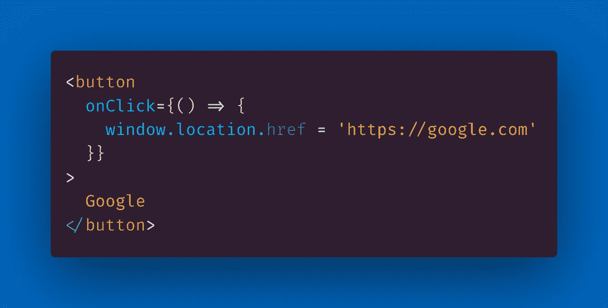
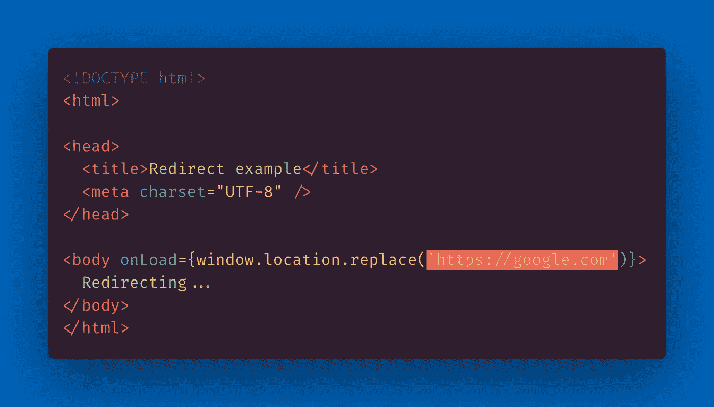

# 如何使用 JavaScript 更改 URL 重定向到另一个网页

> 原文：<https://javascript.plainenglish.io/how-to-redirect-to-another-webpage-using-javascript-to-change-the-url-2b92754845a3?source=collection_archive---------6----------------------->

## 要使用 JavaScript 将用户重定向到另一个网页，您需要决定是否希望当前页面保留在浏览器的历史记录中，也就是说后退按钮是否有效。

Photo by [Hello I'm Nik](https://unsplash.com/@helloimnik?utm_source=medium&utm_medium=referral) on [Unsplash](https://unsplash.com?utm_source=medium&utm_medium=referral)

这种情况经常发生——您正在编写一些 JavaScript 代码，需要将用户重定向到网站的不同部分，或者完全是另一个网页。

对于现代浏览器支持的重定向，有两种“香草 JS”(香草 JavaScript，没有任何 npm 包依赖)解决方案。

第一种，*经典，*是[好 ol '](https://www.urbandictionary.com/define.php?term=good%20ol%27)`window.location.href`——你可以在`window`对象中修改当前`location`的`href`(字面意思是 [URL](https://developer.mozilla.org/en-US/docs/Learn/Common_questions/What_is_a_URL) )。

如果你设置一个值给`window.location.href`(或者简称为`window.location`，那么你将模拟用户点击链接的动作。

> "`[Location.href](https://developer.mozilla.org/en-US/docs/Web/API/Location/href)` :string ifier，返回包含整个 URL 的字符串。如果更改，关联文档将导航到新页面。— [MDN 文档](https://developer.mozilla.org/en-US/docs/Web/API/Location)

(为了完整起见，您还可以使用方法`window.location.assign()`并将新的 URL 作为参数传递给`.assign()`函数。)

就像当有人点击一个链接时，`window.location.href`会将当前 URL 保存在浏览器的会话历史中。

换句话说，使用`window.location.href`重定向后，浏览器中的后退按钮将能够返回到当前页面。

这意味着`window.location.href`在模拟一个链接但需要一些其他标签的情况下最有用，比如`<button>`。

(尽管我应该注意到可能会有一些关于可访问性的问题，如果你没有给一个链接加上标签，那么它显然不是一个链接。)

您可以使用`window.location.href`编写一个“像链接一样的按钮”(尽管有 [a11y](https://www.a11yproject.com/) 的问题)来重定向，如下面的代码示例所示:

[View raw code](https://gist.github.com/DoctorDerek/3ab226a084294de109a8d62ae4b70d5d) as a GitHub Gist

另一方面，如果您需要在网页加载时重定向到一个 URL，那么`window.location.href`将不是一个很好的选择。

这是因为，如果你试图在页面一加载`window.location.href`就改变网站，你会弄坏用户的后退按钮。😥

(如果你曾经在一次重定向后点击后退按钮，结果却立即再次被重定向，这就是我所说的后退按钮损坏的原因。)

我们将要讨论的下一个解决方案，`window.location.replace()`模拟了一个 HTTP [重定向](https://developer.mozilla.org/en-US/docs/Web/HTTP/Redirections)，比如一个 [301](https://http.cat/301) / [308](https://http.cat/308) (永久移动)重定向。

与使用`=`赋值的`window.location.href`不同，您将 URL 作为参数传递给`window.location.replace()`函数。

换句话说，`window.location.replace()`不会将当前页面添加到用户的会话历史中，因此您无法通过后退按钮返回到当前页面。

> "`*Location*`接口的`***replace()***`方法用提供的 URL 中的资源替换当前资源。"— [MDN 文档](https://developer.mozilla.org/en-US/docs/Web/API/Location/replace)

如果您以前使用过只有一个页面的“单页应用程序”(SPA)，您可能对后退按钮的这种行为很熟悉。

(如果你曾经使用过 SPA 风格的网站，当你在应用程序中改变页面后,“后退”按钮会把你完全带离网站，你就会明白我的意思。)

正如您可能已经猜到的，如果您打算在页面加载后立即重定向，那么`window.location.replace()`将是首选的解决方案。

例如，如果您要在页面上创建一个脚本，在页面加载时重定向用户，请使用`.replace()`，如以下代码示例所示:

[View raw code](https://gist.github.com/DoctorDerek/eb88f83013693e04d44e55fccb92ac98) as a GitHub Gist

然而，如果您需要转发 URL,`window.location.replace()`可能不是一个好的解决方案(例如，使用前面提到的 301 HTTP 重定向)。

虽然可能有一些证据表明 JavaScript 重定向对于 SEO 是有效的，但首选策略是 301(或 308)服务器响应代码。

不使用某种类型的服务器端代码，你可以直接在你的域名提供商处处理重定向(参见: [Porkbun 的说明](https://kb.porkbun.com/article/39-how-to-set-up-url-forwarding))。

普通的 JavaScript 无法处理服务器端重定向，这也是我喜欢 Next.js 的原因之一，因为它[可以](https://nextjs.org/docs/api-reference/next.config.js/redirects)直接处理重定向。

**编码快乐！**👨‍💻

Photo by [Mark König](https://unsplash.com/@markkoenig?utm_source=medium&utm_medium=referral) on [Unsplash](https://unsplash.com?utm_source=medium&utm_medium=referral)

德里克·奥斯汀博士是《职业规划:如何在 6 个月内成为一名成功的 6 位数程序员》一书的作者，该书现已在亚马逊上出售。