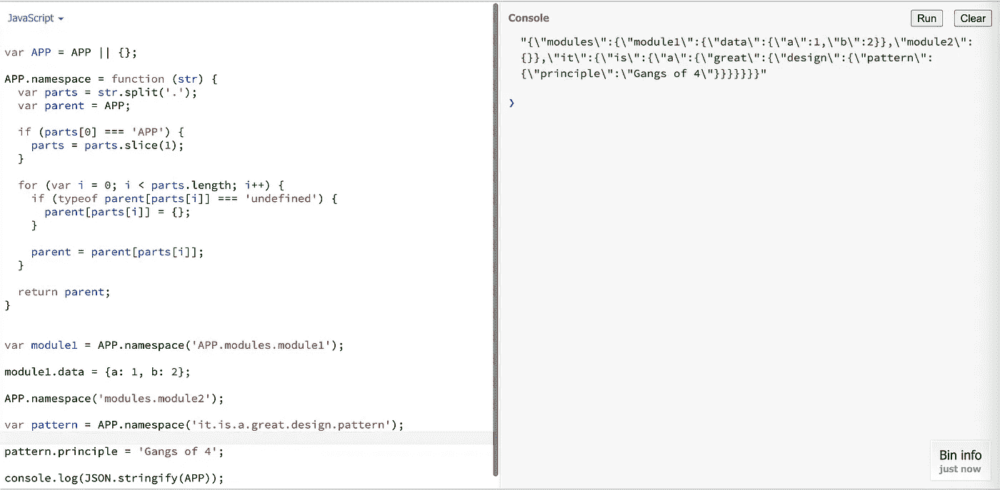

# 如何重构 JavaScript 中的全局变量？

> 原文：<https://javascript.plainenglish.io/how-to-refactor-the-global-variables-in-javascript-9dc2d3fa7e6c?source=collection_archive---------18----------------------->

## 更深入地研究名称空间模式以重构全局变量。


Javascript by Unsplash

我们都听说过或读过全球化是不好的实践。用多个全局变量污染代码空间会导致代码不可管理和不可预测。

这是明智的，始终保持在检查全局，并尽可能减少它。

在这一部分，我们将讨论一种方法，这种方法可以很容易地减少全局变量。

假设您的代码库中存在以下全局变量:

```
// Constructors
function X() {}
function Y() {}// global vars
var res = 1;// global objects
var module1 = {
   a: 1,
   b: 2
};var module2 = {};
module2.a = 10;
module2.b = 20;var module3 = {};
```

在上面的块中，我们有 ***6 个全局变量*** 。现在，我们可以将这段代码重构为只有一个全局对象，所有的构造函数、变量和对象都将是它的一部分。

理想情况下，所有代码库都应该有一个全局变量。拥有多个全局变量是不好的，原因有很多，例如

1.  它们可能会被意外修改，并且容易出错。
2.  此外，它可能会导致与您的代码或第三方库的名称冲突

# 解决办法

重构代码:

```
// Global object
var APP = APP || {};// Constructors
APP.X = function () {};
APP.Y = function () {};// variables
APP.res = 1;// objects
APP.modules.module1 = {a: 1, b: 2};APP.modules.module2 = {};
APP.modules.module2.a = 10;
APP.modules.module2.b = 20;APP.modules.module3 = {};
```

代码有问题，例如，如果您想使用以下代码:

```
var module1 = APP.modules.module1;
```

您必须进行如下 3 项检查:

```
var module1 = APP && APP.modules && APP.modules.module1;
```

这有点让人恼火。

为了解决这个问题，我们需要一个方便的函数来处理命名空间部分。让我们称这个函数为“namespace()”，并像这样使用它:

```
APP.namespace(‘APP.modules.module1’) 
```

这相当于:

```
var APP = {
   modules: {
      module1: {
      }
   }
};
```

# namespace()函数的实现

```
var APP = APP || {};APP.namespace = function (str) {
  var parts = str.split('.'),
      parent = APP; // remove the redundant global
  if (parts[0] === 'APP') {
      parts = parts.slice(1);
  } for (var i = 0; i < parts.length; i++) {
      if (typeof parent[parts[i]] === 'undefined') {
          parent[parts[i]] = {};
      }
      parent = parent[parts[i]]; 
  } return parent;
}
```

让我们测试一下上面的内容:



creating nested objects with namespace pattern

我们可以看到:

```
APP.namespace(‘APP.modules.module1’)
```

上面的代码给出了期望的结果，传递 APP(名称空间中的顶级全局对象)也是多余的。我们可以通过传递`modules.module1`来达到同样的目的

```
APP.namespace(‘modules.module1’)
```

如果您喜欢名称空间模式，请告诉我。如果你喜欢我的文章，请关注我。感谢你阅读这篇文章，回头见！

*更多内容请看**[***说白了。报名参加我们的***](https://plainenglish.io/) **[***免费周报***](http://newsletter.plainenglish.io/) *。关注我们* [***推特***](https://twitter.com/inPlainEngHQ) *和*[***LinkedIn***](https://www.linkedin.com/company/inplainenglish/)*。加入我们的* [***社区***](https://discord.gg/GtDtUAvyhW) *。****