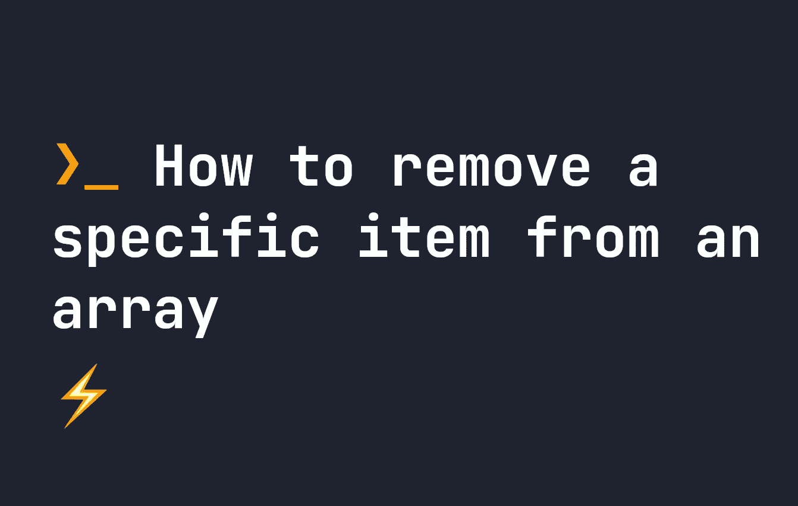

# 如何从数组中移除特定的项

> 原文：<https://javascript.plainenglish.io/how-to-remove-a-specific-item-from-an-array-7b1f77a4a087?source=collection_archive---------12----------------------->



在 JavaScript 中，我们必须执行的最常见的任务之一是从数组中移除特定的项。然而，这并不简单。JavaScript 中没有`removeArrayItem`方法，所以我们必须使用替代方法。让我们看看如何在 JavaScript 中移除特定的数组项。

# 如何在 JavaScript 中移除特定的数组项

## 选项 1:使用过滤器()

现代 JavaScript 删除特定数组项的最简单方法是使用`filter()`。让我们看一个简单的例子:

```
let myArr = [ "🍎", "🍏", "🍐", "🍍" ];// Creates a new array without "🍍" - so [ "🍎", "🍏", "🍐" ]
let removedArr = myArr.filter((x) => x !== "🍍");
console.log(removedArr);
```

当我们有一个数组，其中每个元素都是**唯一的**时，这非常有用。不幸的是，如果你只想删除一个项目，它就开始崩溃了，而且还有重复的项目。让我们看另一个例子:

```
let myArr = [ "🍎", "🍏", "🍏", "🍍" ];// Creates a new array without "🍏" - so [ "🍎",  "🍍" ]
let removedArr = myArr.filter((x) => x !== "🍏");
console.log(removedArr);
```

因为我们有两个青苹果，而新的数组过滤掉了所有的青苹果，所以在使用这个方法时，我们实际上删除了两个项目。如果我们只想删除一个元素，我们必须使用替代策略。

## 选项 2:使用 indexOf()和 splice()

此方法需要多几行代码，但在几个方面与上一个示例略有不同:

*   首先，它改变了原始数组——所以我们在这里没有制作副本。原数组**将**变为**变异后的**
*   其次，它使用了两个函数——首先我们得到了要删除的数组项的`indexOf`,然后我们得到了要删除的数组项的`splice`。

这里有一个例子:

```
let myArr = [ "🍎", "🍏", "🍏", "🍍" ];
let getLocation = myArr.indexOf("🍏");
myArr.splice(getLocation, 1);
// myArr now becomes [ "🍎", "🍏",  "🍍" ];
console.log(myArr);
```

这个例子在某些情况下可能更好，但是最终您需要决定什么在您自己的代码中最有效。

# 结论

虽然在 JavaScript 中没有直接的方法从数组中移除一个项，但是我们有两个工具可以给我们足够的灵活性来涵盖几乎所有关于数组项移除的用例。如果你想学习更多快速数组技巧，在这里查看我的[数组技巧指南](https://fjolt.com/article/javascript-everything-arrays)。

*更多内容请看*[***plain English . io***](https://plainenglish.io/)*。报名参加我们的* [***免费周报***](http://newsletter.plainenglish.io/) *。关注我们关于*[***Twitter***](https://twitter.com/inPlainEngHQ)*和*[***LinkedIn***](https://www.linkedin.com/company/inplainenglish/)*。查看我们的* [***社区不和谐***](https://discord.gg/GtDtUAvyhW) *加入我们的* [***人才集体***](https://inplainenglish.pallet.com/talent/welcome) *。*