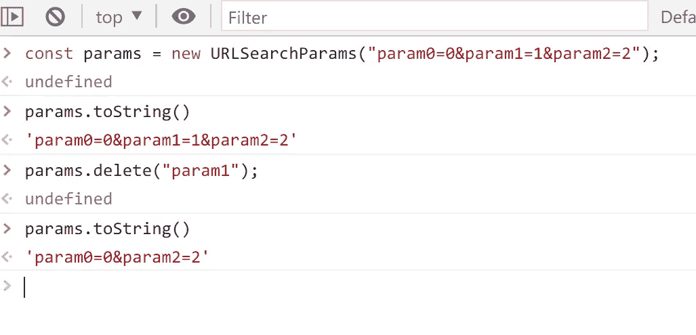

# 如何删除 URL 中的查询字符串参数

> 原文：<https://javascript.plainenglish.io/how-to-remove-query-string-parameters-in-url-c3cb35421083?source=collection_archive---------3----------------------->

## 有没有比正则表达式更好的方法？


Photo by [Sam Pak](https://unsplash.com/@melocokr?utm_source=medium&utm_medium=referral) on [Unsplash](https://unsplash.com?utm_source=medium&utm_medium=referral)

当你想用 JavaScript 删除一个 URL 的参数时，你可能会首先想到使用正则表达式，但是写起来很烦人。有没有更好的方法来避免为此使用 regex？

首先，如果你使用的是现代浏览器，用`URLSearchParams`很容易做到这一点:



更进一步，我们可以创建一个方法来处理这个问题:

```
**function removeParamFromURL(url, param) {
  const urlObj = new URL(url);** **urlObj.searchParams.delete(param);
  return urlObj.toString();
}**
```

但是老浏览器不支持:[https://caniuse.com/?search=URLSearchParams](https://caniuse.com/?search=URLSearchParams)

您可以选择使用 polyfill，但是最好编写一个更兼容的方法:

```
**function removeParamFromURL(url, param) {
  const [path, searchParams] = url.split('?');** **const newSearchParams = searchParams
    ?.split('&')
    .filter((p) => !(p === param || p.startsWith(`${param}=`)))
    .join('&');** **return newSearchParams ? `${path}?${newSearchParams}` : path;
}**
```

仅此而已，这里有一个用例:

不是中等会员？[在这里支持我](https://medium.com/@hibrandonevans/membership)成为其中一员。

感谢阅读！

*更多内容看* [***说白了就是 io***](https://plainenglish.io/) *。报名参加我们的* [***免费周报***](http://newsletter.plainenglish.io/) *。关注我们关于*[***Twitter***](https://twitter.com/inPlainEngHQ)，[***LinkedIn***](https://www.linkedin.com/company/inplainenglish/)*，*[***YouTube***](https://www.youtube.com/channel/UCtipWUghju290NWcn8jhyAw)*，* [***不和***](https://discord.gg/GtDtUAvyhW) *。对增长黑客感兴趣？检查* [***电路***](https://circuit.ooo/) *。*